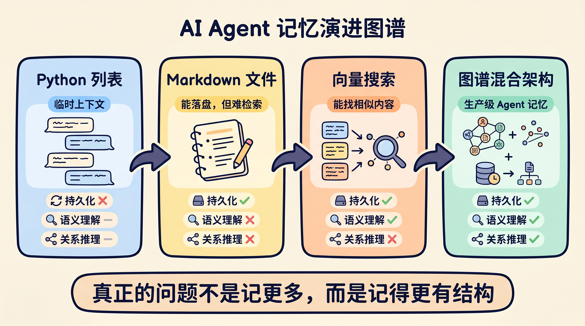
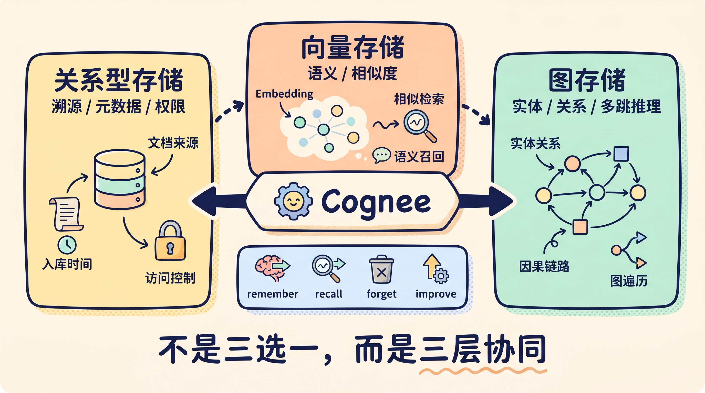

# 别再让你的 AI Agent 失忆了：从 Python 列表到知识图谱的记忆进化之路

## 先说结论

**LLM 天生没有记忆。**

你在 ChatGPT 里感受到的"它记住了我说的话"，只是一个幻觉——每次 API 调用，系统把整段对话历史重新塞进去，LLM 才"假装"记得。

这意味着什么？如果你在做 Agent 开发，记忆不是锦上添花，而是地基。没有记忆的 Agent，本质上就是一个每次见面都要重新自我介绍的陌生人。

今天这篇文章，从第一性原理出发，带你走一遍 Agent 记忆的完整进化路径：从最原始的 Python 列表，到 Markdown 文件，到向量搜索，再到图谱混合架构。最后再看一个开源方案，为什么它更接近一套真正能落地的记忆工程。

---

## 没有记忆的 Agent，到底会出什么问题？

真正关键的地方在于，记忆缺失不是"体验稍差"，而是会导致七类系统性故障：

1. **上下文失忆** —— 你刚告诉它项目用 PostgreSQL，下一轮它又问你用什么数据库
2. **零个性化** —— 每次对话都像在跟客服机器人说话
3. **多步任务崩溃** —— 中间状态丢了，复杂任务直接断链
4. **重复犯错** —— 没有经验记忆，同样的坑踩无数遍
5. **知识无法积累** —— 每次会话都是一张白纸
6. **信息缺失导致幻觉** —— 上下文溢出时，LLM 会自己编信息填空
7. **身份感崩塌** —— 用户觉得对面是个完全没有连续性的工具

如果只用一句话总结：**没有记忆的 Agent，不是智能体，只是一个无状态的函数调用。**

---

## "加大上下文窗口"不是答案

你可能会想：现在不是都有 128K、200K 甚至更长的上下文窗口了吗？直接塞进去不就行了？

不行。原因很实际：

> 当关键信息落在长上下文的中间位置时，准确率会下降超过 30%。

这就是著名的"Lost in the Middle"问题。而且上下文窗口是一个**共享预算**——系统提示词、检索到的文档、对话历史、输出内容，全部在抢同一批 token。

把记忆全塞进上下文，就像把整个图书馆搬进一间自习室。空间有限，找书还慢。

---

## 认知科学给我们的启示

2023 年，OpenAI 的 Lilian Weng 提出了一个影响深远的框架：

> **Agent = LLM + 记忆 + 规划 + 工具使用**

她借用了认知科学中人类记忆的三层模型：

- **感觉记忆**：原始输入的短暂停留，只有被注意到的部分才会进入下一层
- **工作记忆**：当前正在处理的信息，容量大约 7±2 个单元，注意力一转移就消失
- **长期记忆**：容量几乎无限，但关键瓶颈在检索

长期记忆又可以再细分：

| 类型 | 含义 | Agent 中的对应 |
|------|------|----------------|
| **情景记忆** | 具体事件（"周二 PostgreSQL 集群挂了"） | 对话日志、事件记录 |
| **语义记忆** | 事实和概念（"PostgreSQL 是关系型数据库"） | 知识库、文档索引 |
| **程序记忆** | 技能和流程（"退款前先验证购买日期"） | 工作流、SOP |

真正关键的地方在于：人类记忆有一个**巩固机制**——反复出现的具体事件，会逐渐提炼成可复用的通用知识。这恰恰是大多数 Agent 记忆方案缺失的环节。

---

## Agent 记忆的四层进化

### 第一层：Python 列表

最简单的做法：维护一个 `messages` 列表，把每轮对话追加进去。

```python
messages = []

# 每轮对话追加
messages.append({"role": "user", "content": "用户输入"})
messages.append({"role": "assistant", "content": "模型回复"})

# 下一轮调用时全量传入
response = client.chat.completions.create(
    model="claude-sonnet-4-6",
    messages=messages  # 全部塞进去
)
```

问题很明显：

- 列表会无限增长，迟早撞到上下文上限
- 最早的消息会被静默丢弃，没有优先级可言
- 进程一重启，全部归零

**适合场景：Demo、原型验证。** 生产环境靠这个，迟早翻车。

### 第二层：Markdown 文件持久化

把记忆写到磁盘上。Claude Code 的 `MEMORY.md` 就是这个思路——简单、可读、不怕重启。

但问题来了：当你积累了 2000 条提取的事实和 200 份对话日志时，Markdown 变成了一锅粥。关键词搜索搞不定同义词、搞不定改写、更搞不定跨事实关联。

**适合场景：个人工具、小规模 Agent。** 信息量一上去就不够用。

### 第三层：向量搜索

把 Markdown 切块、做 Embedding、用余弦相似度检索。

这一步解决了同义词问题——"数据库崩了"和"DB 挂了"终于能匹配上了。

但更深的问题暴露了：**关联关系丢了。**

举个例子：

- 事实 A：Alice 负责 Project Atlas
- 事实 B：周二发生了一次数据库故障
- 事实 C：Project Atlas 使用 PostgreSQL

现在问："Alice 的项目受到周二故障的影响了吗？"

向量搜索能分别找到这三条事实，但它不知道怎么把它们串起来。因为**相似度不等于推理**，向量搜索缺的是多跳关联能力。

### 能力对比一目了然



| 层级 | 持久化 | 语义理解 | 关系推理 |
|------|--------|----------|----------|
| Python 列表 | ✗ | — | — |
| Markdown 文件 | ✓ | ✗ | ✗ |
| 向量搜索 | ✓ | ✓ | ✗ |
| **图谱混合架构** | **✓** | **✓** | **✓** |

---

## 第四层：图谱混合架构

更务实的做法是，把向量搜索、知识图谱和关系型存储组合在一起。

这不是"为了用新技术而用新技术"。而是因为每种存储捕捉的维度不同：

- **关系型存储** → 溯源（来源、入库时间、权限控制）
- **向量存储** → 语义（Embedding、相似度匹配）
- **图存储** → 关系（实体、因果、层级）

把任何一层压扁，都会丢掉关键的检索信息。



Cognee 官方文档把这件事说得很直白：**没有任何一种数据库能独立处理记忆的全部问题**。关系型存储负责文档和溯源，向量库负责语义相似度，图数据库负责实体关系和结构遍历。真正能打的方案，不是三选一，而是把三层拼起来。

---

## Cognee：把复杂记忆系统压成四个动作

[Cognee](https://github.com/topoteretes/cognee) 是一个开源 knowledge engine，把上面说的三层存储统一到了一套 API 里。按它当前 README 的写法，对外最核心的是四个动作：

```python
import cognee

# 1. 记住新信息
await cognee.remember("User prefers detailed explanations.", session_id="chat_1")

# 2. 回忆相关内容
results = await cognee.recall("What does the user prefer?", session_id="chat_1")

# 3. 忘掉过时数据
await cognee.forget(dataset="main_dataset")

# 4. 持续优化记忆质量
await cognee.improve()
```

如果你想继续往下钻，它底层依然是那条熟悉的流水线：`add -> cognify -> memify -> search`。也就是说，**上层接口负责让你快用起来，下层接口负责让你精细控制。**

### cognify：不只是“存进去”

`cognify()` 不是简单的写入。它会执行一条多阶段流水线：

1. 按类型和领域对文档分类
2. 多租户权限检查
3. 按段落结构切块（不是暴力固定长度）
4. 用 LLM 抽取实体和关系，通过内容哈希去重
5. 生成摘要，用于高效检索
6. 同时写入向量索引和知识图谱

去重这一步特别关键：50 份文档里提到的"Alice"会被合并成知识图谱中的一个节点，而不是 50 个独立的"Alice"。

### memify：让图谱自己学习什么更重要

`memify()` 是 Cognee 最有意思的设计。它借鉴了强化学习的思路：

- 检索成功的路径，边权重增强
- 很少被访问的节点，逐渐衰减
- 隐含关系被自动推导出来

这意味着什么？一个客服 Agent 的知识图谱，会自然地把产品文档和退款流程的路径强化，而让 HR 相关的边逐渐弱化。**图谱会根据实际使用模式自我进化。**

### recall / search：自动选最优检索策略

Cognee 官方的 Search Basics 文档里，默认搜索模式是 `GRAPH_COMPLETION`。它的意思不是“只查图”，而是先从知识图谱和相关索引里取上下文，再交给 LLM 生成答案。你也可以切到只返回上下文、只做检索、或者显式指定不同 query type。

---

## 怎么选？一个简单的判断标准

回到最根本的问题：**你的 Agent 需要记住什么，需要回答什么样的问题？**

- 如果只是"找相似的内容" → 向量搜索就够了
- 如果需要"跨实体推理" → 必须上图谱
- 如果既要语义匹配又要关系推理 → 混合架构

自己分别搭向量库、图数据库、关系型数据库，光基础设施就得折腾几周，还没开始写 Agent 逻辑。Cognee 的价值在于把这些压缩成统一接口，而且底层存储可以换。默认栈能本地跑，生产环境又能切到 Postgres、Qdrant、Neo4j 这类后端，Agent 代码不用跟着重写。

---

## 最后

如果只用一句话总结这篇文章：

> **智能不只是存储，更是结构。** 关系型、向量、图谱三种范式不是在竞争，而是在分工——就像人类的情景记忆、语义记忆、程序记忆，缺一不可。

Agent 记忆不是一个"加不加"的问题，而是一个"怎么加才对"的问题。从 Python 列表开始没有错，但如果你的 Agent 要上生产，迟早要面对记忆架构这个选择。

希望这篇文章能帮你少走一些弯路。

---

> 原文来源：[Build Agents That Never Forget](https://blog.dailydoseofds.com/p/build-agents-that-never-forget) by Akshay Pachaar / Avi Chawla，Daily Dose of Data Science
>
> Cognee 项目地址：[github.com/topoteretes/cognee](https://github.com/topoteretes/cognee)
