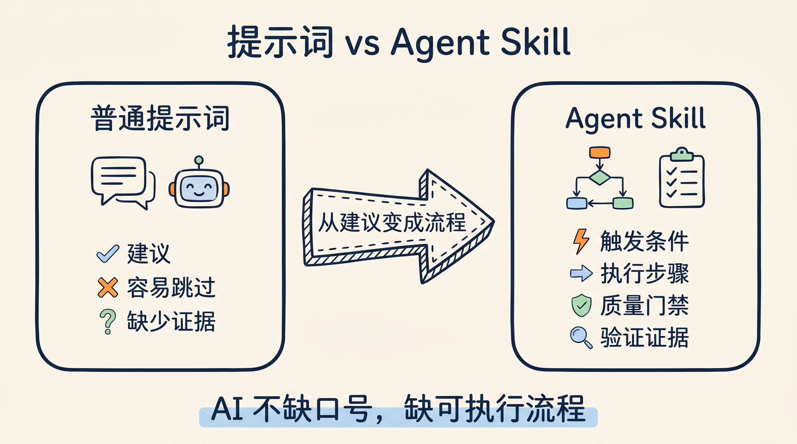
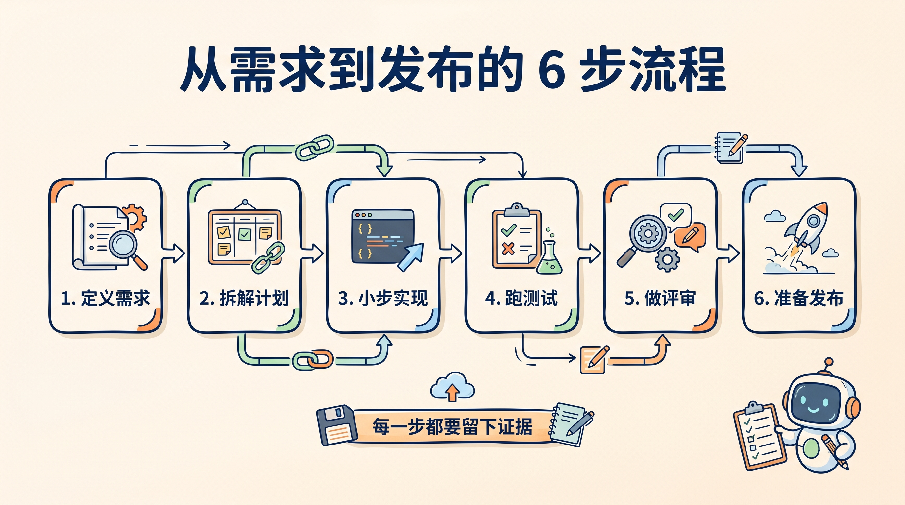
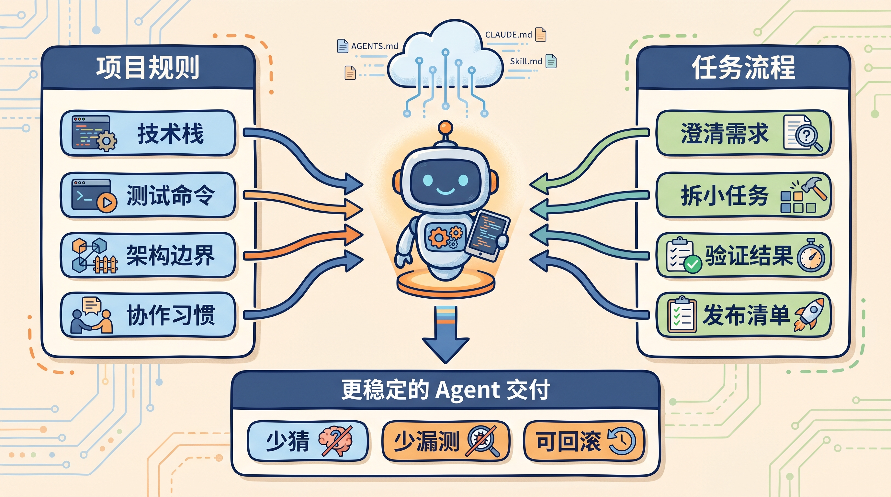

# 别再只给 AI 写提示词：Agent Skills 把工程流程变成可执行规则

很多人用 Claude Code、Codex 或 Cursor，最开始都会做一件事：

给 AI 写一段更长、更细、更严厉的提示词。

但真正跑项目时，你会发现问题不在于 AI 不知道“要写好代码”，而在于它经常不按工程纪律做事。

需求还没澄清就动手。

测试还没跑就说完成。

遇到报错先猜一把。

改动一变大，就开始顺手改边界。

所以我现在越来越觉得：AI 编程的下一步，不是把 prompt 写得更长，而是把工程流程变成 Agent 能稳定执行的规则。

`addyosmani/agent-skills` 做的就是这件事。

它不是一个“神奇提示词合集”，而是把资深工程师日常做的规格、计划、实现、测试、评审和发布，拆成一组可被 AI Agent 读取和执行的 Markdown 技能。

如果只用一句话概括：

**Agent Skills = 工程流程说明书 + 触发条件 + 质量门禁 + 验证清单。**

截至 2026 年 4 月 27 日我查看时，GitHub API 显示这个仓库约 24.4k stars、3.0k forks，许可证是 MIT，最新 release 是 2026 年 4 月 10 日发布的 `0.5.0`。

## AI Agent 真正缺的不是提示词，而是流程约束

普通提示词更像建议。

你可以对 Agent 说：

```text
请写高质量代码，记得测试，注意安全。
```

这句话听起来没问题，但执行时很容易变成口号。

模型知道这些词重要，却不一定会在正确时机停下来做正确动作。

技能的思路不一样。

一个 `SKILL.md` 会告诉 Agent：

- 什么时候应该使用这个技能
- 应该按什么步骤做
- 哪些借口不能成立
- 完成时必须拿出什么证据

这点很关键。

AI Agent 的很多失败不是“不会写代码”，而是“不会坚持工程流程”。

比如一个需求来了：

```text
帮我加一个用户导出功能。
```

没有流程约束时，Agent 可能直接找文件、改接口、补 UI。看起来很快，但很容易漏掉权限、分页、数据量、审计日志和测试边界。

如果按 Agent Skills 的思路走，流程会更像这样：

```text
先写规格 -> 拆任务 -> 小步实现 -> 写测试 -> 跑验证 -> 做 review -> 准备发布
```

慢的是开头几分钟，省的是后面几个小时的返工。

小余判断：提示词解决的是“你希望 AI 怎么做”，Skill 解决的是“AI 到底会不会按流程做完”。



## 这个项目最值得看的，是 7 个命令和 20 个技能

`agent-skills` 的结构很直接。

它把软件开发流程拆成 6 个阶段：

```text
DEFINE -> PLAN -> BUILD -> VERIFY -> REVIEW -> SHIP
```

对应到 Claude Code 里，就是 7 个 slash commands：

| 命令 | 作用 | 核心原则 |
|---|---|---|
| `/spec` | 定义要做什么 | 先规格，后代码 |
| `/plan` | 拆成可执行任务 | 任务要小、可验收 |
| `/build` | 小步实现 | 一次只做一个切片 |
| `/test` | 用测试证明 | 测试是证据 |
| `/review` | 合并前评审 | 先过质量门 |
| `/code-simplify` | 简化代码 | 清晰优于聪明 |
| `/ship` | 准备发布 | 发布要可回滚 |

底层则是 20 个工程技能，覆盖从需求到发布的完整周期。

比如：

- `spec-driven-development`：先写清楚需求、边界和验收标准。
- `planning-and-task-breakdown`：把大任务拆成小任务。
- `incremental-implementation`：按可构建、可测试、可回滚的小切片推进。
- `test-driven-development`：用 Red -> Green -> Refactor 约束实现。
- `debugging-and-error-recovery`：先复现、定位、缩小范围，再修复。
- `code-review-and-quality`：从正确性、可读性、架构、安全、性能做评审。
- `shipping-and-launch`：发布前检查、灰度、回滚、监控。

这套设计最克制的地方在于：它没有把所有流程塞进一个巨大 prompt。

`SKILL.md` 是入口，真正细的检查表放在 `references/` 里，需要时再加载。

这就是所谓的渐进式上下文。

小余判断：好的 Agent 工作流不是“给它更多上下文”，而是“在正确时机给它正确上下文”。



## 它最有价值的设计：专门反“偷懒”

Agent Skills 里有一个很有意思的设计：很多技能都会写 `Common Rationalizations`。

翻译成人话，就是 Agent 常见的偷懒理由。

比如：

- “这个改动很小，不用写测试。”
- “我先实现，后面再补验证。”
- “看起来没问题，可以结束。”
- “我已经读了 README，不需要查官方文档。”

这些理由是不是很熟？

人类工程师也会这么想。

区别在于，人类工程师会被 code review、CI、团队规范拉回来；Agent 如果没有明确门禁，就会把这些借口当成合理路径。

所以这个项目把很多“不能跳过的步骤”写得很硬。

`test-driven-development` 要求先写失败测试，再写实现。

`debugging-and-error-recovery` 要求先复现、定位、缩小范围，再修复。

`code-review-and-quality` 要求从多个维度检查代码，而不是只看能不能跑。

这些规则不新，老工程师都知道。

新的地方在于：它把这些工程纪律写成了 Agent 能稳定读取的流程。

小余判断：Agent 真正需要的不是鼓励，而是门禁。没有门禁，它会自动走最短路径。

## 真要用，别一上来装满 20 个技能

不要一上来把 20 个技能全塞给 Agent。

上下文窗口不是无限资源，加载太多流程反而会稀释当前任务重点。

如果只是想试水，我建议从 3 个技能开始。

| 场景 | 先用哪个 Skill | 解决什么问题 |
|---|---|---|
| 需求经常跑偏 | `spec-driven-development` | 先把目标、边界、验收标准说清楚 |
| 改完没人敢信 | `test-driven-development` | 用测试证明行为变化 |
| 完成后质量不稳 | `code-review-and-quality` | 让 Agent 先做结构化自查 |

如果你经常让 Agent 做多文件改动，再加一个：

```text
incremental-implementation
```

它会强制 Agent 小步推进，每个切片都保持可构建、可测试、可回滚。

在 Claude Code 里，可以直接通过插件市场安装：

```text
/plugin marketplace add addyosmani/agent-skills
/plugin install agent-skills@addy-agent-skills
```

如果是 Cursor，可以把常用的 `SKILL.md` 复制到 `.cursor/rules/`。

如果是 Gemini CLI，可以通过 skills 安装命令把 `skills/` 目录装进去。

其他 Agent 也能用，因为这些技能本质上就是 Markdown 文件。

通用做法也很简单：

```bash
git clone https://github.com/addyosmani/agent-skills.git
```

然后把你需要的 `skills/<name>/SKILL.md` 放进对应工具的规则系统里。

小余判断：先解决最痛的一个环节，不要一开始就追求完整体系。

## 它应该和 AGENTS.md / CLAUDE.md 配合用

很多团队已经在项目里写了 `AGENTS.md`、`CLAUDE.md`、`.cursorrules` 或 Copilot instructions。

Agent Skills 不是替代这些文件，而是补上它们最容易失效的一层：任务流程。

项目级规则通常写的是长期约定：

- 这个仓库用什么技术栈
- 测试命令是什么
- 不要改哪些目录
- 提交信息怎么写

Skill 写的是任务流程：

- 需求不清时怎么澄清
- 多文件改动怎么切片
- bug 修复时怎么先复现
- review 时从哪些维度检查
- 发布前要拿出哪些证据

一个是“本项目的规矩”，一个是“做这类事的步骤”。

两者应该配合使用。

比如你的 `AGENTS.md` 可以写：

```md
本项目使用 pnpm。
测试命令是 pnpm test。
不要修改 generated/ 目录。
```

而 `test-driven-development` 技能会要求 Agent：

```md
先写一个会失败的测试。
确认测试真的失败。
写最小实现让测试通过。
重构后再次运行测试。
```

前者告诉 Agent “在这个仓库怎么做”，后者告诉 Agent “这类任务应该按什么顺序做”。



## 最后：不要把 Agent 当成更快的打字员

Agent Skills 不是魔法。

它不能保证模型永远理解需求，也不能替代工程师判断。

如果项目本身没有测试、没有构建命令、没有清晰边界，Skill 写得再好，Agent 仍然缺少验证依据。

它也不适合把所有任务都流程化。

一个拼写修复，不需要长篇规格。

一个高风险支付改动，就不应该跳过测试、review 和发布清单。

所以更合理的用法是：

把 Agent Skills 当成一个基础模板，再结合团队自己的 `AGENTS.md`、CI 命令、测试体系和代码评审标准做裁剪。

过去大家优化 AI 编程助手，最常见的方向是写更长的提示词。

现在这个方向开始变化了。

真实工程里更稀缺的是流程：

- 什么时候停下来问问题
- 什么时候必须写测试
- 什么时候必须查官方文档
- 什么时候不能继续猜
- 什么时候应该把改动拆小

这些东西不神秘，却决定了 AI Agent 能不能进入生产环境。

如果你已经在项目里使用 AI coding agent，可以从一个最痛的环节开始改：

- 经常需求跑偏，就先加规格技能。
- 经常修 bug 猜错，就先加调试技能。
- 经常测试缺失，就先加 TDD 技能。

不要把 Agent 当成一个更快的打字员。

更好的方向是：让它按你的工程流程工作。

我把这篇文章里的「3 个起步 Skill + AGENTS.md 配合方式 + 验证清单」整理成了可复制版本。

关注「蒸馏小余」，回复 `SKILL` 获取。

下一篇我会拆：怎么把一个团队的 code review 经验，写成 Agent 能稳定执行的 `code-review-and-quality` Skill。

## 参考资料

- GitHub 仓库：<https://github.com/addyosmani/agent-skills>
- Getting Started：<https://github.com/addyosmani/agent-skills/blob/main/docs/getting-started.md>
- Skill Anatomy：<https://github.com/addyosmani/agent-skills/blob/main/docs/skill-anatomy.md>
- 0.5.0 Release：<https://github.com/addyosmani/agent-skills/releases/tag/v0.5.0>
