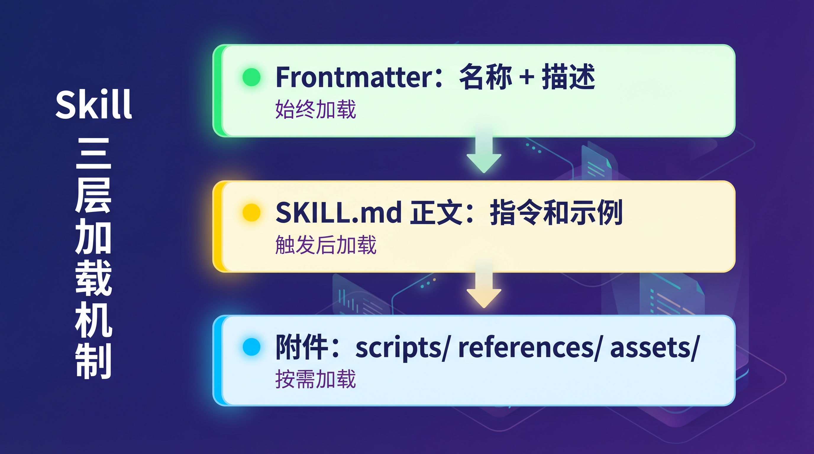

# 写好 Agent Skill 的 8 个实战技巧

先说结论：**Skill 是 2026 年 AI Agent 生态里最轻量、最实用的扩展方式**。Claude Code、Gemini CLI、Copilot、Cursor 等 30 多个 Agent 产品都已经支持了同一套 SKILL.md 规范。

但「支持」和「用好」是两码事。

Philipp Schmid（Google DeepMind 技术负责人）最近分享了他写 Skill 踩过的坑和总结出的 8 条经验。这些不是理论建议，而是他在大量实际使用后沉淀下来的最佳实践。

下面逐条拆解。

## 1. 先搞清楚 Skill 到底是什么

一个 Skill 就是一个文件夹，核心只有一个文件：`SKILL.md`。

```text
my-skill/
├── SKILL.md          ← 唯一必须的文件
├── scripts/          ← 可复用的脚本
├── references/       ← 参考文档，按需加载
└── assets/           ← 模板、图片等资源
```

SKILL.md 有三层结构：

1. **Frontmatter（始终加载）**：名称和描述，告诉 Agent「什么时候用这个 Skill」
2. **正文（触发后加载）**：Markdown 指令，告诉 Agent「怎么做」
3. **附件（按需加载）**：scripts、references、assets 文件夹



真正关键的地方在于：Skill 分两类——

- **能力型 Skill**：让 Agent 做到它本来做不好的事（比如填 PDF 表单）。随着模型能力提升，这类 Skill 可能会过时，用评测来判断何时退役。
- **偏好型 Skill**：编码你的特定工作流（比如团队的 Code Review 流程）。这类 Skill 更持久，但需要跟实际流程保持同步。

## 2. 描述写不好，一切白搭

SKILL.md 的 `description` 字段是触发机制。Agent 看的就是这段话来决定要不要加载你的 Skill。

写得太模糊？Agent 不知道什么时候该用。写得太宽泛？每个请求都会触发。

看看对比：

| 反面教材 | 正确写法 |
|---------|---------|
| "帮助处理文档" | "创建、编辑和分析 .docx 文件，用于批注追踪、格式化或文本提取" |
| "API 辅助工具" | "在编写调用 Gemini API 的代码时使用，包括文本生成、多轮对话、图片生成或流式输出" |


Philipp 的实测数据：**仅仅改善描述，就能带来 50% 的效果提升**。

这意味着什么？如果你的 Skill 表现不好，先别急着改指令——先把描述改清楚。

## 3. 写指令，不写论文

Agent 很聪明，你的任务是告诉它「它还不知道的事」。研究表明，过长、过于全面的上下文反而会降低表现。

几条实操建议：

- **用指令式表达**：写 `始终使用 interactions.create()`，而不是「Interactions API 是推荐方案」。前者是命令，后者是 Agent 不会执行的知识点。
- **先放示例**：5 行代码比 5 段解释管用。
- **说清楚 why**：「使用 model X，model Y 已废弃会报错」——这让 Agent 能举一反三，而不是死记规则。
- **别过度拟合**：不要为了通过你手里那三条测试 prompt 做微调。好的 Skill 要能扛住百万次调用。

## 4. 保持精简

不要把所有东西都塞进一个文件。Agent 是分层加载信息的：

- **始终加载**：Frontmatter 的 name + description
- **触发后加载**：SKILL.md 正文（建议控制在 500 行以内）
- **按需加载**：reference 文件、脚本、资源

如果你的 Skill 涉及多个主题（比如 AWS 部署和 GCP 部署），拆成不同的 reference 文件。Agent 只会读它需要的那份，把上下文留给真正的任务。

> 实用技巧：如果某个 reference 文件超过 500 行，在文件顶部加一个带「行号提示」的目录，让 Agent 快速定位。

## 5. 给自由度，别写流水账

一个常见错误：把 Skill 写成逐步操作手册。

「Step 1: 读文件。Step 2: 解析 JSON。Step 3: 提取字段……」

当你规定了每一步，就剥夺了 Agent 自我调整、错误恢复和寻找更优路径的能力。

更务实的做法是：**描述目标，不规定路径。**

| 别这样写 | 应该这样写 |
|---------|---------|
| "Step 1: 读配置文件。Step 2: 找到数据库 URL。Step 3: 更新端口。Step 4: 写回文件。" | "把配置文件中的数据库端口更新为用户指定的值。" |
| "Step 1: 创建分支。Step 2: 改代码。Step 3: 跑测试。Step 4: 开 PR。" | "开 PR 前必须跑测试。不允许直接 push 到 main。" |

如果只用一句话总结：**给约束，不给流程。如果顺序真的很重要，那就写脚本，不是写 Skill。**

## 6. 别忘了写「不该触发」的条件

只想着 Skill 什么时候该触发，不想它什么时候不该触发，很容易翻车。

比如描述写成「用于任何编码任务」——那你的 Skill 会劫持每一个请求。

正确写法：

> "用于处理 PDF 文件。不用于普通文档编辑、电子表格或纯文本文件。"

测试也一样，不仅要测「应该触发」的场景，也要测「不应该触发」的场景。否则你只会在一个方向上优化。

## 7. 发布前必须做评测

不要没测试就发布 Skill。每次运行结果可能不同，跑一次不够。


具体怎么做：

1. **手动跑几轮不同的 prompt**，观察哪里会出错。是否假设某个依赖存在？是否跳过了步骤？
2. **定义可衡量的成功标准**。输出能编译吗？用了正确的 API 吗？按步骤执行了吗？评的是结果，不是路径。
3. **准备 10-20 条测试 prompt**。混合该触发的、不该触发的、边界情况。每条 prompt 有自己的验收标准。
4. **每条 prompt 跑 3-5 次**。Agent 输出不确定性很高，看分布而不是单次结果。
5. **隔离每次运行**。用干净环境测试，避免上下文污染掩盖真实问题。
6. **出了问题？先改描述**。大多数问题出在触发环节，不在指令本身。

Philipp 在他的配套文章中展示了一个完整案例：通过系统化评测，他把一个 Gemini API Skill 的通过率从 66.7% 提升到了 100%。

## 8. 知道什么时候该退役

定期跑一下不带 Skill 的评测。如果结果依然通过，说明模型已经内化了这个 Skill 的能力——可以退役了。

这一点对能力型 Skill 尤其重要。模型在进步，能力差距在缩小。曾经需要 Skill 才能做好的事，未来可能模型本身就能搞定。

偏好型 Skill 则不同——只要你的团队流程还在，它就有价值。但也要定期检查，确保 Skill 内容跟实际流程一致。

---

**写在最后**

Skill 机制已经是跨平台的通用标准，无论你用 Claude Code、Gemini CLI 还是 Cursor，写法都一样。这意味着你投入在 Skill 上的精力有真正的复利效应。

但就像 Philipp 总结的：大多数 Skill 的问题不在指令写得不好，而在描述没写对。先把触发条件搞清楚，其他事情会简单很多。

> 原文来自 Philipp Schmid：[8 Tips for Writing Agent Skills](https://www.philschmid.de/agent-skills-tips)
