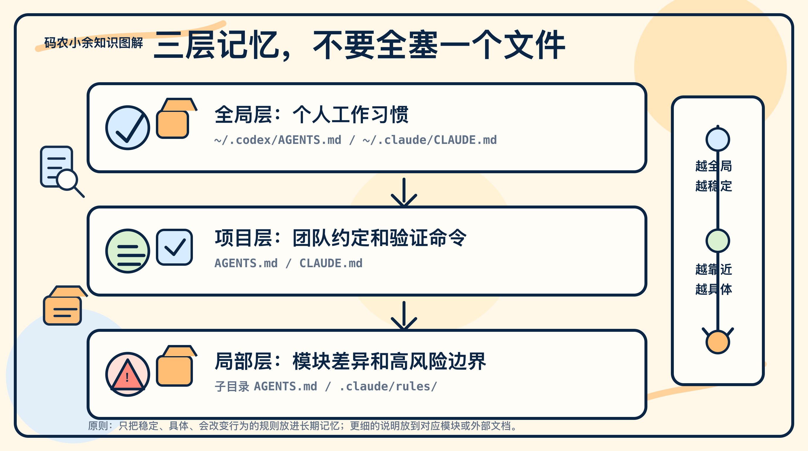
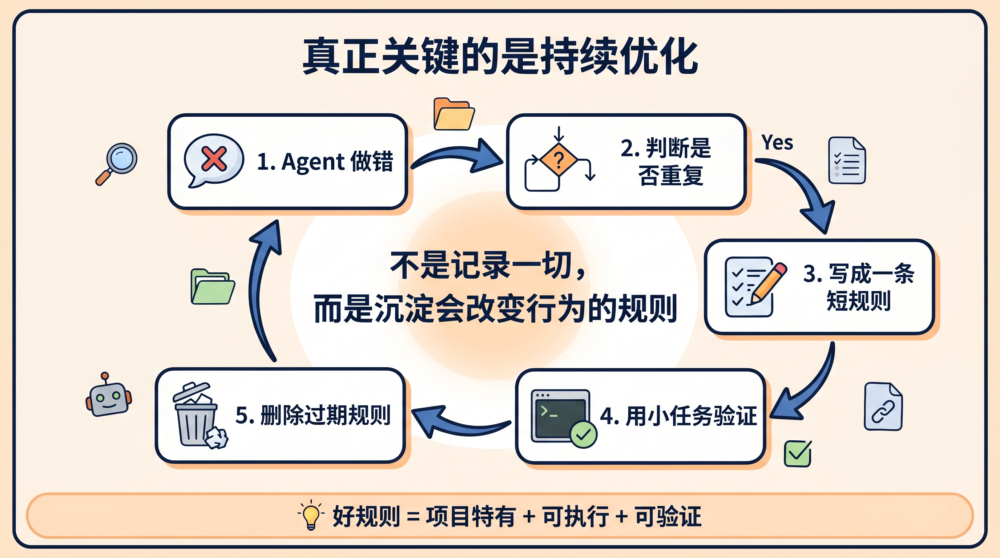

# 别让 Claude Code 每次都像新员工：AGENTS.md 应该这样写

很多人用 Codex 或 Claude Code，第一步都会跑 `/init`。

但问题是，跑完之后就放在那里不管，AI 下次还是会猜错测试命令、乱改架构边界、漏掉验证，甚至每次都像第一次进项目。

所以我现在更建议把 `AGENTS.md` / `CLAUDE.md` 当成一份长期维护的“工作契约”，而不是一次性配置文件。

它真正要解决的不是“让 AI 了解项目的一切”，而是减少它在关键位置猜错：该跑什么命令、哪些目录不能动、完成前怎么验证、踩过的坑下次别再踩。

这篇文章就讲一件事：初始化之后，怎么把这份文件养成一个真正有用的 Agent 工作手册。



## `/init` 只是开始：为什么跑完还会翻车

先把基本动作说清楚。

如果你用的是 Claude Code，可以在项目根目录运行 `/init`。它会扫描当前仓库，并生成一个起步版 `CLAUDE.md`；如果这个文件已经存在，它通常会建议改进，而不是粗暴覆盖。

这个设计本身就说明，`CLAUDE.md` 不应该被理解成一次性产物。它更像是一个项目记忆的草稿。

如果你用的是 Codex，核心文件是 `AGENTS.md`。OpenAI 的官方文档把它定义为 Codex 开始工作前会读取的自定义指令文件，并且支持全局、项目、子目录多层规则：全局习惯可以放在 `~/.codex/AGENTS.md`，项目约定放在仓库根目录，模块差异再放到更靠近代码的目录里。

但初始化本身不等于规则真的生效。

我更建议你跑完 `/init` 之后，第一步不是立刻让 agent 干活，而是让它复述当前加载到的规则。比如让它回答：

```text
请总结你当前读到的 AGENTS.md / CLAUDE.md 规则。
重点说明：验证命令、架构边界、完成定义、哪些改动必须先问。
```

这个动作很朴素，但能立刻暴露两个问题：

- 文件到底有没有被读取
- agent 理解到的重点是否和你预期一致

更务实的初始化流程应该是这样：

```text
1. 先生成或手写 AGENTS.md / CLAUDE.md。
2. 人工删掉空话、重复信息和 agent 能从代码里自己推断的内容。
3. 让 agent 总结它读到的规则，确认文件真的生效。
4. 跑一个小任务，观察它是否会按规则验证、收尾和汇报。
5. 把第一次暴露出来的偏差，改成更具体的规则。
```

小余判断：`/init` 只负责把门打开。真正决定后续体验的，是你有没有把门后面的规则整理清楚。

## 只写会改变行为的 6 类内容

`AGENTS.md` 和 `CLAUDE.md` 最应该解决的，不是“让 agent 了解这个项目的一切”，而是“减少它在关键位置猜错”。

这两个目标看起来接近，实际差别很大。

前者很容易把文件写成百科全书，后者会逼你只保留能改变行为的约束。

我建议先写六类内容。

### 1. 常用命令

不要只写“运行测试”或者“提交前检查代码”。这类话对人类读者可能够了，但对 agent 来说还是太模糊。

它真正需要的是：在这个项目里应该执行哪一条命令、带哪些参数、失败时如何缩小范围。

```md
## 验证命令

- 安装依赖：`pnpm install`
- 跑单测：`pnpm test -- --runInBand`
- 跑单个测试：`pnpm test -- src/foo.test.ts`
- 类型检查：`pnpm typecheck`
- 提交前至少跑：`pnpm lint && pnpm test`
```

GitHub 分析过 2500 多个 `agents.md` 文件后提到，一个常见的高质量特征就是把可执行命令放得很靠前，并且给出真实参数。

原因很简单：agent 不缺“测试很重要”这种常识，它缺的是这个仓库里最小、最快、最靠谱的验证路径。

### 2. 项目特有的代码风格

不要把 PEP 8、Prettier、常规 TypeScript 习惯全部贴进去，因为这些模型本来就知道。

更值得写的是项目特有的偏好，尤其是那些看起来和通用最佳实践不完全一致、但团队已经有明确取舍的地方。

```md
## 代码风格

- React 组件只用 named export，不用 default export。
- API 层只做参数校验和错误映射，业务逻辑必须放在 `services/`。
- 新增异步任务时，必须带重试上限和结构化日志。
```

这类规则有用，是因为它能抵消模型从训练数据里带来的“通用默认值”。通用默认值不一定错，但如果它和项目习惯冲突，最后就会变成 review 里的反复纠正。

### 3. 架构边界

很多 agent 翻车并不是因为代码写不出来，而是因为它为了完成一个局部目标，顺手改了不该改的层。

比如修页面 bug 时改 API 协议，修测试时放宽生产逻辑，或者为了让类型过就改公共接口。

这种风险不能只靠事后 review，最好提前写清楚。

```md
## 架构边界

- `src/api/` 只负责路由、鉴权、输入输出转换。
- `src/domain/` 不允许依赖 React、数据库客户端或 HTTP 框架。
- `generated/` 目录禁止手写修改，只能重新生成。
- 数据库 schema、CI 配置、生产环境变量改动必须先询问。
```

这里最重要的不是目录介绍，而是边界语气要明确：哪里可以动，哪里不能动，哪里必须先问人。

边界越清楚，agent 越不容易用“我以为这样也行”的方式扩大改动范围。

### 4. 完成定义

Claude 的 power user tips 里反复强调一个点：给 Claude 一个验证工作的方法，质量会明显提高。

放到 Codex 也是一样。很多 AI 代码问题不是生成阶段完全不会写，而是收尾阶段没验证，或者验证失败后没有把风险讲清楚。

所以文件里应该有一段“完成定义”：

```md
## 完成定义

- 修改业务逻辑后，必须补充或更新测试。
- 前端改动必须用浏览器或截图检查实际页面。
- 如果测试无法运行，要说明原因、已尝试的命令和剩余风险。
- 不要只说“已完成”，要列出验证命令和结果。
```

这几行看起来普通，但它改变的是 agent 的交付习惯。你不是只要求它生成代码，而是要求它按项目标准完成一次可验收的工作。

### 5. 已知坑

这部分往往最有价值，因为它记录的是 README 里不会写、但老工程师都知道的隐性经验。

比如某个测试命令本地会跑太久，某个 legacy 模块不能随便重构，某个配置字段会被部署脚本读取。

```md
## 已知坑

- 本项目 `npm test` 会跑全量端到端测试，日常改动优先使用 `npm run test:unit`。
- `legacy/payment/` 仍在使用同步 SDK，不要擅自改成异步封装。
- `src/config/runtime.ts` 会被部署脚本读取，字段名不能随便重命名。
```

这类信息越具体越好。

不要写“注意历史代码”，要写清楚是哪一块历史代码、为什么危险、遇到什么情况应该停下来问人。

### 6. 协作规则

如果你会让 agent 提交代码、开 PR、修 CI，协作规则也应该写进去。

否则它很可能能完成代码，却把分支名、提交信息、PR 描述和无关格式化搞得很难 review。

```md
## Git 工作流

- 分支名使用 `codex/<short-description>`。
- commit message 用英文祈使句，例如 `Add retry handling`。
- PR 描述必须包含变更内容、验证方式和风险。
- 不要把无关格式化混进功能改动。
```

小余判断：这 6 类内容的目标不是介绍项目，而是阻止 agent 在关键位置乱猜。

## 重复错误怎么沉淀成规则

初始化之后，真正的维护方法可以概括成一句话：

**做错一次先纠正，做错两次就写进文件。**

为什么不是做错一次就写？

因为 `AGENTS.md` 和 `CLAUDE.md` 不是对话垃圾桶，它们不应该记录所有临时偏好和一次性上下文。只有当一个问题同时满足三个条件时，才值得进入长期记忆：

1. 这是项目特有的吗？
2. 这会重复发生吗？
3. 这能写成一句可执行的规则吗？

比如 agent 写错了一次变量名，通常不用写。

但如果它连续几次在这个项目里用错测试命令，就应该写。

再比如它一次性没理解你的临时需求，也不用写。

但如果它总是在没有确认的情况下改数据库 schema，那就必须写成硬规则。

纠正时可以直接这样说：

```text
这次问题不是一次性失误。
请把它总结成一条短规则，更新到 AGENTS.md / CLAUDE.md。
规则要具体、可执行、不要超过两行。
```

这句话的价值在于，它不是让 agent 机械地“记住我说过的话”，而是让它把一次经验压缩成未来可复用的工作约定。

久而久之，文件里留下的不是聊天记录，而是一组能持续降低返工率的规则。



小余判断：如果一个规则不能改变 agent 的下一次行为，它就不应该进长期文件。

## 文件为什么不能越写越厚

这里要特别提醒一句：上下文文件不是越长越好。

最近几篇研究给出的信号很值得重视。

一篇 2026 年 1 月的论文观察到，在 10 个仓库、124 个 PR 的实验里，有 `AGENTS.md` 时 agent 的中位运行时间下降了 28.64%，输出 token 也下降了 16.58%。

但另一篇 2026 年 2 月的论文又发现，在多种 agent 和模型上，仓库级 context file 反而可能降低任务成功率，并让推理成本增加超过 20%。

这两个结论并不矛盾。

它们共同指向的是同一个问题：上下文文件有用，但前提是短、准、没有噪音。

短而准的规则是导航，长而乱的规则就是负担。

如果你把完整 API 文档、历史决策过程、过期命令、每个文件夹的流水账、“写干净代码”这种空话，以及互相冲突的新旧约定全部塞进去，agent 不是更聪明，而是更难判断哪些指令该优先执行。

Claude 官方文档建议 `CLAUDE.md` 要短、信号密度高，大致控制在 200 行以内；OpenAI Codex 文档也提到，项目说明合并后有默认大小上限，默认是 32 KiB。

这些限制背后的意思很一致：

**上下文是预算，不是仓库。**

更稳的做法不是把所有规则塞进一个文件，而是按照作用范围分层：

| 层级 | 放什么 | 典型位置 |
|---|---|---|
| 全局层 | 你的个人工作习惯 | `~/.codex/AGENTS.md` / `~/.claude/CLAUDE.md` |
| 项目层 | 团队约定、命令、架构边界 | 仓库根目录 |
| 局部层 | 模块差异、高风险目录规则 | 更靠近代码的目录 |

全局层适合放跨项目都稳定成立的偏好，比如修改前先说明要检查哪些文件、默认优先使用项目已有模式、完成后必须说明验证命令。

项目层适合放团队约定。仓库根目录的 `AGENTS.md` 或 `CLAUDE.md` 应该进 git，因为它不是你的私人偏好，而是团队和 agent 的共同工作约定。

局部层适合放模块差异。大项目尤其需要这层，因为前端、后端、支付、基础设施、迁移脚本的风险完全不同。

小余判断：规则越靠近代码，就应该越具体；规则越全局，就应该越稳定。

## 可复制模板 + 维护规则

下面这个模板不是让你一次填满，而是给你一个最小骨架。

第一次初始化后，先把能确定的部分填上，剩下的靠后续真实使用慢慢补。

```md
# AGENTS.md / CLAUDE.md

## 项目心智模型

- 这个项目的核心目标是：<一句话说明>
- 主要模块：
  - `src/api/`：路由和输入输出转换
  - `src/domain/`：核心业务逻辑
  - `src/ui/`：前端界面

## 常用命令

- 安装依赖：`<command>`
- 本地启动：`<command>`
- 单元测试：`<command>`
- 类型检查：`<command>`
- Lint：`<command>`

## 完成定义

- 改业务逻辑必须补测试。
- 完成前必须运行最小相关验证命令。
- 如果验证失败或无法运行，要说明原因和风险。

## 代码约定

- <只写项目特有规则>
- <不要写通用常识>

## 架构边界

- <哪些目录可以动>
- <哪些目录不能动>
- <哪些改动必须先问>

## 已知坑

- <agent 或新人容易踩的坑>

## 维护规则

- 当同类错误出现第二次，把纠正总结成一条短规则加入本文件。
- 每次技术栈或命令变化后，更新对应段落。
- 每季度删除过期、重复、无行为影响的规则。
```

这个模板里最重要的其实是最后一段“维护规则”。

它提醒你，这份文件本身也要像代码一样被维护：有新增，有验证，也要有删除。

未来会用 coding agent 的团队，大概率都会维护某种形式的 agent 工作手册。它可能叫 `AGENTS.md`，可能叫 `CLAUDE.md`，也可能散落在 `.github/copilot-instructions.md`、`.claude/rules/` 或 `GEMINI.md` 里。

名字并不重要。

真正重要的是，你有没有把项目里的隐性经验变成 agent 可以稳定执行的显性规则。

如果只保留一句话：

**不要把 `AGENTS.md` / `CLAUDE.md` 当成 AI 配置。把它当成你和 agent 之间不断迭代的工作契约。**

我把文中的 `AGENTS.md / CLAUDE.md` 最小模板整理成了可复制版本。

关注「蒸馏小余」，回复 `AGENT` 获取。

下一篇我会拆一个真实项目：怎么把重复踩坑记录变成一份可用的 Agent 工作手册。

## 参考资料

- OpenAI Codex：Custom instructions with AGENTS.md  
  https://developers.openai.com/codex/guides/agents-md
- Anthropic Claude Code：How Claude remembers your project  
  https://code.claude.com/docs/en/memory
- Anthropic Claude Code：Best practices  
  https://code.claude.com/docs/en/best-practices
- Claude Help Center：Give Claude context: CLAUDE.md and better prompts  
  https://support.claude.com/en/articles/14553240-give-claude-context-claude-md-and-better-prompts
- Claude Help Center：Claude Code power user tips  
  https://support.claude.com/en/articles/14554000-claude-code-power-user-tips
- AGENTS.md 官方站点  
  https://agents.md/
- GitHub Blog：How to write a great agents.md  
  https://github.blog/ai-and-ml/github-copilot/how-to-write-a-great-agents-md-lessons-from-over-2500-repositories/
- arXiv：On the Impact of AGENTS.md Files on the Efficiency of AI Coding Agents  
  https://arxiv.org/abs/2601.20404
- arXiv：Evaluating AGENTS.md: Are Repository-Level Context Files Helpful for Coding Agents?  
  https://arxiv.org/abs/2602.11988
- Marmelab：Agent Experience: Best Practices for Coding Agent Productivity  
  https://marmelab.com/blog/2026/01/21/agent-experience
- Software Skeptic：AGENTS.md — How to Guide Your Coding Agents  
  https://blog.smallbit.dev/2025/11/27/agents-md-how-to-guide-your-coding-agents/
