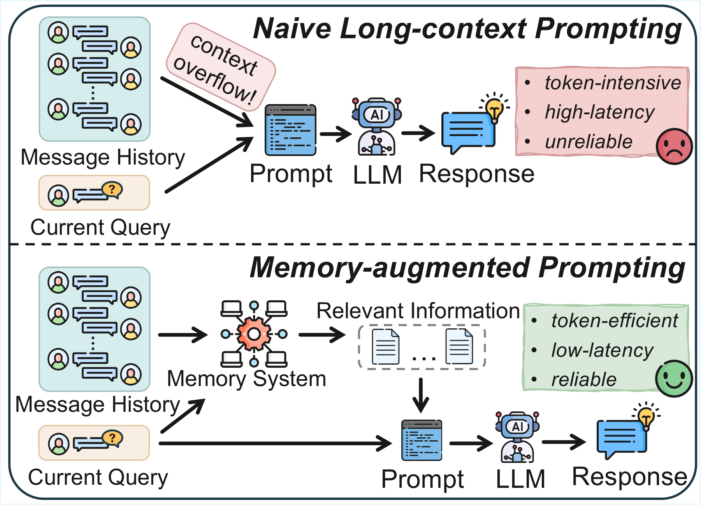
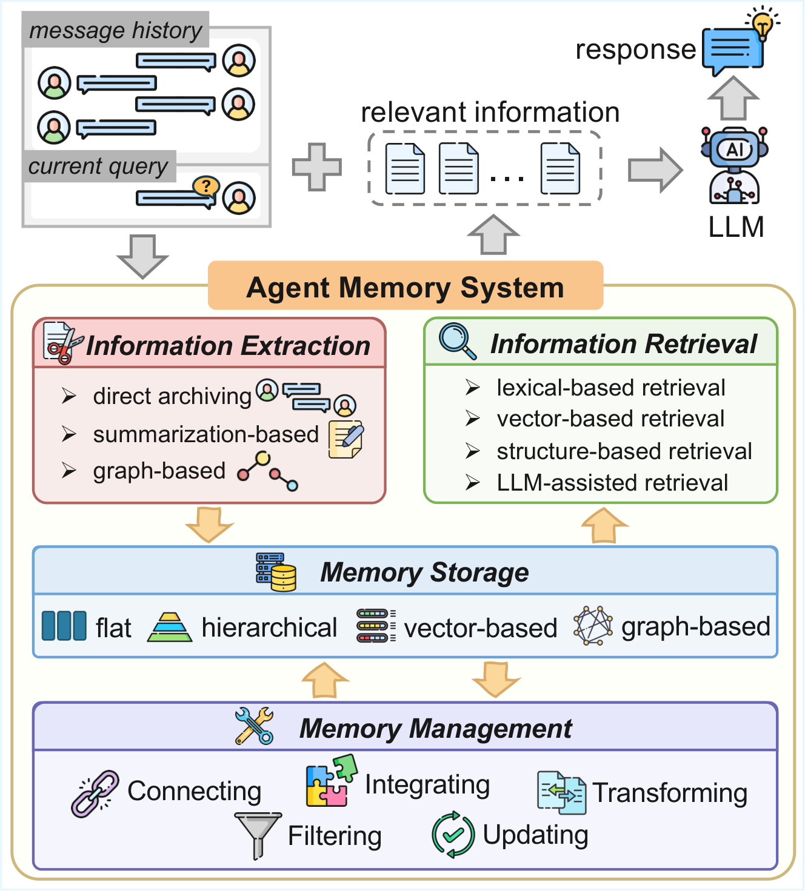
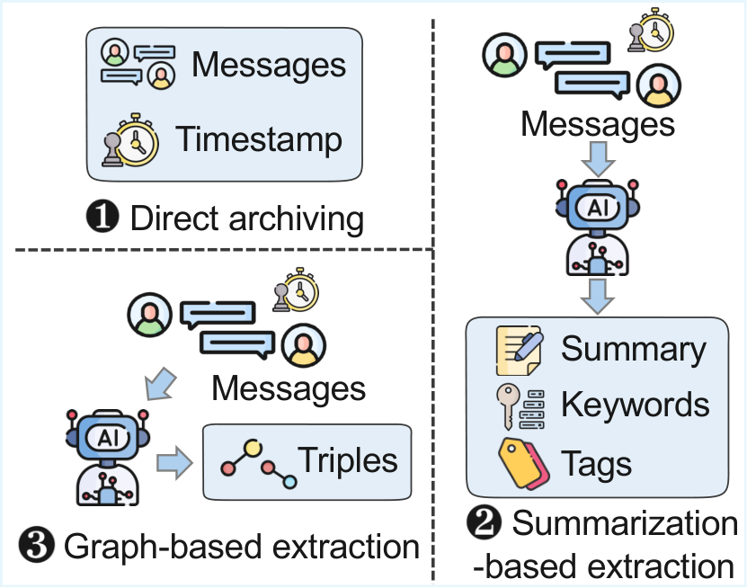
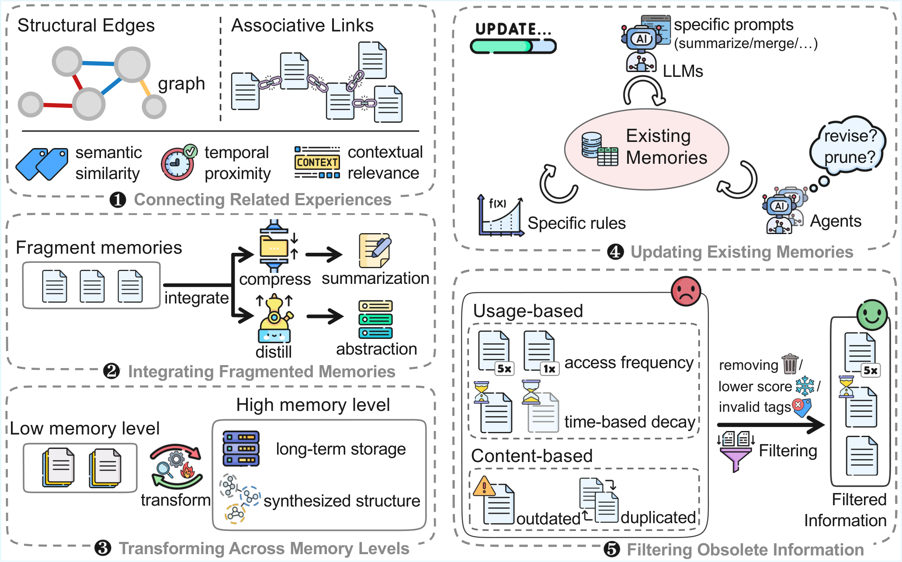
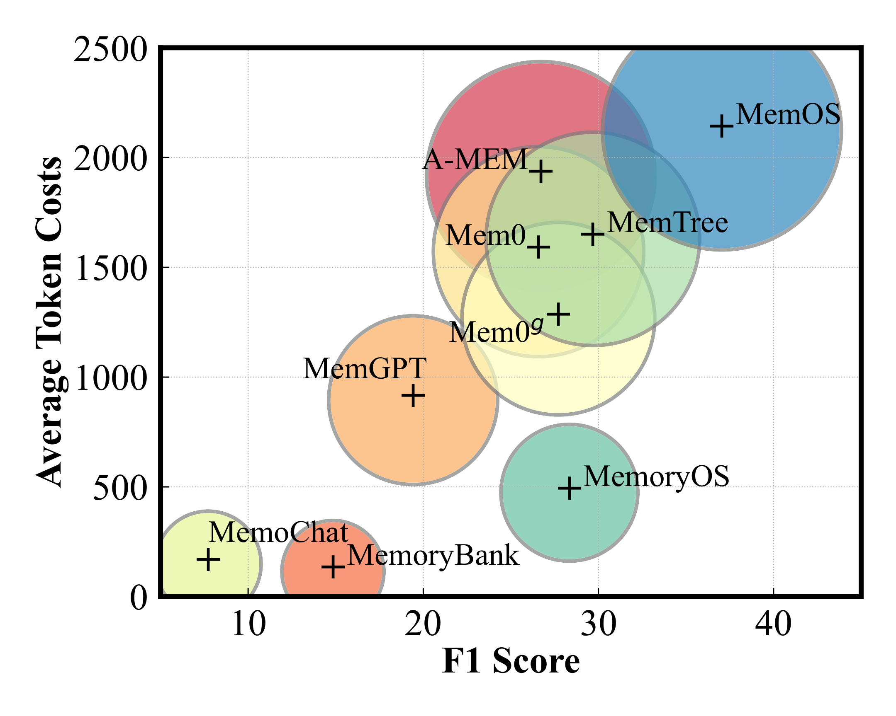
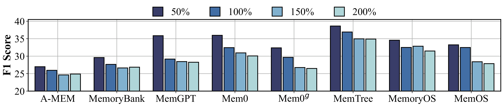
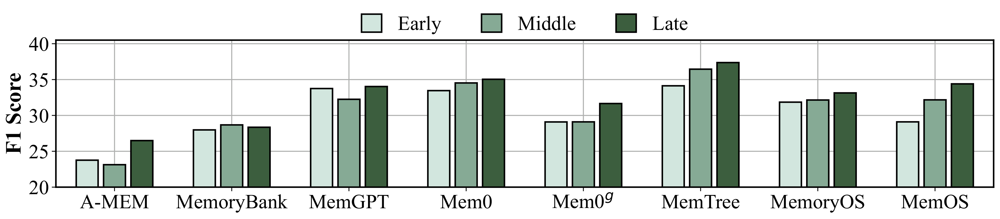
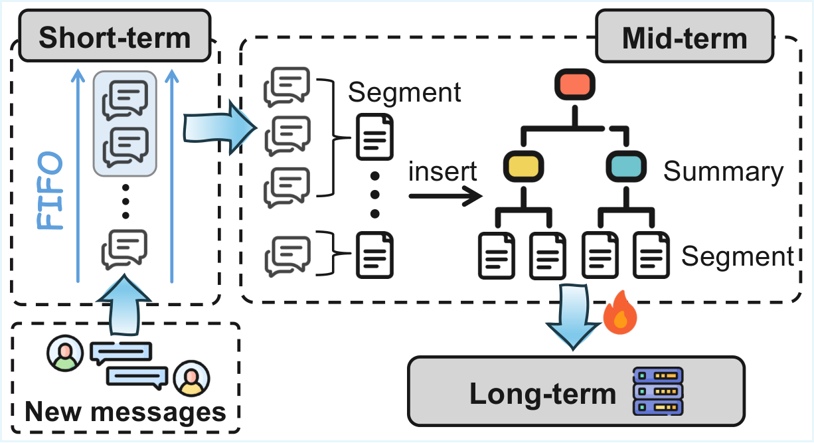
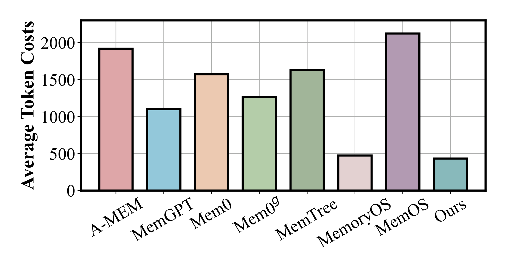

# 做 Agent 记忆，别只上向量库：10 种方法统一评测

很多人做长期 Agent，第一反应是：加一个向量库，把历史对话存进去。

这个起点没错，但很容易把问题想窄。

等系统真的跑起来，你会遇到更麻烦的东西：用户改过偏好，旧事实还被召回；历史越存越多，检索噪声越来越大；LLM 每轮都在总结、更新、查找，token 成本开始失控；一旦证据在很早的会话里出现，系统又容易想不起来。

所以这篇论文我觉得值得看。

它不是又发明一个“更聪明的记忆框架”，而是把 10 种代表性 Agent Memory 方法放进同一个实验框架里拆开测。论文 2026 年 4 月 2 日提交到 arXiv，标题是《Memory in the LLM Era: Modular Architectures and Strategies in a Unified Framework》。

我的结论很直接：

**Agent 记忆不是一个向量库问题，而是一个长期运行的数据系统问题。**

更稳的做法是：先把记忆生命周期分层，保留原始证据，给事实加版本意识，再让 LLM 参与真正需要语义判断的环节。不要一上来就把“写入、合并、删除、更新、检索”全交给模型自己决定。

## 这篇论文真正解决了什么

论文做了两件事。

第一，它把 Agent 记忆拆成 4 个模块：

- 信息提取：从当前消息里抽什么
- 记忆管理：新旧记忆怎么合并、更新、过滤
- 记忆存储：记忆以什么结构保存
- 信息检索：查询时怎么找回相关证据

第二，它把 10 个代表性方法放到 LOCOMO 和 LONGMEMEVAL 两个长期记忆 benchmark 上评测，包括 A-MEM、MemoryBank、MemGPT、Mem0、Mem0g、MemoChat、Zep、MemTree、MemoryOS、MemOS。

这个视角比单独看某个框架更有价值。

因为很多方案看起来名字不同，本质上是在这 4 个模块里做了不同取舍。有的强调图谱抽取，有的强调分层存储，有的让 LLM 像操作系统一样管理记忆，有的更偏确定性规则。

拆开以后，我们才能问一个更工程化的问题：

**一个记忆系统到底是哪里强？哪里贵？哪里容易在规模变大后失效？**

## 第一条判断：原始证据不要太早丢掉

信息提取这一步，最容易走向两个极端。

一个极端是什么都不处理，直接把历史对话扔进存储。实现简单，但后面检索会越来越吵。

另一个极端是过度结构化，马上把对话压成摘要、标签、实体关系或者三元组。看起来更高级，但也可能把关键细节压没。

论文里一个很值得注意的现象是：图谱版本的 Mem0g 并不总是优于普通 Mem0。一个合理解释是，纯三元组能保留关系，但会损失原始对话里的上下文、语气和细粒度事实。

这对工程实现很重要。

**摘要、标签、三元组、embedding 都是索引，不是事实本身。**

我更建议的做法是两层保存：

- 结构化信息负责组织和加速检索
- 原始片段负责兜底、校验和解释来源

如果只保留加工后的记忆，系统短期会显得干净，长期会变得不可追溯。等用户问“我当时为什么这么决定”，你只能给一个被压缩过的结论，拿不出证据。

## 第二条判断：记忆管理不能全靠 LLM 临场发挥

记忆系统真正难的不是“存”，而是“更新”。

用户今天说自己住上海，三个月后搬到深圳，又过一段时间改到杭州。一个长期 Agent 不能每次都召回一个城市，然后看哪个语义更像。它必须知道：

- 哪个事实是当前有效的
- 哪些事实是历史版本
- 新旧事实发生冲突时怎么处理
- 为什么最后回答的是杭州

论文把记忆管理总结成几类操作：连接相关经历、整合碎片信息、跨层级迁移、更新已有记忆、过滤过时内容。

这些操作当然可以让 LLM 参与。问题在于，越底层、越频繁、越影响一致性的操作，越不适合完全交给 LLM 临场判断。

论文在上下文扩展实验里也观察到类似现象。像 MemOS、MemGPT 这类更接近 “LLM-as-OS” 的方案，在候选空间变大后，更容易受到工具调用复杂、索引冲突和状态维护压力的影响。相反，MemoryOS 这种更明确的规则式分层管理，稳定性更好。

所以我会把 LLM 放在两个位置：

- 负责语义判断，比如这两条记忆是不是同一件事
- 负责摘要和解释，比如把多个片段合成一个中期主题

但底层状态变化要尽量确定，比如过期、版本、层级迁移、访问热度、更新时间。这些最好是系统规则，不要靠模型“感觉一下”。

## 第三条判断：层次结构通常比单层向量库更稳

如果你只做一个扁平向量库，前期会很舒服。

所有记忆都存一层，查询时 top-k 召回，接到 prompt 里让模型回答。Demo 阶段足够快，工程复杂度也低。

问题是长期记忆不是一次性文档检索。

它有生命周期。

最近几轮对话要保持连续；某个项目的阶段性信息要压成主题；稳定偏好、身份信息、关键决策要进入长期层；过时事实要保留历史但降低当前权重。

论文里的实验结果也支持这个方向：

- 在 LONGMEMEVAL 的 7B 模型设置下，MemTree 拿到最高 Overall F1：36.92
- 在 LOCOMO 上，MemOS 在 7B 和 72B 设置下分别拿到最高 Overall F1：37.05 和 42.79
- 在 LONGMEMEVAL 的 72B 设置下，MemoryOS 拿到最高 Overall F1：46.04

这些方法的共同点是：都不是简单的单层向量库。

树结构和分层结构能同时保留两种能力：上层有概括，方便快速定位；下层有原始细节，方便追溯证据。检索时先定位大范围，再下钻到具体片段，通常比在一个巨大扁平空间里直接找 top-k 更稳。

这也是我现在看 Agent Memory 的一个基本判断：

**记忆不是越多越好，而是要有层级、有版本、有生命周期。**

## 第四条判断：成本不是只看单次调用，而是看失败循环

论文专门分析了 token 成本，这部分很工程。

整体上，高性能方法通常更贵。因为更复杂的记忆管理、摘要、更新和检索，都会引入额外 LLM 调用。

但论文里更有意思的不是“高分要多花钱”这个常识，而是不同架构的性价比差异。

MemTree 和 MemOS 效果强，但 token 开销也高。MemoryOS 不一定每项第一，但在效果和 token 成本之间更均衡。MemoChat、MemoryBank 这类方法成本低，可准确率也很难上去。

这对产品系统的启发是：不要只盯单次调用 token。

真实世界里，更贵的往往是 retry loop。

记忆召回错了，模型就会用错误证据继续推理；旧事实和新事实混在一起，模型会反复解释冲突；检索噪声太大，模型会在无关上下文里找线索。这些都会把一次问题拖成多轮失败循环。

所以，记忆系统的成本优化，不只是换更便宜的模型，而是减少错误检索、错误更新和错误压缩。

## 第五条判断：记忆系统一定要测规模和位置偏差

这篇论文最值得保留的实验，不是单个方法的排行榜，而是两个鲁棒性测试。

第一个是上下文规模。

作者用 LONGMEMEVAL 构造了 50%、100%、150%、200% 的上下文规模。结果很直观：随着历史变长，几乎所有记忆架构的 F1 都会下降。

原因不是模型突然变弱，而是检索空间变大以后，相关信息和无关信息混在一起，信噪比下降。知识更新任务尤其敏感，因为它要判断“现在有效的事实是什么”。

第二个是位置敏感性。

作者把关键证据分别放在早期、中期和后期，看系统能不能稳定找回。结果是，大多数方法更擅长找后期证据，也就是更近的信息。

这不一定是坏事。有些任务确实应该偏向最近信息，比如用户刚刚改了地址。

但如果用户问的是“我第一次提到这个项目时的目标是什么”，系统就不能只靠近因偏好。它需要知道这是一个历史证据问题，而不是当前状态问题。

所以我建议评测 Agent Memory 时，至少别只测准确率。要加上 4 个维度：

- token 成本：每段对话、每次查询、每次更新分别花多少
- 规模衰减：历史从 1x 变成 2x 后掉多少
- 位置偏差：早期证据、中期证据、近期证据是否都能找回
- 更新能力：旧事实、新事实、失效事实能不能区分

只测 10 条历史里的 top-k 命中率，基本看不出生产问题。

## 作者的新方法：树结构 + 三层记忆

基于前面的实验，作者又组合出一个新方法。

它不是从零发明一套概念，而是把已有方法里表现好的模块拼起来：

- 借鉴 MemTree、MemOS 的树状组织
- 借鉴 MemoryOS 的短期、中期、长期分层
- 用更粗粒度的 segment 降低 token 成本
- 从多个层级独立检索，再合并上下文

可以简单理解成：

新消息先进入短期记忆。短期记忆满了以后，旧内容按语义切成片段，进入中期记忆树。中期树的叶子节点保留片段摘要，父节点保存聚合摘要。经常被访问、近期仍然重要的内容，再通过 heat score 晋升到长期记忆。

查询时，系统不是只搜一个库，而是同时检索短期、中期、长期记忆，再交给 LLM 生成答案。

效果上，作者的新方法在 LONGMEMEVAL 上 Overall F1 是 38.79，相比最强现有 baseline MemTree 的 36.92，整体相对提升 5.17%。

在 LOCOMO 上，新方法也拿到最好 Overall：

- Qwen2.5-7B：38.03
- Qwen2.5-72B：43.87

同时，它的平均 token 开销低于每段对话 450 tokens。

这才是我觉得工程上最有意义的部分：不是某个子任务极限刷分，而是在效果、成本和跨模型稳定性之间比较均衡。

## 如果你正在做 Agent Memory，可以直接按这张清单检查

我把这篇论文压成一个工程自查清单。

第一，先问：你要记住的到底是什么？

如果只是短期上下文，不需要上复杂长期记忆；如果是长期偏好、项目状态、历史决策，就要把它当成数据系统设计。

第二，保留原始证据。

摘要、标签和向量都只是索引。关键事实必须能追溯到原始片段，否则系统出了错很难解释。

第三，给事实加版本。

长期 Agent 一定会遇到知识更新。不要只覆盖，也不要只追加。更合理的是保留历史，同时标注当前有效状态、更新时间、置信度和失效原因。

第四，先做分层，再做复杂智能管理。

短期、中期、长期这三层比“让 LLM 自动管理一切”更适合作为起点。等生命周期稳定了，再让 LLM 参与合并、摘要和冲突判断。

第五，检索不能只有相似度。

向量检索解决语义接近，不解决时间、版本、关系和多跳推理。长期记忆要有关键词、结构、时间和语义检索的组合。

第六，评测要模拟真实变长。

不要只测小样本和干净历史。要测历史变长、证据靠前、事实更新、旧信息干扰、不同模型骨架下的表现。

## 我会怎么用这篇论文

如果是一个还在 Demo 阶段的 Agent，我不会一上来做完整 MemoryOS 或 MemOS。

我会先做一个简单但可控的三层结构：

- 短期记忆：最近 N 轮原文，保证当前任务连续
- 中期记忆：按项目、主题或会话段落生成 segment 摘要
- 长期记忆：只保存稳定偏好、长期身份、关键决策和高频访问事实

然后给每条记忆加 5 个字段：

- `source`：来自哪段原始对话或文档
- `created_at`：什么时候写入
- `updated_at`：什么时候更新
- `status`：current / superseded / expired
- `confidence`：系统对这条记忆的置信度

这个版本不一定最强，但更容易调试。等你知道哪些记忆真的有价值，再加图结构、树结构、heat score、LLM 辅助检索。

我暂时不建议把所有写入、合并、删除都交给 LLM。原因不是模型不够聪明，而是这类操作会改变系统状态。一旦错了，后面每次回答都会继承这个错误。

最大坑在于：把 Agent Memory 当成“更长上下文”的替代品。

长期记忆不是为了把所有历史都带回来，而是为了在正确时间找回正确证据，并知道哪些证据已经过期。

## 最后

这篇论文最好的地方，是把 Agent Memory 从一个听起来很玄的能力，拆成了可以设计、可以评测、可以取舍的工程模块。

如果只留一句话，我会这样总结：

**Agent 记忆的关键，不是存得更多，而是知道什么该保留、什么该更新、什么该失效、什么该在回答时被拿回来。**

对开发者来说，真正值得带走的不是某个方法名，而是一套设计顺序：

先分层，再留证据；先加版本，再做检索；先测规模和位置偏差，再谈智能管理。

我把这篇论文里的 Agent Memory 自查清单整理成了可复制版本。关注「蒸馏小余」，回复 `MEMORY` 获取。

下一篇我会继续拆：怎么给一个真实 AI 编程助手设计项目级长期记忆，让它记住仓库结构、踩坑记录和团队偏好，但不把历史噪声全塞回 prompt。

---

参考资料：

- Yanchen Wu, Tenghui Lin, Yingli Zhou, Fangyuan Zhang, Qintian Guo, Xun Zhou, Sibo Wang, Xilin Liu, Yuchi Ma, Yixiang Fang. [Memory in the LLM Era: Modular Architectures and Strategies in a Unified Framework](https://arxiv.org/pdf/2604.01707). arXiv:2604.01707, 2026-04-02.
- arXiv 摘要页：https://arxiv.org/abs/2604.01707
