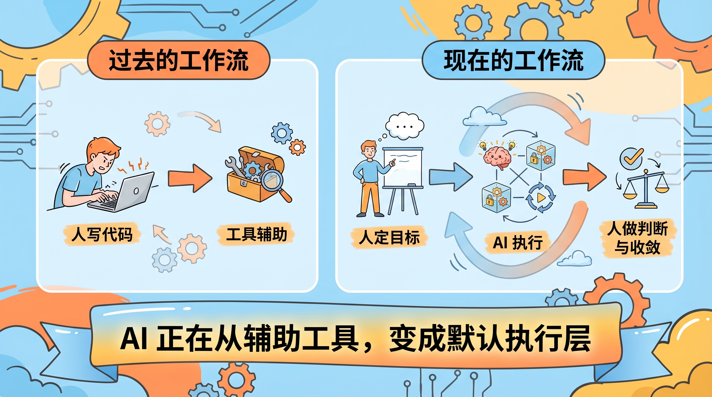
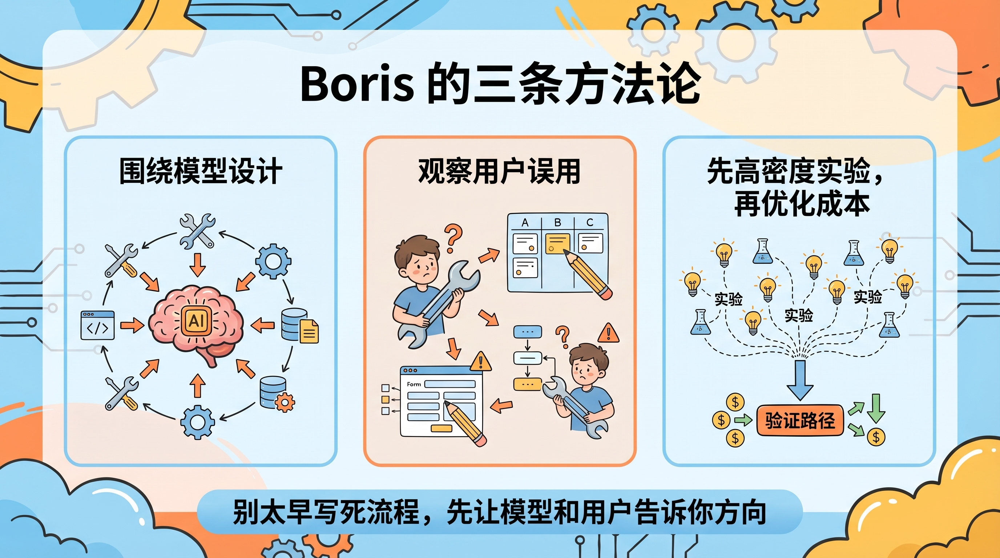

# Claude Code 负责人 Boris Cherny：编程被解决之后，会发生什么？

## 先说结论

如果只用一句话总结这期 Boris Cherny 的播客，我的结论是：

**真正被改变的，不是“写代码”这一个动作，而是整个软件生产流程。**

很多人看这期内容，第一反应会停留在几个很抓眼球的数据上：

- Claude Code 已经贡献了相当可观的公开代码提交量
- Boris 自己已经长期不手写代码
- 团队里很多角色都开始直接写代码

这些都很猛，但它们不是最重要的。

真正关键的地方在于，Boris 其实在讲一件更深的事：

**当“编码”本身越来越便宜之后，软件行业真正稀缺的能力，会从“把代码敲出来”转向“判断做什么、为什么做、怎么把不同环节串起来”。**

这也是我觉得这期播客值得认真听的原因。

它不是一场普通的产品宣传，更像是一份来自一线操盘手的行业路标。

---

## 这期播客，真正透露了三个信号

我把整期内容看下来，最值得记住的不是那些零散观点，而是下面这三个信号。

### 第一，AI 编程已经过了“能不能用”的阶段

这个问题其实已经不太重要了。

按 Boris 在播客里的说法，Claude Code 现在已经不是一个“写点 demo 还行”的工具，而是一个已经深度进入真实开发流程的系统。

他说自己从 2025 年 11 月开始，基本就不再手动写代码了。

他的工作方式变成了：

- 给 agent 下任务
- 并行跑多个任务
- 看结果
- 决定下一步

这意味着，对一部分高频开发工作来说，AI 已经不是“辅助工具”，而开始接近“默认执行层”。

以前的流程是：

`人写代码 -> 工具辅助`

现在越来越像：

`人定目标 -> AI 执行 -> 人做判断与收敛`

这不是效率提高一点点的问题，而是工作流重排。

### 第二，未来被放大的不是工程师数量，而是软件产能

很多人一听“编程被解决了”，脑子里第一个想法就是：

那是不是程序员要没了？

Boris 的回答并不是这么简单。

他的意思更接近于：

**不是软件需求变少了，而是软件供给能力突然暴涨了。**

这背后很像杰文斯悖论。

当某种能力变得更便宜、更容易获得时，社会通常不是更少使用它，而是会疯狂增加使用量。

印刷术出来以后，不是大家更少写字了，而是全社会的信息生产能力被彻底放大。

AI 编程也一样。

代码变便宜，不代表软件变少。

恰恰相反，它大概率意味着：

- 会有更多软件被造出来
- 会有更多过去“不值得做”的工具被做出来
- 会有更多非工程师开始直接参与软件构建

所以这场变化更像“软件工业化升级”，而不是“岗位一夜蒸发”。

### 第三，最先被重写的不是代码，而是团队分工

这是我觉得 Boris 讲得最有意思的部分。

他说在 Claude Code 团队里，产品经理写代码，设计师写代码，管理者写代码，很多角色之间出现了大量重叠。

这件事的重点不是“所有人都去学编程语言”。

重点是：

**当代码实现门槛被 AI 拉低之后，传统岗位分工的边界会开始松动。**

以前你可能要靠工程师排期，才能验证一个想法。现在越来越多的人，可以自己先把第一版东西做出来。

这会直接改写团队协作方式。

真正被削弱的，不一定是某个岗位本身，而是“我不会写，所以我只能提需求、排队、等待实现”的那套链路。

---

## Boris 讲对了什么

这期访谈里，我认同 Boris 的不少判断，尤其是下面这几条。

### 1. 不要过早把模型装进流程盒子里

这是 Boris 反复强调的一点。他的核心思路是：

不要一上来就把模型每一步都设计死。

更务实的做法是：

- 给它目标
- 给它工具
- 给它边界
- 然后观察它会怎么完成任务

为什么这很重要？因为现在很多团队做 AI 产品时，还是延续老思路：

先把流程写死，再让模型去填空。

但模型能力提升太快了。你今天精心设计的一大堆固定流程，六个月后可能就成了负担。

所以 Boris 的方法论，本质上是在押注一件事：

**模型会越来越通用，产品不该把自己锁死在旧能力上。**

### 2. 观察用户“误用”产品，是最好的产品路线图

这个判断我也非常认同。

Claude Code 早期明明是写代码的工具，但用户很快开始拿它去做别的事：

- 项目管理
- 表单填写
- 自动化日常工作
- 各种跨工具协调任务

这类“偏离设计目标”的使用方式，很多团队会当成噪音。

但 Boris 把它视为真正的信号。

因为它告诉你，**用户真正要买的，不是你以为你在卖的那个功能，而是更底层的能力。**

Claude Code 表面上卖的是“写代码”。

但用户真正想要的，可能是：

“给我一个能拿着工具去把事情做完的 agent。”

这也是为什么后面会长出 CoWork 这类产品。

### 3. 小团队 + 高实验密度，确实更适合这个时代

Boris 提了一个很反直觉的策略：

团队可以小，但要让大家大胆消耗 token，大胆实验。

这背后其实是一个非常典型的 AI 产品逻辑：

现在最贵的，往往不是 token，而是方向错了还投入了大量人力。

所以先高密度试错，把真正有效的路径找出来，再去优化成本，这是合理的。

如果今天还用传统大团队、长周期、重流程的方式做 AI 原生产品，节奏很容易跟不上。

---

## Boris 也有没讲透的地方

这期播客很强，但也不是没有盲区。

尤其是下面这两个地方，我觉得要单独拎出来看。

### 第一，他讲清了“工程会怎么变”，但没有完全讲清“设计会怎么变”

播客里提到一个调查：

- 工程师和 PM 采用 AI 后，大部分人更享受工作
- 设计师这边的正向比例没那么高，而且不适应的人明显更多

Boris 给出的解释，大意是：

因为 Anthropic 的设计师也会自己写代码，所以效率更高、更开心。

这个回答不能说错，但它还是偏工程视角。

因为设计的问题从来不只是“能不能自己把原型做出来”。

设计更难的部分在于：

- 视觉判断
- 交互节奏
- 用户感受
- 空间组织
- 信息优先级

这些东西，和“会不会写代码”并不是一回事。

所以我会更谨慎一点。AI 确实会重写设计流程，但它不会简单等价为“设计师也写代码，所以问题解决了”。

### 第二，“编程已被解决”这句话成立，但有前提

这句话很容易被传播，也很容易被误读。

如果不加前提，它会让人误以为：

“那以后谁都不用管代码质量、系统复杂度和工程边界了。”

这显然不对。

更准确的说法应该是：

**对相当多的实现性工作而言，编码正在快速商品化；但对复杂系统的判断、拆解、取舍和验收，仍然高度依赖人。**

也就是说，写代码的门槛确实在塌。

但把系统做对，依然很难。

这个区别非常重要。

---

## 对普通开发者来说，真正该关心什么

很多人听完这类播客，最容易问两个问题：

1. 我要不要焦虑？
2. 我现在该学什么？

我自己的答案很直接。

### 先别急着焦虑，先把工作方式升级掉

如果你现在还在把 AI 当成：

- 自动补全
- 查资料工具
- 写点小脚本的助手

那你其实还没有真正进入这一轮变化。更值得做的是把自己的工作流往前推一步。

比如：

- 先让 AI 出方案，再自己收敛
- 把任务拆成更适合 agent 并行处理的粒度
- 学会写更清晰的目标、约束和验收标准
- 用 AI 处理那些重复、低杠杆但耗时的部分

你会发现，生产力提升的关键，不在于多会写 prompt，而在于你能不能把工作改造成一种“适合让 AI 干活”的形态。

### 比起“更会写代码”，更重要的是“更会定义问题”

未来真正拉开差距的人，大概率不是代码写得最熟的人。

而是下面这类人：

- 知道什么问题值得做
- 能把模糊目标拆成可执行任务
- 能判断结果是好是坏
- 能把产品、业务、设计和技术串起来

换句话说，代码能力不会消失，但它会从“最核心的壁垒”，慢慢退到“必要但不再足够”的基础能力。

### 你要练的是“Builder 能力”

我觉得 Boris 提到的那个词很值得记住：

**Builder。**

这不是说职位名字真的一定会改。

而是说，未来更有价值的人，会越来越像一种复合型构建者：

- 懂一点产品
- 懂一点设计
- 懂一点技术
- 懂一点数据
- 最关键的是，能把事情真正做出来

这意味着，你不一定要变成全栈超人，但你至少要能跨出原来那条很窄的专业边界。

---

## 我对这期播客的最终判断

如果只谈观点密度，这期播客确实很高。

但它最有价值的地方，不在于那些刺激眼球的数据，也不在于“编程被解决了”这种大标题。真正有价值的是，它让我们看到了一线团队现在正在怎么工作：

- 怎么围绕模型设计产品
- 怎么从潜在需求里找方向
- 怎么用小团队快速试错
- 怎么把代码生成扩展成更广义的任务执行

如果你今天还把 AI 编程理解成“Copilot 升级版”，那看完 Boris 的这期内容，你应该能明显感觉到：

**行业讨论的重点，已经从“AI 会不会写代码”，转向“AI 会不会成为默认执行层”。**

这才是真正的大变化。

---

## 小结

最后再压缩成三句话。

第一，Claude Code 这类产品真正改变的，不是代码补全，而是软件生产方式。

第二，未来更稀缺的能力，不只是写代码，而是定义问题、组织流程、判断结果。

第三，普通开发者现在最该做的，不是争论 AI 行不行，而是尽快把自己的工作方式升级到 agent 时代。

本文基于 Lenny's Podcast 于 2026 年 2 月发布的 Boris Cherny 访谈内容整理与改写。原始播客可在 YouTube、Spotify、Apple Podcasts 收听。
