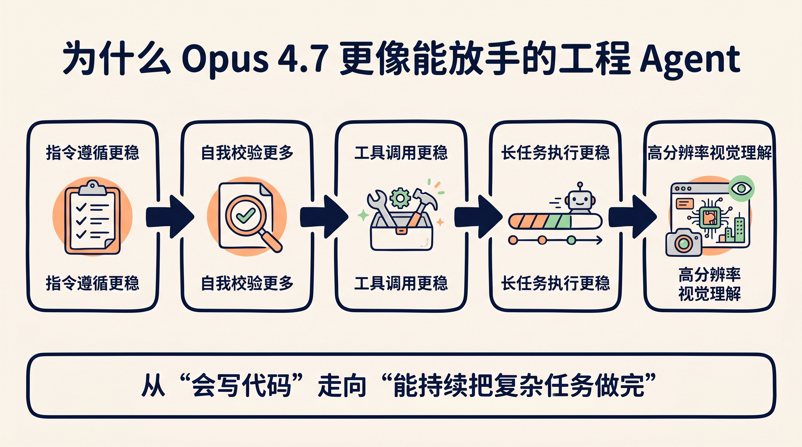
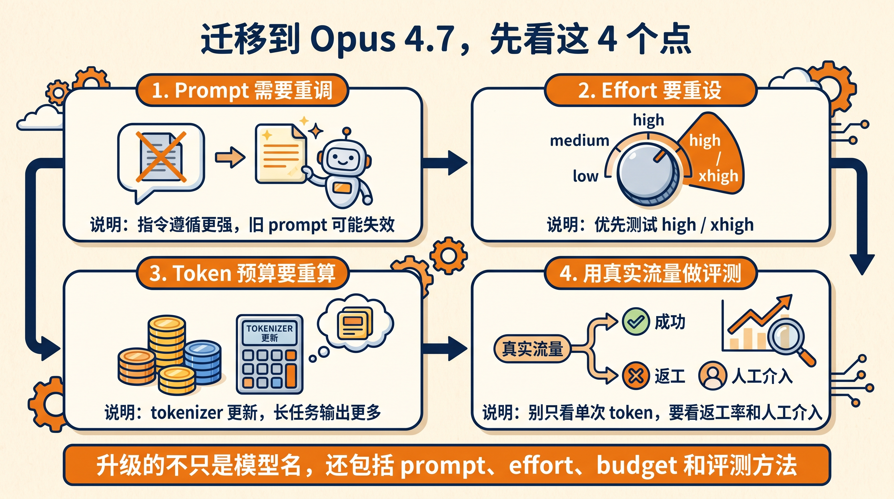

# Claude Opus 4.7 发布了，但真正重要的是：更难的活，可以开始交给 Agent 了

## 先说结论

如果只用一句话总结 Anthropic 在 2026 年 4 月 16 日发布的 Claude Opus 4.7，我的判断是：

**这次升级最关键的，不是“模型又更强了一点”，而是它开始更接近一个可以长期接活、自己校验、你不需要全程盯着的工程 Agent。**

官方这次反复强调的，不只是 benchmark。

它真正想传递的是三件事：

- 更难的编码任务，现在可以更放心地交出去
- 更长链路的任务，现在更不容易半路掉线
- 更细节的视觉和文档工作，现在也更像能直接交付的东西

这意味着什么？

这意味着 Claude 这条线，正在从“写代码很强”继续往前走，走到“能不能独立把一件复杂事情做完”。

这和普通的模型发版，不是一回事。

这篇文章里提到的核心信息，主要参考了 Anthropic 的[官方公告](https://www.anthropic.com/news/claude-opus-4-7)、[Claude Opus 4.7 System Card](https://anthropic.com/claude-opus-4-7-system-card)、[迁移指南](https://platform.claude.com/docs/en/about-claude/models/migration-guide#migrating-to-claude-opus-4-7)和[effort 文档](https://platform.claude.com/docs/en/build-with-claude/effort)。

## 这次升级，真正值得开发者看的不是 28 条好评

Anthropic 官网上给了很多合作方评价，里面当然有不少亮眼数字。

比如：

- Cursor 提到，CursorBench 从 `58%` 提升到 `70%`
- Rakuten 提到，在 Rakuten-SWE-Bench 上，能解决的生产任务数是 Opus 4.6 的 `3 倍`
- XBOW 提到，视觉敏锐度基准从 `54.5%` 拉到 `98.5%`
- CodeRabbit 提到，代码审查召回率提升 `10%+`

这些数字有参考价值，但如果你只盯着这些看，很容易把这次发布理解成一次普通的“榜单升级”。

真正关键的地方在于，这些反馈反复指向的是同一种能力：

**不是更会答题，而是更会把多步骤任务持续做下去。**

很多评价都在重复类似的描述：

- 更少工具错误
- 更少中途停住
- 更会按要求执行
- 更会在汇报前自己做验证

如果你平时主要用模型写几行 demo，这种差异感受不会特别强。

但如果你在跑下面这些事，就会很敏感：

- 长链路编码任务
- 跨多个文件的重构
- 带工具调用的 agent 工作流
- 需要反复检查结果是否靠谱的自动化任务

这也是我觉得 Opus 4.7 真正值钱的地方。

## 为什么说它更像“能放手一点的 Agent”

Anthropic 官方原文里，有一句话很重要。

他们说，用户现在可以把以前必须密切监督的 hardest coding work，更放心地交给 Opus 4.7。这个判断直接来自[官方公告](https://www.anthropic.com/news/claude-opus-4-7)。

这句话听起来像宣传，但背后其实是很具体的产品变化。

我把它拆成 4 个点来看。

### 1. 它更会按指令做事了

官方明确提到，Opus 4.7 的 instruction following 明显更强，老 prompt 和 harness 需要重新调。这一点原文写得很直接，也和[迁移指南](https://platform.claude.com/docs/en/about-claude/models/migration-guide#migrating-to-claude-opus-4-7)的建议是一致的。

这件事表面上像优点，但真正关键的地方在于：

**老 prompt 可能会失效。**

为什么？

因为之前很多 prompt 之所以“能跑”，不是因为写得严谨，而是因为旧模型经常会自动脑补、自动放过一些模糊指令。

现在 Opus 4.7 更字面理解你的要求了。

这意味着：

- 模糊 prompt 的容错空间会变小
- harness 里的历史假设可能会失效
- 你原来觉得“差不多就行”的提示词，现在可能要重新收紧边界

如果只用一句话总结：

**模型更强了，你的 prompt 也得跟着升级。**

### 2. 它不只是会写，还更会自查

官方这次很强调一个点：

Opus 4.7 会在汇报前，想办法验证自己的输出。这也是官方公告里反复强调的主卖点之一。

这不是一个小优化。

因为很多 agent 真正的问题，从来不是“不会生成”，而是：

- 生成完不检查
- 工具失败后不会补救
- 跑到一半就放弃
- 给出一个看起来合理、但其实没验证过的答案

这也是为什么很多团队在真实业务里，明明觉得模型很强，却又迟迟不敢完全放手。

真正卡住自动化落地的，不是首轮能力，而是后面的持续执行和自我校验。

从官方给出的合作方反馈看，Opus 4.7 的提升，恰好就集中在这里。

### 3. 它的视觉能力终于开始影响工程流了

这次还有个很容易被低估的点。

Opus 4.7 支持更高分辨率图像，官方给出的上限是长边 `2576` 像素，约 `3.75MP`，比此前 Claude 模型高出 3 倍以上。这个数字来自[官方公告](https://www.anthropic.com/news/claude-opus-4-7)。

很多人会把这理解成“看图更清楚了”。

但更务实的理解是：

**很多过去需要人眼硬看、或者 OCR + 人工二次判断的工作，现在更有机会直接进 Agent 流了。**

比如：

- 读复杂截图
- 看密集 UI 布局
- 抽取技术图表里的细节
- 参考高保真界面去改前端

这类任务以前最容易出的问题，不是不会看，而是看不清。

分辨率上来以后，很多工程场景的可用性会直接变。

### 4. 它开始更适合“长时间持续工作”

官方还提到，Opus 4.7 更擅长使用基于文件系统的 memory。这也是公告里四个“使用层面提醒”之一。

这点对普通聊天场景意义不算大，但对 agent 工作流很重要。

原因很简单。

真实生产任务不是一轮问答。

它往往更像：

`读取上下文 -> 做计划 -> 调工具 -> 写文件 -> 检查结果 -> 继续推进`

这个过程中，如果模型能把重要笔记沉淀到文件里，并且在后续会话继续拿来用，很多任务的启动成本会明显下降。

这不是“记忆功能很酷”。

这是在降低长任务的上下文税。

## 这次发布，对开发者最直接的影响其实是 3 个配置项

除了模型本身，Anthropic 这次一起放出来的更新也很值得看。

因为这些东西直接影响你怎么把 Opus 4.7 用起来。

### 第一，`xhigh` effort 来了

Opus 4.7 新增了 `xhigh` effort，位置在 `high` 和 `max` 之间，Anthropic 还单独给了[effort 文档](https://platform.claude.com/docs/en/build-with-claude/effort)。

Claude Code 里，默认 effort 也提高到了 `xhigh`。

官方还明确建议：

如果你在测试编码和 agent 场景，先从 `high` 或 `xhigh` 开始。

这背后的信号很清楚。

Anthropic 自己也在告诉你：

**这代模型的价值，和“愿不愿意给它更多思考预算”强相关。**

### 第二，API 侧开始推 task budgets

这个更新很务实。

task budgets 公测，本质上是在给长任务加预算控制。官方更新把它和高分辨率图像一起放进了平台侧能力说明。

换句话说，Anthropic 不是只想让模型更会想，而是开始认真处理一个更现实的问题：

**当任务越跑越长时，怎么让开发者还能控住 token 成本。**

这说明他们对模型使用场景的判断，已经不再只是单轮问答了。

### 第三，Claude Code 在往“更像同事”走

这次还一起发布了 `/ultrareview`，以及 Max 用户可用的[auto mode](https://claude.com/blog/auto-mode)。

这两个更新放在一起看，味道很明显：

- 一个在加强审查能力
- 一个在加强代理执行能力

前者是在补“像资深 reviewer 一样看问题”。

后者是在补“少打断，持续往前推进”。

如果你之前就把 Claude Code 当重度工程工具，这次应该会明显感觉到方向更统一了。

## 真正要提前准备的，不是升级版本号，而是迁移成本

Anthropic 这次没有回避一个很实际的问题。

Opus 4.7 升级后，token 使用方式会变。

官方明确提到两个变化，这部分可以直接对照[迁移指南](https://platform.claude.com/docs/en/about-claude/models/migration-guide#migrating-to-claude-opus-4-7)看：

- 新 tokenizer 可能让同样输入映射到更多 tokens，范围大约是 `1.0x - 1.35x`
- 更高 effort 下，尤其是 agent 场景后半段，会产生更多输出 tokens

很多人一看到这里，第一反应会是：

那成本是不是要变高？

更准确的说法是：

**账不能只按单轮 token 看，要按整条任务链路看。**

如果一个模型单次多花一点 token，但：

- 更少返工
- 更少人工接管
- 更少工具报错
- 更少重复 prompt

那它在真实工作流里的总成本，反而可能更低。

所以更务实的做法不是猜。

而是：

- 用真实流量跑一轮 A/B
- 分开测 `high`、`xhigh`
- 单独看成功率、返工率、人工介入次数

不要只拿“每次调用多了多少 token”下结论。

## 还有一个容易忽略的信号：Anthropic 在试着更谨慎地放能力

这次公告里还夹了一个安全层面的信息。

他们提到，Opus 4.7 是在 Mythos Preview 之外，先拿来验证网络安全防护策略的模型。这部分背景和安全发布节奏，可以结合[Project Glasswing](https://www.anthropic.com/glasswing)、[System Card](https://anthropic.com/claude-opus-4-7-system-card)一起看。

官方说法是：

- Opus 4.7 的网络安全能力没有 Mythos Preview 那么强
- 上线时会自动检测和拦截高风险网络安全请求
- 合规安全研究人员可以走[Cyber Verification Program](https://claude.com/form/cyber-use-case)

这意味着 Anthropic 现在的节奏不是“越强越快放出来”，而是：

**先把更强模型限制住，再拿次一级但仍然很强的模型去跑真实世界的防护验证。**

从产品角度看，这会让很多企业用户更安心。

从行业角度看，这也说明前沿模型的发布逻辑，已经不是单纯拼分数了。

## 最后说我的判断

如果你问我，Claude Opus 4.7 最值得关注的是什么。

我的答案不是某个单项 benchmark，也不是“又超过谁了”。

而是这条线越来越明显地在证明一件事：

**工程模型的竞争，正在从“会不会写”走向“能不能持续干活、会不会自查、敢不敢让人少盯着”。**

这才是更大的分水岭。

因为当模型开始具备下面这组能力时：

- 指令更稳
- 长任务更稳
- 工具调用更稳
- 视觉理解更稳
- 自我验证更稳

它就不再只是一个“更强的聊天模型”。

它开始变成真正的执行层。

而对开发者来说，真正该升级的，也不只是模型名。

你还得一起升级：

- prompt 写法
- effort 配置
- token 预算
- 真实任务评测方式

如果这些没跟上，你感受到的可能只是“好像更贵了”。

如果这些跟上了，你感受到的会是另一件事：

**过去必须自己盯着做完的那部分工程活，终于开始可以成批交给 Agent 了。**

## 原文链接

- Anthropic 官方公告：https://www.anthropic.com/news/claude-opus-4-7
- Claude Opus 4.7 System Card：https://anthropic.com/claude-opus-4-7-system-card
- 迁移指南：https://platform.claude.com/docs/en/about-claude/models/migration-guide#migrating-to-claude-opus-4-7
- effort 文档：https://platform.claude.com/docs/en/build-with-claude/effort
- Claude API 模型总览：https://platform.claude.com/docs/en/about-claude/models/overview
- Project Glasswing：https://www.anthropic.com/glasswing
