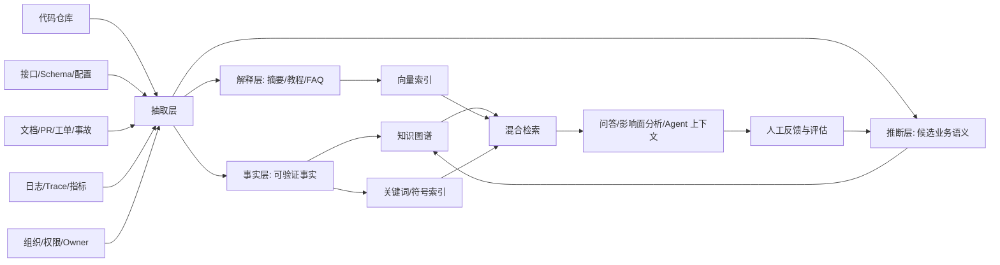

# 从代码到业务知识库：存量系统知识沉淀的工程路线

## 先说结论

真正有价值的业务知识库，不是一个“能问代码问题”的聊天框，也不是把仓库切成 chunk 丢进向量库。

它更像一套持续运行的知识基础设施：一边从代码里抽取系统真实执行的事实，一边从文档、需求、工单、事故、运行日志里补齐业务意图，最后用图谱、搜索、向量和人工校准把这些信息组织成可以被人和 Agent 共同使用的上下文。

如果只用一句话概括：

**代码负责回答“系统现在到底怎么做”，业务知识库负责回答“为什么这么做、谁负责、影响哪里、以后怎么改”。**

这两件事之间有巨大的鸿沟。代码天然是实现语言，业务天然是协作语言。把存量代码变成业务知识，难点不在于 LLM 会不会总结，而在于你能不能把隐含在代码、数据、配置和组织流程里的事实，变成一套可追溯、可更新、可验证的知识资产。

这也是为什么业界成熟实践很少停留在“文档问答”。Backstage 做软件目录，Sourcegraph 做代码智能索引，Glean 做企业知识图谱，GraphRAG 和 KAG 做图谱增强检索，DeepWiki 和 Aider 做代码库上下文，CodeQL、Joern、Semgrep 做语义分析。它们看似分散，其实都在指向同一个方向：

**知识库的底座不是文档，而是结构化上下文。**

## 为什么“从代码构建业务知识”特别难

存量系统里的业务知识通常不是写在一个地方，而是散落在多个层面。

一个“退款规则”可能出现在前端页面文案、后端 API、状态机、数据库字段、风控服务、消息队列、定时任务、测试用例、运营配置、客服 SOP、事故复盘和产品需求里。任何一个地方单独看，都只能看到局部。

更麻烦的是，代码里出现的名字并不总是业务语言。`checkEligibility`、`BizType=13`、`strategy_v2`、`handleCallback` 这些符号，对编译器有意义，对新人和 Agent 不一定有意义。真正的业务含义往往要从调用链、数据流、配置项、日志埋点、测试样例和历史需求里反推。

这会带来五类工程挑战。

第一，代码事实和业务语义之间存在抽象差。AST 能告诉你某个函数调用了另一个函数，但不能直接告诉你这代表“用户取消订单后释放库存”。

第二，业务知识有时间维度。代码里可能同时存在当前逻辑、灰度逻辑、历史兼容逻辑、废弃逻辑和实验逻辑。知识库如果不记录版本、时间和证据，很快会变成过期知识的放大器。

第三，微服务和多语言让边界消失。一次业务流程可能跨越 TypeScript 前端、Java 网关、Go 服务、Python 风控、SQL、Kafka、Redis、Flink 和第三方回调。只看单仓库无法回答真实影响面。

第四，权限和责任关系是知识的一部分。业务知识不是所有人都能看，也不是所有人都能改。Glean 的企业知识图谱把内容、人员和活动作为核心支柱，并强调权限管理，这一点对企业内部知识库尤其关键。

第五，LLM 很擅长生成连贯解释，但不天然保证解释正确。代码知识库必须把“事实、推断、摘要”分层存储，否则漂亮的总结会掩盖证据缺失。

## 业界实践透露出的六个信号

### 1. 先做软件资产图谱，再做智能问答

Spotify 开源的 Backstage 很值得参考。它的 Software Catalog 不是一个文档站，而是一个集中管理软件资产、所有权和元数据的系统。Spotify 的介绍里明确提到，Catalog 围绕和代码放在一起的 metadata YAML 文件构建，并会追踪服务、数据库、Kafka topic、共享库和系统之间的关系。

这给业务知识库一个很重要的启发：

**知识库的第一层不是“知识”，而是“资产台账”。**

你至少要知道公司有哪些系统、服务、仓库、接口、数据表、消息 topic、任务、组件、owner、依赖和运行环境。没有这层软件目录，后面的 RAG 再强，也只是在不完整的地图上问路。

业务知识库应该从这些问题开始：

- 这个业务能力由哪些服务共同实现？
- 每个服务的 owner 是谁？
- 入口 API、异步事件、数据表和下游依赖是什么？
- 哪些组件是生产核心链路，哪些只是实验或历史兼容？
- 新增需求会影响哪些系统和团队？

Backstage 的价值不在于页面长什么样，而在于它把“软件资产是组织知识的一部分”这件事产品化了。

### 2. 代码智能索引要区分“搜索式”和“编译器精确式”

Sourcegraph 的 SCIP/LSIF 路线提供了第二个关键启发。Sourcegraph 把代码导航分成两类：搜索式导航和精确导航。搜索式导航依赖 ctags、Tree-sitter 等工具，开箱即用、速度快，但可能有误报和漏报；精确导航依赖语言索引器和编译器语义，成本更高，但能做到跨仓库、编译器级准确。

业务知识库也需要这个分层。

不是所有事实都值得用最高成本抽取。函数定义、类、路由、简单引用关系，可以用 Tree-sitter、ctags、LSP 做低成本覆盖。跨仓库调用、类型解析、接口实现、泛型、反射、依赖注入、数据流，则需要编译器、构建系统或语言服务器参与。

更务实的做法是建立“证据等级”：

| 等级 | 来源 | 适合回答 |
|------|------|----------|
| L1 文本证据 | README、注释、工单、提交信息 | 背景、意图、历史原因 |
| L2 语法证据 | Tree-sitter、AST、符号表 | 函数、类、文件结构、路由位置 |
| L3 语义证据 | LSP、编译器、SCIP、CodeQL | 定义引用、类型、跨文件调用、接口实现 |
| L4 运行证据 | 日志、trace、指标、真实流量 | 生产链路、热点路径、实际依赖 |
| L5 人工确认 | owner 标注、专家审核、ADR | 业务定义、边界、决策 |

业务知识库最怕把不同等级的证据混在一起。`A 调用了 B` 和 `A 负责退款业务` 不是同一种事实，必须记录来源、置信度和更新时间。

### 3. 代码图谱正在成为 Agent 上下文基础设施

Aider 的 repo map 是一个很典型的小而美方案。它用 Tree-sitter 解析代码，识别函数、类、变量、类型等定义和引用，再选出最重要的标识符放进有限 token 预算里。这个思路不是为了生成完整文档，而是为了在上下文窗口有限时，把最有结构价值的信息优先给模型。

更进一步的开源项目是 Codebase-Memory MCP。它声称通过 Tree-sitter 解析 66 种语言，构建包含函数、类、调用链、HTTP 路由、跨服务链接的持久化知识图谱，并通过 MCP 暴露给 coding agent。其 README 和预印本中给出的实验结果是，在 31 个真实仓库上，相比逐文件探索，能用约十分之一 token 达到接近的回答质量。

这些项目说明一个趋势：

**代码知识库的第一批用户，很可能不是人，而是 Agent。**

人类可以慢慢翻代码，Agent 不行。Agent 的上下文窗口、工具调用次数、检索路径都有限。如果没有结构化 code graph，它只能反复 `grep`、读文件、猜关系，成本高且容易漏。

所以，面向业务增量开发的知识库，需要优先支持几类 Agent 查询：

- “实现这个功能应该改哪些文件？”
- “这个 API 的调用链和数据表有哪些？”
- “这个字段从入口到落库经过哪些转换？”
- “改这个枚举会影响哪些服务、测试和配置？”
- “过去类似需求是怎么做的？”

这类问题不是普通文档问答，而是图遍历、语义检索、历史检索和上下文压缩的组合。

### 4. 图谱增强 RAG 是为“跨片段推理”而生的

Microsoft GraphRAG 对企业知识库的启发很直接。它不是只做向量相似度，而是先从原始文本抽取知识图谱，构建社区层级，再生成社区摘要，用于回答需要跨信息片段综合的问题。它的文档也明确指出，普通向量 RAG 在需要“connect the dots”的问题上容易表现不好。

OpenSPG/KAG 走的是另一个相近方向。KAG 强调图结构和原始文本块之间的 mutual indexing，并通过 planning、reasoning、retrieval 等算子，把自然语言问题转换成符号和语言结合的求解过程。对业务知识库来说，这一点很关键，因为很多业务问题不是“找一段相似文档”，而是“沿着业务关系推理”。

比如：

- “修改优惠券核销状态，会影响哪些财务对账报表？”
- “会员等级从订单金额改成支付金额，哪些链路需要调整？”
- “这个风控规则命中的用户，后续会不会进入人工审核？”

这些问题往往需要跨 API、事件、表、任务、报表、配置和组织 owner 推理。向量检索可以找到相关片段，但很难稳定地保证路径完整。图谱的价值就在这里。

### 5. 企业知识图谱必须纳入人、权限和活动信号

Glean 的企业知识图谱把 content、people、activity 作为核心架构支柱，并通过大量连接器抓取内容、元数据、权限和互动信息。这对业务知识库非常重要。

很多团队构建知识库时只盯着代码和文档，忽略了“谁知道、谁负责、谁最近改过、谁在用”这些信号。但在真实研发里，很多高价值问题本质上是组织问题：

- 这个服务现在归哪个团队？
- 这个接口没人敢改，是因为技术复杂，还是 owner 不清？
- 哪些文档虽然旧，但最近仍被频繁访问？
- 哪个需求、事故或 PR 最能解释这段代码的由来？

业务沉淀不是把知识从人身上“抽干”，而是降低找到正确人、正确证据、正确历史上下文的成本。

### 6. 领域知识库离不开人机协同校准

美团商品知识图谱的实践提供了一个非常好的业务侧参照。美团大脑围绕商家、商品、用户、场景等实体构建生活服务领域图谱，并在药品等强专业场景中区分弱专业知识和强专业知识：弱专业知识可以通过模型抽取加专家抽检，强专业知识则需要专家全量质检。

这对代码到业务知识库同样成立。

代码可以自动抽取大量事实，但“这个规则代表什么业务承诺”“这个状态是否可对外解释”“这个流程是否还能沿用”往往需要 owner 确认。不要试图一次性自动生成完全可信的业务百科。更现实的路线是：

先自动抽取候选知识，再让领域专家以低成本方式确认、修正、废弃和补充。

Airbnb 的 Knowledge Repo 也体现了类似思想。它强调用数据科学家熟悉的 Markdown、Notebook、R Markdown 等格式沉淀可复现知识，并支持 GitHub 集成。换句话说，自动化知识抽取之外，还需要一条“人主动沉淀知识”的正式通道。

## 从代码里到底能抽出哪些业务知识

如果目标是业务增量开发，知识库不应该只抽“函数列表”。更有价值的是围绕业务变更的影响面来建模。

我建议把代码抽取对象分成八类。

### 1. 入口

入口是业务能力暴露给外界的边界，包括 HTTP API、RPC method、GraphQL resolver、CLI command、定时任务、消息消费者、前端 route、页面 action、Webhook callback。

入口能回答：

- 用户或外部系统从哪里进入？
- 这个能力有哪些同步和异步触发方式？
- 哪些入口共享同一段业务逻辑？

很多业务知识应该从入口开始，而不是从文件目录开始。因为业务流程天然是从“用户做了什么”或“系统收到什么事件”出发的。

### 2. 领域实体

领域实体包括订单、用户、商户、商品、账户、合同、工单、优惠券、库存、发票等。代码里的实体可能表现为 DB table、ORM model、DTO、protobuf message、TypeScript type、枚举、状态机、索引、缓存 key。

这一层要解决的是“代码对象”和“业务名词”的对齐。比如 `coupon_instance`、`VoucherDTO`、`promotion_ticket` 可能都指向优惠券相关概念，但语义边界不同。

### 3. 业务规则

业务规则通常藏在校验函数、策略类、状态流转、配置表达式、SQL where 条件、特征开关、规则引擎和测试断言里。

比如：

- 退款是否允许
- 优惠是否可叠加
- 订单是否进入人工审核
- 用户是否能看到某个入口
- 发票状态如何流转

规则抽取不能只靠 LLM 总结。更可靠的方式是先定位代码证据，再生成“规则候选”，最后由 owner 确认。

### 4. 数据流

数据流回答“字段从哪里来，到哪里去，中间如何变换”。它是影响面分析的核心。

典型对象包括请求参数、DTO 字段、数据库列、消息字段、日志字段、报表指标、缓存值、第三方字段映射。

CodeQL、Joern、Semgrep 这类工具虽然主要用于安全和静态分析，但它们的思想很值得借鉴：把代码看成可查询的数据，围绕控制流、数据流、污点传播等关系进行查询。业务知识库可以把这种能力迁移到业务字段追踪上。

### 5. 副作用

副作用包括发消息、写库、扣款、发券、发邮件、推送通知、调用三方、写缓存、打日志、埋点、创建任务。

增量开发最容易出事故的地方，往往不是主流程，而是副作用。知识库应该能回答：

- 这个动作会触发哪些下游？
- 哪些副作用有幂等保护？
- 哪些副作用在事务内，哪些在事务外？
- 失败后会重试、补偿还是静默丢弃？

### 6. 依赖和契约

依赖包括内部服务、第三方 API、SDK、数据库、消息队列、缓存、对象存储、权限系统、支付系统、风控系统。契约包括 OpenAPI、protobuf、GraphQL schema、数据库 schema、事件 schema、配置 schema。

这部分知识应该尽量从机器可读契约中抽取，而不是从自然语言文档里猜。

### 7. 运行时证据

静态代码只能说明“可能发生什么”，运行时数据说明“实际发生什么”。Trace、日志、指标、调用频率、错误率、慢查询、告警、事故记录，可以帮助知识库识别生产核心链路和真实热点。

例如，一个函数在代码上有十条调用路径，但生产 trace 显示 99% 流量来自其中两条。对增量开发来说，这两条路径的优先级显然更高。

### 8. 历史和决策

提交记录、PR、需求单、事故复盘、ADR、设计文档、评审评论，解释的是“为什么”。没有这层，知识库只能复述现状，不能帮助判断取舍。

这也是存量业务最容易丢失的知识：代码还在，决策背景没了；逻辑还在，没人知道当初是临时方案还是长期设计。

## 一套可落地的参考架构

业务知识库可以按“三层知识、双索引、持续校准”来设计。



### 抽取层

抽取层负责把异构材料变成统一事实。

代码侧可以使用 Tree-sitter 做多语言 AST 解析，用 LSP 或编译器补充类型和引用，用 CodeQL/Joern/Semgrep 类工具做数据流和控制流分析，用构建系统识别模块、依赖和产物。

业务材料侧则需要连接需求系统、工单系统、事故系统、文档系统、IM、监控平台和权限系统。Glean 这类企业搜索产品的连接器思路值得借鉴，因为企业知识的难点往往不是单点解析，而是多源同步、权限继承和增量更新。

### 事实层

事实层只放可验证的信息。

例如：

- `POST /refunds` 由 `RefundController.create` 处理
- `RefundService.apply` 写入 `refund_order` 表
- `RefundApplied` 事件由 `AccountingConsumer` 消费
- `refund_order.status` 有 `PENDING/APPROVED/REJECTED` 三种枚举
- `refund-service` owner 是 `payment-platform`

事实层必须记录证据位置、抽取时间、代码版本、来源类型和置信度。没有证据的内容不能进入事实层。

### 推断层

推断层放“可能的业务语义”。

例如：

- `RefundService.apply` 可能对应“用户发起退款申请”
- `AccountingConsumer` 可能参与“退款财务入账”
- `PENDING -> APPROVED` 可能代表“审核通过”

这些推断可以由 LLM 生成，但需要显式标记为 candidate，并提供证据链。owner 可以一键确认、修改或否决。确认后的内容可以提升置信度，甚至进入领域词表或业务本体。

### 解释层

解释层面向阅读和协作，包括自动生成的模块说明、业务流程说明、FAQ、影响面分析报告、迁移指南、Onboarding 页面。

DeepWiki 的自动 wiki、架构图、源码链接，以及 `.devin/wiki.json` 对大仓库文档生成进行 steering 的能力，说明自动文档化已经在走向“可控生成”。但解释层不能脱离事实层。每段解释都应该能回链到代码、文档或人工确认记录。

### 双索引

业务知识库不能只用一种检索。

关键词和符号索引适合精确查找，例如函数名、表名、错误码、接口路径、配置 key。向量索引适合语义相似，例如“退款失败”找到“售后单驳回”。图索引适合关系推理，例如从 API 追到服务、表、事件、报表和 owner。

WeChat 在工业级代码补全 RAG 研究中比较了 identifier-based RAG、similarity-based RAG、词法检索和语义检索，并发现词法与语义结合效果最好。这个结论在业务知识库里同样成立：不要迷信单一向量检索，混合检索才是工程常态。

## 知识模型怎么设计

一个实用的业务知识本体，不需要一开始就很复杂，但必须覆盖三类节点。

第一类是软件节点：

- Repository
- Service
- Module
- File
- Symbol
- API
- Job
- MessageTopic
- Database
- Table
- Column
- Config
- FeatureFlag
- Test

第二类是业务节点：

- BusinessCapability
- BusinessProcess
- DomainEntity
- BusinessRule
- Scenario
- Metric
- Risk
- Policy
- Report
- Incident

第三类是组织节点：

- Team
- Person
- Role
- Ownership
- Decision
- Document
- Ticket
- PullRequest

边关系比节点更重要。常见关系包括：

- `IMPLEMENTS`：代码实现业务能力
- `EXPOSES`：服务暴露接口
- `CALLS`：函数、服务或接口调用
- `READS/WRITES`：读写数据表、缓存、对象
- `PUBLISHES/CONSUMES`：发布或消费消息
- `GUARDS`：规则保护某个动作
- `CONFIGURED_BY`：逻辑受配置控制
- `OWNED_BY`：资产归属
- `MENTIONED_IN`：被文档、需求、事故提到
- `CHANGED_BY`：由 PR 或提交修改
- `AFFECTS`：变更影响业务能力或下游资产

这套模型的关键不是“图谱看起来很酷”，而是它能支持变更问题。

一个好的业务知识库，最终要能回答：

> 如果我要改某个业务规则，应该看哪些代码、哪些配置、哪些数据、哪些测试、哪些历史决策，以及找谁确认？

## 落地路线：不要一上来就做全量智能大脑

最常见的失败方式，是一开始就想做“全公司统一业务知识大脑”。这通常会死在范围、权限、质量和维护成本上。

更稳的路线是四步。

### 第一阶段：软件目录和 owner 先行

先把服务、仓库、owner、运行环境、API、数据库、消息 topic、文档链接打通。这个阶段可以参考 Backstage 的思路，把 metadata 放进仓库，走代码评审，让知识维护进入研发流程。

阶段目标不是问答，而是让资产可见、边界可见、责任可见。

### 第二阶段：围绕一个高频业务域做代码图谱

不要全公司铺开。选一个需求频繁、系统复杂、owner 愿意配合的业务域，比如退款、会员、库存、履约、结算。

先抽取入口、服务、调用、表、消息、配置、测试，再把这些信息做成图谱和检索。这个阶段的核心问题是影响面分析，而不是百科问答。

### 第三阶段：引入业务语义和人工确认

让 LLM 基于事实层生成候选业务能力、流程、规则和领域实体，再让 owner 校准。校准界面要足够轻，不要让专家写长文。最有效的交互通常是：

- 确认这个推断正确
- 改写业务名词
- 标记已废弃
- 绑定到已有业务能力
- 补充一句约束或例外

这一步会逐渐沉淀出企业自己的业务词表和领域本体。

### 第四阶段：接入 Agent 和研发工作流

当知识库能稳定回答影响面问题后，再接入 coding agent、IDE、PR review、需求评审、测试生成、事故分析。

不要让 Agent 直接相信总结。它应该通过 MCP 或内部工具查询结构化事实、拿到证据链，再生成建议。

典型工作流可以是：

```text
需求输入
  -> 识别业务能力和相关系统
  -> 检索历史相似需求/PR/事故
  -> 图遍历得到入口、调用链、表、消息、配置、测试
  -> 生成改动候选文件和风险点
  -> owner 确认
  -> Agent 执行代码修改
  -> 测试和静态分析验证
  -> 反写知识库
```

这样，知识库不只是“读”的系统，而是参与研发闭环的系统。

## 评估指标：知识库好不好，不能只看回答像不像

业务知识库需要一套比普通 RAG 更严格的评估。

第一类是检索指标：

- 关键文件召回率
- 关键 owner 召回率
- API 到数据表路径召回率
- 相似历史需求召回率
- 证据覆盖率

第二类是图谱质量指标：

- 节点准确率
- 边准确率
- 孤岛节点比例
- 过期边比例
- 事实来源覆盖率
- 人工确认比例

第三类是生成质量指标：

- 回答是否有证据链接
- 是否区分事实和推断
- 是否暴露不确定性
- 是否遗漏关键风险
- 是否引用过期信息

第四类是研发效果指标：

- 新人理解业务链路耗时
- 需求影响面分析耗时
- PR 返工率
- 因遗漏下游造成的事故数
- Agent 首次改对比例
- 重复答疑次数下降比例

真正值得追的不是“问答满意度”，而是业务增量开发的摩擦是否下降。

## 几个高风险反模式

### 反模式一：只做向量库

向量检索适合找相似文本，不适合保证关系完整。业务影响面分析需要路径、依赖、所有权和版本。只做向量库，短期 Demo 好看，长期会在复杂问题上失真。

### 反模式二：把 LLM 总结当事实

LLM 总结只能进入解释层或推断层，不能直接进入事实层。事实必须有来源，最好能回到代码行、schema、配置、日志、PR 或人工确认记录。

### 反模式三：一次性导入，不做增量更新

代码每天在变，知识库如果不能跟着 commit、schema migration、配置发布、文档更新和 owner 变更增量刷新，很快就会变成危险资产。

### 反模式四：没有权限模型

业务知识库会聚合大量敏感信息，包括代码、客户、财务、风控、事故、权限和组织关系。检索和生成都必须继承源系统权限，否则越智能越危险。

### 反模式五：没有 owner 参与

没有 owner 校准的业务知识库，只能停留在“代码解释器”。真正的业务沉淀一定需要人确认术语、边界、例外和决策。

### 反模式六：把所有知识都写成文档

文档是解释层，不是唯一存储层。函数调用、字段流转、服务依赖、owner、运行指标、权限关系，更适合结构化存储。文档应该从结构化事实生成，也应该反向补充事实。

## 最后的判断

未来的业务知识库，大概率会同时具备四种形态：

它是软件目录，知道资产、owner 和依赖。

它是代码图谱，知道入口、调用、数据流和副作用。

它是业务图谱，知道能力、实体、规则、流程和场景。

它也是 Agent 上下文层，能把正确证据在正确时间交给模型。

所以，从存量代码构建业务知识，不应该被理解成“自动生成文档”项目，而应该被理解成“把研发组织的隐性上下文显性化”的工程。

这件事的短期价值是帮新人理解系统、帮老员工减少重复答疑、帮 Agent 少读错文件。长期价值则更大：它让业务系统的演进不再完全依赖少数人的记忆。

一家公司真正的技术资产，不只是代码本身，而是代码背后那套可被理解、可被验证、可被继承的业务知识。

## 参考资料

- Backstage Software Catalog: https://backstage.spotify.com/learn/backstage-for-all/3-software-catalog/
- Backstage Technical Overview: https://backstage.io/docs/overview/technical-overview/
- Sourcegraph SCIP: https://sourcegraph.com/blog/announcing-scip
- Tree-sitter: https://github.com/tree-sitter/tree-sitter
- Aider Repo Map: https://aider.chat/2023/10/22/repomap.html
- Codebase-Memory MCP: https://github.com/DeusData/codebase-memory-mcp
- Codebase-Memory paper: https://arxiv.org/abs/2603.27277
- CodeQL: https://codeql.github.com/
- Joern Code Property Graph: https://github.com/joernio/joern
- Semgrep Dataflow Analysis: https://semgrep.dev/docs/writing-rules/data-flow/data-flow-overview
- Microsoft GraphRAG: https://microsoft.github.io/graphrag/
- OpenSPG/KAG: https://github.com/OpenSPG/KAG
- Glean Knowledge Graph: https://docs.glean.com/security/knowledge-graph
- DeepWiki Docs: https://docs.devin.ai/work-with-devin/deepwiki
- Airbnb Knowledge Repo: https://github.com/airbnb/knowledge-repo
- 美团商品知识图谱的构建及应用: https://tech.meituan.com/2021/09/02/meituan-commodity-nlp-practice.html
- A Deep Dive into Retrieval-Augmented Generation for Code Completion: Experience on WeChat: https://arxiv.org/abs/2507.18515
