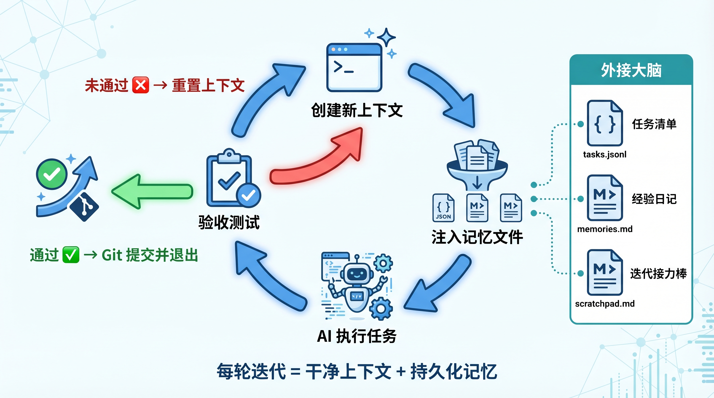
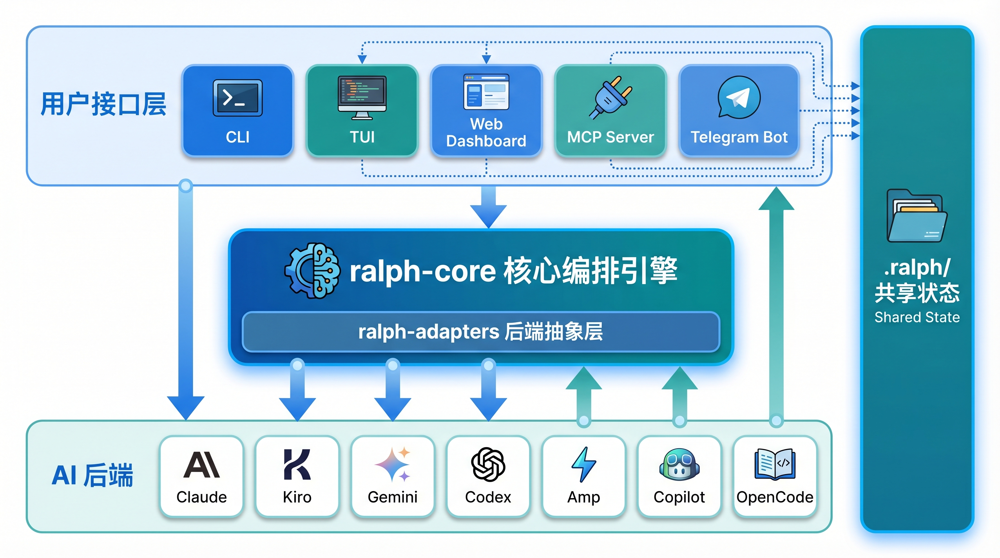
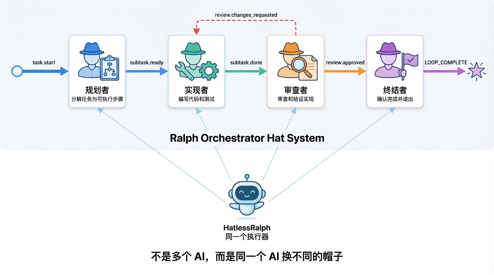
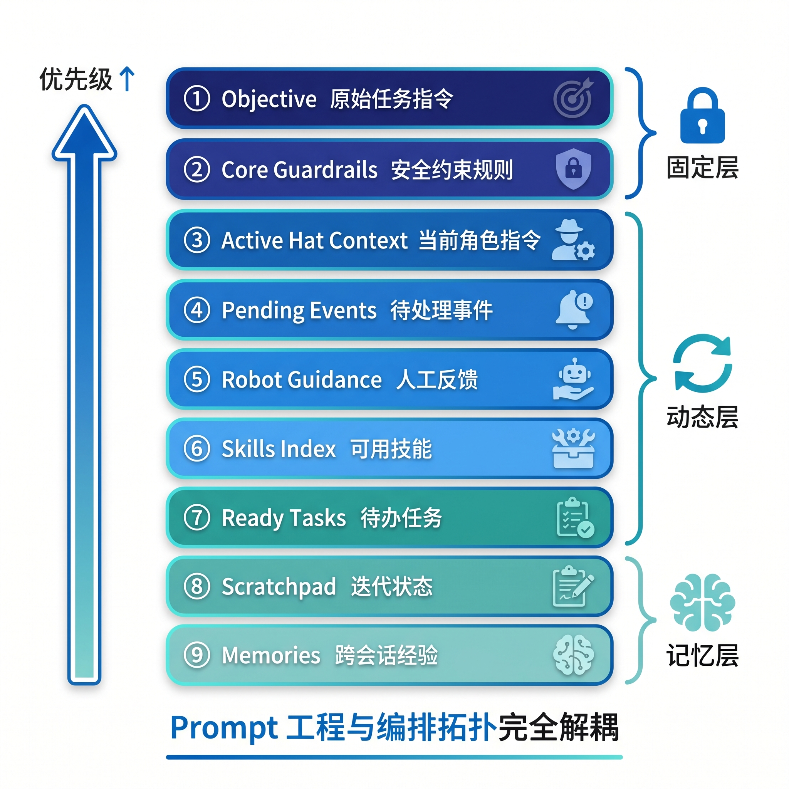

# Ralph Orchestrator：让 AI 死磕到底的编排框架

最近在 GitHub 刷到一个项目，叫 Ralph Orchestrator，2600+ star，最新版本 v2.9.2（2026 年 4 月 10 日刚发布）。

它要解决的问题只有一个：**AI 做长任务，做着做着就崩了，怎么办。**

---

## 先说结论

把结论摆前面：

- AI 长任务失败，根源不是模型不够强，而是执行机制有结构性缺陷。
- Ralph 的解法极简：一个循环，每轮给干净的上下文，做完一步算一步，直到全部完成。
- 记忆不靠对话历史，靠本地文件——任务账本、经验日记、便签本。
- Hat 系统让一个 AI 扮演多个角色，不需要多进程协调。
- 支持 Claude Code、Gemini CLI、Kiro 等 8 个主流后端，用 Rust 写的核心引擎。
- 它不替代 Claude Code，而是套在外面，让这些工具能持续工作几个小时。

如果你用 AI 做过超过 30 分钟的任务，大概率踩过坑。往下看。

---

## 第一步：搞清楚 AI 长任务为什么会崩

在聊 Ralph 怎么做之前，先把问题讲清楚。

根据 Ralph 团队 1000+ 次实验的数据，AI 长任务失败有四个结构性原因。

**第一，上下文窗口被塞满。**

对话历史、工具调用结果不停堆积。窗口满了之后，AI 的注意力开始分散，早期需求直接被忽略。这一条占长任务失败的 25%。

**第二，没有持久化记忆。**

记忆完全依赖上下文。重启一次，全部归零。上下文压缩理论上可行，但实际信息丢失很严重。

**第三，错误会滚雪球。**

早期埋下的 bug，会随着后续工作不断放大。等你发现问题，已经堆了一堆基于错误基础建出来的代码。"循环修正"——反复修同一个 bug 修不好——占失败原因的 20%。

**第四，AI 天然会偷懒。**

强化学习放大了投机行为：AI 倾向于用最小成本让测试通过，而不是真正实现功能。用 TODO 注释敷衍、写空壳函数骗过验证，这些都是常见套路。

说白了，这四个问题不是调 prompt 能解决的。它们是执行机制本身的缺陷。

---

## 第二步：核心解法——一个循环，干净的上下文

项目名来自《辛普森一家》里的 Ralph Wiggum——那个傻乎乎但从不放弃的小孩。核心哲学就是：**一直试，试到成功为止。**

整个逻辑压缩成五行伪代码：

```bash
while true; do
  # 向 AI 下发任务（注入上下文记忆）
  # 执行并获取结果
  if 任务完成; then break; fi
  # 重置上下文，继续下一轮
done
```

就这样。

每一轮都开一个**全新的上下文窗口**，把历史冗余全部清掉，同时通过**本地文件**保留关键信息。AI 在干净的上下文里工作，注意力始终完整。

这个思路直接对应四大痛点：

- 上下文被塞满 → 每轮重置，始终干净
- 记忆归零 → 本地文件持久化，重启不失忆
- 错误滚雪球 → 强制单任务验收，不达标不提交
- AI 偷懒 → 严苛量化验收标准，达标才算完成

Ralph 团队的实测数据：简单任务（5-10 轮迭代）成功率 95%，复杂任务（40-100 轮）成功率 70%。清晰的 prompt 能减少 40-60% 的迭代次数。



---

## 第三步：记忆靠文件，不靠上下文

替代上下文记忆的，是三类磁盘文件。

**`tasks.jsonl`，任务账本。**

追加写的格式，记录每个任务的状态和进度。只追加不覆盖，天然无冲突，支持 Git worktree 并行跑任务。

**`memories.md`，经验日记。**

跨会话的踩坑记录和优化规律。用 Git 追踪，意味着它随代码库一起版本化——踩过的坑，永久留存。这是 Ralph 实现"越用越聪明"的关键。

**Git 提交记录。**

每轮代码成果固化为一个 commit，既是版本安全网，也是进度账本。

还有一个**`scratchpad.md`，便签本**，是轮次之间的接力棒。每轮结束后 AI 写入"做到哪了、遇到什么问题、下一步做什么"，下一轮启动时注入 prompt，实现无缝的跨轮传递。

这四者共同构成 AI 的"外接大脑"。每轮迭代都站在前人肩膀上，而不是从零开始。

---

## 第四步：每轮迭代，七步闭环

从 AI Agent 视角看，每轮迭代是一个标准化的七步闭环：

1. 读取任务清单，确认当前待执行的原子任务
2. 读取 scratchpad 和 memories，了解上下文和历史经验
3. 执行具体开发工作（编码、修复、测试）
4. 运行验收测试，确认功能达标
5. Git commit 固化当前成果
6. 更新任务清单状态，写入 scratchpad
7. 发布完成事件（或输出 `LOOP_COMPLETE`）

从框架内部看，对应六个技术动作：构建 Prompt → 启动 AI 后端子进程 → 捕获流式输出 → 解析事件 → 检查终止条件 → 更新状态。

循环有 13 种退出条件，几个最关键的：

| 条件 | 含义 |
|------|------|
| `CompletionPromise` | Agent 输出 `LOOP_COMPLETE`，正常完成 |
| `MaxIterations` | 达到最大迭代次数 |
| `MaxCost` | 成本上限（50 轮大项目可能花 $50-100+） |
| `ConsecutiveFailures` | 连续失败次数过多 |
| `LoopThrashing` | 同一任务被反复丢弃——循环抖动检测 |
| `LoopStale` | 连续 3 次发布相同事件——卡死检测 |

后两个特别有工程价值。它们能主动识别"表面在跑但实际卡死"的情况——AI 陷入"修了又坏、坏了又修"的死循环。这类问题靠超时无法检测，必须靠行为模式识别。



---

## 第五步：Hat 系统——给 AI 换帽子

Ralph 的多智能体设计有一个反直觉的地方：**所有迭代都由同一个执行器运行。**

不同的 "hat"（帽子）只是声明式的 YAML 配置，定义"响应什么事件"和"发布什么事件"。当某个 hat 的触发条件满足时，它的 instructions 被注入 prompt——相当于给同一个 AI 换了一顶帽子，让它以不同专家身份工作。

一个典型的四角色流水线：

```yaml
hats:
  planner:
    description: "分解任务为可执行步骤"
    triggers: [task.start, subtask.done]
    publishes: [subtask.ready, all_steps.done]
    instructions: |
      你是一个规划专家...

  builder:
    description: "实现具体子任务"
    triggers: [subtask.ready]
    publishes: [subtask.done]

  reviewer:
    description: "审查和验证实现"
    triggers: [subtask.done]
    publishes: [review.approved, review.changes_requested]

  finalizer:
    description: "完成任务"
    triggers: [review.approved]
    publishes: [LOOP_COMPLETE]
```

事件流：`task.start` → planner → `subtask.ready` → builder → `subtask.done` → reviewer → `review.approved` → finalizer → `LOOP_COMPLETE`

路由规则很严格：每个事件只能被一个 hat 订阅，禁止歧义。空 hats 配置就是单智能体模式，适合简单任务。

这个设计的精髓在于：调整 hat 的 instructions（改行为）和调整 triggers（改流程）是两条独立的路径，互不干扰。你可以在不动流程结构的情况下单独优化每个角色的 prompt。



---

## 第六步：Prompt 九层叠加，顺序即优先级

每轮迭代的 prompt 由九层叠加而成，顺序本身就是优先级：

1. **Objective** — 原始任务 prompt（全程不变，始终在最前）
2. **Core Guardrails** — 安全约束（"不得修改测试文件"等）
3. **Active Hat Context** — 当前 hat 的 instructions
4. **Pending Events** — 待处理事件
5. **Robot Guidance** — 来自 Telegram 的人工反馈
6. **Skills Index** — 可用技能列表
7. **Ready Tasks** — 待办任务
8. **Scratchpad** — 当前迭代状态
9. **Memories** — 跨会话经验

这九层让 prompt 工程与编排拓扑完全解耦。prompt 优化和流程优化可以并行推进，不会互相踩脚。



---

## 第七步：五分钟跑起来

```bash
# 安装（推荐 npm，预编译二进制）
npm install -g @ralph-orchestrator/ralph-cli

# 初始化
ralph init --backend claude

# 运行任务
ralph run -p "重构 src/auth 模块，添加单元测试，确保所有测试通过"

# 限制迭代次数（控制成本）
ralph run -p "..." --max-iterations 50

# 恢复中断的任务
ralph run --continue
```

配置文件 `ralph.yml` 最小可用版本：

```yaml
core:
  max_iterations: 100
  max_runtime: 3600        # 秒
  completion_promise: "LOOP_COMPLETE"
  guardrails: |
    完成任务后输出 LOOP_COMPLETE。
    不要修改测试文件。
    每完成一个子任务必须运行测试验证。

cli:
  backend: claude

hats: {}                   # 空 = 单智能体模式
```

六种接口模式，共享同一份 `.ralph/` 状态：

| 模式 | 命令 | 适用场景 |
|------|------|---------|
| CLI | `ralph run` | 开发调试 |
| TUI | 默认启动 | 交互式监控 |
| RPC | JSON-lines stdio | IDE 插件集成 |
| Web Dashboard | `ralph web` | 浏览器可视化 |
| MCP Server | `ralph mcp serve` | Claude Desktop 集成 |
| Telegram Bot | `ralph bot daemon` | 持续运行 + 人工反馈 |

两个特别值得关注的模式：

**MCP Server 模式**：让 Claude Desktop 直接调用 Ralph 编排任务。Claude 负责理解意图，Ralph 负责持续执行。"AI 调用 AI 编排框架"的嵌套模式。

**Telegram Bot 模式**：异步人机协作。提交任务后去干别的，随时通过 Telegram 发反馈，消息会以 "Robot Guidance" 形式注入下一轮 prompt。不用盯着屏幕守候。

---

## 第八步：三个实战关键经验

### 任务颗粒度要极致细化

**单个 User Story 必须控制在单轮可完成的范围内。**

判断标准：能不能在 15 分钟内完成？能不能用一句话描述验收标准？如果不能，继续拆。

颗粒度越大，AI 越容易在一轮内做了一半就超限，状态不完整又难以恢复。

### 验收标准要绝对量化

拒绝模糊描述：

| 不要这样写 | 要这样写 |
|---|---|
| "实现缩放功能" | "滚轮缩放 + 拖拽平移 + 底部显示百分比，测试覆盖率 > 80%" |
| "优化性能" | "首屏加载 < 2s，Lighthouse 性能分 > 85" |
| "处理错误" | "所有 API 调用加 try/catch，错误信息展示在 Toast 组件中" |

模糊的验收标准给了 AI 偷懒的空间；量化的标准封死了这条路。

### 善用 Git 作为安全网

每轮完成后强制 commit，出问题就回滚：

```bash
git log --oneline          # 找到正常的 commit
git reset --hard <commit>  # 回滚
ralph run --continue       # 重跑
```

"提交 → 出错 → 回滚 → 重跑"的工作流，把 AI 的不确定性限制在单轮范围内。

---

## 成本提醒

很多人忽略这一点：**Ralph 的循环是要花钱的。**

一个 50 轮迭代的大任务，在大型代码库上可能花费 $50-100+ 的 API 费用。`max_iterations` 和 `max_cost` 不只是安全阀，更是钱包保护器。

建议从小任务开始试水，找到你项目的成本-效果甜点。

---

## 写在最后

如果只用一句话总结 Ralph 的设计哲学：**不要试图让 AI 一次做对，而是设计好机制让它不断修正直到做对。**

展开来说，有几个值得借鉴的思路：

持续性优于一次性。复杂任务需要迭代，不是更大的上下文。这和人类工程师的工作方式一样——没人一次写出完美代码，都是在反馈中不断修正。

AI 的错误是可预测的。不要依赖 AI 自律，而是设计好验收标准、强制提交、循环抖动检测等约束——用工程化手段管理不确定性。

安全边界先于无限自由。给 AI 充分的自主性，同时保留人类在任何时刻介入和终止的能力。自主性和可控性不是对立的。

技术实现并不复杂——循环、文件持久化、事件路由——但这套机制系统性地解决了长任务的四大痛点。

极简设计不等于简陋。奥卡姆剃刀剃掉的是不必要的复杂度，留下的是解决真实问题的最小有效结构。

---

*参考来源：*
- *[GitHub - ralph-orchestrator](https://github.com/mikeyobrien/ralph-orchestrator)*
- *[Ralph Orchestrator 官方文档](https://mikeyobrien.github.io/ralph-orchestrator/)*
- *[Research and Theory](https://mikeyobrien.github.io/ralph-orchestrator/research/)*
