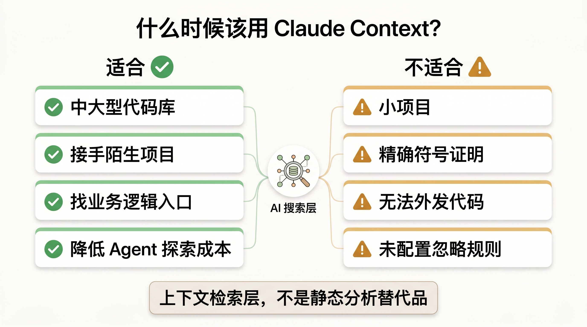
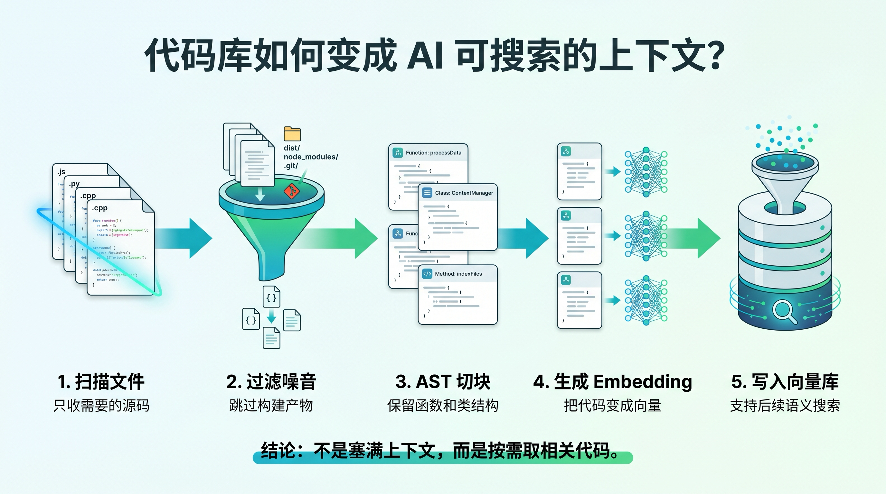
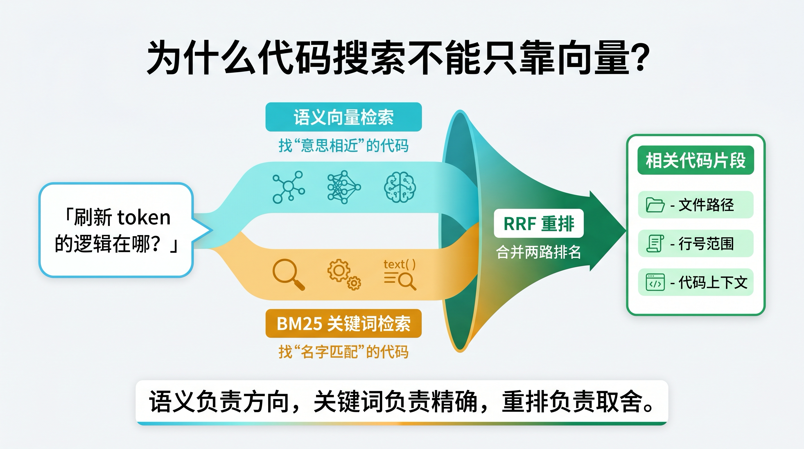

# Claude Context 深度拆解：AI Agent 为什么需要代码检索层

Claude Context 解决的是 AI 编程助手的第一步问题：先找到相关代码，再开始分析和修改。

今天的 AI Agent 已经能读文件、跑命令、改代码，但它们经常卡在同一个地方：不知道该先读哪个文件。一次定位失败，后面的推理、修改和测试都会被带偏。

`zilliztech/claude-context` 的做法不是扩大上下文窗口，而是给 Agent 增加一层代码检索系统。它会先把代码库切块、向量化、写入 Milvus 或 Zilliz Cloud；Agent 需要上下文时，再通过 MCP 工具检索最相关的代码片段。

可以把它理解成：

> Claude Context = MCP 工具层 + 代码切块 + Embedding + 向量数据库 + BM25 混合检索。

它不是 Claude 的永久记忆，也不是完整的编程代理。它更像一层专门服务 AI Agent 的代码搜索引擎。


## Claude Context 是什么

Claude Context 是 Zilliz 开源的代码检索项目。当前仓库是 monorepo，主要由三部分组成：

- `@zilliz/claude-context-core`：负责代码索引、切块、Embedding 和搜索。
- `@zilliz/claude-context-mcp`：把检索能力封装成 MCP Server，供 Claude Code、Codex CLI、Cursor 等工具调用。
- VS Code Extension：在 IDE 内提供语义代码搜索入口。

我阅读的是 GitHub 当前 `master` 分支。npm 上 `@zilliz/claude-context-core` 和 `@zilliz/claude-context-mcp` 当前都是 `0.1.7`。GitHub 页面显示这个仓库约 8k stars。

它的使用方式也很直观。你可以让 Agent 问：

```text
Find functions that handle user authentication
```

返回结果不是普通文件列表，而是带路径、行号、语言和代码片段的上下文。Agent 拿到这些片段后，再继续解释、排查或修改。

这就是 Claude Context 的主要价值：把“让模型到处翻文件”改成“先通过工程化检索找候选上下文”。

## 怎么跑起来

最小部署需要三类依赖：

- Node.js：README 要求 `>= 20.0.0` 且 `< 24.0.0`，并说明不兼容 Node.js 24。
- Embedding provider：默认 OpenAI，也支持 VoyageAI、Gemini、Ollama。
- 向量数据库：Milvus 或 Zilliz Cloud。

Claude Code 里可以这样添加 MCP Server：

```bash
claude mcp add claude-context \
  -e OPENAI_API_KEY=sk-your-openai-api-key \
  -e MILVUS_ADDRESS=your-zilliz-cloud-public-endpoint \
  -e MILVUS_TOKEN=your-zilliz-cloud-api-key \
  -- npx @zilliz/claude-context-mcp@latest
```

如果不想在每个 MCP 客户端里重复写环境变量，可以把配置放到全局文件：

```bash
mkdir -p ~/.context

cat > ~/.context/.env << 'EOF'
EMBEDDING_PROVIDER=OpenAI
OPENAI_API_KEY=sk-your-openai-api-key
EMBEDDING_MODEL=text-embedding-3-small
MILVUS_TOKEN=your-zilliz-cloud-api-key
EOF
```

这样 MCP 客户端只需要启动：

```bash
npx @zilliz/claude-context-mcp@latest
```

进入项目目录后，典型操作是：

```text
Index this codebase
```

索引开始后，可以继续查状态：

```text
Check the indexing status
```

索引完成后，再问代码问题：

```text
Find the code that handles auth token refresh
```

MCP 侧暴露了 4 个核心工具：

- `index_codebase`：索引代码库。
- `search_code`：用自然语言搜索代码。
- `get_indexing_status`：查看索引进度。
- `clear_index`：清理某个代码库索引。

有一个容易踩坑的细节：Claude Context 用代码库的绝对路径识别项目。同一份仓库如果通过软链路径、另一个 clone 路径或挂载路径索引，会被视为不同 codebase。这种设计能隔离项目，但也要求团队固定路径习惯。

## 哪些场景值得用

Claude Context 更适合中大型代码库。小项目直接用 `rg`、IDE 跳转和 LSP 往往更快。

适合的场景主要有四类。

第一，接手陌生项目。老项目里的业务入口通常不会按新人的关键词命名。你搜 `login`，实现可能叫 `session`；你搜 `payment`，核心逻辑可能藏在 `billing` 或 `invoice` 下面。语义检索能用业务描述找到相近实现，减少关键词猜测。

第二，降低 Agent 探索成本。很多 AI 编程错误不是发生在写代码阶段，而是发生在定位阶段。Agent 没找到真实调用链，就开始改一个看起来相关、实际无关的文件。Claude Context 不能保证每次都命中，但能降低盲读文件的概率。

第三，大仓库问题定位。你问“哪里校验 webhook 签名”，传统 grep 需要尝试 `webhook`、`signature`、`verify`、`hmac`、`secret` 等多个词。语义检索可以先根据意图召回候选代码，再用精确搜索确认。

第四，多客户端复用。README 里列了 Claude Code、Codex CLI、Gemini CLI、Qwen Code、Cursor、Windsurf、Cline、Roo Code、Claude Desktop 等接入方式。它把代码检索做成 MCP 工具，而不是绑定某个 IDE。



## 哪些场景不该依赖它

Claude Context 是上下文检索层，不是静态分析替代品。

小项目不一定需要它。几千行代码的仓库，`rg` 加 IDE 跳转通常就能解决问题，引入向量库和 Embedding provider 反而增加复杂度。

精确符号证明不该交给它。比如“找出某个 TypeScript interface 的所有实现，并保证一个不漏”，应该使用 LSP、编译器或语言级索引。语义检索返回的是 topK 候选结果，不提供完备性证明。

高敏感代码要先评估数据流。如果使用 OpenAI、VoyageAI 或 Gemini 做 embedding，代码片段会发送到外部服务。安全要求严格的团队需要评估 Ollama + 本地 Milvus 的全本地方案。

没有忽略规则的仓库也不适合直接索引。生成文件、构建产物、fixtures、大型 JSON、minified 文件会污染检索结果。`.contextignore` 配不好，后面的召回质量会明显下降。

## 索引流程：代码库先变成可搜索资产

Claude Context 的工作流可以拆成两条链路。

索引链路：

```text
代码文件 -> 过滤规则 -> 代码切块 -> Embedding -> 写入 Milvus/Zilliz
```

搜索链路：

```text
自然语言问题 -> Query Embedding -> 混合检索 -> RRF 重排 -> 返回代码片段
```

项目里的多数实现都在服务这两条链路。



## 文件过滤：先决定哪些内容值得索引

Claude Context 不会把整个仓库无差别塞进索引。

默认支持的扩展名包括 TypeScript、JavaScript、Python、Java、C/C++、C#、Go、Rust、PHP、Ruby、Swift、Kotlin、Scala、Markdown 和 Jupyter Notebook。

默认忽略的内容也比较明确：

- `node_modules`
- `dist`、`build`、`out`
- `.git`
- IDE 配置目录
- cache、log、temp
- `.env`
- minified、bundle、source map 文件

实际文件集合还会合并多种规则：

- MCP 调用参数里的 `customExtensions`
- 环境变量 `CUSTOM_EXTENSIONS`
- MCP 调用参数里的 `ignorePatterns`
- 环境变量 `CUSTOM_IGNORE_PATTERNS`
- 项目根目录下的 `.gitignore` 和各种 `.xxxignore`
- 全局 `~/.context/.contextignore`

文件选择逻辑可以简化为：

```text
最终文件 = 支持扩展名集合 - 忽略规则集合
```

前端项目尤其要注意扩展名。`.vue`、`.svelte`、`.astro` 这类文件默认未必都被索引，应该显式补充：

```bash
CUSTOM_EXTENSIONS=.vue,.svelte,.astro
```

忽略规则同样重要。索引垃圾文件越多，检索结果越容易偏离真正的业务代码。

## 代码切块：尽量按代码结构切，而不是硬切字符

Claude Context 默认使用 AST splitter。它会用 Tree-sitter 解析代码，再按函数、类、方法、接口、类型别名等结构切块。

以 TypeScript 为例，切分器会关注：

- `function_declaration`
- `arrow_function`
- `class_declaration`
- `method_definition`
- `interface_declaration`
- `type_alias_declaration`
- `export_statement`

这种切法比固定字符数切分更适合代码。函数最好保持完整，类和方法也应该尽量作为一个有意义的上下文单元被召回。否则 Agent 拿到半段函数，很容易误解变量来源和控制流。

项目没有把 AST 切块做成唯一选择。如果语言不支持 AST，或者解析失败，会回退到 LangChain 字符切分。

默认 chunk 大小是 `2500` 字符，overlap 是 `300` 字符。大块继续拆，小块之间保留重叠，避免边界处丢失上下文。这个取舍很实用：优先保留结构，失败时保证系统还能跑。

## Embedding：不同 provider 影响成本和隐私

切块完成后，每个 chunk 会生成 embedding。

当前支持四类 provider：

- OpenAI，默认 `text-embedding-3-small`
- VoyageAI，默认 `voyage-code-3`
- Gemini，默认 `gemini-embedding-001`
- Ollama，默认 `nomic-embed-text`

创建向量库 collection 前，Claude Context 会检测 embedding 维度，再按实际维度建 schema。比如 OpenAI `text-embedding-3-small` 是 1536 维，`text-embedding-3-large` 是 3072 维。

索引速度和 batch size 有关。默认值是：

```bash
EMBEDDING_BATCH_SIZE=100
```

吞吐能力更强的 provider 可以适当调大。MCP README 里给过 `512` 的示例，但不建议一开始就追求大 batch。batch 太大更容易遇到限流，失败时也会让重试成本上升。

## 向量库：保存的不只是向量

Claude Context 使用 Milvus 或 Zilliz Cloud 存储代码 chunk。

每个 chunk 会带上多类字段：

- `content`：原始代码片段。
- `relativePath`：相对代码库的文件路径。
- `startLine` / `endLine`：行号范围。
- `fileExtension`：文件扩展名。
- `metadata`：语言、代码库路径等附加信息。

默认 hybrid mode 还会增加 `sparse_vector` 字段，通过 BM25 函数从 `content` 生成稀疏向量。

collection 名称来自代码库绝对路径：

```text
hybrid_code_chunks_<absolute_path_md5_prefix>
```

chunk id 则由路径、行号和内容生成：

```text
relativePath:startLine:endLine:content
```

然后做 sha256。只要 chunk 的内容或位置变化，id 就会变化。增量更新时，可以按文件删除旧 chunks，再写入新 chunks。

## 搜索流程：为什么要混合检索

代码搜索不能只靠向量。

Claude Context 默认使用 hybrid search：一路是 dense vector，一路是 BM25 sparse vector，最后用 RRF 做重排。

Dense vector 负责语义。你问“认证逻辑在哪里”，它能找到意思相近的实现。

BM25 负责精确词。你搜 `refreshToken`、`UserSessionManager`、`__iso_year` 这类符号时，字面匹配反而是重要证据。

RRF，即 Reciprocal Rank Fusion，负责把两路排名融合起来。它不是简单平均分数，而是根据各自排名做融合，让“语义相关”和“关键词命中”都能进入候选结果。

代码检索同时需要理解意图和尊重符号名。混合检索比纯向量检索更贴近这个需求。



## 后台索引：Agent 不必等完整索引结束

MCP 工具 `index_codebase` 会立即返回，真正的索引过程在后台运行。

这个设计改善了大仓库体验。索引期间，Agent 可以继续查询状态，也可以搜索已经完成的部分，只是结果可能不完整。

状态主要有 4 类：

- `indexed`：索引完成，可以搜索。
- `indexing`：后台索引中。
- `indexfailed`：索引失败，可以重试。
- `not_found`：还没有索引。

进度百分比不是严格的文件完成比例，而是阶段型指标。官方文档说明：0% 是准备 collection，约 5% 是扫描文件，10% 到 100% 才是处理文件、生成 embedding 和写入向量库。

因此，进度很快跳到 10% 并不代表已经处理了 10% 文件，只代表索引进入了文件处理阶段。

## 增量更新：用文件 hash 降低重复索引成本

Claude Context 里有一个 `FileSynchronizer`，负责追踪文件变化。

它会给文件内容计算 hash，并把快照保存到：

```text
~/.context/merkle/<codebase_path_hash>.json
```

内部使用 Merkle DAG 判断文件集合是否变化。发现变化后，再细分为：

- added：新增文件
- removed：删除文件
- modified：修改文件

处理方式也很直接：

- 删除文件：删除向量库中该文件对应的 chunks。
- 修改文件：先删旧 chunks，再重新切块、embedding、写入。
- 新增文件：直接写入新索引。

增量索引的价值在大仓库里很明显。代码只改了一小部分时，没有必要重新 embedding 全仓库。

边界也要看到。增量更新依赖本地 snapshot 和向量库状态一致。换机器、换路径、手工删 collection，都可能造成状态不一致。遇到异常时，最稳的处理方式通常是：

```text
clear_index -> 使用同一个绝对路径重新 index
```

## Claude Context 和 grep 应该一起用

grep 和 `rg` 仍然是代码搜索里的基础工具。

区别在于，grep 需要你知道该搜什么词。函数名、变量名、错误码、配置项明确时，`rg` 往往更快。

Claude Context 解决的是另一类问题：你知道业务意图，但不知道代码叫什么。比如：

```text
哪里处理了订单过期后的退款？
```

这时直接 grep 需要猜一串关键词：

```text
order expired refund timeout payment cancel
```

语义检索可以先根据业务描述召回候选代码，再用 `rg` 验证具体符号。

更稳的组合是：

```text
Claude Context 找方向，rg 和 LSP 做确认，测试做闭环。
```

这句话也解释了它的边界：Claude Context 负责召回上下文，不负责证明所有相关代码都找齐。

## 官方评测说明了什么

仓库里的 `evaluation` 目录提供了一组对照实验。

实验设计如下：

- 数据来自 SWE-bench Verified。
- 选取 30 个实例。
- 难度过滤为 15 到 60 分钟，且每个问题正好需要修改 2 个文件。
- baseline agent 只有 read、grep、edit。
- enhanced agent 在同样基础上增加 Claude Context MCP。
- 默认模型是 GPT-4o-mini。
- 每种方法独立运行 3 次。

结果如下：

| 指标 | grep only | 加 Claude Context MCP | 变化 |
| --- | ---: | ---: | ---: |
| 平均 F1 | 0.40 | 0.40 | 基本相当 |
| 平均 token | 73,373 | 44,449 | 下降 39.4% |
| 平均工具调用 | 8.3 | 5.3 | 下降 36.3% |

这组数据不能解读成“代码能力提升 40%”。更准确的结论是：在这组任务里，检索质量基本相当，但 Agent 找上下文时少花了约 40% token，也少调用了约三分之一工具。

这符合 Claude Context 的定位。它不直接提高模型写代码的能力，而是减少模型定位上下文的成本。

还要注意版本差异。评测 README 说明结果测试在 `claude-context-mcp@0.1.0` 上，而当前 npm 包已经是 `0.1.7`。这些数字适合作方向参考，不应当作为所有仓库、所有任务上的承诺。

## 优点和代价

Claude Context 做对了几件事。

MCP 形态让它可以被多个客户端复用。代码搜索能力不再绑死在某个 IDE 或某个 Agent 里。

混合检索也符合代码搜索特点。代码既有语义，也有符号；dense vector 解决语义相似，BM25 解决关键词命中，RRF 解决排序融合。

AST 切块则提升了上下文质量。函数、类和方法比固定字符片段更适合作为检索单元。

本地化部署也留了口子。团队如果不能把代码发送到外部 embedding 服务，可以评估 Ollama + 本地 Milvus 的方案。

代价同样明确。

它比普通搜索工具重，需要 Node、Embedding provider、向量数据库和索引管理。首次索引也有成本，代码越多，embedding 调用越多。

检索结果不是证明。topK 结果再相关，也不等于所有相关实现都被找出来。涉及类型影响面、安全逻辑、权限链路和数据迁移时，还要用编译器、LSP、测试和人工 review 收口。

路径身份也需要规范。同一份仓库通过不同绝对路径索引，会变成不同 codebase。团队使用时最好统一工作目录。

## 它和其他工具是什么关系

可以按职责区分：

- `grep` / `rg`：字符串搜索。
- LSP：符号、引用和类型理解。
- Context7：提供最新文档和示例，降低库用法幻觉。
- DeepWiki：把仓库生成可读文档。
- Serena：更完整的 coding agent 工具箱，偏语言服务器和符号能力。
- Claude Context：把代码库做成 AI Agent 可调用的语义搜索索引。

Claude Context 的边界很窄，但窄得有价值。它专注解决“Agent 如何找到相关代码”这个问题。

## 团队落地时先做这几步

不要一上来全员推广。更稳的方式是先选一个中大型、但不涉及最高敏感级别代码的仓库试点。

第一步，测基础指标：

- 初次索引耗时。
- 平均搜索延迟。
- top10 结果是否能减少 Agent 读文件次数。
- embedding 和 Zilliz/Milvus 成本是否可接受。

第二步，先配置 `.contextignore`。不要让生成文件、快照、fixtures、大型 JSON、测试金数据进入索引。索引质量很大程度取决于输入文件是否干净。

第三步，补齐项目扩展名。前端项目常见配置是：

```bash
CUSTOM_EXTENSIONS=.vue,.svelte,.astro
```

后端项目可能需要：

```bash
CUSTOM_EXTENSIONS=.sql,.graphql,.proto
```

只加 Agent 真正需要阅读的文件。扩展名越多，不代表上下文越准。

第四步，给 Agent 固定搜索习惯。例如：

```text
先用 claude-context 搜索和“刷新 token”相关的代码，
返回最相关的 10 个结果。
然后再用 rg 验证精确符号。
```

这种指令比“帮我修一下登录问题”更稳定，因为它把语义召回和精确验证拆开了。

第五步，修改后必须跑测试。Claude Context 负责找到候选上下文，不能替代测试闭环。

## 最后怎么评价 Claude Context

Claude Context 的价值不是让上下文窗口更大，而是让进入上下文的代码更准。

大上下文窗口能缓解一部分问题，但它也更贵，并且容易把无关内容带进模型。Claude Context 选择了另一条路：先离线索引代码库，问题出现时按需取相关片段。

这种设计更接近面向代码的 RAG。对象从普通文档变成代码，调用者从人变成 AI Agent。

未来的 AI 编程助手不应该每次都像第一次见到仓库。它需要一层可复用的检索系统，快速回答“相关代码在哪里”。Claude Context 还需要更强的符号理解、更完整的语言生态支持，以及更稳定的本地部署体验，但它已经把方向说清楚了：

> Agent 写代码之前，先要会找代码。

把代码找准，后面的分析、修改和验证才有基础。

## 参考资料

- GitHub 仓库：https://github.com/zilliztech/claude-context
- MCP 包：https://www.npmjs.com/package/@zilliz/claude-context-mcp
- Core 包：https://www.npmjs.com/package/@zilliz/claude-context-core
- 官方文档：仓库内 `docs/` 目录
- 评测说明：仓库内 `evaluation/README.md`
