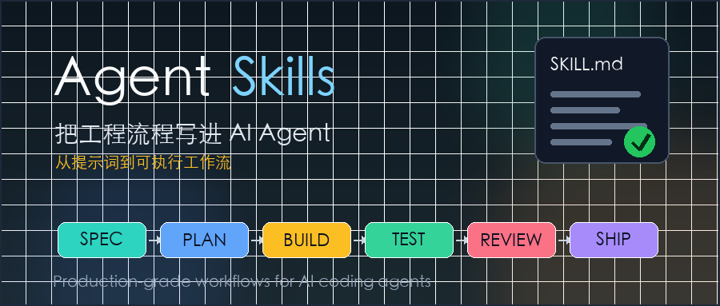

# Agent Skills 深度拆解：让 AI 编程助手按工程流程干活

AI 编程助手真正难的地方，不是写一段函数，而是持续按照工程纪律做事。

人类工程师会先澄清需求、拆任务、写测试、跑构建、做 review、准备发布。AI Agent 往往会跳过这些步骤：需求还没问清就动手，测试还没跑就说完成，遇到报错就猜，代码变大后又很难收住范围。

`addyosmani/agent-skills` 解决的正是这个问题。它不是一个“更会写代码的提示词集合”，而是把软件工程流程拆成一组可被 Agent 读取和执行的 Markdown 技能。

可以把它理解成：

> Agent Skills = 工程流程说明书 + 触发条件 + 质量门禁 + 验证清单。

截至我阅读时，GitHub 页面显示这个仓库有约 23.2k stars、2.9k forks，许可证是 MIT，最新 release 是 2026-04-10 发布的 `0.5.0`。项目的定位很明确：给 AI coding agents 使用的生产级工程技能。



## 为什么 AI Agent 需要“技能”，而不只是提示词

普通提示词更像建议。

你可以对 Agent 说：“请写高质量代码，记得测试，注意安全。”这句话听起来没问题，但执行时很容易变成口号。模型知道这些词重要，却不一定会在正确时机停下来做正确动作。

技能的思路不一样。

一个 `SKILL.md` 会告诉 Agent：什么时候应该使用这个技能、应该按什么步骤做、哪些借口不能成立、完成时必须拿出什么证据。它不是给模型补一段知识，而是给模型加一套流程约束。

这点很关键。AI Agent 的很多失败不是“不会写代码”，而是“不会坚持工程流程”。

比如一个需求来了：

```text
帮我加一个用户导出功能。
```

没有流程约束时，Agent 可能直接找文件、改接口、补 UI。看起来很快，但很容易漏掉权限、分页、数据量、审计日志和测试边界。

如果按 Agent Skills 的思路走，流程会更像这样：

```text
先写规格 -> 拆任务 -> 小步实现 -> 写测试 -> 跑验证 -> 做 review -> 再准备发布
```

慢的是开头几分钟，省的是后面几个小时的返工。

## 这个项目到底包含什么

`agent-skills` 的仓库结构很直接，主要有四类内容。

第一类是 `skills/` 目录。这里放了 20 个工程技能，覆盖从需求定义到上线发布的完整开发周期。

按阶段看，大致可以分成：

- 定义需求：`idea-refine`、`spec-driven-development`
- 拆解计划：`planning-and-task-breakdown`
- 编码实现：`incremental-implementation`、`test-driven-development`
- 上下文和资料：`context-engineering`、`source-driven-development`
- 前端、接口、安全、性能：`frontend-ui-engineering`、`api-and-interface-design`、`security-and-hardening`、`performance-optimization`
- 验证与调试：`browser-testing-with-devtools`、`debugging-and-error-recovery`
- 评审与发布：`code-review-and-quality`、`git-workflow-and-versioning`、`ci-cd-and-automation`、`shipping-and-launch`
- 文档和迁移：`documentation-and-adrs`、`deprecation-and-migration`

第二类是 `.claude/commands/`。项目把常见生命周期封装成 7 个 slash commands：

```text
/spec          定义要做什么
/plan          拆成可执行任务
/build         小步实现
/test          用测试证明
/review        合并前评审
/code-simplify 简化代码
/ship          准备发布
```

第三类是 `agents/`。这里提供了几个预设专家角色，例如代码评审、安全审计和测试工程师。它们适合在 review 阶段换一个视角看问题。

第四类是 `references/`。这里放的是更细的检查表，比如测试模式、安全清单、性能清单、可访问性清单。技能本体不需要一次性塞满所有细节，真正需要时再加载参考材料。

这个设计很克制。它没有把所有内容都堆进一个巨大的提示词，而是按任务阶段拆开，尽量让 Agent 在需要时只加载相关流程。

## 一个技能文件长什么样

Agent Skills 的核心单位是 `SKILL.md`。

一个技能文件通常由几部分组成：

```markdown
---
name: test-driven-development
description: Drives development with tests. Use when implementing any logic...
---

# Test-Driven Development

## Overview
说明这个技能解决什么问题。

## When to Use
说明什么时候应该使用，什么时候不该使用。

## The TDD Cycle
按 Red -> Green -> Refactor 的顺序执行。

## Common Rationalizations
列出 Agent 容易用来跳过流程的借口。

## Verification
列出完成时必须满足的验证条件。
```

上面这段不是完整原文，而是结构化示意。

最值得注意的是 `description`。它不是给人看的简介那么简单，而是技能发现入口。Agent 先通过描述判断“这个任务是否应该触发这个技能”，然后再读取完整流程。

这也是为什么仓库文档反复强调：技能描述要写清楚“做什么”和“什么时候用”。描述太泛，Agent 会误触发；描述太窄，Agent 会错过真正该用的流程。

## 它和普通规则文件有什么区别

很多团队已经在项目里写了 `AGENTS.md`、`CLAUDE.md`、`.cursorrules` 或 Copilot instructions。Agent Skills 不是替代这些文件，而是把规则文件里最容易失效的部分拆出来，做成更明确的工作流。

项目级规则通常写的是长期约定：

- 这个仓库用什么技术栈。
- 测试命令是什么。
- 不要改哪些目录。
- 提交信息怎么写。

技能写的是任务流程：

- 需求不清时怎么澄清。
- 多文件改动怎么切片。
- bug 修复时怎么先复现。
- review 时从哪些维度检查。
- 发布前要拿出哪些证据。

一个是“本项目的规矩”，一个是“做这类事的步骤”。两者应该配合使用。

比如你的 `AGENTS.md` 可以写：

```text
本项目使用 pnpm。
测试命令是 pnpm test。
不要修改 generated/ 目录。
```

而 `test-driven-development` 技能会要求 Agent：

```text
先写一个会失败的测试。
确认测试真的失败。
写最小实现让测试通过。
重构后再次运行测试。
```

前者告诉 Agent “在这个仓库怎么做”，后者告诉 Agent “这类任务应该按什么顺序做”。

## 这个项目最有价值的是反“偷懒”

Agent Skills 里有一个很有意思的设计：很多技能都会写 `Common Rationalizations`，也就是常见的偷懒理由。

这不是玩笑。

AI Agent 经常会给自己找理由跳过步骤：

- “这个改动很小，不用写测试。”
- “我先实现，后面再补验证。”
- “看起来没问题，可以结束。”
- “我已经读了 README，不需要查官方文档。”

这些理由和人类工程师很像。但人类工程师可以被 code review、CI、团队规范拉回来，Agent 如果没有明确门禁，就会把这些借口当成合理路径。

所以这个项目把“不能跳过的步骤”写得很硬。

`test-driven-development` 要求先写失败测试，再写实现。`debugging-and-error-recovery` 要求先复现、定位、缩小范围，再修复。`code-review-and-quality` 要求从正确性、可读性、架构、安全、性能五个维度看代码。

这些规则不新，老工程师都知道。新的是：它把这些规则做成了 Agent 能稳定读取的流程。

## 用在真实项目里，应该怎么开始

不要一上来把 20 个技能全塞给 Agent。

这是这个项目里很务实的一点：技能应该按需加载。上下文窗口不是无限资源，加载太多流程反而会稀释当前任务重点。

如果只是想试水，我建议从三个技能开始：

1. `spec-driven-development`：让 Agent 先把需求说清楚。
2. `test-driven-development`：让 Agent 用测试证明行为变化。
3. `code-review-and-quality`：让 Agent 在完成后做一次结构化自查。

如果你经常让 Agent 做多文件改动，再加上 `incremental-implementation`。它会强制 Agent 小步推进，每个切片都保持可构建、可测试、可回滚。

在 Claude Code 里，可以直接通过插件市场安装：

```bash
/plugin marketplace add addyosmani/agent-skills
/plugin install agent-skills@addy-agent-skills
```

如果是 Cursor，可以把常用的 `SKILL.md` 复制到 `.cursor/rules/`。如果是 Gemini CLI，可以通过 skills 安装命令把 `skills/` 目录装进去。其他 Agent 也能用，因为这些技能本质上就是 Markdown 文件。

通用做法也很简单：

```bash
git clone https://github.com/addyosmani/agent-skills.git
```

然后把你需要的 `skills/<name>/SKILL.md` 放进对应工具的规则系统里。

## 它适合哪些团队

Agent Skills 最适合已经在认真使用 AI 编程助手的团队。

如果你只是偶尔让模型写一个脚本，它可能显得有点重。因为写规格、拆计划、跑测试这些步骤，本来就是为了降低复杂任务的风险。

但如果你已经开始让 Agent 做这些事，就值得看：

- 修改中大型代码库。
- 修复线上 bug。
- 写跨模块功能。
- 做前端页面和接口联调。
- 处理安全、性能、发布相关改动。
- 让多个 Agent 参与 review 或测试。

这些场景里，最大风险不是 Agent 写不出代码，而是它写出“看起来能跑、实际没人验证过”的代码。

Agent Skills 的价值是把开发过程拆成可检查的节点。每个节点都要求留下证据：测试输出、构建结果、review 结论、发布清单。这样 Agent 的产出不再只靠“模型说完成了”，而是要通过流程证明。

## 它不解决什么

Agent Skills 不是魔法。

它不能保证模型永远理解需求，也不能替代工程师判断。技能写得再好，如果项目本身没有测试、没有构建命令、没有清晰边界，Agent 仍然会缺少验证依据。

它也不适合把所有流程机械化。

比如 `spec-driven-development` 对复杂功能很有用，但一个拼写修复不需要长篇规格。好的技能应该帮 Agent 识别风险，而不是把所有任务都拖进同一套仪式。

另外，技能本身也需要维护。框架最佳实践会变，安全建议会变，团队流程也会变。如果技能长期不更新，它也会变成过期规则。

所以更合理的用法是：把 Agent Skills 当成一个基础模板，再结合团队自己的 `AGENTS.md`、CI 命令、测试体系和代码评审标准做裁剪。

## 更大的启发：Agent 工程开始从提示词进入流程化

过去大家优化 AI 编程助手，最常见的方向是写更长的提示词。

现在这个方向开始变化了。

提示词仍然重要，但真实工程里更稀缺的是流程：什么时候停下来问问题，什么时候必须写测试，什么时候必须查官方文档，什么时候不能继续猜，什么时候应该把改动拆小。

这些东西不神秘，却决定了 AI Agent 能不能进入生产环境。

`agent-skills` 的意义就在这里。它把资深工程师脑子里的工作习惯，变成了一组可复制、可审查、可组合的 Markdown 工作流。

对团队来说，最值得借鉴的不是“直接照搬 20 个技能”，而是这套表达方式：

```text
触发条件清楚
步骤可执行
门禁不可跳
完成要有证据
```

如果你已经在项目里使用 AI coding agent，可以从一个最痛的环节开始改。经常需求跑偏，就先加规格技能；经常修 bug 猜错，就先加调试技能；经常测试缺失，就先加 TDD 技能。

不要把 Agent 当成一个更快的打字员。更好的方向是：让它按你的工程流程工作。

## 参考资料

- GitHub 仓库：[addyosmani/agent-skills](https://github.com/addyosmani/agent-skills)
- Getting Started：[docs/getting-started.md](https://github.com/addyosmani/agent-skills/blob/main/docs/getting-started.md)
- Skill Anatomy：[docs/skill-anatomy.md](https://github.com/addyosmani/agent-skills/blob/main/docs/skill-anatomy.md)
- 0.5.0 Release：[Agent Skills 0.5.0](https://github.com/addyosmani/agent-skills/releases/tag/0.5.0)
