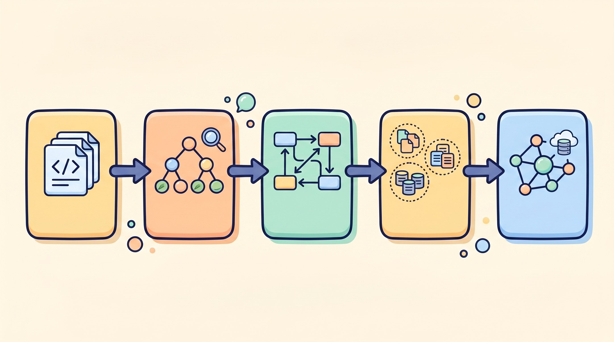
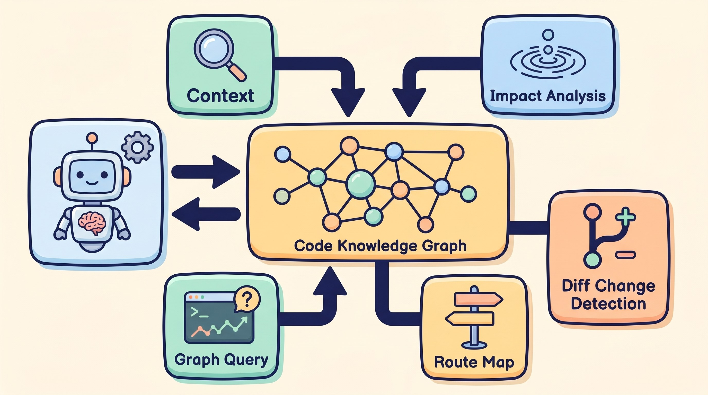
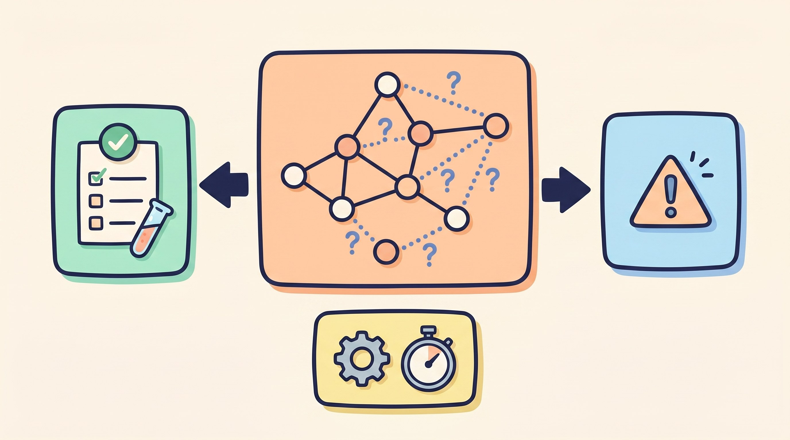

# GitNexus：给 AI Agent 装一套代码库神经系统

最近我看了一个很火的项目：GitNexus。

截至 2026-04-28，它在 GitHub 上大约 3.24 万星、3.7 千 fork；npm 当前稳定版是 1.6.3，最新稳定 release 发布时间是 2026-04-24。这个热度背后，不只是“又一个代码聊天工具”，而是一个更底层的判断：

**现在很多 AI 编程失败，不是模型不会写代码，而是它不知道代码库里谁依赖谁。**

你让 Agent 改一个 `validateUser()`，它可能只看到了当前文件、附近几个 import、搜索结果前几条。真正麻烦的是：这个函数被哪些接口调用？返回值被谁读取？改字段会影响哪些流程？某个重命名会不会漏掉跨文件引用？

GitNexus 想解决的就是这个问题。

一句话讲人话：

**它先把你的代码库离线分析成一张知识图谱，再通过 MCP、CLI、Web UI 把这张图喂给 Cursor、Claude Code、Codex 这类 AI Agent。**

这就像给 Agent 装了一套“代码库神经系统”。不是每次临时 grep，不是把一堆文件硬塞进上下文，而是提前把结构关系算好。

## 它到底在做什么？

GitNexus 的核心不是 UI，也不是聊天框，而是这条链路：

```text
代码仓库
  -> 文件扫描
  -> Tree-sitter 解析 AST
  -> 提取函数、类、方法、接口、路由、工具定义
  -> 解析 import、调用链、继承、字段访问
  -> 聚类成功能模块
  -> 追踪执行流程
  -> 存进 LadybugDB 图数据库
  -> 通过 MCP/HTTP/CLI 查询
```

如果用更工程化的话说，它是一个“代码索引器 + 图数据库 + Graph RAG 工具层”。

传统 RAG 多半是：切代码片段，做向量，搜相似内容。这个办法适合问“这段代码大概在哪”，但不擅长回答“改这里会炸哪里”。因为依赖关系、调用关系、继承关系不是简单文本相似度能稳定推出来的。

GitNexus 的做法更像编译器前端：先理解语法结构，再把关系写成边。



*从文件扫描、AST 解析，到调用链、模块聚类和图数据库，GitNexus 的核心价值在这条索引链路里。*

比如：

| 代码事实 | 图里可能变成 |
|---|---|
| 文件 A import 文件 B | `IMPORTS` 边 |
| 函数 A 调用函数 B | `CALLS` 边 |
| 类 A 继承类 B | `EXTENDS` 边 |
| 类实现接口 | `IMPLEMENTS` 边 |
| 路由由某个文件处理 | `HANDLES_ROUTE` 边 |
| 某个符号属于某个功能区 | `MEMBER_OF` 边 |
| 某个函数是流程第 3 步 | `STEP_IN_PROCESS` 边 |

这张图建好之后，Agent 就可以问更“结构化”的问题。

不是：

> 帮我搜一下 auth。

而是：

> 找出登录流程，从入口函数一路追到 session 创建。  
> 如果我改这个方法，哪些调用方会受影响？  
> 这个 API 返回字段变了，前端哪些 consumer 会读错？

这才是 GitNexus 真正有价值的地方。

## 源码里最关键的设计

我看下来的感觉：GitNexus 是一个典型的“先重索引，后轻查询”的架构。

索引阶段比较重，因为它要解析代码、建图、做全文索引、可选生成 embedding；但查询阶段就很快，因为大多数复杂关系已经提前算好了。

它的 monorepo 主要分三块：

| 目录 | 作用 |
|---|---|
| `gitnexus/` | CLI、MCP server、HTTP server、索引管线、LadybugDB、embedding |
| `gitnexus-web/` | React + Vite 的图谱浏览和 AI chat UI |
| `gitnexus-shared/` | CLI 和 Web 共享的类型、语言枚举、图结构常量 |

核心入口是 `gitnexus analyze`。

```bash
# 在项目根目录执行，生成本地代码图谱
npx gitnexus analyze

# 如果你希望语义搜索更强，可以额外生成 embeddings
npx gitnexus analyze --embeddings

# 一次性配置 Cursor、Claude Code、Codex 等工具的 MCP
npx gitnexus setup

# 启动本地 HTTP 后端，给 Web UI 使用
npx gitnexus serve
```

这里有个小细节值得说。

GitNexus 不是只给一个编辑器用。它通过全局 registry 管理多个已索引仓库：每个仓库把索引存在本地 `.gitnexus/`，再把指针登记到 `~/.gitnexus/registry.json`。MCP server 启动后读取 registry，就能服务多个项目。

所以它不是“每个项目单独起一个 MCP 配置”的思路，而是“索引一次，多处查询”。

## 它给 Agent 的工具，不只是搜索

GitNexus 通过 MCP 暴露了一组工具。最核心的几个是：

| 工具 | 用途 |
|---|---|
| `query` | 混合搜索：BM25 + 语义向量 + RRF 排序，并按执行流程聚合 |
| `context` | 看一个符号的 360 度上下文：谁调用它、它调用谁、属于哪些流程 |
| `impact` | 改一个符号前，分析上游/下游影响面 |
| `detect_changes` | 根据 git diff 找变更命中的符号和受影响流程 |
| `rename` | 图谱辅助的多文件重命名，区分高置信图关系和低置信文本命中 |
| `cypher` | 直接对图数据库跑 Cypher 查询 |
| `route_map` / `shape_check` / `api_impact` | 面向 API 路由、响应字段和 consumer 的影响分析 |

这里面我最看重三个：`context`、`impact`、`detect_changes`。

因为它们改变的是 Agent 的工作方式。

过去 Agent 经常是“先改了再说”，失败了靠测试兜底。GitNexus 想把流程变成：

```text
先查上下文 -> 再判断影响面 -> 再动代码 -> 提交前跑 diff 影响分析
```

这对大仓库很关键。

小项目里，人脑还能记住调用关系；项目一大，连资深工程师都会靠 IDE、grep、类型系统和经验拼图。Agent 更容易漏，因为它的上下文窗口再大，也不是无限的。

GitNexus 的本质，就是把这些“应该被记住的结构信息”从上下文窗口里拿出来，放进一个可查询的本地图谱。



*对 Agent 来说，图谱不是多一个搜索框，而是多了一组能追上下文、看影响面、查流程的工具。*

## 技术上最有意思的点

我觉得有四个。

第一，**它不是只做文本检索，而是把搜索结果挂到执行流程上。**

`query` 不是简单返回一堆文件，而是会尝试把命中的符号映射到 `Process`，也就是调用链追踪出来的执行流程。这样 Agent 拿到的不是散点，而是“这段逻辑在哪条业务链路里”。

这点非常重要。人读代码时也是这样：不是孤立看一个函数，而是问它在流程里的位置。

第二，**它开始认真处理跨文件、跨语言的解析问题。**

项目支持 JavaScript、TypeScript、Python、Java、C、C++、C#、Go、Ruby、Rust、PHP、Kotlin、Swift、Dart、Vue、COBOL 等语言。不同语言的 import、方法分派、继承、隐式 receiver 都不一样，所以源码里有大量语言 provider、type extractor、import resolver、call resolver。

这意味着 GitNexus 不是“用正则扫扫函数名”的玩具项目。它在向“轻量静态分析引擎”靠近。

第三，**它把社区发现和流程发现都做成图上的一等公民。**

源码里用 Graphology + Leiden 做 community detection，把经常协作的符号聚成模块；再从入口点沿着 `CALLS` 边追踪执行流。这样就能生成类似“认证模块”“订单流程”“路由处理链”这样的结构化视图。

第四，**它在努力服务真实工程环境。**

比如多仓库 group、跨仓库影响分析、Docker 镜像签名、SBOM、Cosign 验证、API shape 检查、pre-commit change detection。这些东西看起来不性感，但都是项目从 demo 走向工程工具必须补的。

## 它适合谁？

我会这么判断：

**如果你每天用 AI Agent 改一个中大型代码库，GitNexus 值得认真试。**

尤其是这些场景：

- 代码库很大，grep 能搜到很多结果，但你不知道哪个才是主流程。
- 项目里有大量服务层、controller、route handler、工具函数调用链。
- 你经常让 Agent 重构、改接口、改响应字段、改公共方法。
- 团队想在 PR 前做影响面分析，而不是等测试炸。
- 你用 Cursor、Claude Code、Codex、Windsurf、OpenCode，并且愿意引入 MCP。

但如果你只是一个很小的脚本项目，GitNexus 可能有点重。小项目里，直接读文件就够了。

## 也别神化它

GitNexus 的方向是对的，但边界也要讲清楚。

第一，**图谱不是类型检查器。**

它的 CALLS、ACCESSES、shape 分析是静态近似。动态语言、反射、运行时注入、复杂框架魔法，都可能让图谱缺边或误连边。所以它适合做“增强上下文”和“影响面提示”，不能替代测试、类型系统和代码审查。



*图谱能让 Agent 少猜一点，但它不是运行时，也不是测试系统。复杂动态行为仍然要靠工程验证兜底。*

第二，**索引质量依赖语言支持深度。**

TypeScript、Python、C# 这类正在重点推进的路径会更强；冷门语言或复杂框架场景，效果要看 extractor 覆盖程度。

第三，**embedding 不是免费的。**

开启 `--embeddings` 会更慢，也会引入本地模型/向量索引成本。好处是语义搜索更强，代价是索引更重。

第四，**商业使用要注意许可证。**

项目使用 PolyForm Noncommercial 1.0.0。个人研究、非商业用途问题不大；公司内使用、商业产品集成，最好先看清许可证或联系作者的商业版本。

另外 README 里也明确提醒：GitNexus 没有官方加密货币、token 或 coin。看到蹭名字的币，别碰。

## 我对它的最终判断

GitNexus 最值得看的，不是“又做了一个 DeepWiki”，而是它抓住了 AI 编程真正卡住的地方：

**Agent 缺的不是更多文本，而是更可靠的代码结构。**

现在很多工具还停留在“把相关文件找出来，然后让模型自己猜关系”。GitNexus 往前走了一步：把关系提前计算出来，把图谱作为 Agent 的外部记忆。

这条路我认为是对的。

未来的 AI IDE，大概率不会只靠上下文窗口和向量检索。它会有三层记忆：

1. **文本记忆**：代码、文档、注释。
2. **结构记忆**：调用、依赖、继承、路由、数据流。
3. **历史记忆**：提交、PR、事故、评审意见。

GitNexus 主要补的是第二层。

所以我会把它放进“AI 工程化基础设施”这一类，而不是普通开发小工具。

一句话收尾：

**如果你希望 AI Agent 少一点瞎改，多一点架构感，GitNexus 是值得研究的项目。**

---

参考链接：

- GitHub 项目：https://github.com/abhigyanpatwari/GitNexus
- 架构文档：https://github.com/abhigyanpatwari/GitNexus/blob/main/ARCHITECTURE.md
- v1.6.3 Release：https://github.com/abhigyanpatwari/GitNexus/releases/tag/v1.6.3
- npm 包：https://www.npmjs.com/package/gitnexus
- 本文分析版本：`dafda284bc0d46636dc5721673c65ca00d80b099`
