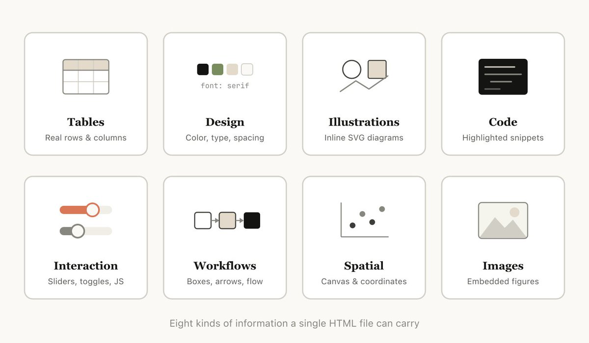
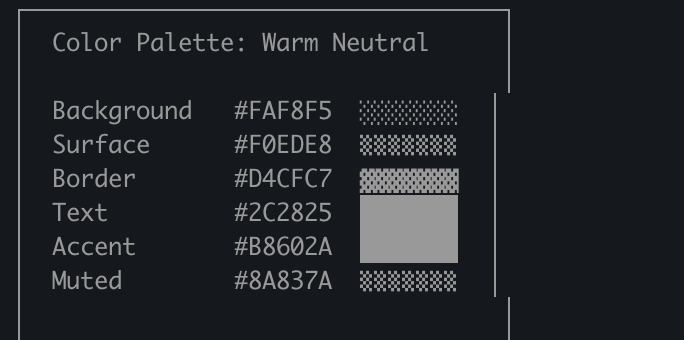
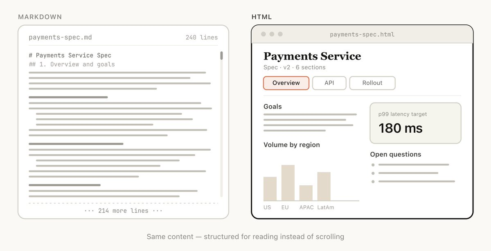
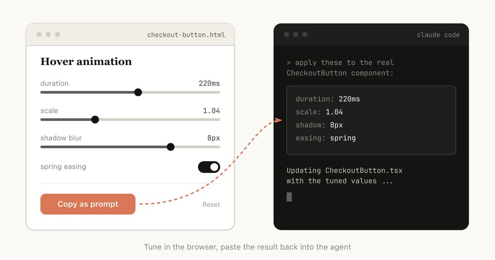
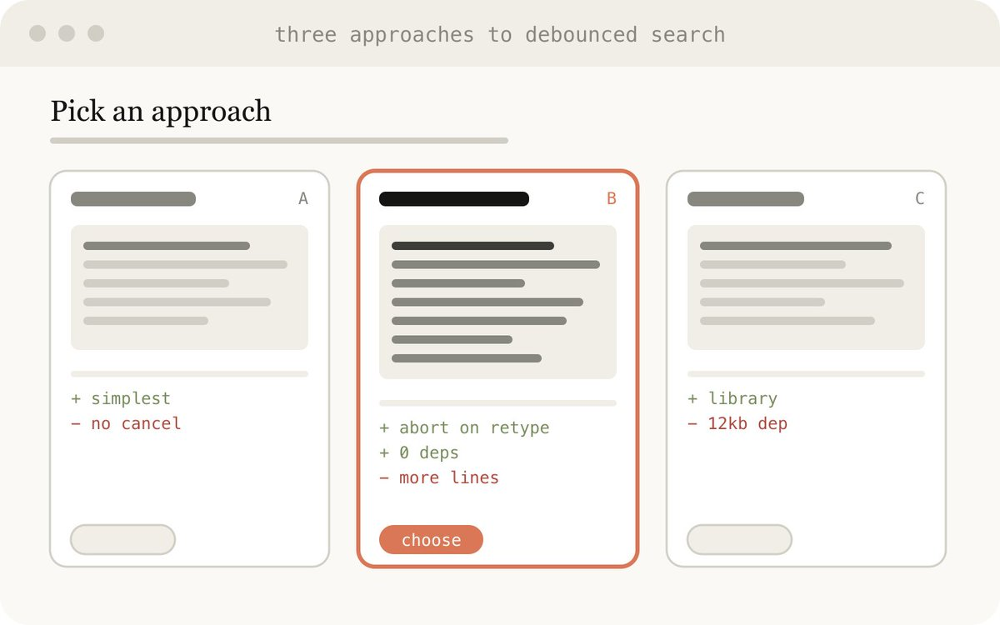
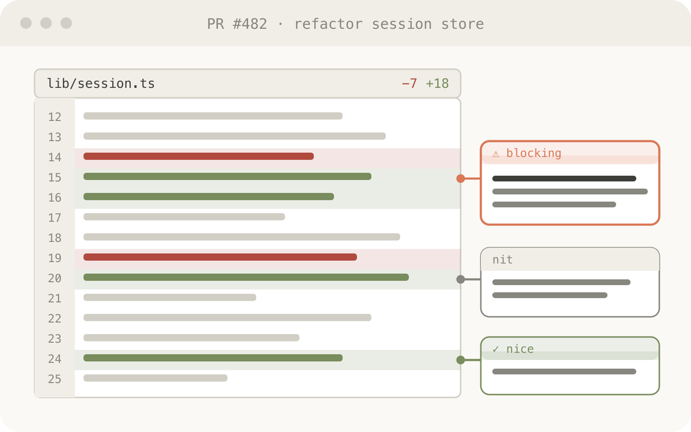
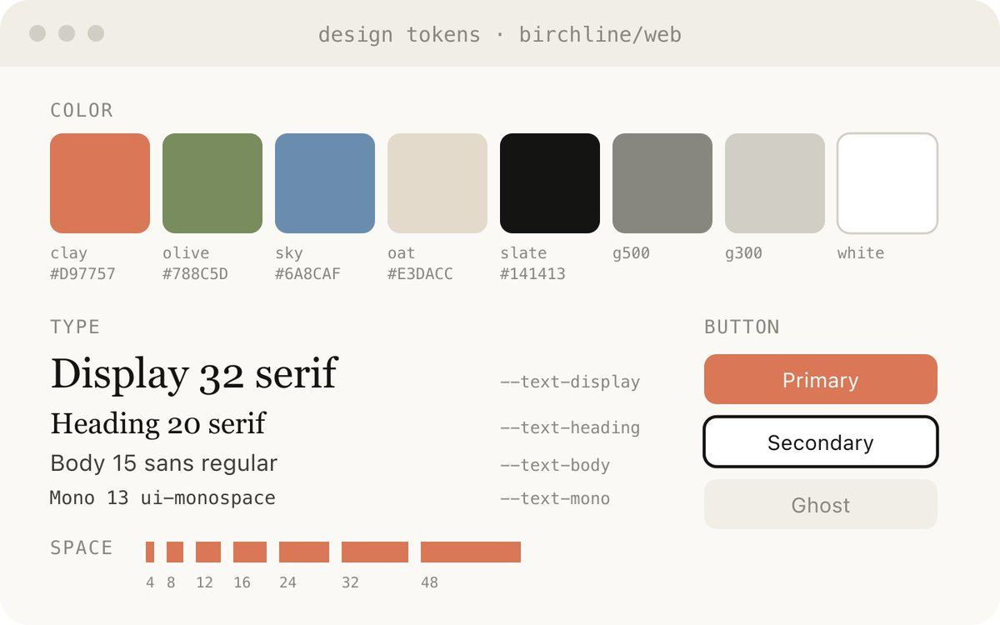
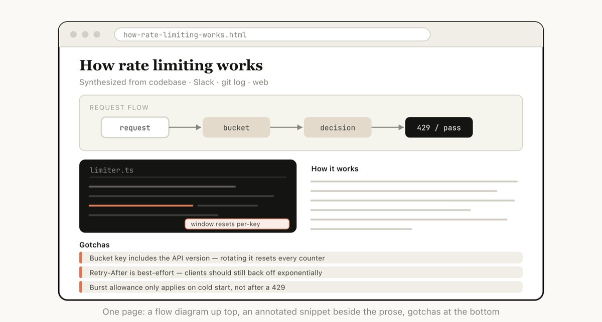
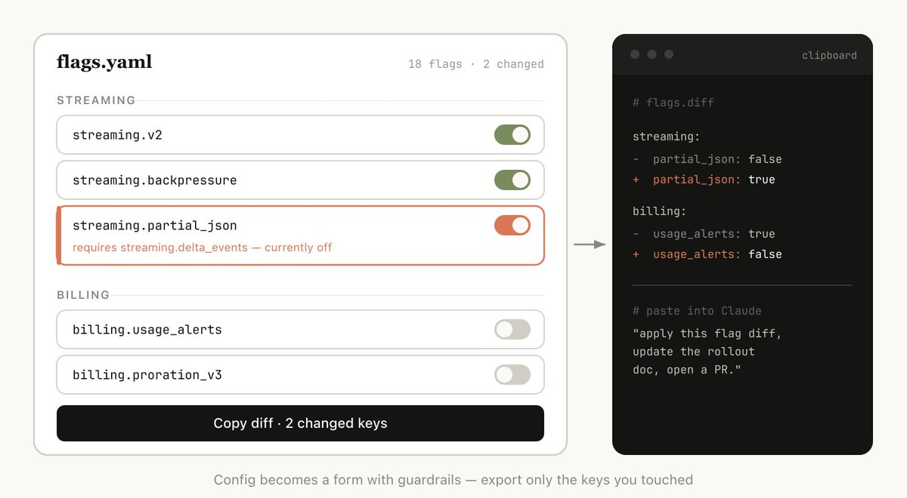

# Agent 交付物，不该只剩 Markdown

Claude Code 团队的 Thariq 写了一篇 X Article，标题是《Using Claude Code: The Unreasonable Effectiveness of HTML》。文章讨论的不是前端开发技巧，而是一个更具体的 Agent 协作问题：当 AI 编程助手能处理更复杂的任务时，Markdown 已经不总是最合适的交付格式。

Markdown 仍然适合 README、ADR、规范和长期维护的知识库。问题出在另一类任务：方案比较、代码评审、设计探索、报告复盘、Prompt 调参、配置编辑。这些任务的主要目标不是让人继续编辑文本，而是让人快速理解、判断和行动。

所以这篇文章的判断可以更直接地说：**Markdown 适合沉淀结论，HTML 更适合承载复杂 Agent 交付物的阅读和操作界面。**


## Markdown 的限制，不是语法太少，而是信息被压扁了

Markdown 的优势来自克制。标题、列表、代码块、表格、链接，足够写清楚大部分技术文档，也方便进仓库、做 diff、长期维护。

但 Agent 现在经常产出的不是普通文档。它可能要把一个 PR 的风险点标在 diff 旁边，要把几个架构方案并排展示，要让你拖动任务优先级，要把配置项做成表单，再导出一段可以贴回 Claude Code 的 JSON。

这类信息硬塞进 Markdown 后，空间关系、视觉层级和交互状态都会丢失。读者只能在长文本里滚动、脑补和对照。HTML 的价值不在于“更高级”，而在于它能保留更多判断线索。



Thariq 在原文里举了一个很小但很典型的例子：Claude Code 为了在 Markdown 里表达颜色，甚至会用 ASCII 和字符块模拟色卡。这个输出不是错，只是说明 Markdown 正在被迫承担不擅长的表达任务。



## 判断格式前，先判断读者要做什么

选择 Markdown 还是 HTML，不应该从工具习惯出发，而应该从读者任务出发。

如果读者下一步要编辑、审查 diff、长期维护，用 Markdown。纯文本更稳定，也更容易在 Git 里留下清楚历史。

如果读者下一步要比较、审阅、演示、调参、做决策，用 HTML。HTML 可以把线性文本变成带结构的工作台，让读者少滚动、少脑补、少来回切上下文。



可以用下面这张表做判断：

| 场景 | 更适合 | 原因 |
|---|---|---|
| README、ADR、团队规范 | Markdown | 稳定、可 diff、适合长期维护 |
| 复杂计划和方案探索 | HTML | 并排比较比长列表更容易决策 |
| PR 解释和代码评审 | HTML | diff、批注、调用链可以放在同一视图 |
| 调研报告和事故复盘 | HTML | 时间线、证据、结论可以分区展示 |
| Prompt、配置、参数调优 | HTML | 表单、滑杆、预览和导出更自然 |
| 最终归档 | Markdown | 结论沉淀需要简单、稳定、可追踪 |

这张表的重点不是二选一。更实用的流程是：**用 HTML 帮人理解和决策，再把稳定结论回写成 Markdown。**

## HTML 最适合做一次性工作台

Thariq 提到一个很有价值的用法：让 Claude Code 生成“用完即走”的 HTML 文件。它不是产品代码，也不一定需要复用，而是为当前任务临时搭一个更好用的界面。

比如调一个按钮动画时，HTML 可以直接给滑杆、开关和复制按钮。你在浏览器里调完参数，再把结果贴回 Claude Code，让 Agent 修改真实组件。



方案探索也是同样逻辑。让 Agent 把 3 到 6 个方案并排放在一个页面里，每个方案写清收益、代价和风险，比让它输出一长串 Markdown 小标题更容易比较。



代码评审也很适合 HTML。复杂 PR 的难点通常不是“改了哪些行”，而是这些行和模块边界、调用链、风险点之间有什么关系。HTML 可以把 diff、旁注和风险标记放到一个视图里，让 review 更像读解释器，而不是读纯补丁。



## Claude Code 生成 HTML 的优势，是上下文更完整

为什么不是直接让网页端 Claude 生成 HTML？Thariq 的理由很实际：Claude Code 可以读取本地文件系统、代码库、Git 历史，也可以通过 MCP 接入 Slack、Linear、浏览器等上下文。

这意味着 HTML 不是凭空画页面，而是从真实工程上下文里抽取结构。比如让 Claude Code 读取代码库里的设计 token，生成一份设计系统说明页；或者让它读限流相关代码、Git 记录和团队讨论，再做一页 rate limiting explainer。





这种交付物的目标不是替代源码，也不是替代正式文档。它更像一个临时的理解层：把散落在代码、提交记录、聊天记录和文档里的信息，组织成一个可以快速读完的页面。

## 可复制的 4 类 Prompt

下面这 4 类 Prompt 可以直接拿去试。写法不需要复杂，关键是告诉 Agent：页面要帮读者完成什么判断。

### 1. 方案探索

```text
生成一个 HTML 方案探索页。
要求：
1. 给出 4-6 个不同方案，按网格并排展示；
2. 每个方案写清适用场景、主要收益、最大风险；
3. 用颜色标出风险等级；
4. 最后给一个推荐排序和理由。
```

适合架构取舍、产品方案、重构路径。目标是减少读者在脑子里手动做表格的成本。

### 2. PR / 代码解释

```text
生成一个 HTML 代码评审说明页。
重点解释这次改动的模块边界、调用链和风险点。
把关键 diff 放进去，并在旁边加行内批注。
最后输出一个 review checklist。
```

适合复杂 PR、跨模块改动、团队交接。目标是让 review 先理解影响面，再进入具体代码。

### 3. 报告和复盘

```text
把这些材料整理成一个 HTML 复盘页。
要求：
1. 顶部先给 5 条结论；
2. 中间用时间线和因果链解释过程；
3. 把证据、截图、日志片段分区展示；
4. 最后给行动项表格，包含 owner、优先级和验收标准。
```

适合事故复盘、周报、调研报告。目标是让团队快速看到结论、证据和下一步。

### 4. 临时编辑器

```text
为这份配置生成一个一次性 HTML 编辑器。
左侧是可编辑表单，右侧实时预览生成结果。
需要校验依赖关系，错误项用红色标出。
底部加一个按钮，可以复制最终 JSON 或 diff。
```

适合配置、Prompt、特性开关和数据标注。HTML 在这里不是展示页，而是一个带护栏的临时操作台。



## HTML 交付物也有明确边界

HTML 最大的缺点是难审查。一个几百行 HTML 文件的 diff 很难像 Markdown 那样快速看懂，所以不适合直接替代长期文档。

生成时间也是成本。Thariq 在 FAQ 里提到，HTML 可能比 Markdown 慢 2-4 倍。只有当阅读、比较、协作收益足够大时，这个成本才值得付。

视觉质量也需要约束。不要只写“做得好看一点”，要明确布局密度、字号层级、颜色数量、移动端适配和导出按钮。如果团队有设计系统，先让 Claude Code 读取现有组件和 token，再生成 HTML。

更稳的使用方式是：

1. 探索、解释、比较、调参时，用 HTML。
2. 做完决策后，把结论、清单和最终方案回写到 Markdown。
3. 需要长期维护的内容，不把 HTML 当唯一事实源。

## 团队可以先加一条小规则

当 Agent 输出超过 100 行时，先停一下，问一个问题：

**读者接下来是要编辑文本，还是要理解和判断？**

如果答案是编辑，用 Markdown。  
如果答案是理解、比较、审阅、演示或调参，让 Agent 生成 HTML。

这条规则足够小，但能明显改变 Agent 交付物的质量。AI 编程下一阶段的竞争，不只是让 Agent 写更多代码，而是让人更容易看懂 Agent 做了什么、为什么这么做、下一步该不该继续。

关注「蒸馏小余」，回复 `HTML`，我会把上面 4 类 Prompt 整理成可复制模板。下一篇继续拆：怎么约束 Claude Code 生成不丑、可读、能用的一次性 HTML 工具页。

## 参考来源

- Thariq: [Using Claude Code: The Unreasonable Effectiveness of HTML](https://x.com/trq212/status/2052809885763747935)
- Thariq 的示例集: [html-effectiveness](https://thariqs.github.io/html-effectiveness/)
- Claude Code Docs: [Extend Claude Code](https://code.claude.com/docs/en/features-overview)
- Claude Code Docs: [Output styles](https://code.claude.com/docs/en/output-styles)
- Claude Code Docs: [Connect Claude Code to tools via MCP](https://code.claude.com/docs/en/mcp)
