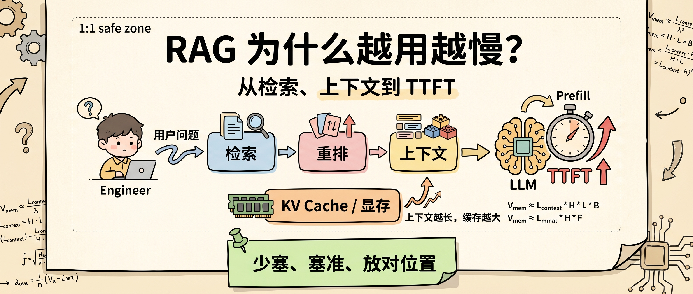
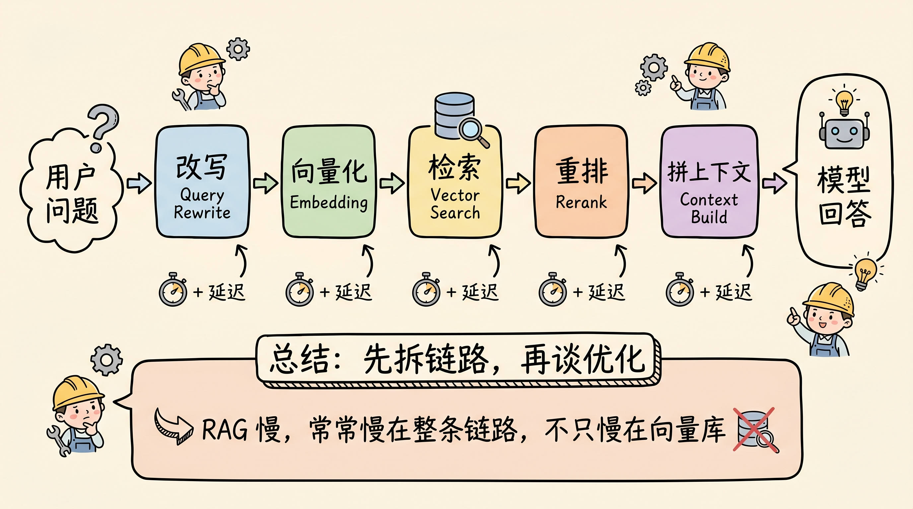
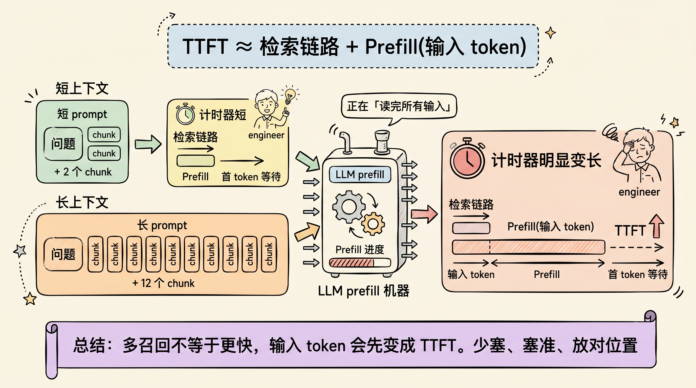
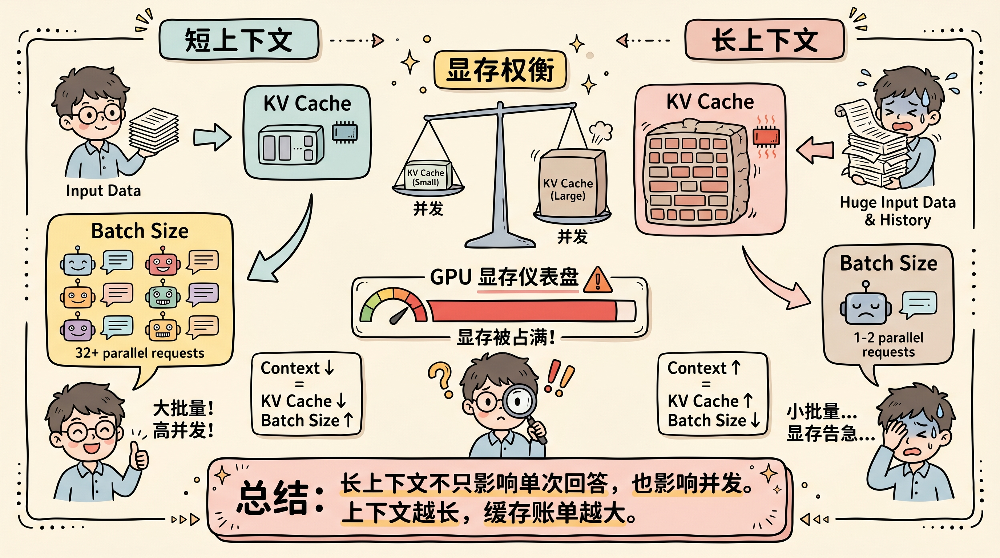

# RAG 为什么越用越慢？从检索、上下文到 TTFT 讲清楚

很多 RAG 应用刚上线时很轻快，文档一多、权限一复杂、检索链路一加，体验就开始变差：用户提交问题后先空等几秒，首 token 出来以后，回答又像一段一段挤出来。

这个问题不能只归因于“模型慢”或“向量库慢”。RAG 的延迟是一条链路：**query 改写、embedding、向量检索、rerank、上下文拼接、LLM prefill、decode、KV Cache 管理**，每一段都可能把响应时间推高。

判断 RAG 为什么慢，先看两个指标：**TTFT** 和 **ITL**。TTFT 是 Time To First Token，决定用户等多久才看到第一段输出；ITL 是 Inter-Token Latency，决定后续 token 流出来的间隔。RAG 最容易先把 TTFT 拉高，因为它会在生成第一个 token 前，把更多检索内容塞进 prompt，让模型先处理一大段上下文。

## RAG 本来解决什么问题？

RAG 的出发点很清楚：模型参数里存了知识，但这些知识难更新、难溯源，也不一定覆盖企业自己的文档。Lewis 等人在 2020 年提出 Retrieval-Augmented Generation，把预训练生成模型和外部非参数记忆结合起来，让模型在生成前先检索相关文档。

这个思路到今天仍然成立。企业知识库、客服系统、代码助手、投研助手都需要 RAG，因为很多答案不应该只靠模型“记忆”，而应该基于最新文档、权限内文档和可引用来源。

问题在于，RAG 不是“查一下资料再回答”这么简单。2024 年的 RAG best practices 研究也明确指出，RAG 工作流通常包含多个处理步骤，不同组合会影响效果和效率。也就是说，RAG 一旦进入生产系统，就不只是 NLP 问题，而是端到端系统问题。

## 第一层慢：检索链路变长

最简单的 RAG 是：用户问题进来，做 embedding，向量库 top-k 检索，把 chunk 拼进 prompt，然后让模型回答。

生产系统很少停在这一层。为了提高准确率，工程师会不断加组件：

- query rewrite：把用户问题改写得更适合检索；
- hybrid search：向量检索加关键词检索；
- reranker：对候选 chunk 重新排序；
- metadata filter：按时间、权限、部门、文档类型过滤；
- contextual compression：只保留和问题有关的句子；
- citation checker：检查答案是否能回到来源。

这些组件都可能有价值，但它们不是免费的。每加一个模型调用、一次 rerank、一次跨服务请求，端到端延迟都会增加。RAG 越用越慢，第一部分原因就是链路从“一次检索”变成了“检索流水线”。

这里的工程判断很直接：如果你的慢主要发生在 LLM 调用前，优化模型没有用，应该先看 retrieval latency、rerank latency、外部服务调用和权限过滤。

## 第二层慢：上下文变长，TTFT 被 Prefill 拉高

RAG 的第二层慢更隐蔽：检索本身可能很快，但拼进 prompt 的内容太多。

LLM 生成第一个 token 前，必须先处理完整输入。这个阶段通常叫 **Prefill**。DistServe 论文把 TTFT 直接对应到 prefill 阶段，而 decode 阶段对应后续 token 的 TPOT/ITL。换句话说，只要 RAG 把 prompt 从 2K token 扩到 20K token，模型在第一个 token 出来前就要先处理这 20K token。

这就是很多 RAG 应用的体感：检索很快，流式输出也不算慢，但用户提交问题后先等很久。慢的不是回答本身，而是模型正在读你塞进去的上下文。

这也是为什么“多召回一点总没错”在 RAG 里很危险。多放几个 chunk，看起来提高了覆盖率，实际可能带来三类成本：

1. 输入 token 增加，Prefill 变慢；
2. 相关信息被埋在中间，模型不一定用得好；
3. 无关信息干扰答案，质量反而下降。

Lost in the Middle 这篇研究给了一个关键提醒：模型在长上下文里并不总能稳定使用所有信息，相关信息出现在开头或结尾时表现更好，落在中间时性能会明显下降。对 RAG 来说，这意味着上下文不是越长越好，排序和裁剪同样重要。

## 第三层慢：KV Cache 让长上下文影响并发

RAG 还会影响后续 decode 和系统并发。原因是 KV Cache。

模型生成时会把历史 token 在每一层 attention 里的 Key 和 Value 缓存下来，后续 token 可以复用这些缓存，避免重复计算。vLLM/PagedAttention 论文指出，KV Cache 很大，而且会动态增长；如果管理不好，会因为碎片和重复占用浪费显存，进而限制 batch size。

RAG 的问题是，它往往先塞一大段检索上下文。上下文越长，Prefill 后留下的 KV Cache 越大。单个用户看到的是“回答变慢”，服务端看到的是“显存被缓存占住，并发被挤压”。

RAGCache 这篇论文把问题说得更贴近 RAG：知识注入会带来长序列生成，并导致高计算和内存成本。它通过缓存检索知识的中间状态来优化，实验中报告 TTFT 最多降低 4 倍、吞吐最多提升 2.1 倍。这个结果说明，RAG 的性能瓶颈已经不只是检索，也包括检索内容进入 LLM 后的缓存和推理成本。

所以，RAG 系统的性能优化不能只看“向量检索用了多少毫秒”。真正要看的是：

- 召回了多少 chunk；
- 每个 chunk 多长；
- rerank 后实际塞进 prompt 多少 token；
- TTFT 是否随上下文长度线性或近似线性变差；
- KV Cache 是否挤压 batch size 和并发；
- 长输出时 ITL 是否也在变差。

## RAG 变慢时，先别急着换模型

遇到 RAG 变慢，我建议按下面顺序排查。

第一，拆端到端耗时。把一次请求分成 query rewrite、embedding、retrieval、rerank、context build、LLM TTFT、LLM ITL。没有这些指标，讨论“RAG 慢”很容易变成猜测。

第二，看 top-k 和 token budget。不要只记录召回多少文档，要记录最终塞进 prompt 的 token 数。很多系统 top-k 不高，但 chunk 太大，最后上下文一样膨胀。

第三，看相关信息的位置。Lost in the Middle 的结论对 RAG 很重要：相关信息不应该随机散落在长上下文中。rerank 之后要把最关键证据放到模型更容易利用的位置，并且删除弱相关 chunk。

第四，做检索质量评估。CRAG 提醒我们，RAG 很依赖检索文档的相关性；如果检索错了，模型会基于错误材料生成。RECOMP 这类工作则进一步强调压缩和选择性增强：无关或无增益内容应该可以被压缩掉，甚至返回空内容。

第五，看缓存和复用。重复问题、稳定文档、热门知识块，都可能存在缓存空间。RAGCache、PagedAttention 这类系统工作说明，缓存不是锦上添花，而是高并发 RAG 的基础设施。

## 一张可执行清单

如果只能保留一张 RAG 性能清单，我会写成这样：

| 症状 | 先看指标 | 可能原因 | 优化方向 |
|---|---|---|---|
| 用户提交后空等 | TTFT | prompt 太长、chunk 太多、Prefill 成本高 | 减少上下文、压缩 chunk、缓存前缀 |
| 检索前就慢 | rewrite / embedding latency | 多次模型调用、embedding 服务慢 | 合并步骤、缓存 query、异步化 |
| 检索后还慢 | rerank latency | 候选太多、cross-encoder 太重 | 先粗排再精排、降低候选数 |
| 答案质量变差 | recall / faithfulness | 无关 chunk 干扰、信息在中间 | rerank、裁剪、证据重排 |
| 首 token 快但输出慢 | ITL | Decode 受内存带宽/KV Cache 影响 | 量化、PagedAttention、优化 serving |
| 并发上不去 | batch size / KV memory | 长上下文缓存占显存 | 限制 token budget、KV cache 管理 |

这张表背后的原则是：**不要把 RAG 当成“检索模块 + 大模型”两个黑盒，要把它拆成可观测的延迟链路。**

## 结尾：RAG 优化的目标不是少检索，而是少塞垃圾上下文

RAG 不会因为长上下文模型出现就消失。长上下文让模型能读更多内容，但不代表读得更快、更便宜、更稳定，也不代表它能在大量弱相关材料中自动抓住关键证据。

真正稳定的 RAG 系统，目标不是“尽量多召回”，而是“用最少、最准、位置最好的上下文，让模型回答问题”。这会同时改善三件事：TTFT 更低，答案更集中，显存和并发压力更可控。

下次再遇到 RAG 变慢，不要先问“要不要换更快的模型”。先问：

**我们是不是把太多检索内容，变成了模型必须在 Prefill 阶段读完的上下文？**

这个问题答清楚，RAG 性能优化才会从玄学变成工程。

关注「蒸馏小余」，回复 `RAG`，我会把这篇文章里的 RAG 延迟排查表、TTFT/ITL 指标模板和上下文预算清单整理成可复制版本。下一篇继续拆：长上下文为什么不是免费记忆，KV Cache 才是真账单。

## 参考来源

- Patrick Lewis et al., [Retrieval-Augmented Generation for Knowledge-Intensive NLP Tasks](https://arxiv.org/abs/2005.11401)
- Nelson F. Liu et al., [Lost in the Middle: How Language Models Use Long Contexts](https://arxiv.org/abs/2307.03172)
- Woosuk Kwon et al., [Efficient Memory Management for Large Language Model Serving with PagedAttention](https://arxiv.org/abs/2309.06180)
- Yinmin Zhong et al., [DistServe: Disaggregating Prefill and Decoding for Goodput-optimized Large Language Model Serving](https://arxiv.org/abs/2401.09670)
- Chao Jin et al., [RAGCache: Efficient Knowledge Caching for Retrieval-Augmented Generation](https://arxiv.org/abs/2404.12457)
- Xiaohua Wang et al., [Searching for Best Practices in Retrieval-Augmented Generation](https://arxiv.org/abs/2407.01219)
- Shi-Qi Yan et al., [Corrective Retrieval Augmented Generation](https://arxiv.org/abs/2401.15884)
- Fangyuan Xu et al., [RECOMP: Improving Retrieval-Augmented LMs with Compression and Selective Augmentation](https://arxiv.org/abs/2310.04408)
