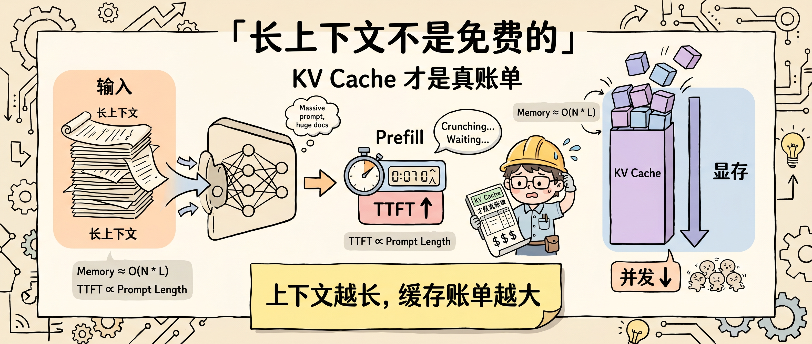
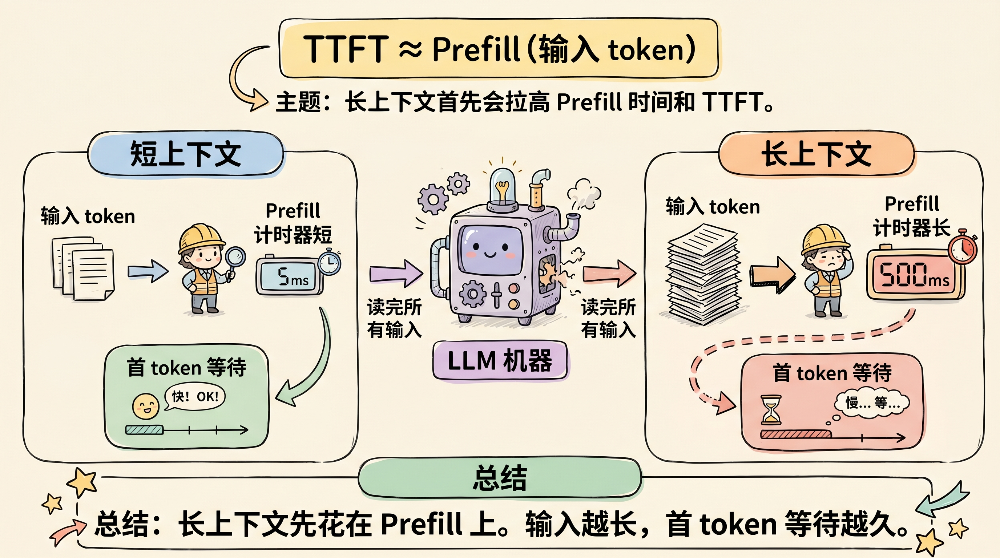
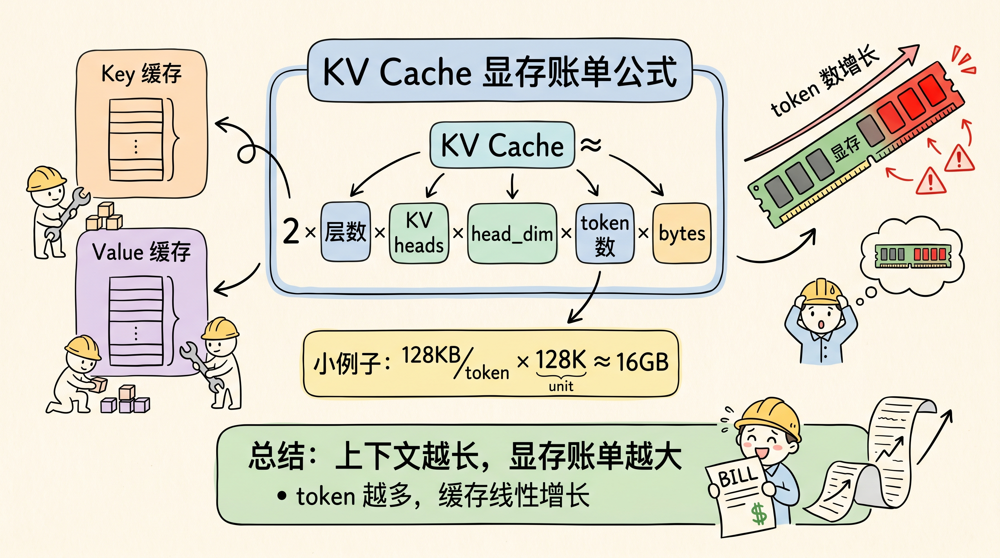
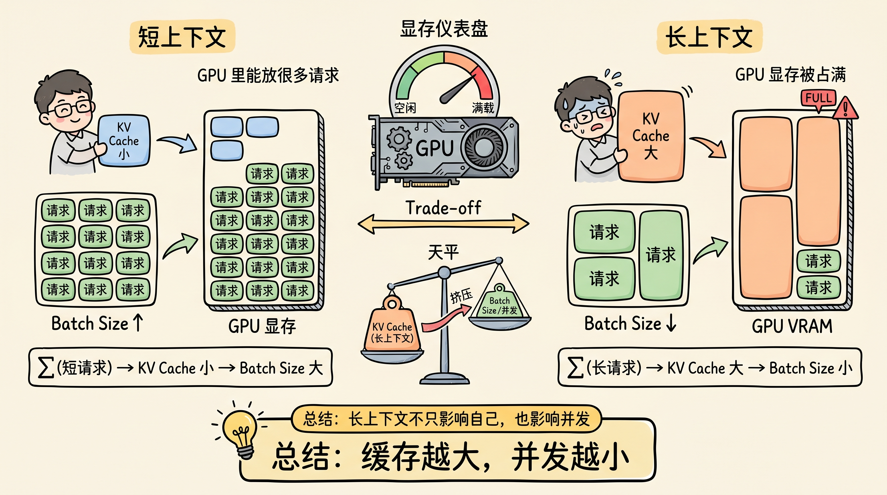
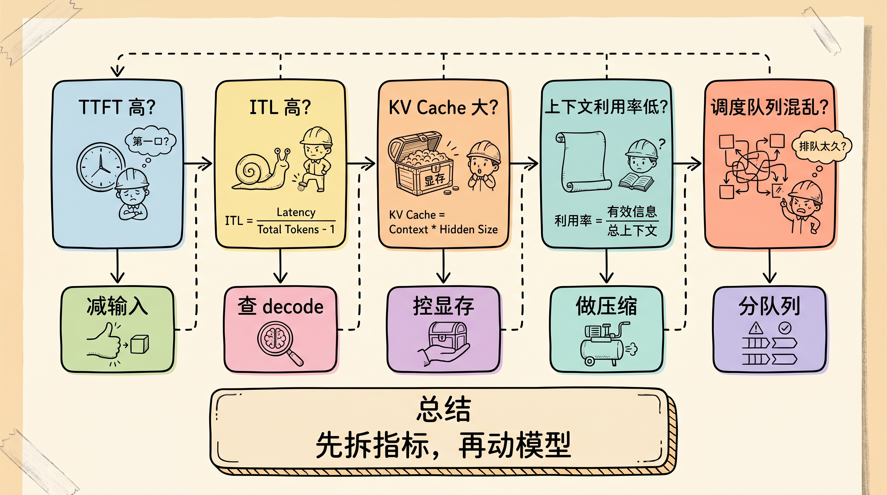

# 长上下文和 KV Cache：为什么上下文不是免费的

长上下文很容易给人一种错觉：窗口越大，模型记得越多，工程上就越省事。真实情况相反。上下文窗口变大以后，成本从 prompt 里转移到了推理系统里，主要体现在两个地方：**Prefill 要先读完整输入，KV Cache 要把历史 token 的 Key/Value 留在显存里。**

所以，长上下文不是“免费记忆”。它更像一块昂贵的 GPU 工作内存：你塞进去的每个 token，都会影响首 token 延迟、显存占用、batch size 和并发能力。

判断长上下文值不值得用，不能只看模型支持 128K、200K 还是 1M token。更应该看：这段上下文会不会被模型用到，它要花多少 TTFT，留下多少 KV Cache，以及会不会把线上并发挤掉。



## 上下文窗口不是知识库，而是工作区

上下文窗口解决的是“模型当前能看到多少内容”，不是“模型长期记住多少知识”。把更多文档塞进窗口，确实能让模型在一次请求里读取更多材料，但这不等于免费扩展记忆。

Transformer 推理有两个阶段。第一个阶段是 Prefill，模型处理完整输入，并准备生成第一个 token。第二个阶段是 Decode，模型一个 token 一个 token 继续输出。DistServe 论文把这两个阶段拆开讨论：Prefill 主要影响 Time To First Token，Decode 主要影响后续 token 的生成间隔。

长上下文首先伤到 TTFT。因为模型必须先处理完整输入，才有资格生成第一个 token。你把 prompt 从 4K token 拉到 64K token，用户看到的不是“模型记忆更大”，而是“提交后先等更久”。



这也是为什么 RAG 系统、代码库问答、长文档总结经常出现同一种体感：检索和上传都完成了，但第一个字迟迟不出来。慢的不是网络，也不一定是模型输出慢，而是模型正在读完你塞进去的输入。

## KV Cache 是长上下文的显存账单

Decode 阶段不能每生成一个 token 就重算整个历史上下文。为避免重复计算，模型会缓存历史 token 在每一层 attention 里的 Key 和 Value，这就是 KV Cache。

KV Cache 的好处很明显：后续生成可以复用历史 K/V，只为新 token 计算增量。vLLM 的 PagedAttention 论文指出，KV Cache 很大、动态变化，而且如果管理不好，会因为碎片和预留空间浪费大量显存。

KV Cache 的账单可以用一个简化公式理解：

```text
KV Cache ≈ 2 × 层数 × KV heads × head_dim × token 数 × 每个数的字节数
```

这里的 2 代表 Key 和 Value。token 数越长，KV Cache 近似线性增长；batch 里请求越多，这个缓存还要再乘上并发请求数。

举个保守例子：假设一个模型有 32 层、8 个 KV heads、head_dim 是 128，用 FP16 存缓存。每个 token 的 KV Cache 大约是：

```text
2 × 32 × 8 × 128 × 2 bytes = 128 KB / token
```

如果上下文是 128K token，单个请求的 KV Cache 就接近 16GB。这个数字只是示意，不同模型结构会差很多，但它足够说明一件事：**长上下文会把显存变成主要约束。**



## 为什么长上下文会挤压并发？

线上推理服务不是只服务一个用户。服务端要把多个请求放到同一张 GPU 上，尽量提高吞吐。KV Cache 越大，单个请求占用的显存越多，能同时放进 GPU 的请求就越少。

这会带来一个很现实的结果：长上下文请求不只是自己慢，还会影响其他请求的排队和 batch。用户看到的是响应慢，服务端看到的是显存被 KV Cache 占住、batch size 降低、吞吐下降。

vLLM 的 PagedAttention 把 KV Cache 类比成操作系统里的分页内存来管理，目标就是减少碎片、按需分配、共享缓存块。这个设计方向说明，长上下文推理的瓶颈已经不只是模型结构，而是内存管理。



所以，不要只问“模型支持多长上下文”。更好的问题是：

- 这个上下文长度下，单请求 KV Cache 多大？
- batch size 会被压到多少？
- TTFT 和 ITL 分别变成多少？
- 高峰期长上下文请求会不会拖慢短请求？
- 能不能把长请求和短请求分队列调度？

## 为什么很多模型开始改造 Attention？

KV Cache 太贵以后，模型架构也开始围绕缓存优化。

Shazeer 在 Multi-Query Attention 论文里提出，让所有 query heads 共享一组 Key/Value heads，可以减少增量解码时的内存带宽开销。GQA 进一步做折中：不是所有 heads 共享一组 K/V，而是多个 query heads 共享较少数量的 K/V heads，在质量和速度之间取平衡。

这些方法的共同目标很清楚：减少 Decode 阶段需要读取和存储的 K/V 数量。

DeepSeek-V3 技术报告里的 MLA 也是类似方向。它通过低秩压缩方式减少推理时的 KV Cache，占用更少缓存，同时服务长上下文。这里不需要记住每个结构细节，只要抓住趋势：**长上下文能力不只靠扩大窗口，还要靠降低缓存成本。**

另外还有 KV Cache 量化。KVQuant 等工作关注用更低位宽存储 KV Cache，减少显存占用。代价是可能带来精度损失，所以生产系统需要评估具体任务质量。

## 长上下文不是不用，而是要有预算

长上下文仍然很有价值。代码库理解、法律合同、长报告分析、多轮 Agent 会话，都需要模型看到更多材料。问题不是“用不用长上下文”，而是“什么时候值得用，以及用多少”。

我建议把上下文当成预算，而不是垃圾桶。

| 场景 | 建议 |
|---|---|
| 用户问题只需要局部材料 | 先检索和重排，不要整包塞入 |
| 文档很长但结构清楚 | 先摘要、分层索引，再按需展开 |
| 代码库问答 | 优先塞相关文件、调用链和接口，不塞全仓 |
| 多轮 Agent 会话 | 定期压缩历史，只保留决策、约束和未完成事项 |
| 高并发服务 | 给长上下文请求单独队列或限额 |
| 质量要求高 | 记录引用位置，避免相关信息埋在中间 |

这个预算至少要包含 4 个数字：

1. 输入 token 上限；
2. 可接受 TTFT；
3. 单请求 KV Cache 估算；
4. 高峰期目标 batch size。

没有这 4 个数字，长上下文很容易从“能力升级”变成“成本黑洞”。

## 排查慢请求时，按这个顺序看

遇到长上下文请求变慢，不要先换模型。先拆指标。

第一，看 TTFT。如果首 token 很慢，优先检查输入 token 数、Prefill 时间、检索材料是否过长。

第二，看 ITL。如果首 token 已经出来，但后续输出慢，优先检查 Decode 阶段、显存带宽、KV Cache 读写和 serving 框架。

第三，看 KV Cache 占用。如果显存高、batch size 上不去，说明瓶颈可能不是算力，而是缓存。

第四，看上下文利用率。如果模型实际只引用了少量片段，却读了几十万 token，上下文预算就用错了。

第五，看调度策略。长上下文请求和短问答请求混在同一队列里，容易让短请求被拖慢。工程上可以考虑分队列、限长、缓存热门前缀或使用更细的调度策略。



## 结尾：上下文越长，越要会删

长上下文是强能力，但不是免费午餐。它让模型能看到更多材料，也让推理系统承担更多 Prefill 计算、KV Cache 显存和调度压力。

更成熟的做法不是无脑扩大窗口，而是把上下文拆成三类：

- 必须读：和当前问题直接相关的证据；
- 可以压缩：历史对话、背景材料、低价值文档；
- 不该塞：弱相关 chunk、重复内容、过期信息。

真正稳定的 AI 应用，不会把长上下文当成万能保险。它会先筛选、再排序、再压缩，最后只把必要内容放进模型工作区。

下次看到“支持 1M 上下文”这类能力，不要只问窗口有多大。先问：

**这一百万 token 里，有多少真的值得模型在 Prefill 阶段读完，又有多少值得留成 KV Cache？**

这个问题答清楚，长上下文才会从卖点变成工程能力。

关注「蒸馏小余」，回复 `KV`，我会把这篇文章里的 KV Cache 估算公式、长上下文预算表和慢请求排查清单整理成可复制版本。下一篇继续拆：Prompt Caching 为什么是 Agent 的地基。

## 参考来源

- Woosuk Kwon et al., [Efficient Memory Management for Large Language Model Serving with PagedAttention](https://arxiv.org/abs/2309.06180)
- Noam Shazeer, [Fast Transformer Decoding: One Write-Head is All You Need](https://arxiv.org/abs/1911.02150)
- Joshua Ainslie et al., [GQA: Training Generalized Multi-Query Transformer Models from Multi-Head Checkpoints](https://arxiv.org/abs/2305.13245)
- Yinmin Zhong et al., [DistServe: Disaggregating Prefill and Decoding for Goodput-optimized Large Language Model Serving](https://arxiv.org/abs/2401.09670)
- Huiqiang Jiang et al., [MInference 1.0: Accelerating Pre-filling for Long-Context LLMs via Dynamic Sparse Attention](https://arxiv.org/abs/2407.02490)
- DeepSeek-AI, [DeepSeek-V3 Technical Report](https://arxiv.org/abs/2412.19437)
- Coleman Hooper et al., [KVQuant: Towards 10 Million Context Length LLM Inference with KV Cache Quantization](https://arxiv.org/abs/2401.18079)
