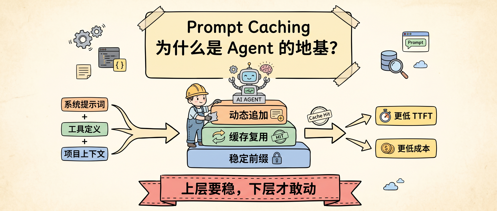
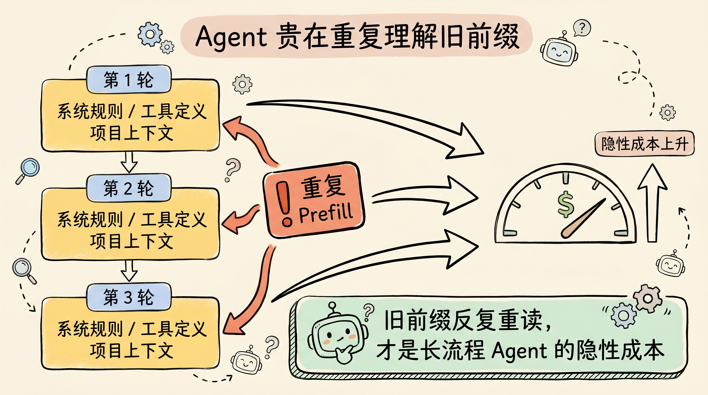
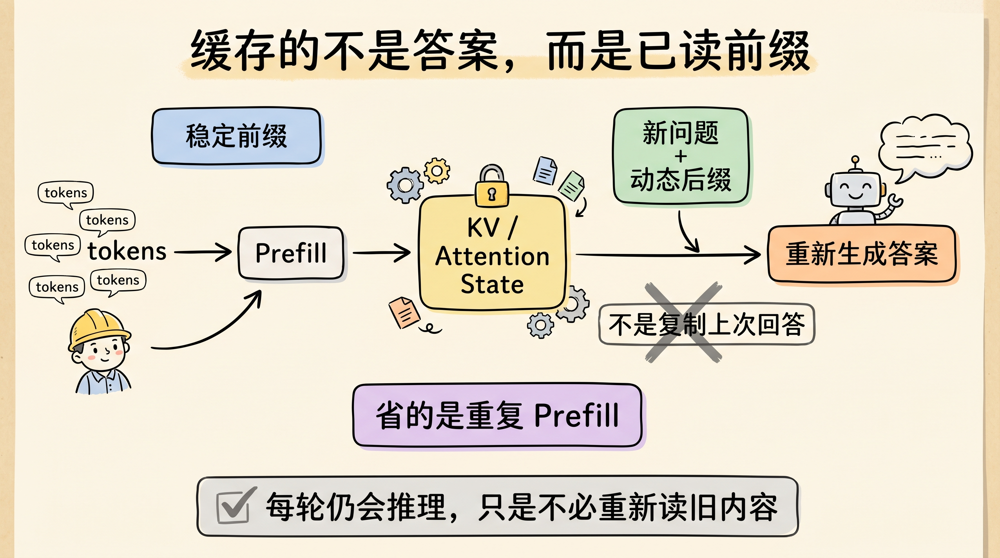
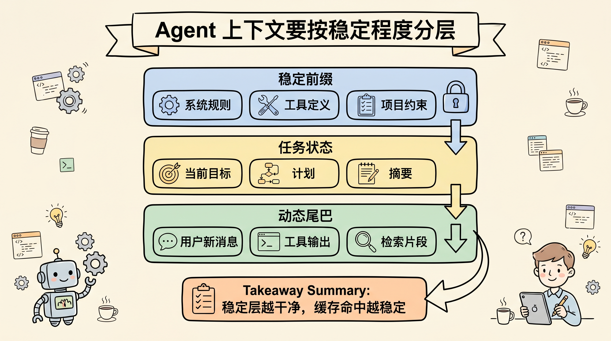
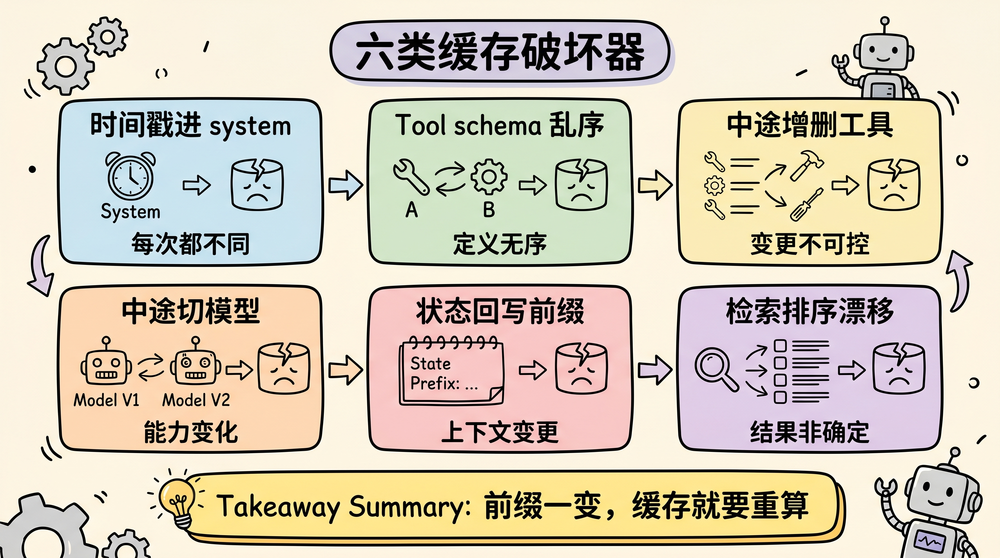
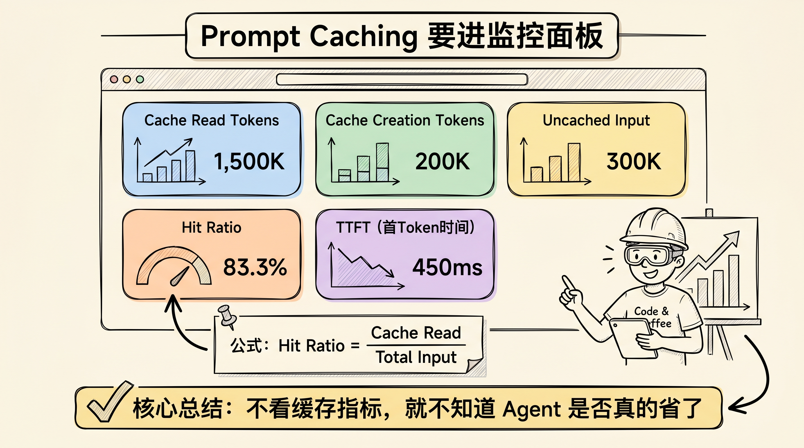

# Prompt Caching 为什么是 Agent 的地基？

Agent 要跑得久、跑得稳、跑得便宜，不能只靠更大的上下文窗口。真正要先设计的是缓存友好的会话结构：稳定内容放在前面，变化内容追加在后面，让模型已经读过的前缀可以持续复用。

Prompt Caching 不是一个“打开就省钱”的按钮。它更像 Agent 的地基。系统提示词、工具定义、项目规则、长期任务背景，这些内容一旦被反复重算，Agent 每走一步都在为旧信息重新付钱；一旦被稳定缓存，后面的多轮动作才有机会变成低延迟、低成本的增量调用。

上一篇讲长上下文和 KV Cache 时，我们说上下文不是免费的。今天可以再往前推一步：**Agent 不是怕上下文长，而是怕每一轮都把同一段上下文当新内容重读。**



## Agent 为什么比普通聊天更需要缓存？

普通聊天通常是一问一答，系统提示词不长，工具也少。Agent 不一样。一个代码 Agent 或研究 Agent 每次请求里，经常会带上几类固定内容：

- 系统行为规则；
- 工具定义和调用协议；
- 项目说明、仓库约束、工作流规范；
- 任务目标、已有计划和关键背景。

这些内容在第一轮有价值，因为模型必须先理解工作环境。问题出在第二轮、第三轮、第五十轮：如果稳定前缀没有命中缓存，模型就会把同一批工具定义和项目规则重新做一遍 prefill。

这就是 Agent 成本里很隐蔽的一项：不是新问题贵，而是旧前缀反复贵。



OpenAI 的 Prompt Caching 文档把优化原则说得很直接：缓存命中依赖 prompt 的精确前缀匹配，静态内容应该放在开头，动态内容应该放在末尾。Anthropic 的文档也强调，缓存引用的是 `tools`、`system`、`messages` 这个顺序里直到缓存断点的完整前缀。

换成 Agent 语言，就是一句话：**上层要稳，下层才敢动。**

## Prompt Caching 缓存的不是“回答”，而是“读过的前缀”

很多缓存系统缓存的是最终结果，比如“同一个问题直接返回同一个答案”。Prompt Caching 不是这个逻辑。它缓存的是模型处理输入时产生的中间状态，尤其是 attention 层在 prefill 阶段算出的 Key/Value 状态。

这点很关键。Agent 每一轮都可能需要新的推理和新工具调用，不能简单复用上一次回答。但如果前面的系统提示词、工具定义、项目背景完全一样，模型就不需要每次都从零读完这些前缀。

Prompt Cache 论文把这种思想表达成“复用重叠 prompt 片段的 attention states”。论文关注的例子包括系统消息、prompt 模板和上下文文档，这些正是 Agent 请求里最常重复的部分。它的实验也说明，长 prompt 场景下，复用 attention state 对首 token 延迟尤其有帮助。



所以，Prompt Caching 对 Agent 的价值不只是省输入 token 费用。更准确地说，它同时影响三件事：

| 影响 | 解释 |
|---|---|
| 成本 | 缓存读通常比完整输入处理便宜 |
| TTFT | 稳定前缀不再完整 prefill，首 token 更快出来 |
| 并发 | 重复 prefill 减少后，服务端更容易把资源留给真正新增的请求 |

OpenAI 文档里还提到，满足条件的 prompt 会自动缓存，并通过 `usage.prompt_tokens_details.cached_tokens` 报告缓存命中的 token 数。Anthropic 则提供更显式的 `cache_control` 断点，并通过 `cache_creation_input_tokens`、`cache_read_input_tokens` 和 `input_tokens` 拆出缓存写入、缓存读取和未缓存输入。

这些指标不只是账单字段。对 Agent 工程来说，它们应该进入监控面板。

## 为什么稳定前缀是 Agent 的“地基”？

一个 Agent 系统通常有三层上下文。

第一层是稳定前缀，包括系统规则、工具 schema、角色边界、安全约束、项目指南。这一层应该尽量不动，因为它决定缓存能不能命中。

第二层是任务状态，包括当前目标、计划、已完成步骤、未解决问题、关键文件和引用材料。这一层会变化，但应该以追加或压缩摘要的方式变化，避免回头修改第一层。

第三层是动态尾巴，包括用户新指令、模型最新回复、工具输出、终端日志、检索结果。这一层天然会增长，也是 Agent 每一步真正需要新增处理的部分。



缓存友好的 Agent，不是把所有内容都塞进一个巨大 prompt，而是把上下文按“稳定程度”分层。稳定前缀越干净，缓存命中率越高；动态尾巴越克制，长会话越不容易膨胀。

这也是为什么 Claude Code、Cursor、Devin 这类 Agent 工具都非常重视项目说明文件、工具协议和会话结构。对用户来说，这些只是提示词；对推理系统来说，它们是可以被反复复用的计算资产。

## 哪些细节最容易把缓存打碎？

Prompt Caching 最反直觉的地方，是它通常要求“完全一样”。意思不是语义差不多，而是 token 前缀要匹配。

下面这些细节都会让缓存命中率下降：

| 破坏方式 | 后果 | 改法 |
|---|---|---|
| 每轮在 system prompt 里注入时间戳 | 前缀每轮都变 | 把时间放到动态消息 |
| 工具 schema 顺序不稳定 | 工具前缀哈希变化 | 固定序列化顺序 |
| 会话中途增删工具 | 缓存断点前内容变化 | 会话开始前加载常用工具 |
| 中途切模型 | 模型相关缓存不可复用 | 按模型维度设计会话 |
| 把状态写回系统提示词 | 稳定层被污染 | 状态追加到消息或单独摘要 |
| 检索材料排序飘忽 | 文档前缀不稳定 | 固定排序、去重、分层插入 |



这些问题在 demo 里不明显，因为 demo 只有三五轮。到了真实 Agent 工作流，几十轮工具调用、上百个文件片段、多次压缩摘要混在一起，缓存命中率会被这些小变化吃掉。

KVFlow 论文讨论多 Agent 工作流时提到，Agent 会被反复调用，固定 prompt 对应的 KV tensor 本来可以复用；但普通 LRU 策略可能在下一次复用前把缓存淘汰掉，所以需要工作流感知的缓存管理和预取。TokenDance 进一步从多 Agent 同步轮次出发，指出多 Agent 会共享大量相同输出块，普通前缀缓存并不能充分利用这种冗余。

这说明 Prompt Caching 已经不是“提示词技巧”。它正在变成 Agent serving 的系统设计问题。

## 自己做 Agent，Prompt 应该怎么排？

如果你在做自己的 Agent，可以直接按这个顺序组织请求：

```text
1. System rules
   稳定身份、行为边界、输出规范、安全约束

2. Tool definitions
   固定工具列表、固定 schema、固定序列化顺序

3. Project or product context
   项目说明、代码规范、长期约束、业务背景

4. Task state
   当前目标、计划、已完成动作、未完成事项、压缩摘要

5. Dynamic messages
   用户最新输入、工具结果、检索片段、终端输出
```

这套排法的目标不是让 prompt 看起来整齐，而是让缓存断点前的内容尽量稳定。

这里还有一个容易被忽略的原则：**不要把短期状态写进长期前缀。** 比如“当前时间”“这一步刚失败了”“用户刚刚改了需求”，这些信息很重要，但它们应该进入动态消息或任务状态，而不是改写系统提示词。

如果上下文快满了，也不要粗暴重写整段 prompt。更好的方式是做 cache-safe compaction：保留稳定前缀，把历史对话压缩成新的任务状态摘要，再继续往后追加。压缩会产生新内容，但至少不会把地基一起砸掉。

## 该怎么监控 Prompt Caching？

不要只看总 token。总 token 会告诉你花了多少，但不会告诉你 Agent 结构好不好。

我建议至少看 5 个指标：

| 指标 | 看什么 |
|---|---|
| Cache read tokens | 有多少输入来自缓存 |
| Cache creation tokens | 有多少输入在写入缓存 |
| Uncached input tokens | 还有多少输入每轮都在重算 |
| Cache hit ratio | 缓存读取占缓存相关 token 的比例 |
| TTFT | 首 token 是否随着缓存命中下降 |

一个简单的缓存效率可以这样算：

```text
cache_hit_ratio =
cache_read_tokens / (cache_read_tokens + cache_creation_tokens + uncached_input_tokens)
```

这个公式不追求学术严谨，它的作用是帮你发现趋势：如果 Agent 跑了很多轮，`cache_read_tokens` 仍然很低，就说明稳定前缀没有稳定；如果 `uncached_input_tokens` 持续暴涨，就说明动态尾巴失控；如果 TTFT 没有改善，可能是缓存没命中，也可能是检索材料和工具输出太长。



## 什么时候不要迷信 Prompt Caching？

Prompt Caching 很重要，但不是所有慢请求都能靠它解决。

短 prompt 的一次性问答，缓存收益有限。每轮检索材料都完全不同的 RAG，缓存也很难救前缀漂移。输出很长、decode 阶段占大头的任务，Prompt Caching 对首 token 有帮助，但不会让生成本身消失。高并发系统里，缓存还会受到路由、TTL、模型、机器内存和淘汰策略影响。

OpenAI 文档里提到，prompt 至少达到一定长度才会显示实际缓存命中；Anthropic 的缓存也有默认生命周期，并且长 TTL 会有额外写入成本。这些约束提醒我们：Prompt Caching 是工程杠杆，不是无限免单。

更稳的判断标准是：

- 稳定前缀是否足够长；
- 同一前缀是否会被多次复用；
- 请求间隔是否在缓存生命周期内；
- 动态内容是否只追加在后面；
- 监控里是否能看到缓存读 token 上升。

五个条件都满足，Prompt Caching 才会真正变成 Agent 的收益。

## 结尾：先设计地基，再谈智能体

Agent 系统的很多问题，表面上是模型能力问题，落到线上经常是上下文工程问题。

稳定前缀没有设计好，工具再多也会变成重复 prefill。动态尾巴不控制，长上下文会吞掉 TTFT 和显存。缓存指标不监控，成本下降只能靠猜。

我会把 Prompt Caching 当成 Agent 的基础设施，而不是成本优化小技巧。一个合格的 Agent 设计，至少要回答三个问题：

- 哪些内容必须稳定放在前缀？
- 哪些状态只能追加，不能回写？
- 每轮请求的缓存命中率是否可观测？

把这三个问题答清楚，Agent 才不是每走一步都重新认识世界。

关注「蒸馏小余」，回复 `CACHE`，我会把这篇文章里的 Agent Prompt 排布模板、缓存破坏清单和监控指标整理成可复制版本。下一篇继续拆：Agent 的上下文压缩，为什么不是简单总结聊天记录。

## 参考来源

- OpenAI, [Prompt caching](https://platform.openai.com/docs/guides/prompt-caching)
- Anthropic, [Prompt caching](https://docs.anthropic.com/en/docs/build-with-claude/prompt-caching)
- In Gim et al., [Prompt Cache: Modular Attention Reuse for Low-Latency Inference](https://arxiv.org/abs/2311.04934)
- Zaifeng Pan et al., [KVFlow: Efficient Prefix Caching for Accelerating LLM-Based Multi-Agent Workflows](https://arxiv.org/abs/2507.07400)
- Zhuohang Bian et al., [TokenDance: Scaling Multi-Agent LLM Serving via Collective KV Cache Sharing](https://arxiv.org/abs/2604.03143)
- Avi Chawla, [Prompt caching in LLMs, clearly explained](https://x.com/_avichawla/status/2044670188998803855)
