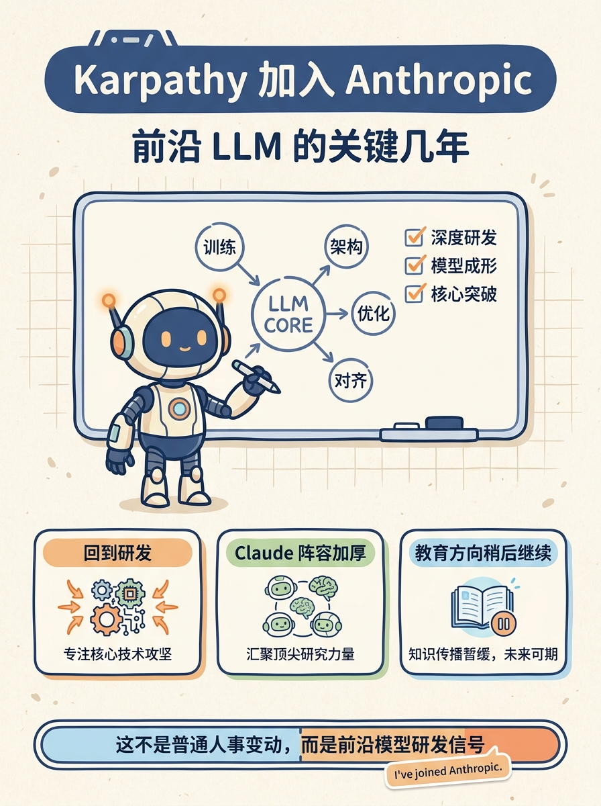

Karpathy 刚发了一条个人更新：他已加入 Anthropic，并判断接下来几年会是前沿 LLM 的关键成形期。对 AI 圈来说，这意味着 Anthropic 的研究阵容继续增强，也意味着 Claude 相关方向可能获得更多一线研发火力。

他同时提到，教育仍是自己长期热情，但会在合适时间再继续推进。

来源：Andrej Karpathy on X（2026-05-19）
https://x.com/karpathy/status/2056753169888334312
