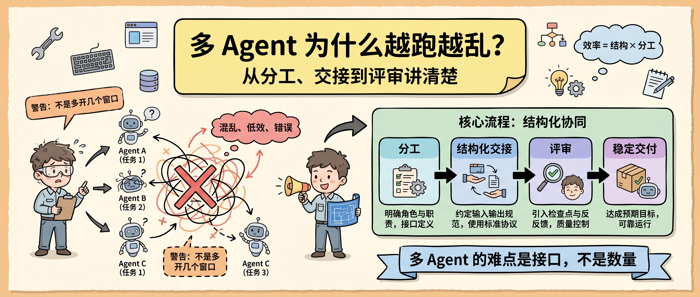
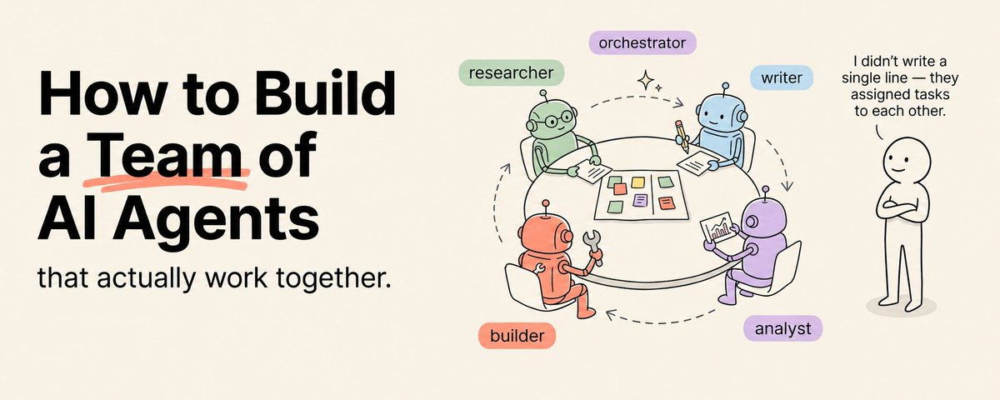
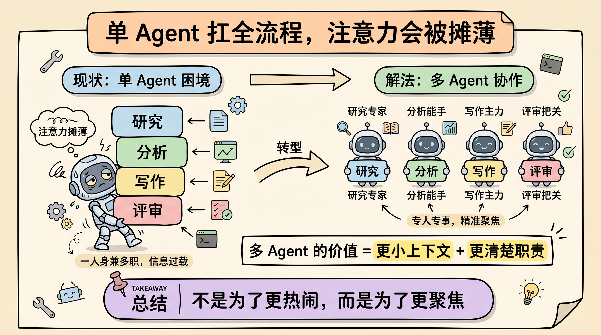
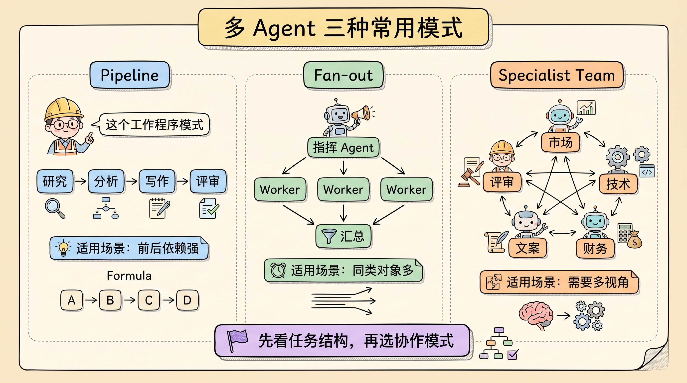
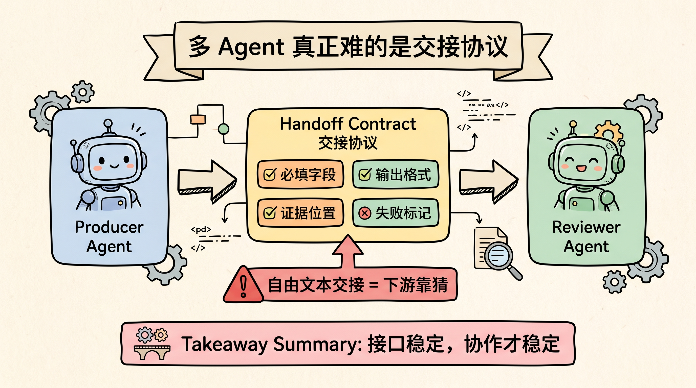
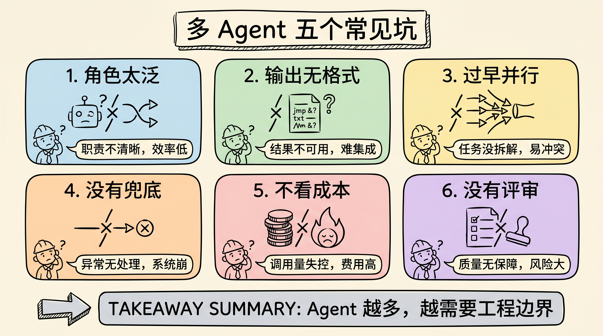

# 多 Agent 为什么越跑越乱？从分工、交接到评审讲清楚

多 Agent 系统最容易让人兴奋，也最容易让人翻车。

一听到“20 个 Agent 并行工作”，很多人第一反应是速度会变快。现实里，Agent 数量一多，最先暴露的往往不是算力问题，而是工程问题：谁负责什么、输出交给谁、格式怎么对齐、失败后谁兜底、最后谁来验收。

所以，多 Agent 不是“多开几个聊天窗口”。它更像搭一个小团队：每个人都要有明确职责、交付格式和评审标准。否则并行越多，混乱越快。



原文来自 Khairallah AL-Awady 的 X 长文，主题是怎么从零搭一个真正能协作的 AI Agent 团队。原文讲了很多产品和趋势，我更关心其中能直接复用的工程部分：**多 Agent 值得用，但前提是先把分工和接口设计清楚。**



## 单 Agent 的问题，不只是慢

单 Agent 像一个能力很强的全栈同事。它能查资料、写代码、做分析、写报告，也能自查一遍。但同一个上下文里塞进太多职责，注意力会被摊薄。

问题不只是速度慢。更大的问题是质量不稳定。

一个 Agent 同时做研究、分析、写作和评审，很容易出现三种情况：前面查得太散，后面分析接不住；写作时把证据压扁；评审时又因为上下文太长而漏掉关键约束。

多 Agent 的价值在这里：把复杂任务拆成更小的专业角色，让每个 Agent 只处理自己最擅长的一段。



Anthropic 在 Claude Code 的 subagents 文档里也强调了类似思路：子 Agent 可以有独立上下文窗口、独立工具权限和专门的 system prompt。这个设计不是为了“看起来更智能”，而是为了让每个 Agent 的上下文更聚焦。

## 三种模式，别混着用

原文把多 Agent 总结成三种模式：Pipeline、Fan-out、Specialist Team。这个分类很实用，但落地时要先判断任务结构。

第一种是 **Pipeline**。Agent 按顺序工作，上一个 Agent 的输出就是下一个 Agent 的输入。

```text
研究 Agent -> 分析 Agent -> 写作 Agent -> 评审 Agent
```

这种模式适合依赖关系强的任务，比如报告生产、代码审查、文档整理。优点是流程清楚，缺点是前面一环错了，后面会一路放大。

第二种是 **Fan-out**。一个指挥 Agent 把任务拆开，多个 Worker 并行跑，最后再汇总。

```text
指挥 Agent
  -> Worker 1：分析文档 A
  -> Worker 2：分析文档 B
  -> Worker 3：分析文档 C
  -> 汇总 Agent：合并结论
```

这种模式适合“同一种操作作用在很多对象上”，比如分析多份日志、多篇论文、多份合同、多组竞品页面。它的收益来自并行，而不是角色差异。

第三种是 **Specialist Team**。多个 Agent 拥有不同专业能力，一起完成一个复杂任务。

比如一次产品发布，可以拆成市场研究、技术可行性、财务测算、文案生成、质量评审。每个 Agent 负责不同视角，最后合成一个完整交付物。



这三种模式不能随便混。任务有明确前后依赖，就用 Pipeline；任务可以按对象切分，就用 Fan-out；任务需要多种专业视角，才用 Specialist Team。

## 真正关键的是交接协议

多 Agent 最容易坏在交接。

一个 Research Agent 输出一大段自然语言，Analysis Agent 却期待结构化 JSON，交接就会失败。一个 Coding Agent 改完代码，只说“done”，Review Agent 没有 diff、测试结果和风险说明，也只能靠猜。

所以，设计多 Agent 时，先别急着写 10 个角色。先定义每个 Agent 的三个东西：

| 设计项 | 要回答的问题 |
|---|---|
| 角色 | 这个 Agent 只负责哪一件事？ |
| 工具 | 它需要哪些工具，不需要哪些工具？ |
| 输出 | 它交付什么格式，给谁使用？ |

输出格式是最容易被低估的部分。它决定 Agent 之间能不能稳定通信。

一个可用的交接协议，至少要包含：

- 必填字段；
- 可选字段；
- 失败时怎么标记；
- 证据或引用放在哪里；
- 下游 Agent 不能解析时怎么处理。



如果没有这个协议，多 Agent 会变成一群会说话但不会协作的模型。

## 先从两个 Agent 开始

原文里有一句建议很值得保留：不要一上来就做 10 个 Agent。

我也会这么做。第一版多 Agent 系统，最好只做两个 Agent：

1. 一个 Producer，负责生成结构化结果；
2. 一个 Reviewer，负责按 rubric 检查结果。

这条链路跑通后，再加第三个 Agent。比如把 Producer 前面拆出 Research Agent，或者在 Reviewer 后面加 Fix Agent。

这样做的好处是，每新增一个 Agent，都能单独验证它有没有增加价值。否则一开始就并行 8 个 Agent，最后出了问题，你很难判断是角色设计错了、交接格式错了、工具权限错了，还是评审标准错了。

多 Agent 系统不是 Agent 越多越高级。Agent 越多，调度、上下文、Token 成本和错误传播都会增加。

## 常见的 5 个坑

第一，把每个 Agent 都写得太泛。

如果 Research Agent 也分析、也写作、也评审，那它只是另一个单 Agent。多 Agent 的意义是专业化，不是复制几个万能助手。

第二，不定义输出格式。

自由文本适合人读，不适合 Agent 交接。只要后面还有下游 Agent，输出就应该尽量结构化。

第三，过早并行。

并行适合相互独立的子任务。如果子任务之间存在强依赖，强行并行只会制造更多合并成本。

第四，没有失败处理。

如果某个 Agent 找不到数据，是让整个流程失败，还是带着缺失标记继续？这个规则要提前写清楚。

第五，不看成本。

多 Agent 往往比单 Agent 更耗 token。每个 Agent 都有自己的上下文、工具输出和推理过程。没有成本监控，多 Agent 很容易从“提效”变成“烧钱”。



## 一张最小设计清单

如果你准备搭第一个多 Agent 工作流，可以直接用这张清单：

| 问题 | 判断标准 |
|---|---|
| 任务是否值得拆？ | 单 Agent 是否因为上下文太大、步骤太多或质量不稳而失败 |
| 哪些步骤能并行？ | 子任务之间是否互不依赖 |
| 每个 Agent 只做什么？ | 能否用一句话说清职责 |
| 输出给谁用？ | 下游 Agent 是否能直接解析 |
| 失败怎么处理？ | 缺数据、工具失败、格式错误是否有兜底 |
| 谁来评审？ | 是否有 rubric 或 Review Agent |
| 成本怎么监控？ | 是否记录每个 Agent 的 token、耗时和失败率 |

这张表比“先设计多少个 Agent”更重要。因为多 Agent 系统的上限，不取决于你开了几个 Agent，而取决于它们能不能稳定交接。

## 结尾：多 Agent 是工程，不是魔法

多 Agent 的方向是对的。Anthropic 的 Managed Agents、Claude Code subagents、以及多 Agent research system，都在说明同一个趋势：复杂任务会越来越多地被拆成多个专门的上下文和执行单元。

但这不代表所有任务都要多 Agent。

我的判断是：只有当任务同时满足两个条件时，才值得拆成多 Agent。第一，任务能自然拆成几个边界清楚的子任务；第二，拆开以后，每个子任务的输出能被下游稳定使用。

否则，多 Agent 只是把一个复杂 prompt，拆成多个更难调试的复杂 prompt。

先从两个 Agent 开始。一个负责生成，一个负责评审。把交接协议、失败处理和成本监控跑通，再谈并行和团队。

关注「蒸馏小余」，回复 `MULTI`，我会把这篇文章里的多 Agent 设计清单、交接协议模板和 Review Agent rubric 整理成可复制版本。下一篇继续拆：Agent 上下文压缩为什么不是简单总结聊天记录。

## 参考来源

- Khairallah AL-Awady, [How to Build a Team of AI Agents That Actually Work Together](https://x.com/eng_khairallah1/status/2055215784092401966)
- Anthropic, [Claude Managed Agents](https://www.anthropic.com/engineering/managed-agents)
- Anthropic Engineering, [How we built our multi-agent research system](https://www.anthropic.com/engineering/built-multi-agent-research-system)
- Anthropic Docs, [Subagents](https://docs.anthropic.com/en/docs/claude-code/sub-agents)
