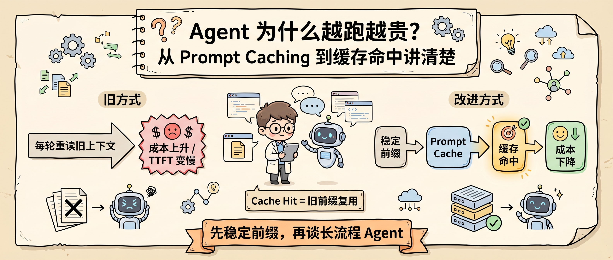
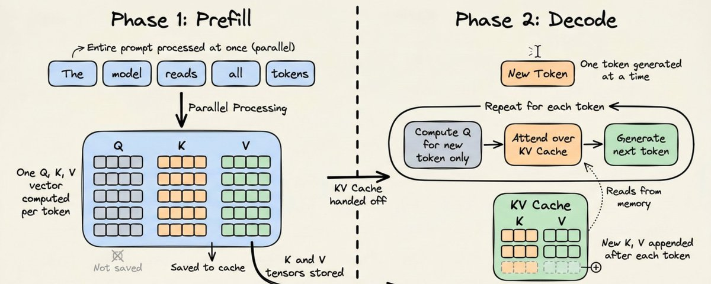
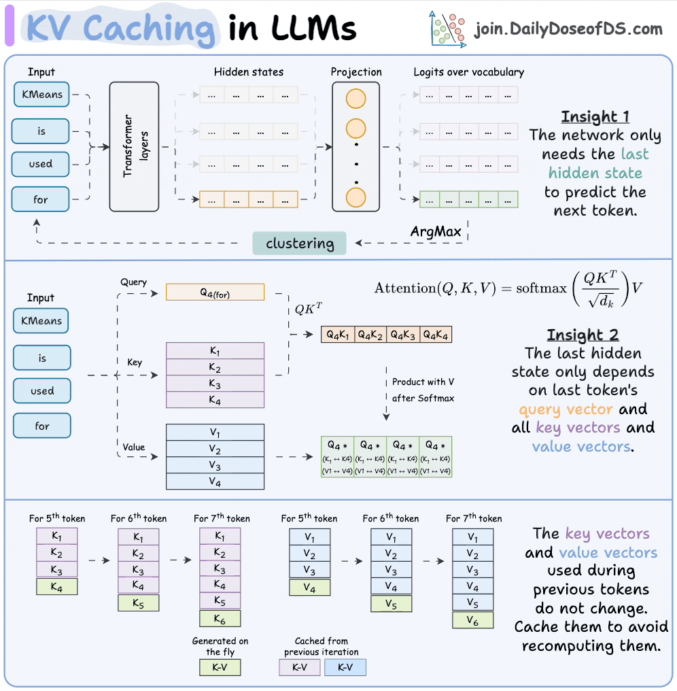
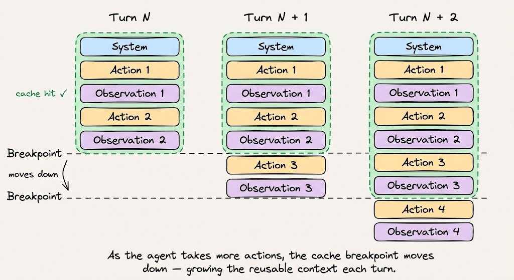
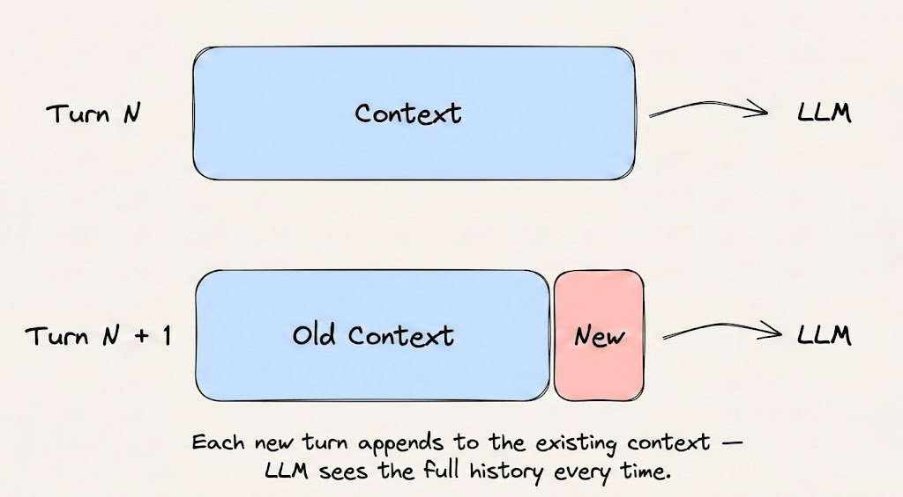
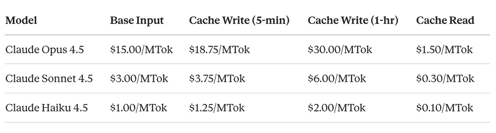
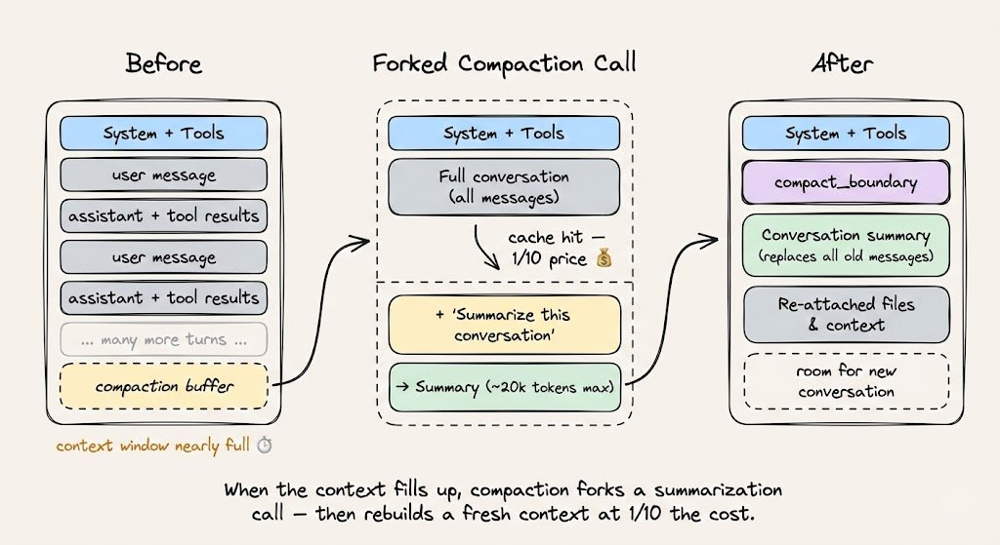
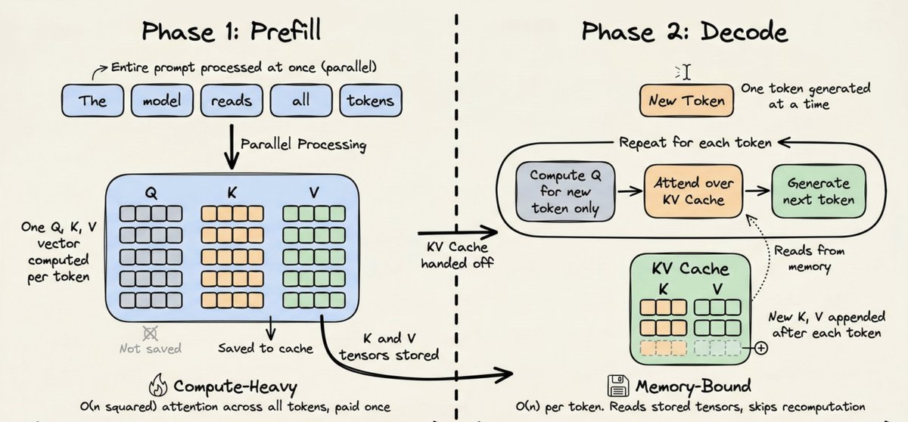
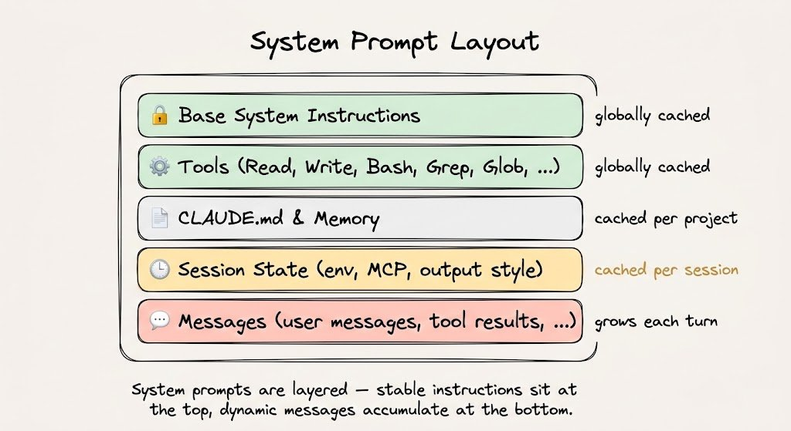

# Agent 为什么越跑越贵？从 Prompt Caching 到缓存命中讲清楚

Agent 跑久以后变贵，很多时候不是因为它生成了太多新内容，而是因为它每走一步，都在重新读取旧上下文。

系统提示词、工具定义、项目规则、历史计划、代码库说明，这些内容第一轮读有价值。但到了第 10 轮、第 30 轮、第 50 轮，如果每次都重新 prefill，一大块成本其实是在重复理解已经理解过的东西。

Prompt Caching 要解决的就是这笔“上下文税”：让稳定前缀只被完整处理一次，后面的请求尽量从缓存里读。



原文来自 Akshay 的 X 长文，案例讲的是 Claude 如何做到 92% cache hit-rate。这个数字不要当成所有系统的默认收益，它更像一个方向：**缓存命中率高的 Agent，不是靠一个开关，而是靠一套稳定的上下文结构。**



## Agent 的上下文，先拆成两段

要理解 Prompt Caching，先别急着看价格表。先把一次 Agent 请求拆成两段。

第一段是 **稳定前缀**：

- system instructions；
- tool definitions；
- 项目上下文；
- 行为规则和输出规范。

第二段是 **动态尾巴**：

- 用户新消息；
- 工具调用结果；
- terminal output；
- 当前轮新增观察。

OpenAI 的 Prompt Caching 文档强调，缓存命中依赖 exact prefix match。静态内容应该放在 prompt 前面，动态内容应该放在后面。Anthropic 文档里也提到，缓存前缀按 `tools`、`system`、`messages` 的顺序形成。



这就是 Agent prompt 的第一条工程规则：

**上层越稳定，缓存越容易命中；尾巴越克制，长会话越不容易失控。**

## 缓存的不是答案，而是 Prefill 的中间状态

Prompt Caching 很容易被误解成“保存上一次回答”。这不准确。

模型处理请求时，通常先走 Prefill，再走 Decode。Prefill 负责读完整输入，建立后续生成需要的内部状态；Decode 负责一个 token 一个 token 往后生成。

缓存真正复用的是稳定前缀在 Prefill 阶段算出来的中间状态，尤其是 attention 里的 Key/Value 张量。OpenAI 文档也把 key/value tensors 描述为模型 attention layers 在 prefill 期间产生的中间表示。



所以，缓存命中以后，模型不是“不思考了”。它仍然会基于新问题生成新答案，只是不必把完全相同的前缀再从头处理一遍。

这也是为什么 Prompt Caching 对长流程 Agent 特别关键。普通聊天里，稳定前缀可能不长；但一个 Coding Agent 的系统规则、工具 schema、项目说明，很容易上万 token。



## 这笔账为什么会很大？

原文给了一个很直观的例子：如果稳定前缀有 20,000 token，一个 Agent 会话跑 50 轮，那就是 100 万 token 的重复前缀处理。

第一次处理这 20,000 token 是必要成本。问题是后面 49 次如果都当成新内容重算，就没有太多信息增量。

Anthropic 的定价规则能看出缓存的经济意义：5 分钟缓存写入是基础输入价格的 1.25 倍，1 小时缓存写入是 2 倍，缓存读取是基础输入价格的 0.1 倍。也就是说，第一次写入稍贵，后面读缓存便宜很多。



这笔账能不能成立，取决于一个指标：cache hit-rate。

如果命中率高，缓存读会快速摊薄第一次写入成本。如果命中率低，每次都在写新缓存，Prompt Caching 反而不会带来想象中的收益。

## 为什么 Claude Code 适合吃到缓存收益？

原文用 Claude Code 做例子，是因为 coding agent 的结构天然适合 Prompt Caching。

会话开始时，Claude Code 会加载系统提示词、工具定义和项目里的 `CLAUDE.md`。这部分很贵，但稳定。

后面的用户指令、文件读取、grep 结果、测试输出，会不断追加到动态尾巴。只要前面的系统层和工具层没有变化，稳定前缀就有机会持续命中缓存。



这也是为什么长会话里要控制工具输出。Explore 阶段拿到的大量原始结果，不应该原封不动塞给后续 Plan 阶段。更好的做法是先压缩成关键观察，再交给下一个阶段。

否则，缓存虽然命中了前缀，但动态尾巴会越来越胖，TTFT、上下文占用和成本仍然会继续上升。

## 缓存为什么这么容易被打碎？

Prompt Caching 最反直觉的地方，是它通常依赖“完全一样的前缀”。

`1 + 2 = 3` 和 `2 + 1 = 3` 语义差不多，但 token 顺序不同，哈希就不同。对缓存系统来说，这不是同一个前缀。

所以，下面这些操作都可能让缓存失效：

- 每轮往 system prompt 里塞时间戳；
- 会话中途增删工具；
- 工具 schema 序列化顺序不稳定；
- 中途切模型；
- 把临时状态回写到稳定前缀；
- 检索材料顺序每轮漂移。



这也是我更愿意把 Prompt Caching 看成“架构纪律”，而不是“省钱功能”。

缓存不是你想命中就命中。你要先让 prompt 结构变得可命中。

## 自己做 Agent，可以直接这样排

如果你在做自己的 Agent，我建议按这个顺序组织上下文：

```text
1. 工具定义
2. 系统规则
3. 项目上下文
4. 当前任务状态
5. 用户最新消息
6. 工具输出和观察
```

不同平台的具体顺序可能不同，但原则一致：稳定的放前面，变化的放后面；长期规则放前面，短期状态追加在后面。



这里有一条很实用的边界：

**不要为了更新状态去改系统提示词。**

比如“刚刚测试失败了”“用户改了需求”“这次要用另一种方案”，这些都很重要，但它们应该进入后续消息或任务状态摘要，而不是回头改稳定前缀。

## 监控别只看总 token

只看总 token，不足以判断 Prompt Caching 有没有起作用。

更应该看三类字段：

| 指标 | 含义 |
|---|---|
| cache creation tokens | 写入缓存的 token |
| cache read tokens | 从缓存读取的 token |
| uncached input tokens | 每轮仍然完整处理的 token |

OpenAI 在响应里提供 `cached_tokens` 字段；Anthropic 则会拆出 `cache_creation_input_tokens`、`cache_read_input_tokens` 和普通 `input_tokens`。

我会把缓存效率当成 Agent 监控的一部分：

```text
缓存效率 ≈ cache_read_tokens / 输入相关 token
```

这个公式不追求严密，只用于观察趋势。如果会话跑了很多轮，cache read 仍然很低，说明稳定前缀没有稳定；如果 uncached input 一直涨，说明动态尾巴失控。

## 结尾：先稳定前缀，再谈长流程 Agent

Prompt Caching 不是银弹。短 prompt 的一次性问答收益有限；每轮上下文都完全不同的任务，也很难吃到缓存红利。

但对长流程 Agent 来说，它是基础能力。

因为 Agent 成本高，不只是模型贵，也不是只因为输出多。很多时候，贵在每轮都重新理解系统规则、工具定义和项目上下文。

我会用三条规则判断一个 Agent 是否缓存友好：

- 稳定前缀是否足够长，而且真的稳定；
- 动态内容是否只追加在后面，不污染前缀；
- 监控里是否能看到 cache read tokens 持续上升。

这三条做不到，Prompt Caching 就只是账单上的一个字段。做到了，它才会变成 Agent 长流程的地基。

关注「蒸馏小余」，回复 `CACHE`，我会把这篇文章里的 Prompt Caching 上下文排布模板、缓存破坏清单和监控指标整理成可复制版本。下一篇继续拆：Agent 上下文压缩，为什么不是简单总结聊天记录。

## 参考来源

- Akshay, [Prompt caching, clearly explained](https://x.com/akshay_pachaar/status/2031021906254766128)
- Anthropic, [Prompt caching](https://docs.anthropic.com/en/docs/build-with-claude/prompt-caching)
- OpenAI, [Prompt caching](https://platform.openai.com/docs/guides/prompt-caching)
- Daily Dose of Data Science, [KV Caching in LLMs Explained Visually](https://www.dailydoseofds.com/p/kv-caching-in-llms-explained-visually/)
- Manus, [Context Engineering for AI Agents](https://manus.im/blog/Context-Engineering-for-AI-Agents-Lessons-from-Building-Manus)
