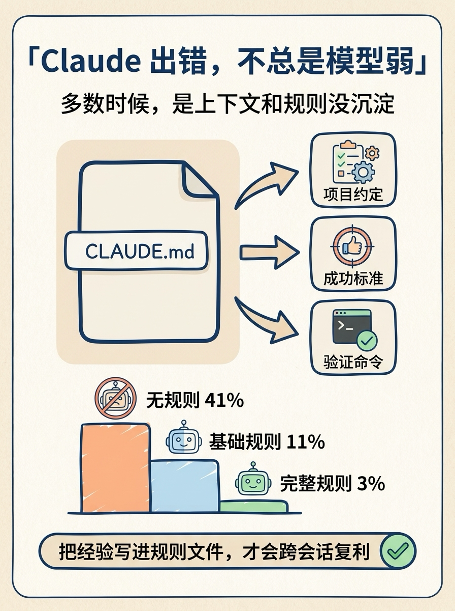
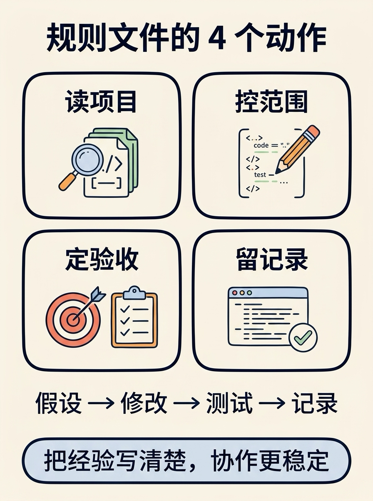

我更愿意把这条推的核心，改写成一句工程判断：

**Agent 出错，很多时候不是模型突然变笨，而是你没有把项目经验沉淀成可执行规则。**

原帖提到一组很直观的对比：没有规则文件时，出错更多；加入基础规则后，错误明显下降；规则完整后，继续下降。具体数字可以先当作经验案例看，不必当成通用结论。

真正有价值的是这件事背后的方法：

1. 先把项目约定写清楚，别让 Agent 猜。
2. 每次修改都要有成功标准，别让它“感觉完成了”。
3. 读代码再写代码，避免重复造函数。
4. checkpoint 要前置，失败要暴露，不要静默跳过。

我的建议很简单：别把规则文件当提示词仓库，把它当团队的 AI 工程操作手册。

如果只能先写 5 条，我会写：

- 先读哪些文件，再动手。
- 什么范围绝对不要顺手改。
- 修改后必须跑哪些测试。
- 遇到冲突时必须停下来说明。
- 失败、不确定、没验证时不能说完成。

这类规则短期看是约束，长期看是复利。Agent 真正需要的不是更多鼓励，而是更清楚的边界、证据和验收标准。

来源：huangserva on X（2026-05-19）
