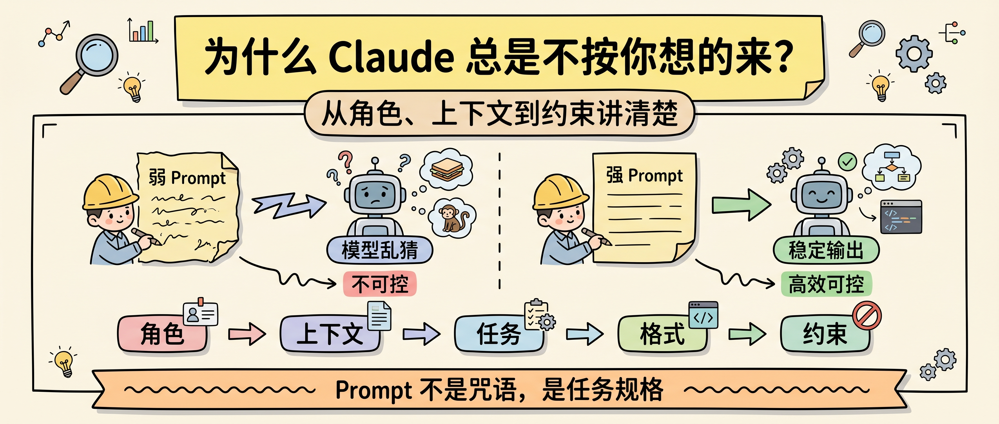
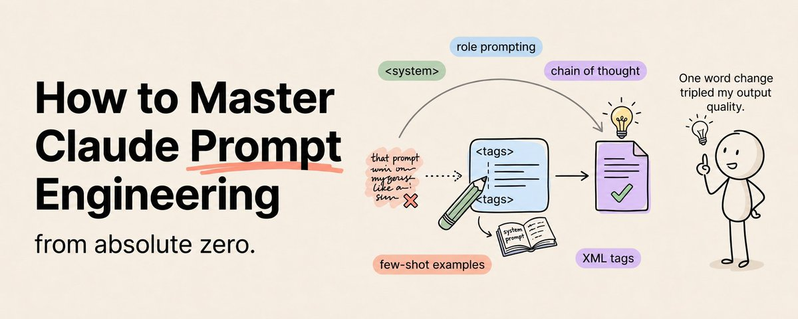
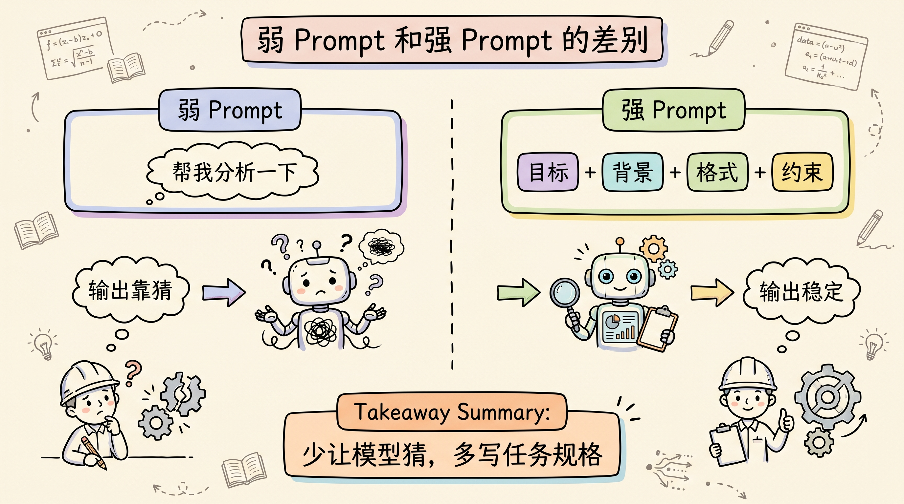
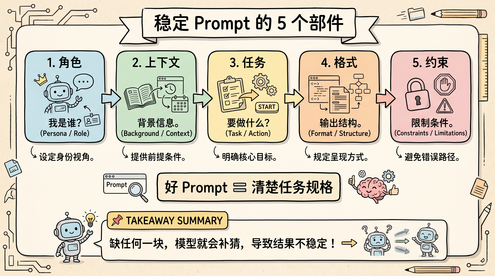
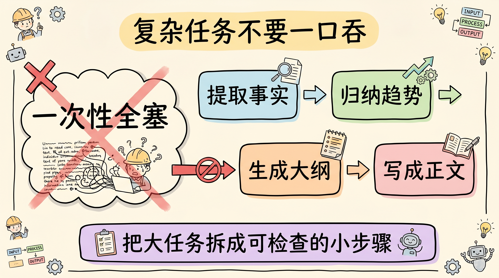

# 为什么 Claude 总是不按你想的来？从角色、上下文到约束讲清楚

Claude 输出不稳定，很多时候不是模型不行，而是 prompt 没有把任务说明白。

开发者最常见的误区，是把 prompt 当成一句愿望：帮我分析一下、写个方案、优化这段文案、看下这个问题。Claude 会回答，但它只能按自己猜到的目标回答。你没有定义角色、上下文、输出格式和不要做什么，它就会用默认的“通用助手模式”补全空白。

Prompt Engineering 不是咒语，也不是堆模板。它更像写一份任务规格：谁来做、基于什么信息、产出什么、按什么标准验收、哪些风格和错误要避免。



原文来自 Khairallah AL-Awady 的 X 长文，讲 Claude Prompt Engineering 从零到进阶。原文信息很多，我把它压成一条更适合直接使用的主线：**先把 prompt 写成任务规格，再谈技巧。**



## 最常见的问题：让模型自己猜

弱 prompt 通常长这样：

```text
帮我写一篇关于 AI 趋势的文章。
```

这句话不是不能用，而是留给模型猜的地方太多。写给谁？多长？语气是什么？要不要数据？要不要案例？要不要行动建议？哪些套话不能出现？

原文给的改法很典型：把目标、受众、语气、长度、结构、例子和禁止项都写清楚。模型没变，订阅没变，差异只来自任务说明更清楚。

Anthropic 官方的 prompt engineering 文档也强调类似原则：Claude 不是读心工具，越清楚直接地说明目标、上下文和格式，输出越容易稳定。



## 一个稳定 prompt，至少有 5 个部件

我建议把 Claude 的重要任务都拆成 5 个部件：

| 部件 | 要写清楚什么 |
|---|---|
| 角色 | Claude 以什么专业视角工作 |
| 上下文 | 它需要知道哪些背景、材料和目标 |
| 任务 | 它到底要完成什么动作 |
| 格式 | 输出是表格、清单、报告、JSON 还是邮件 |
| 约束 | 不要做什么、不要用什么风格、边界在哪里 |

这 5 个部件不是为了让 prompt 看起来专业，而是减少模型猜测。

比如“分析这份合同”很弱。更稳的写法是：

```text
你是一名有 10 年经验的 SaaS 商务合同审查顾问。
请基于下面合同，找出对供应商最不利的 5 个条款。
每个条款输出：风险点、为什么重要、建议修改语言。
用表格输出。
不要泛泛而谈，不要输出法律免责声明。
```

这类 prompt 的好处是，Claude 不需要先猜“分析”的意思。它只需要执行规格。



## 例子比抽象描述更好用

原文里有个判断值得保留：一个例子，通常胜过十段抽象说明。

如果你想要某种格式，不要只说“结构化一点”。直接给 Claude 一个样例：

```text
请按这个格式输出：

趋势：
发生了什么：
为什么重要：
谁在做：
下一步观察：

现在基于下面材料，再写 3 个同样格式的趋势。
```

模型很擅长 pattern matching。你给它一个具体样例，它会比读一堆抽象描述更容易对齐。

这也是 Anthropic 文档里 multi-shot prompting 的思路：用少量高质量示例，让模型学习你想要的输出形态。

## 复杂任务不要一口吞

很多人喜欢把复杂任务一次性塞给 Claude：

```text
帮我研究这个市场，分析趋势，写一份完整报告。
```

这种写法看起来省事，实际容易让模型在一个回答里同时做检索、判断、组织结构和写作。步骤越多，输出越容易变浅。

更稳的方式是链式推进：

1. 先让 Claude 提取关键事实；
2. 再让它归纳趋势；
3. 再让它生成大纲；
4. 最后基于大纲写正文。

每一步都把前一步的结果变成更干净的输入。质量不是靠一次 prompt 变长，而是靠中间结果不断变清楚。



## 负面约束能快速去掉 AI 味

很多 AI 味不是因为模型不会写，而是因为你没有告诉它什么不要写。

原文提到 negative constraints，这个方法很实用。比如：

```text
不要使用“在当今快速变化的时代”。
不要使用“值得注意的是”。
不要堆砌“赋能、生态、范式、协同”。
不要添加空泛总结。
不要用被动语态。
```

这些约束看起来琐碎，但对输出风格影响很大。因为它们直接切掉了模型最容易滑向的默认表达。

写作类任务尤其需要负面约束。你不说“不要什么”，Claude 很可能会用最安全、最中庸、最像 AI 的方式完成任务。

## 评审循环比一次写完更可靠

重要任务不要只让 Claude 输出一次。

可以让它先产出，再按明确标准自评：

```text
写完后，请按准确性、清晰度、对目标读者的帮助程度各打 1-10 分。
如果任何一项低于 8 分，请直接改到 8 分以上。
最后只输出改进后的版本。
```

这类 self-evaluation loop 的关键，不是让模型“自己夸自己”，而是把验收标准提前写进去。标准越具体，改进越可控。

如果是代码、方案、报告这类高风险任务，我会再加一个独立评审步骤：让 Claude 站在挑错者角度检查假设、遗漏和边界。

## 可复制的 Prompt 模板

下面这个模板，可以直接作为重要任务的起点：

```text
你是：[角色和经验]

背景：
[项目、受众、目标、限制条件]

任务：
[具体要完成什么，不要写“分析一下”这种模糊动作]

输入材料：
[文档、数据、代码、链接或上下文]

输出格式：
[表格 / 清单 / JSON / 报告结构 / 邮件格式]

质量标准：
[什么算好，什么算不合格]

约束：
[不要使用哪些表达，不要遗漏哪些边界，不要做哪些假设]
```

这个模板不神秘。它只是逼你先想清楚任务规格。

Prompt 写得好的人，不是更会写神秘指令，而是更清楚自己要什么。

## 结尾：Prompt 是思考的外化

Prompt Engineering 的核心不是技巧清单，而是清晰思考。

角色、上下文、任务、格式、约束，这 5 个部件解决的是同一个问题：减少模型猜测。

例子、链式 prompt、负面约束、自评循环，解决的是第二个问题：把输出从“能用”推到“稳定可复用”。

我会用一个简单标准判断 prompt 是否合格：

- 一个新人读完，是否知道该怎么执行？
- 输出格式是否能直接被人或下游系统使用？
- 失败标准是否明确，还是只能靠感觉判断好坏？

如果这三个问题答不清，Claude 输出不稳定就不奇怪。模型不是读心工具，prompt 也不是许愿池。好的 prompt，本质上是一份可执行的任务说明书。

关注「蒸馏小余」，回复 `PROMPT`，我会把这篇文章里的 5 部件 Prompt 模板、负面约束清单和自评 rubric 整理成可复制版本。下一篇继续拆：为什么 Agent 上下文压缩不是简单总结聊天记录。

## 参考来源

- Khairallah AL-Awady, [How to Master Claude Prompt Engineering From Zero](https://x.com/eng_khairallah1/status/2057030983044710442)
- Anthropic, [Prompt engineering overview](https://docs.anthropic.com/en/docs/build-with-claude/prompt-engineering/overview)
- Anthropic, [Be clear and direct](https://docs.anthropic.com/en/docs/build-with-claude/prompt-engineering/be-clear-and-direct)
- Anthropic, [Use examples](https://docs.anthropic.com/en/docs/build-with-claude/prompt-engineering/multishot-prompting)
- Anthropic, [Use XML tags](https://docs.anthropic.com/en/docs/build-with-claude/prompt-engineering/use-xml-tags)
