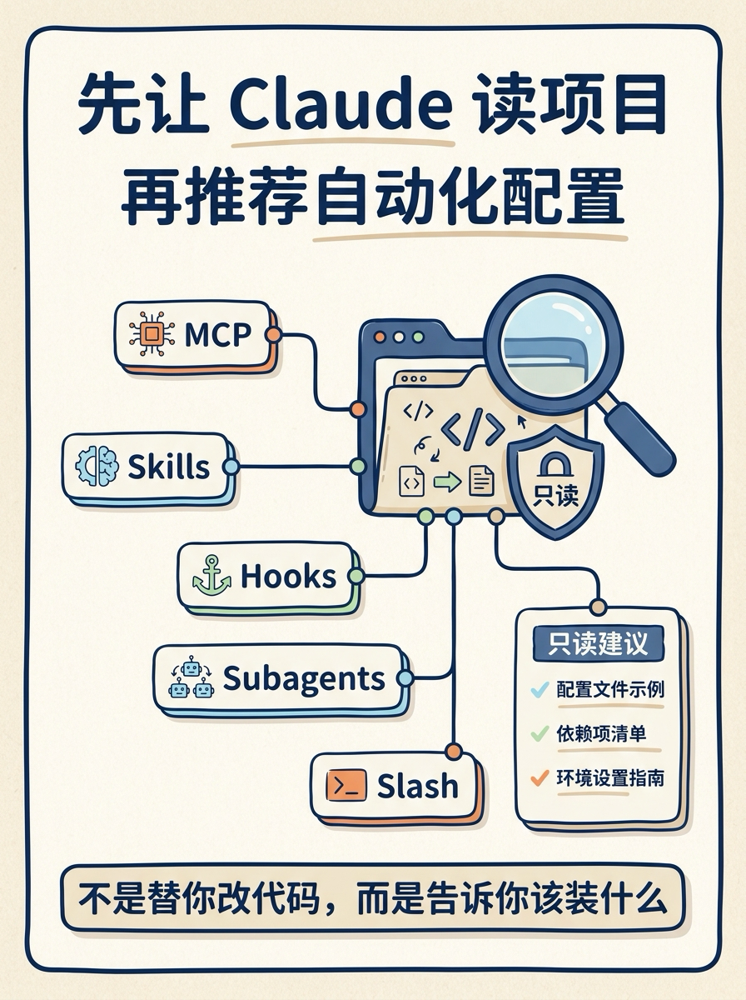

Claude Code Setup 这个插件，适合解决一个很具体的问题：

**你知道 Claude Code 可以配很多自动化，但不知道当前项目最该先配哪几个。**

官方页面给它的定位很直接：分析代码库，然后推荐适合这个项目的 Claude Code 自动化配置。

它会看项目结构、依赖和代码模式，再把建议分到 5 类：

- MCP servers
- Skills
- Hooks
- Subagents
- Slash commands

我觉得重点不是“又多了一个插件”，而是这个工作流：

**先让工具读项目，再让它推荐配置。**

它不是上来就改文件，而是只读分析，然后给出每类最值得装的 1-2 个建议。比如 React 项目可能优先推荐 Playwright MCP；检测到认证相关代码时，可能建议安全审查类 subagent。

实际用法也很朴素：在 Claude Code 里问它：

“recommend automations for this project”

或者：

“what hooks should I use?”

小余判断：这类插件最适合用在新项目接手、老项目补 AI 工程化、团队统一 Claude Code 配置时。别一开始就追求全套，先让它给出当前仓库最值钱的几个自动化建议。

来源：Anthropic Claude Code Setup 插件页（2026-05-21 访问）
https://claude.com/plugins/claude-code-setup
