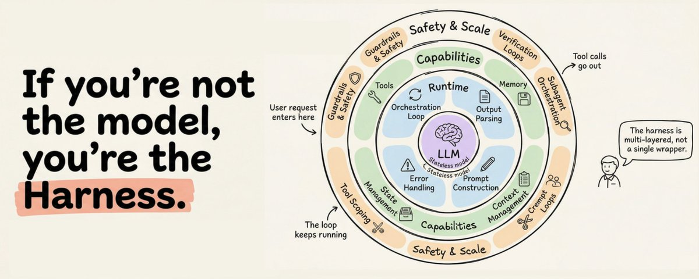

# 别再怪模型了，Agent 真正拼的是 Harness

先说结论：你做的不是“一个模型”，而是一整套让模型能长期干活的系统。模型负责思考，harness 负责把思考变成稳定的动作。

原帖这篇 X article 的观点很直接：真正拉开 Agent 差距的，不是聊天框里的提示词，而是 orchestration loop、tools、memory、context management、state、error handling、guardrails 这些外围系统。把这层搭好，同一个模型也能从演示级变成可交付。



## Harness 到底是什么

可以把它理解成 Agent 的“操作系统”。

- 模型是脑子
- tools 是手
- memory 是短期和长期记忆
- context management 是桌面清理和压缩
- verification 是自检
- guardrails 是权限闸门
- orchestration loop 是主循环

原帖给出的定义很清楚：harness 不是 prompt 的外壳，而是完整的软件基础设施。你看到的 agent 行为，是这套系统和模型共同“演出来”的结果。

## 为什么很多 Agent 一上生产就露馅

Demo 里能跑，不代表长期任务能跑。

常见问题基本都在 harness 层：

- 模型忘了三步前做过什么
- 工具调用成功了，但结果没被正确接回上下文
- 历史记录越堆越大，真正有用的信息反而被淹没
- 出错后没有重试、回滚和人工介入路径
- 权限和确认逻辑写在 prompt 里，结果只是“建议”，不是“约束”

这也是为什么同一个模型，换一套更好的外围系统，表现会差很多。不是模型突然变聪明了，而是它终于有了能持续工作的结构。

## 做 Agent，先看这 5 层

如果你要自己搭一个 Agent，我建议先按这五层拆：

1. `Orchestration loop`
   负责不断执行“调用模型 - 解析输出 - 执行工具 - 回写结果 - 继续循环”。

2. `Tools`
   负责把能力暴露给模型，但一定要做 schema 校验、参数校验、沙箱执行和结果格式化。

3. `Memory + Context`
   负责决定什么该长期保留，什么只该短期存在。不要把所有工具输出原样塞回去。

4. `Verification + Guardrails`
   负责测试、校验、权限、拒绝高风险动作。这个层最好和模型判断分开。

5. `State + Recovery`
   负责 checkpoint、恢复、重试、回滚。长任务没有这层，失败只是时间问题。

```text
system prompt
  -> tools
  -> memory
  -> conversation history
  -> current user message
```

这个顺序的意义很简单：越稳定的内容越靠前，越动态的内容越靠后。前缀稳定，缓存和复用才有意义；尾巴克制，长会话才不会一路膨胀。

## 我会怎么判断一个 harness 好不好

不是看它“功能多不多”，而是看它有没有这几个特征：

- 能不能把失败控制在局部，而不是一错全错
- 能不能把工具结果压缩成高信号上下文
- 能不能在不改模型的情况下继续提速
- 能不能把权限、确认和执行分开
- 能不能让后续会话快速接上前一次工作

如果这几点做不到，说明你做的更像“能聊天的脚本”，还不是一个真正的 Agent 系统。

## 什么时候该加厚，什么时候该变薄

原帖还有一个很重要的判断：harness 不是越厚越好。

- 模型还弱、任务还复杂时，需要更厚的 harness 来兜底
- 模型能力上来后，很多重复逻辑应该被删掉
- 真正好的 harness，是能随着模型变强而逐步变薄的

这点很关键。很多团队会习惯性地往 harness 里不断加规则、加分支、加例外，最后把系统做成一坨难维护的流程机。结果不是更稳，而是更脆。

## 结尾

如果你在做 Agent，别先问“哪个模型最强”。先问：

- 这套系统有没有稳定前缀
- 工具输出有没有被正确压缩
- 失败后能不能恢复
- 权限是不是和模型决策分离
- 这个 harness 能不能在模型升级后自动受益

答案如果是否定的，问题大概率不在模型，而在 harness。

来源：Akshay 的 X article [The Anatomy of an Agent Harness](https://x.com/akshay_pachaar/status/2041146899319971922)

关注「蒸馏小余」，后面我会继续拆 Agent 的上下文管理、验证循环和多 agent 编排。
