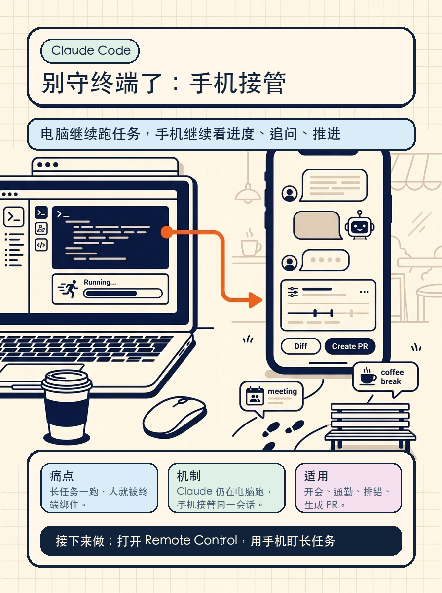

这次 Claude Code 的 Remote Control，真正改变的是工作流：任务还在你的电脑上跑，但你不用一直守着终端。

内容大纲：

1. 痛点：长任务一跑起来，人就被终端绑住了。
2. 新能力：电脑端发起 Claude Code 任务，手机端继续看进度、追问、推进。
3. 核心机制：Claude 仍在本机运行，手机只是接管同一个会话。
4. 适用场景：开会、通勤、离开工位、长时间排错、生成 PR。
5. 注意事项：电脑要保持在线，别睡眠，任务才会继续跑。

接下来做：打开 Remote Control，拿一个长任务试试手机接管。

来源：Claude 官方 X（2026-05-25 访问）
