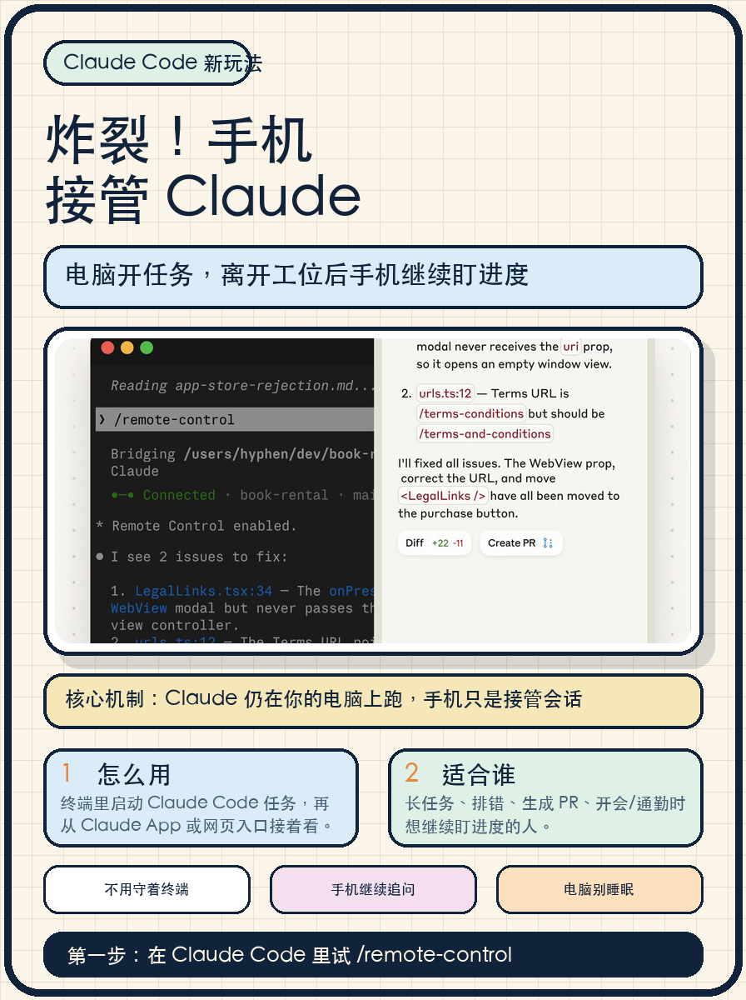

这次 Claude Code 的 Remote Control，重点不是“手机写代码”，而是“电脑继续跑，手机接管会话”。

内容大纲：

1. 痛点：长任务一跑起来，人就被终端绑住了。
2. 新能力：先在电脑终端发起 Claude Code 任务，再用手机继续查看、追问、推进。
3. 核心机制：Claude 仍在你的机器上运行，手机只是控制同一个 session。
4. 适用场景：开会、通勤、离开工位、长时间排错、等待生成 PR。
5. 注意事项：电脑要保持在线和不睡眠，否则会话也跑不动。

第一步就试：在 Claude Code 里用 Remote Control，把一个长任务交出去，然后用手机继续盯结果。

来源：Claude 官方 X（2026-05-25 访问）
