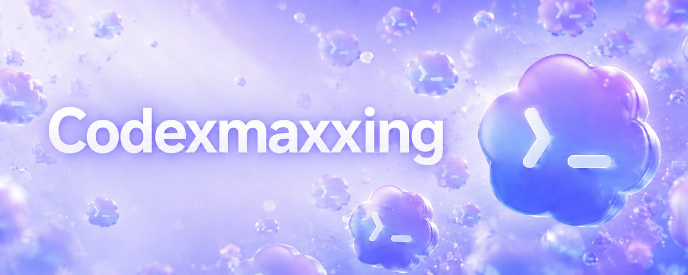
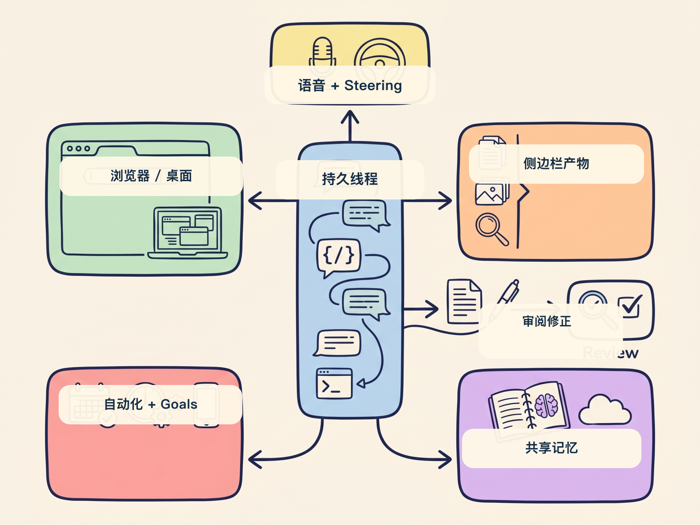

# 别只让 Codex 写代码：把它用成工作台

大多数人第一次用 Coding Agent，默认会把它当成“会改代码的助手”：看仓库、写 diff、跑测试、开 PR。

这当然还是 Codex 的主场。但 Jason 这篇 X article 提醒了一件更大的事：电脑上的很多工作，本来就是由代码、网页、API、文档、消息和自动化串起来的。只要这些表面能被 Codex 触达，Codex 就不只是写代码工具，而会变成一个处理电脑工作的 Agent 工作台。


原文来自 Jason（@jxnlco）的 X article《Getting the most out of Codex》。我的理解是：这篇文章不是在讲“怎么多用几个 Codex 功能”，而是在讲一种新的工作方式。

以前是一问一答。现在是一个线程持续保留上下文，能打开浏览器，能碰桌面应用，能接 MCP 和连接器，能定时回来继续干活，还能把文档、表格、网页和 deck 放在侧边栏里一起审。



## 先把 Codex 当成一个“持久线程”

短聊天最大的问题，是每次都要重新解释背景。

Jason 把 durable threads 放在第一个讲，我觉得这是整篇最重要的入口。所谓持久线程，不是把聊天记录存起来这么简单，而是让一个工作流长期留在同一个上下文里。

适合 pin 起来的线程可以是：

- Chief of Staff 线程；
- 发布管理线程；
- 文档 review 线程；
- 外部信息监控线程；
- 某个长期项目的跟进线程。

这些线程的价值在于少重复上下文。你不需要每次重新讲项目是谁负责、上次卡在哪里、哪些规则不能碰、哪些文件是入口。

如果你只把 Codex 当成一次性问答工具，很多能力都用不起来。先有持久线程，后面的浏览器、自动化、记忆和侧边栏才有落点。

## 语音、Steering 和 Queuing，是人还在回路里

Codex 不是越自动越好。很多任务在一开始并不清楚，用户也不一定能把需求一次写完整。

语音输入的价值就在这里。粗糙想法、会议后的碎片、临时冒出来的判断，用说的往往比打字更自然。比如：

```text
我记得 Slack 里 Ben 提过这个问题。
我不确定是哪条消息。
你去找一下，然后把结论整理给我。
```

这类输入看起来不精确，但对一个能搜索、能补上下文、能回报结果的 Agent 来说已经够了。

Steering 和 Queuing 则解决另一个问题：任务跑起来以后，人怎么介入。

Steering 是纠偏。比如 Codex 正在 review 一个网页，你看到侧边栏里的页面，直接说“这个间距太大”“这个按钮文案不对”，它就应该立刻调整方向。

Queuing 是排队。比如“当前任务做完后，把预览链接发给 Slack 里的 reviewer”。它不打断当前步骤，只把下一步排进去。

这个区别很重要。Steering 改现在，Queuing 改下一步。人仍然在回路里，但不必一直盯着终端等它停下来。

## 真正的变化，是 Codex 的触手伸出了仓库

只会读写 repo 的 Agent，天然会被限制在代码工作里。

Jason 提到的 `$browser`、`@chrome`、`@computer`、MCP servers、connectors，本质上是在扩展 Codex 的行动半径。



我会这样理解它们的分工：

- `$browser`：适合在 Codex 侧边栏里检查网页、标注页面、做 UI review；
- `@chrome`：适合依赖你已登录状态的浏览器任务；
- `@computer`：适合只能通过桌面 GUI 操作的任务；
- MCP 和连接器：把 Slack、Gmail、Calendar、API 和内部系统接进来；
- Skills：把反复出现的流程包装成可复用能力。

这意味着 Codex 的工作不再停在“改代码”。它可以从 Slack 里发现问题，到仓库里修改实现，再打开网页检查结果，最后把 artifact 放回可 review 的地方。

## 自动化和 Goals：一个管周期，一个管终点

我会把 Automations 和 Goals 分开看。

Automations 适合周期性唤醒。比如每 30 分钟检查一次 Slack 和 Gmail，找出需要你处理的消息，先研究背景，再草拟回复，但不要直接发送。

Goals 适合有明确终点的长任务。弱目标是“按这个 Markdown 实现计划”。强目标是“迁移完成后，新实现必须通过这组单元测试”。

这两个能力都不能只靠一句大话驱动。自动化需要边界，Goals 需要 verifier。

好 verifier 可以是：

- 测试套件；
- benchmark；
- bug 复现脚本；
- 验证矩阵；
- 必须持续通过的端到端流程。

没有 verifier 的目标，本质上只是愿望。Agent 会很努力，但你很难判断它是不是离完成更近。

## 侧边栏和共享记忆，让工作结果留下来

侧边栏的意义，是把产物留在对话旁边。

代码只是其中一种产物。更常见的还有 Markdown、表格、PDF、网页、slide deck、数据应用、动画预览。你可以一边看产物，一边让 Codex 修，不需要在编辑器、浏览器、文件夹和聊天窗口之间来回搬运。

共享记忆解决的是另一个问题：重要上下文不能只活在某条聊天记录里。

Jason 提到一种很实用的模式：用 Obsidian vault 或普通文件夹承载长期工作记忆。比如：

```text
vault/
├── TODO.md
├── people/
├── projects/
├── agent/
└── notes/
```

再用 `AGENTS.md` 告诉 Codex：哪些信息要沉淀，TODO 放哪里，项目决策怎么记录，什么时候不要制造笔记噪音。

我的建议是，不要一上来设计复杂知识库。先把三类信息写清楚：

- 人：谁负责什么，沟通偏好是什么；
- 项目：目标、阻塞、owner、时间点；
- 决策：为什么这么做，哪些坑已经踩过。

这些信息比聊天 transcript 更可控，也更容易被下一个线程接住。

## 我会怎么用这套工作流

如果是个人开发者，我会先建三个固定线程：

- `Daily Ops`：每天看消息、排优先级、草拟回复；
- `Release`：盯 PR、测试、文档和发布检查；
- `Writing`：收集素材、生成文章草稿、维护选题池。

如果是团队，我会先把 Codex 放在低风险闭环里：

- 文档 review；
- UI 页面检查；
- issue 到 PR 草稿；
- 周报和变更摘要；
- 测试失败归因。

我暂时不建议一上来就让它自动处理高风险动作，比如直接发客户邮件、自动合并 PR、改生产配置。不是能力不够，而是流程边界还没建立好。

先让 Codex 做“收集、整理、草拟、验证、提醒”，再逐步扩大到“执行”。

## 结尾：Codex 的分界线变了

这篇原文真正有价值的地方，是把 Codex 从“写代码工具”重新放回“电脑工作系统”里看。

代码仍然是中心，但很多工作本来就发生在代码外面：Slack 里的反馈、浏览器里的页面、桌面应用里的上传、PDF 里的审阅、表格里的数据、长期线程里的上下文。

Codex 现在要解决的，不只是“帮我写一段代码”，而是把这些分散表面串成一个可持续的工作流。

判断你有没有用出这层价值，就看三件事：

- 是否少重复解释背景；
- 是否少在工具之间搬运产物；
- 是否让长任务有明确的检查点和终点。

如果这三件事还没发生，你用到的可能只是 Coding Agent 的第一层。

关注「蒸馏小余」，回复 `CODEX`，我会把这篇里的 Codex 工作台清单、持久线程模板和 `AGENTS.md` 记忆规则整理成可复制版本。

## 参考来源

- Jason, [Getting the most out of Codex](https://x.com/jxnlco/status/2057153744630890620)
- OpenAI, [Codex app features](https://developers.openai.com/codex/app/features/)
- OpenAI, [Work with Codex from anywhere](https://openai.com/index/work-with-codex-from-anywhere/)
- OpenAI, [Codex automations](https://developers.openai.com/codex/app/automations)
- OpenAI, [Codex browser](https://developers.openai.com/codex/app/browser)
- OpenAI, [Codex memories](https://developers.openai.com/codex/memories)
