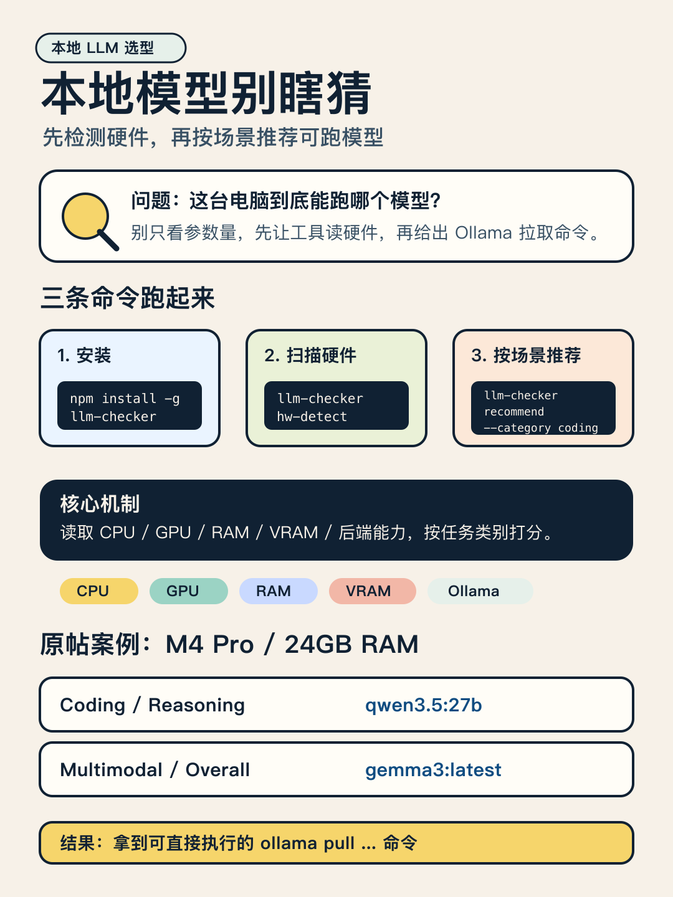
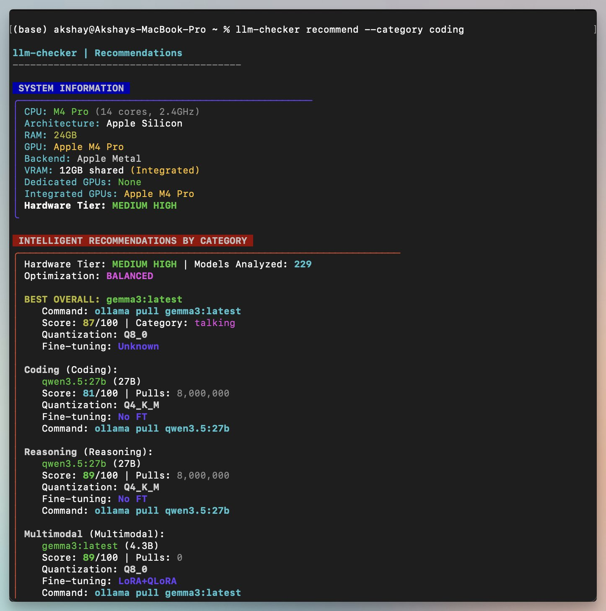

今天刷到 @akshay_pachaar 分享的一个小工具：`llm-checker`。

它解决的不是“哪个模型最强”，而是“我的电脑现在能稳定跑哪个模型”。

实用点在这里：

- 先用 `hw-detect` 读取 CPU / GPU / RAM / VRAM / 后端能力
- 再按 `coding`、`reasoning`、`multimodal` 这类场景给推荐
- 输出里会带模型名、评分、量化方式，以及可直接执行的 `ollama pull ...`
- 原帖案例里，M4 Pro / 24GB RAM 的 coding 和 reasoning 推荐到了 `qwen3.5:27b`，多模态推荐 `gemma3:latest`

接下来做：先跑 `npm install -g llm-checker`，再执行 `llm-checker hw-detect`。推荐结果以你自己的机器为准。

来源：X @akshay_pachaar，原帖发布于 2026-06-01。
