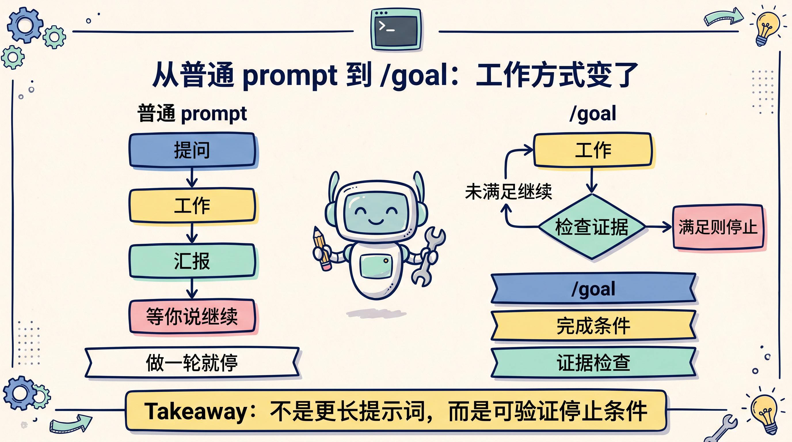
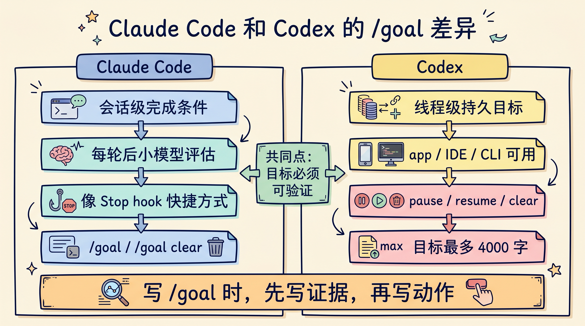
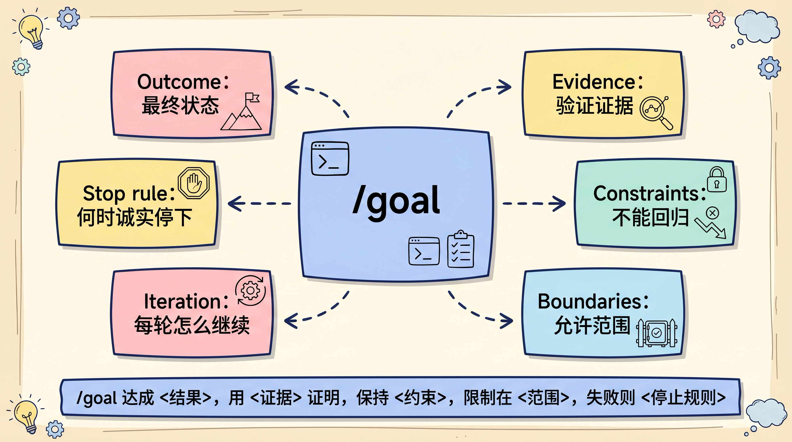

# Agent 总要你催继续？用 /goal 让 Claude Code 和 Codex 跑到有证据

AI coding agent 最烦人的地方，不是不会写代码。

而是它经常做完一轮就停下来，告诉你“我已经修了一部分”“下一步建议继续跑测试”“还可以再排查一下”。

你只好回一句：

```text
继续。
```

过一会儿又回一句：

```text
继续，直到测试通过。
```

`/goal` 解决的就是这个断点。

它不是让你写一个更长的 prompt，而是给 Claude Code 或 Codex 设置一个“完成条件”：目标没有满足，就继续下一轮；目标满足了，才停止。更准确地说，`/goal` 把“帮我做一下”改成了“持续工作，直到证据说明这件事真的完成”。

截至 2026 年 6 月 4 日我查官方文档并在本机验证：Claude Code 官方要求 `/goal` 需要 `v2.1.139` 或更高版本，我本机是 `2.1.162`；Codex cookbook 写明 Goals 从 `Codex 0.128.0` 开始可用，我本机 `codex-cli 0.133.0` 可以覆盖这个要求。



## /goal 不是任务描述，而是完成合同

普通 prompt 的语义是：

```text
请做下一件事。
```

`/goal` 的语义是：

```text
请持续工作，直到这个条件成立。
```

差别很大。

普通 prompt 更像一次派活。Agent 读上下文、改文件、跑命令、汇报结果，然后等你下一句话。它可能会建议下一步，但不会天然替你把下一步接上。

`/goal` 更像一份完成合同。你写清楚：

- 最终状态是什么
- 用什么证据证明完成
- 过程中不能破坏什么
- 遇到阻塞时应该怎么停

Agent 每轮工作后，都要把当前状态和这份合同对一下。没达到，就继续；达到，才收工。

这也是为什么 `/goal` 最适合这类任务：

- 迁移 API，直到调用点全部改完，并且测试通过
- 排查 flaky test，直到能稳定复现、修复，并连续通过
- 做性能优化，直到 p95 延迟低于某个阈值
- 拆大文件，直到每个文件低于大小预算，并保持行为不变
- 做技术调研，直到输出一份有来源、有不确定性边界的报告

它不适合“解释一下这个概念”“改一个文案”“做一次简单 review”。这些任务用普通 prompt 更干净。

## Claude Code 里的 /goal：像一个会自动续杯的 Stop hook

Claude Code 官方文档对 `/goal` 的解释很直接：设置一个完成条件后，Claude 会跨多个回合继续工作，直到条件满足。

用法也很简单：

```text
/goal all tests in test/auth pass and the lint step is clean
```

如果已经有一个活跃目标，新目标会替换旧目标。设置目标后，Claude 会立刻启动一个回合，不需要你再单独发一句“开始”。

常用命令是这几个：

```text
/goal <condition>   设置目标
/goal               查看当前目标、已用回合和 token
/goal clear         提前清除目标
```

Claude Code 还接受 `stop`、`off`、`reset`、`none`、`cancel` 作为清除目标的别名。这个细节很实用，因为长任务跑偏时，你不需要等它自己判断完成，可以直接停掉目标。

Claude Code 的关键机制在“每轮之后”。

每当 Claude 完成一轮工作，`/goal` 会让一个小型快速模型判断：目标条件是否已经满足。默认情况下，这个评估模型是 Haiku。它会返回 yes / no 和一个简短理由。

如果答案是 no，Claude 会把这个理由当成下一轮指导，继续工作。

如果答案是 yes，目标会自动清除，并在 transcript 里记录已经完成。

这意味着 `/goal` 和 auto mode 不是一回事。

auto mode 解决的是“这一轮里工具调用要不要一直问我”。它减少每个工具调用前的确认。

`/goal` 解决的是“这一轮结束后要不要自动开下一轮”。它减少你反复输入“继续”的次数。

两者可以配合，但不能互相替代。

Claude Code 还有几个边界要记住：

- `/goal` 需要 Claude Code `v2.1.139+`
- 一个会话里只能有一个活跃目标
- `/goal` 可以在非交互模式里用，例如 `claude -p "/goal CHANGELOG.md has an entry for every PR merged this week"`
- 非交互目标可以用 `Ctrl+C` 中断
- 如果恢复一个仍然活跃的会话，目标条件会保留，但回合数、计时器和 token 基线会重置
- 评估器不调用工具，不会自己去读文件或跑测试，只能看 Claude 已经展示在对话里的证据
- `/goal` 依赖 hooks 系统，所以需要在已信任的 workspace 里运行；如果 managed policy 禁用了 hooks，它会不可用

最后这条最容易被忽略。

如果你写：

```text
/goal 修好登录测试
```

评估器其实很难判断“修好”是真是假。更好的写法是：

```text
/goal 登录相关测试全部通过，并在 transcript 中展示 npm test -- auth 的退出码为 0；不要修改支付、账单和权限模块。如果连续 3 次不同修复都失败，停止并汇报最可能的阻塞原因。
```

目标不是写给人看的愿望，而是写给评估器看的证据标准。



## Codex 里的 /goal：把目标挂到当前线程上

Codex 的 `/goal` 也叫 Goal mode。

OpenAI 官方文档里的定义是：给 Codex 一个在长任务中持续追踪的持久目标，适合多步骤工作，或者需要清晰 definition of done 的任务。

Codex 的 mental model 可以这样记：

```text
普通 prompt：ask -> work -> result -> wait
Codex Goal：work -> check -> continue or complete
```

在 Codex CLI 里，常用命令是：

```text
/goal <objective>   设置目标
/goal               查看当前目标
/goal pause         暂停目标
/goal resume        恢复目标
/goal clear         清除目标
```

Codex 官方 CLI 文档还写了一个硬限制：goal objective 必须非空，最多 `4,000` 个字符。目标太长时，不要硬塞进命令里，应该把详细说明放进文件，然后让目标指向那个文件。

比如：

```text
/goal 按 docs/migration-goal.md 完成认证模块迁移；所有验收标准满足后再停止
```

Codex app 里的体验更偏工作台。

你在 composer 里输入 `/goal` 后，目标会变成当前 thread 的持久状态。目标活跃时，app 会在输入框上方显示进度条和控制按钮，可以暂停、恢复、编辑或清除目标。也就是说，Codex app 里你不一定要记住所有子命令，很多生命周期操作可以点按钮完成。

如果 `/goal` 没出现在 Codex 的 slash command 列表里，官方文档给的处理方式是启用 `features.goals`：

```toml
[features]
goals = true
```

也可以直接运行：

```bash
codex features enable goals
```

Codex 的 cookbook 对 Goal 写法讲得更工程化：一个好 Goal 不只是“请做完”，而是包含 6 个部分：

| 要素 | 要回答的问题 | 例子 |
|---|---|---|
| Outcome | 完成后什么为真 | p95 checkout latency < 120ms |
| Verification surface | 用什么证据证明 | benchmark 输出、测试退出码、最终报告 |
| Constraints | 不能破坏什么 | correctness suite 必须保持绿色 |
| Boundaries | 哪些文件、工具、数据可用 | 只改 checkout 模块，不碰支付风控 |
| Iteration policy | 每轮失败后怎么选下一步 | 先看 benchmark hot path，再做最小改动 |
| Blocked stop condition | 什么时候诚实停下 | 连续 3 次无改善，汇报阻塞证据 |

这也是我更推荐的写法：

```text
/goal <想要的最终状态>，用 <具体证据> 验证，同时保持 <约束> 不变。只使用 <允许的文件/工具/数据边界>。每轮迭代后，基于 <选择下一步的方法> 继续。如果 <阻塞条件> 出现，停止并汇报原因、已尝试路径和下一步需要的人类输入。
```

举个更像实战的例子：

```text
/goal 把 checkout 页面 p95 交互延迟降到 120ms 以下，并用 scripts/bench-checkout 输出证明；npm test -- checkout 必须退出 0；只改 src/checkout 与 shared/perf 下的文件。每轮先记录瓶颈证据，再做一个最小改动并复测。如果 5 轮后仍无法低于阈值，停止并输出瓶颈报告和剩余方案。
```

这段看起来比“优化 checkout 性能”麻烦，但它把 Agent 最容易漏掉的四件事都写进去：指标、证据、边界、停止规则。

## 两个 /goal 最大的共同点：评估器只相信你让它看见的证据

Claude Code 和 Codex 的实现细节不同，但使用原则高度一致。

`/goal` 不是许愿池。

它不会让 Agent 突然拥有完美判断力，也不会替代测试、CI、code review 和人类审批。它只是把“持续推进”这件事制度化。

最关键的原则是：

**目标必须可验证，证据必须出现在当前会话里。**

比如你想让 Agent 修测试，目标里最好明确写：

```text
pytest tests/auth -q exits 0
```

而不是：

```text
认证模块恢复正常
```

因为前者有命令、有退出码、有输出；后者只是一个主观状态。

你想让 Agent 做研究，目标里最好写：

```text
输出一份 Markdown 报告，逐条列出来源、证据强度、无法验证的部分和下一步验证方式。
```

而不是：

```text
深入研究这个话题。
```

因为前者有交付物和审计标准；后者很容易变成堆资料。

这也是 `/goal` 和 prompt engineering 的分界线。

prompt engineering 让模型更理解你想要什么。

Goal engineering 让模型更清楚什么时候该继续，什么时候该停。



## 我会怎么用：先 /plan，再 /goal，中途只做方向修正

我不建议一上来就把复杂任务塞进 `/goal`。

更稳的流程是：

```text
1. 先用 /plan 让 Agent 澄清任务、拆步骤、列风险
2. 让 Agent 把计划压缩成一个可验证的 Goal
3. 你检查 Goal 里的证据、边界和停止条件
4. 再用 /goal 启动长任务
5. 中途只做方向修正，不反复改目标
6. 完成后用 /diff、测试、review 做人工验收
```

这个流程的重点不是仪式感，而是防止“错误目标被自动化执行”。

如果目标写错，`/goal` 会很勤奋地朝错误方向跑。

比如：

```text
/goal 重构 auth 模块，让代码更优雅
```

这类目标很危险。

“更优雅”没有证据。Agent 可能会大范围改文件，最后给你一堆看似更清爽但行为变了的代码。

改成下面这样就好很多：

```text
/goal 将 auth/session.ts 拆成不超过 3 个职责清晰的模块，每个文件低于 250 行；保持 public API 不变；npm test -- auth 退出 0；git diff 中不能修改 billing、payment、admin 目录。如果拆分会改变外部行为，停止并先给出方案。
```

这里的关键不是“写得长”，而是写得可裁决。

## 什么时候不要用 /goal

`/goal` 会让 Agent 更能持续工作，所以也会放大坏目标的伤害。

下面几类任务，我会避免用：

第一，一句话能完成的任务。

比如“把按钮文案从 Submit 改成 Save”。用普通 prompt 更快，没必要启动持续循环。

第二，没有验收标准的任务。

比如“把项目优化一下”“让代码更现代”。这种目标会让 Agent 自己定义成功，最后你很难判断它到底有没有做对。

第三，需要你频繁做产品判断的任务。

比如定价策略、风格取舍、业务规则重排。Agent 可以准备方案，但不应该自动越过决策点。

第四，高风险操作没有边界的任务。

比如数据库迁移、支付逻辑、权限系统、安全策略。可以用 `/goal`，但必须把允许范围、备份要求、验证命令、人工确认点写进去。

第五，证据不在会话里的任务。

Claude Code 文档明确提醒：它的 `/goal` 评估器不调用工具，只能判断 Claude 已经展示在对话里的内容。Codex cookbook 也强调，Goal 要靠 thread 里的证据推进。换句话说，如果你没有让 Agent 把测试结果、报告路径、diff 摘要、失败日志展示出来，评估器就只能猜。

## 可以直接复制的 /goal 模板

给开发任务：

```text
/goal 完成 <功能/修复/迁移>，并用 <测试命令或构建命令> 退出 0 证明；保持 <不能回归的模块/行为> 不变；只修改 <允许范围>。每轮先运行或检查最相关证据，再做最小必要改动。如果 <轮数/时间/失败次数> 后仍无法满足目标，停止并汇报已尝试方案、阻塞证据和需要我决定的问题。
```

给性能优化：

```text
/goal 将 <指标> 优化到 <阈值>，用 <benchmark 命令> 的输出证明；<正确性测试> 必须通过；每轮记录瓶颈假设、改动和复测结果。不得通过删除功能、降低校验或跳过测试达成指标。如果连续 <N> 轮没有改善，停止并输出瓶颈报告。
```

给研究文章：

```text
/goal 产出一份 <主题> 的证据型研究稿，必须包含官方来源、关键定义、适用场景、限制条件、可复制模板和参考链接；每个重要判断都要标注来源或明确写成推断。如果资料不足，停止堆砌并列出无法确认的问题。
```

给 bug 排查：

```text
/goal 找到并修复 <bug 描述>，用 <复现命令> 先证明问题存在，再用同一命令和 <回归测试命令> 证明修复有效；只改 <范围>。如果无法复现，停止并输出最小复现缺口，而不是猜测修改。
```

## 最后：/goal 真正改变的是“停止条件”

AI coding agent 过去最常见的用法，是你一轮一轮推它走。

你说“继续”，它继续。

你说“跑测试”，它跑测试。

你说“再修一下”，它再修一下。

`/goal` 把这个节奏换掉了。

你不再只描述下一步动作，而是定义完成条件。Agent 不再每轮都等你推一下，而是围绕条件继续工作，直到证据说明完成，或者它诚实地遇到阻塞。

这对 AI 编程很重要。

因为复杂工程任务最难的不是第一步，而是第七步、第十二步、第二十步之后还能不能记得最初要交付什么。

我的建议很简单：

把 `/goal` 当成“长任务完成合同”，不要当成“自动驾驶按钮”。

目标写得越像验收清单，它越有用。

目标写得越像愿望，它越危险。

如果你准备在真实项目里试，先从低风险但多轮的任务开始：

- 修一组失败测试
- 迁移一个小模块
- 降一个明确性能指标
- 生成一份证据型研究报告

等你习惯了“Outcome + Evidence + Constraints + Stop rule”的写法，再把它用到更大的任务里。

我把这篇文章里的 `/goal` 模板和检查清单整理成了可复制版本。

关注「蒸馏小余」，回复 `GOAL` 获取。

## 参考资料

- Claude Code Docs: Keep Claude working toward a goal: <https://code.claude.com/docs/en/goal>
- Claude Code Docs: Commands: <https://code.claude.com/docs/en/commands>
- OpenAI Developers: Codex Prompting - Goal mode: <https://developers.openai.com/codex/prompting#goal-mode>
- OpenAI Developers: Codex CLI Slash commands: <https://developers.openai.com/codex/cli/slash-commands#set-or-view-a-task-goal-with-goal>
- OpenAI Developers: Codex app commands: <https://developers.openai.com/codex/app/commands#set-or-manage-a-goal-with-goal>
- OpenAI Cookbook: Using Goals in Codex: <https://developers.openai.com/cookbook/examples/codex/using_goals_in_codex>
