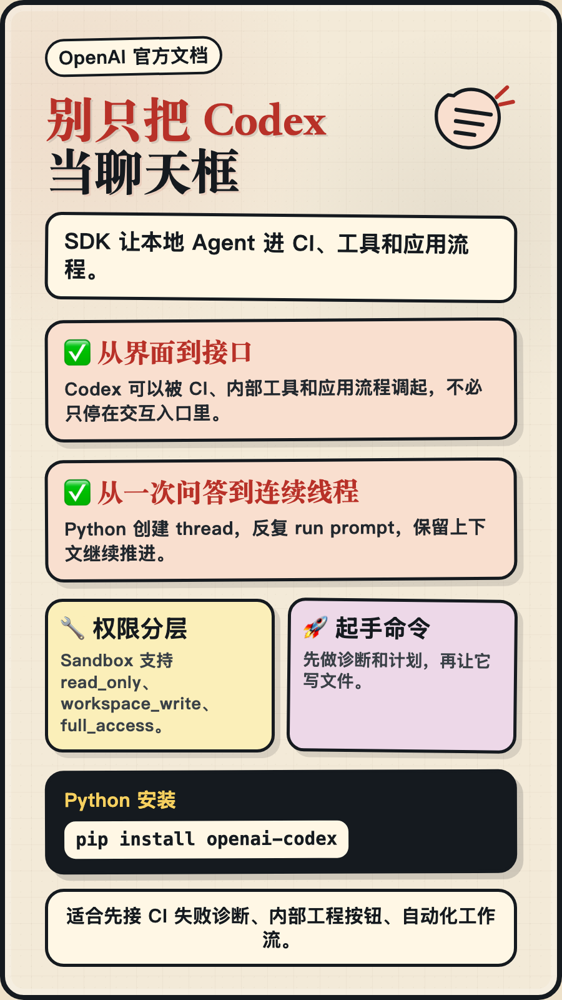

别只把 Codex 当聊天框：SDK 让本地 Agent 进工程流程！

✅从 CLI、IDE、Web 里的交互式使用，  
✅到 CI、内部工具、应用流程里的程序化调用，  
Codex 不只是一个打开后再输入指令的入口，也可以变成系统能调度的工程能力。

OpenAI Codex SDK，聚焦自动化新需求，  
让程序可以创建 thread、运行 prompt，并拿回 final response。

💻`pip install openai-codex`，  
🔧Python 版通过 JSON-RPC 控制本地 app-server，  
🏆Sandbox 支持 read_only、workspace_write、full_access，  
说明它已经适合先接入诊断、计划、内部工具按钮这类低风险流程。

未来可以先从 CI 失败诊断开始，把 Codex 接进真实工程链路；需要写文件时，再逐步提高沙箱权限。

来源：OpenAI Codex SDK 官方文档（2026-06-06 访问）

标签：#OpenAI #CodexSDK #AI工程化 #Agent自动化 #开发工具
