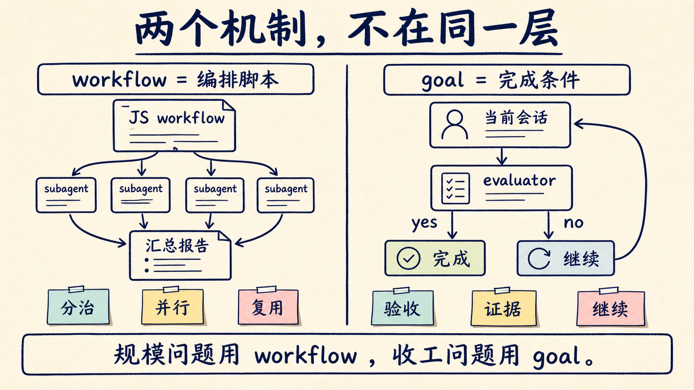
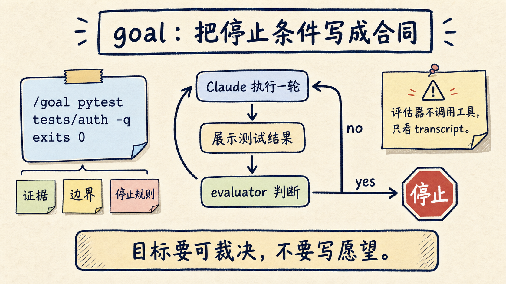
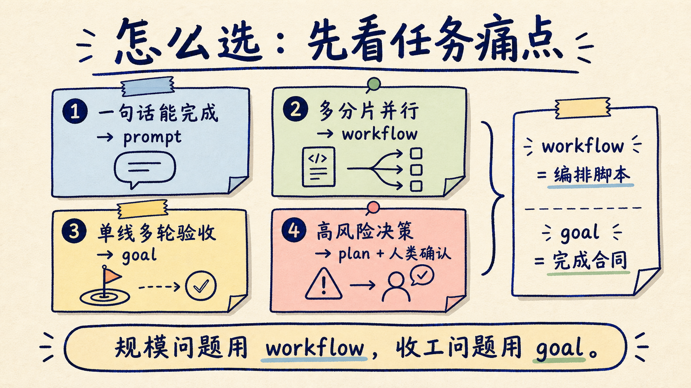

# Agent 长任务别乱开：Claude Code workflow 和 goal 怎么选

Claude Code 现在有两个很容易被混用的长任务机制：`workflow` 和 `goal`。

它们看起来都在解决“让 Agent 多做几步”的问题，但工作层级完全不同。

`workflow` 解决的是大规模编排：Claude 写出一段 JavaScript 脚本，后台调度一批 subagent 去并行干活、交叉验证、汇总结果。

`goal` 解决的是持续收工：你给当前会话设置一个完成条件，Claude 每一轮结束后让评估器判断证据是否满足，没满足就继续下一轮。

判断方法很简单：

如果任务主要难在“要拆给很多 Agent 并行做”，用 `workflow`。

如果任务主要难在“一个 Agent 容易半路停下，需要持续做到验收通过”，用 `goal`。

一个管编排，一个管收工。混着用，反而容易让 Agent 跑得更贵、更乱。



## 先看 workflow 怎么用

Claude Code 的 dynamic workflow 最快入口，是内置的 `/deep-research`。

比如你想调查 Node.js 权限模型在 v20 到 v22 之间发生了什么变化，可以直接写：

```text
/deep-research What changed in the Node.js permission model between v20 and v22?
```

这不是让 Claude 在当前对话里慢慢搜资料。

它会启动一个后台 workflow：多个 agent 从不同角度检索资料、抓取来源、交叉检查结论，最后给你一份带引用的报告。你可以用 `/workflows` 打开进度视图，看每个 phase、每个 agent 的 token、耗时和中间发现。

如果要让 Claude 为自己的任务写 workflow，可以这样写：

```text
ultracode: audit every API endpoint under src/routes for missing auth checks
```

也可以直接说：

```text
use a workflow to audit every API endpoint under src/routes for missing auth checks
```

Claude 会先写一段 workflow 脚本，再由 workflow runtime 在后台执行。CLI 里会让你批准计划；Desktop app 里会出现审批卡片。任务跑起来后，你的主会话仍然可用，不会被一堆 subagent 的过程输出塞满。

workflow 成功跑通后，还可以保存成命令。

常见保存位置有两个：

```text
.claude/workflows/      # 项目级，团队共享
~/.claude/workflows/    # 个人级，跨项目可用
```

保存以后，workflow 会像普通 slash command 一样出现。比如一次安全扫描 workflow 保存成 `/security-audit`，以后可以直接运行：

```text
Run /security-audit on src/routes and summarize high-confidence findings only
```

workflow 的价值不只是“开很多 Agent”。

更关键的是：编排逻辑变成了代码。哪些目录分组、每组启动几个 agent、如何交叉审核、如何过滤低可信发现、如何合并报告，都可以沉淀在脚本里，下次复用。

## 再看 goal 怎么用

`/goal` 的入口更像一份验收条件。

比如你要修认证测试，不建议写：

```text
/goal 修好认证模块
```

这个目标太虚。评估器不知道“修好”到底怎么判断。

更好的写法是：

```text
/goal all tests in test/auth pass and the lint step is clean
```

再工程一点，可以把证据、边界、停止条件都写进去：

```text
/goal 登录相关测试全部通过，并在 transcript 中展示 npm test -- auth 的退出码为 0；不要修改 billing、payment、admin 目录。如果连续 3 次修复后仍失败，停止并汇报最可能的阻塞原因。
```

设置 goal 后，Claude 会立刻开始一轮工作。每轮结束后，一个小型快速模型会检查当前对话里的证据。

如果条件没满足，评估器会给出简短理由，Claude 带着这个理由继续下一轮。

如果条件满足，goal 自动清除。

常用命令只有几个：

```text
/goal <condition>   设置目标
/goal               查看当前 goal、已用回合和 token
/goal clear         提前清除 goal
```

`stop`、`off`、`reset`、`none`、`cancel` 也可以当作清除别名。

这里最容易误解的一点是：`/goal` 不是 workflow。

它不会把任务拆成一堆后台 subagent，也不会保存编排脚本。它只是给当前 session 套了一层“完成条件评估”。

官方文档把 `/goal` 说得很清楚：它本质上是 session-scoped 的 prompt-based Stop hook wrapper。每一轮结束后，评估器看条件是否成立；不成立，就再开下一轮。

所以 `/goal` 最怕两件事。

第一，目标不可验证。

第二，证据没有出现在 transcript 里。

评估器不会自己去跑命令、读文件、打开报告。它只能看 Claude 已经展示出来的测试结果、退出码、diff 摘要、文件路径、错误日志。你想让它判断“测试通过”，就要让 Claude 把测试命令和结果展示出来。



## 两者的区别，不是“自动化程度”

workflow 和 goal 都能减少你手动催 Agent 的次数。

但如果只用“更自动”来理解它们，很容易选错。

更准确的比较是下面这张表：

| 维度 | workflow | goal |
|---|---|---|
| 解决的问题 | 大规模分治、并行、交叉验证 | 当前任务持续推进到验收通过 |
| 谁持有计划 | JavaScript workflow 脚本 | 当前 session 的 goal condition |
| 执行方式 | 后台 runtime 调度多个 subagent | Claude 一轮一轮继续工作 |
| 中间结果放哪 | 脚本变量和 workflow 运行状态 | 对话上下文和 transcript |
| 复用方式 | 保存成 `.claude/workflows/` 或 `~/.claude/workflows/` 命令 | 复制 goal 模板或重新设置条件 |
| 适合规模 | 几十到上百个 agent 的任务 | 一个会话内的多轮任务 |
| 主要风险 | token 成本高、权限边界要提前收紧 | 坏目标会被勤奋执行很多轮 |
| 停止逻辑 | workflow 跑完、暂停、停止、恢复 | 评估器判断条件满足，或手动 clear |

一句话判断：

`workflow` 是“把任务编排写成程序”。

`goal` 是“把停止条件写成合同”。



## 什么场景该用 workflow

第一类，codebase-wide audit。

比如你要检查整个 `src/routes` 目录的鉴权缺口。每个路由组都可以由独立 agent 审查，再让另一个 agent 交叉验证高风险发现。

这类任务如果放在一个普通对话里，问题会很快出现：上下文被大量文件和中间结论挤满，Claude 一边记计划，一边读代码，一边合并结果，最后容易丢细节。

workflow 更合适，因为它把“分组、并发、复核、合并”写进脚本。

第二类，大规模迁移。

比如 500 个文件从旧 API 迁到新 API。你不希望一个 Agent 在一个上下文窗口里从头改到尾，也不希望它每改一批就忘记之前的判断。

workflow 可以把迁移拆成多个互不重叠的 shard，让 agent 分区处理，最后统一汇总失败点和人工决策点。

第三类，需要独立视角的研究。

比如你要研究一个新框架是否适合进入生产，不应该只让一个 agent 看一遍文档就下结论。更稳的做法是让不同 agent 分别看官方文档、GitHub issue、benchmark、真实案例、竞品对比，再做 claim voting，把没通过交叉验证的判断过滤掉。

这也是 `/deep-research` 的工作方式。

第四类，值得沉淀成团队命令的流程。

比如每次发版前都要做一次 API 鉴权扫描、隐私字段检查、breaking change 总结。只要流程会反复出现，就不应该一直靠口头 prompt 重写。

workflow 保存后，团队可以直接运行同一个编排。

## 什么场景该用 goal

第一类，测试修复。

比如：

```text
/goal pytest tests/auth -q 退出 0，并展示最终命令输出；只修改 auth 相关实现和测试辅助，不改支付、账单、权限策略。如果 4 轮后仍失败，停止并输出剩余失败用例和最小复现线索。
```

这类任务不一定需要很多 agent。它需要的是 Claude 不要修一半就停在“建议继续排查”。

第二类，小到中等规模迁移。

比如只迁移一个模块：

```text
/goal 将 user-profile 模块从 legacy client 迁移到 new client；npm test -- user-profile 和 npm run lint 均退出 0；public API 不变；只改 src/user-profile 与 shared/client-adapter。
```

目标清楚、边界清楚、验证命令清楚，用 goal 就够。

第三类，bug 排查。

好的 goal 不是“修好 bug”，而是“先证明 bug 存在，再证明它消失”：

```text
/goal 找到并修复订单列表偶发重复渲染问题；先用 npm run repro:orders 证明问题存在，再用同一命令和 npm test -- orders 证明修复有效；每轮汇报复现证据、改动和复测结果。
```

第四类，证据型写作或调研。

比如写一篇技术对比文章：

```text
/goal 产出一份 Claude Code workflow 和 goal 的对比研究稿，必须包含官方来源、最小用法示例、机制差异、适用场景、限制条件和参考链接；每个重要判断要能回到来源，无法确认的地方明确写成推断。
```

这类任务不需要后台 100 个 agent，但很需要“不要查了两条资料就收工”。

## 几个不要乱用的边界

一句话能完成的任务，不用 workflow，也不用 goal。

把按钮文案从 `Submit` 改成 `Save`，普通 prompt 最快。启动长任务机制只会增加成本和状态复杂度。

没有验收标准的任务，不要用 goal。

“优化一下项目”“把代码整理得更优雅”“让架构更现代”，这些都不是完成条件。Agent 会自己发明成功标准，然后朝那个标准努力很多轮。

需要频繁产品判断的任务，不要直接扔进 workflow。

比如定价策略、权限模型、用户路径重排。这些任务可以让 workflow 收集证据、产出方案，但关键决策点应该拆出来让人确认。Claude Code workflow 官方也提醒：workflow 运行中没有常规的用户输入；需要阶段性签核时，应该拆成多个 workflow。

高风险修改必须先收紧权限边界。

workflow 的 subagent 在运行时会继承工具 allowlist，文件编辑会按 workflow 机制自动处理。跑大型迁移、安全扫描、支付逻辑修改前，先把允许目录、命令、禁止区域写清楚。否则你不是在加速工程，而是在加速事故。

## 我的实际选型规则

可以按下面这套顺序判断：

1. 任务能不能一句话完成？能，就普通 prompt。
2. 任务是否需要跨很多独立分片并行？需要，用 workflow。
3. 任务是否需要独立 agent 互相审查？需要，用 workflow。
4. 任务是否会反复执行，值得保存成团队命令？值得，用 workflow。
5. 任务是否主要是一个会话里的持续迭代，直到测试、报告或指标满足？是，用 goal。
6. 任务是否没有明确证据？先写验收标准，不要直接启动 goal。

也可以记成一个更短的版本：

```text
规模问题 -> workflow
收工问题 -> goal
一次性小事 -> prompt
高风险决策 -> plan + 人类确认
```

很多真实任务会组合使用。

比如一次大规模权限审计，可以先用 workflow 把全仓库拆开检查，得到一份高可信问题列表；然后针对某个明确 bug，用 goal 让当前 session 持续修到测试通过。

workflow 负责发现和分治。

goal 负责把某个明确子任务做到验收。

## 可以直接复制的模板

给 workflow 的模板：

```text
use a workflow to <任务>。请按 <目录/模块/来源> 分片启动 subagents；每个 agent 输出证据、风险等级和不确定性；再用独立 reviewer agent 交叉检查高风险结论；最终只汇总高置信发现、来源和建议动作。先展示 workflow 计划，等我批准后再运行。
```

给 codebase audit：

```text
ultracode: audit every API endpoint under src/routes for missing auth checks. Split by route group, have one reviewer cross-check high-risk findings, and report only findings with file path, evidence, exploit scenario, and suggested minimal fix.
```

给 goal 的模板：

```text
/goal 完成 <功能/修复/迁移>，并用 <测试命令/构建命令/报告路径/benchmark> 证明；保持 <不能回归的模块或行为> 不变；只修改 <允许范围>。每轮先检查最相关证据，再做最小必要改动。如果 <轮数/时间/失败次数> 后仍无法满足目标，停止并汇报已尝试路径、阻塞证据和需要我决定的问题。
```

给测试修复：

```text
/goal 修复 auth 测试，并在 transcript 中展示 pytest tests/auth -q 退出 0；只修改 src/auth、tests/auth 和 test helpers；不得跳过测试或降低断言。如果连续 4 轮仍失败，停止并列出剩余失败、已排除原因和下一步需要人工判断的问题。
```

## 最后：别把长任务机制当自动驾驶

Claude Code 的 workflow 和 goal，真正改变的是 Agent 长任务的组织方式。

workflow 把编排从 Claude 的上下文窗口里拿出来，写进可运行、可保存、可复盘的脚本。

goal 把“什么时候算完成”从你的下一句催促里拿出来，写成当前会话的验收条件。

前者解决规模，后者解决收工。

这两个机制都很有用，但前提是你要先承认：Agent 不缺“更努力”，缺的是边界、证据和停止规则。

我的建议是：

小任务继续用 prompt。

多轮但单线的任务用 goal。

大规模、可分治、需要交叉验证的任务用 workflow。

关键决策点不要自动化，先让 Agent 做计划和收集证据，再由人决定。

如果只记一句：

**workflow 是编排脚本，goal 是完成合同。**

把这句话记住，Claude Code 的长任务能力就不会越用越乱。

关注「蒸馏小余」，回复 `WORKFLOW`，我会把这篇里的 workflow / goal 选型表和可复制模板整理成一份清单。

## 参考资料

- Claude Code Docs: Orchestrate subagents at scale with dynamic workflows: <https://code.claude.com/docs/en/workflows>
- Claude Code Docs: Keep Claude working toward a goal: <https://code.claude.com/docs/en/goal>
- Claude Code Docs: Create custom subagents: <https://code.claude.com/docs/en/sub-agents>
- Claude Code Docs: Run agent teams: <https://code.claude.com/docs/en/agent-teams>
