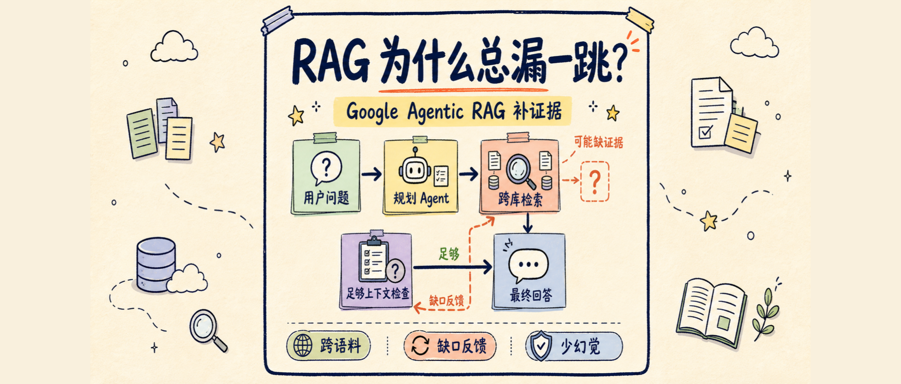
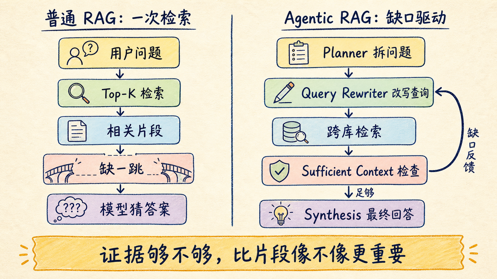
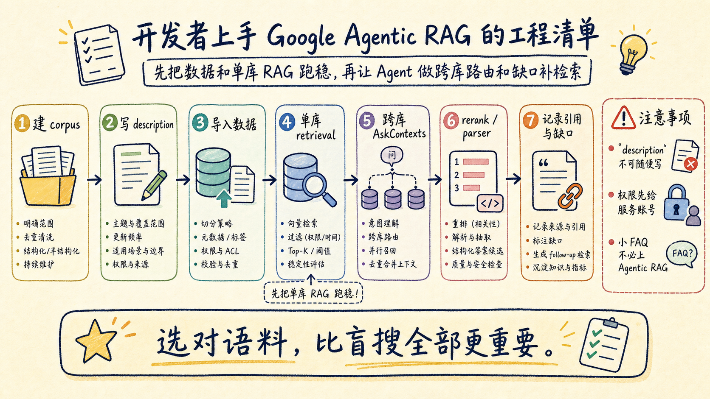

# RAG 为什么总漏一跳？Google Agentic RAG 讲清楚

RAG 最烦人的失败，不是完全找不到资料，而是找到了“看起来相关”的资料，却漏掉了中间那一跳。

你问“Project X 用的服务器规格是什么”，系统先搜到 Project X 文档，里面只写了一个服务器 ID。普通 RAG 到这里就可能停了：要么说没找到规格，要么根据相似片段凑一个答案。真正需要做的是顺着服务器 ID 再去资产库查第二次。

Google 这次讲的 Agentic RAG，解决的就是这种问题。它不是把 Top-K 调大，也不是让模型一次性读更多上下文，而是让检索流程变成一个会规划、会改写查询、会跨语料路由、会判断证据是否足够的 Agent 工作流。



先说结论：**Agentic RAG 的价值不在“多 Agent”这个词，而在它把“证据够不够”变成了检索流程里的质量闸门。**

## 它到底适合解决什么问题

普通 RAG 的典型路径很简单：

```text
用户问题 -> 向量检索 -> 取回片段 -> 拼进上下文 -> LLM 生成答案
```

这条链路适合 FAQ、单文档问答、政策查询、产品文档检索。问题在于，企业里的很多问题不是单跳的。

比如：

- “这个客户投诉和哪个版本发布有关？”
- “某个供应商延迟，会影响哪些项目预算？”
- “某个病例里的用药、饮食、过敏信息分别在什么记录里？”
- “项目代号、服务器 ID、资产规格、采购记录之间怎么串起来？”

这些问题的共同点是：答案分散在多个数据岛里。第一轮检索经常只能找到线索，不能直接找到答案。

Google Research 在 2026-06-05 发布的文章里，把这种问题称为现代企业工作流里的 multi-source、multi-hop query。它们需要更深的探索，而不是一次相似度搜索。

## 使用上先别急：先跑通普通 RAG

如果你今天要在 Google Cloud 上尝试这条路线，入口不是先写一个复杂 Agent，而是先把 RAG Engine 的基础流程跑稳。

第一步，创建 corpus。你可以把它理解成一个可检索的知识集合。Google 的 RAG Engine 支持本地单文件、Cloud Storage、Google Drive、Slack、Jira、SharePoint 等数据源。这里有一个工程细节很容易漏：Google Drive 这类数据源要给 RAG Data Service Agent 服务账号授权，否则文件可能根本导不进去。

第二步，导入数据并做转换。官方 quickstart 里会配置 embedding model，再设置 chunk size 和 overlap。这个阶段不要急着调 Agent，先用 `retrieval_query` 问几个你知道答案的问题，确认文档能被正确切块、索引、召回。

第三步，把 RAG corpus 接到 Gemini 生成里。官方示例的形态大概是这样：

```python
from vertexai import rag
from vertexai.generative_models import GenerativeModel, Tool
import vertexai

vertexai.init(project=PROJECT_ID, location="us-east4")

rag_retrieval_config = rag.RagRetrievalConfig(
    top_k=3,
)

rag_retrieval_tool = Tool.from_retrieval(
    retrieval=rag.Retrieval(
        source=rag.VertexRagStore(
            rag_resources=[rag.RagResource(rag_corpus=rag_corpus.name)],
            rag_retrieval_config=rag_retrieval_config,
        )
    )
)

rag_model = GenerativeModel(
    model_name="gemini-2.0-flash-001",
    tools=[rag_retrieval_tool],
)
```

这一步的目标不是马上追求“智能”，而是确认普通 RAG 的地基是好的：数据能进来，检索能命中，引用链能追踪，权限边界清楚。

## Cross-Corpus Retrieval 才是新能力的入口

Google 这次公开的产品入口，主要是 Gemini Enterprise Agent Platform 里的 Cross-Corpus Retrieval。文档里列了两个 API：

- `AsyncRetrieveContexts`：异步从多个 RAG-managed corpus 里检索上下文。
- `AskContexts`：同步跨多个 corpus 检索，并直接生成回答。

它的关键不是“同时搜多个库”。如果只是把所有语料混在一起盲搜，噪音会变多，权限和归因也更难管。

Cross-Corpus Retrieval 更像一个会选路的检索调度器。你创建每个 corpus 时要写好 `description`，因为 Planner 会根据这些描述判断：这次问题应该去哪个 corpus 找。

这也是第一个工程坑：**corpus description 不是备注，而是路由信号。** 写得太泛，Agent 就不知道该去财务库、项目库、病历库还是资产库。



文档还写了几个边界：

- Cross-Corpus Retrieval 当前只在 `us-central1` 可用。
- 需要给 RAG Engine 服务账号授予 Vertex AI User 角色。
- 创建 corpus 时的 `description` 很重要，而且文档强调要在创建时认真设置。

这些不是小字。Agentic RAG 能不能跑得像样，很多时候取决于数据组织和权限配置，而不是模型名。

## 原理：多 Agent 不是重点，缺口反馈才是重点

Google 的 Agentic RAG 可以拆成几类角色。

Orchestrator 先判断问题是不是一跳能解决。如果不是，它会把任务交给后面的 Agent。

Planner Agent 负责规划信息路径。比如一个问题同时问预算和时间线，它会判断应该先查财务数据，再查项目管理记录。

Query Rewriter 把用户的自然语言问题改写成更适合检索的查询。用户问“Project X 最近怎么样”，系统可能会拆成“Project X Q3 status report”“Project X team blockers”等多个查询。

Search Fanout 或 RAG Agent 把这些查询发到不同数据源，拿回候选片段。

把这套东西和普通多 Agent RAG 拉开的，是 Sufficient Context Agent。

它不只是看“片段相关不相关”。它会拿原始问题、粗答案和检索片段一起判断：这些上下文是否足够回答问题。

相关不等于足够。一个片段可能和问题高度相关，但只回答了三分之二。比如医生问病人的用药、饮食和过敏记录，第一轮只找到了用药和低钠饮食，没有找到过敏或不良反应。普通 RAG 很容易把已有信息写得很完整，让读者误以为答案已经全了。

Sufficient Context Agent 要做的是明确指出缺口：现在有用药和饮食，但缺过敏信息。然后它把这个缺口变成下一轮检索反馈，让 Query Rewriter 去搜“rash”“adverse event”这类更具体的线索。

这一步很像一个严一点的研究助理：不是只说“资料不够”，而是告诉你“缺哪一项、为什么缺、下一轮应该搜什么”。

## 为什么“足够上下文”比“相关片段”更重要

Google 2025 年的 sufficient context 研究讲了一个很重要的判断：RAG 系统过去太关注 relevance，也就是召回片段是否相关；但事实性问答更需要判断 sufficiency，也就是片段是否包含回答问题所需的全部信息。

这两个指标在工程上差别很大。

相关性像是在问：

```text
这段文字和问题像不像？
```

充分性是在问：

```text
只看这些证据，能不能负责任地回答原始问题？
```

RAG 的很多幻觉，不是模型完全无视上下文，而是上下文只给了半截线索，模型却被迫生成一个完整答案。更麻烦的是，加了检索上下文以后，模型有时会更自信，因为它“看见了资料”，但没有意识到资料不完整。

所以 Agentic RAG 的质量闸门，不应该只放在最后的事实核查。更好的位置是在生成前：先判断上下文够不够，不够就继续找，找不到就明确拒答或标注缺口。

## Google 报告了什么效果

Google Research 在文章里给了两个数字。

第一，与标准 RAG 相比，这套框架在 factuality datasets 上准确率最高提升 34%。

第二，在 FramesQA 实验里，Google 用 824 个查询和 2676 份 PDF 文档测试多跳问答。在 cross-corpus 设置下，系统要从 4 个候选语料库里选对检索目标。Google 报告的正确率是 90.1%，而且 single-corpus 与 cross-corpus 版本的延迟平均差异在 3% 内。

这两个数字可以说明方向，但不要直接外推到自己的业务系统。企业数据的格式、权限、重复度、过期程度、corpus description 质量，都会影响结果。

我更建议把它当成一个工程信号：跨语料路由不一定天然拖慢系统，只要路由足够准，检索空间变大未必等于延迟爆炸。

## 开发者怎么落地：一张检查表

如果你准备把 Agentic RAG 放进真实业务，我会按这个顺序做。

| 步骤 | 要做什么 | 判断标准 |
|---|---|---|
| 1 | 先划分 corpus | 每个 corpus 对应清楚业务边界 |
| 2 | 写好 description | 不写泛词，写数据范围、更新时间、典型问题 |
| 3 | 跑普通 RAG | 单库问题能稳定召回正确片段 |
| 4 | 加 parser / chunking | 表格、PDF、流程图不要被切碎 |
| 5 | 加 rerank | Top-K 里噪音高时先重排 |
| 6 | 再试 cross-corpus | 观察 Planner 是否选对 corpus |
| 7 | 记录缺口反馈 | 每次没答全，保存缺什么、下一轮搜什么 |
| 8 | 做拒答策略 | 上下文不足时不要硬答 |



这里最容易被低估的是第二步。很多团队会把 description 写成“项目资料”“客户资料”“内部文档”。这对人类也许够了，对路由 Agent 不够。

更好的写法应该像这样：

```text
包含 2024-2026 年企业客户合同、SLA、续约日期、行业、客户成功备注。
适合回答客户状态、续约风险、合同条款、服务等级相关问题。
不包含产品 bug、工程发布记录或财务发票。
```

描述越像数据产品说明书，Planner 越容易选对路。

## 什么时候不该用 Agentic RAG

Agentic RAG 听起来很强，但不是所有 RAG 都该升级。

如果你的问题主要是单跳 FAQ，用户问法稳定，数据源只有一个，普通 RAG 加 rerank 可能已经够了。Agentic RAG 会带来更多组件、更多日志、更多权限配置，也可能带来更高成本。

如果你的数据质量很差，Agentic RAG 也救不了。重复文档、过期文档、权限错配、表格解析失败、corpus description 混乱，这些问题会直接污染 Agent 的判断。

如果你的业务不能接受多轮检索延迟，也要谨慎。Google 报告的实验结果不等于每个私有系统都能做到同样延迟。上线前应该记录每轮检索、Planner 路由、Sufficient Context 判断和最终生成的耗时。

我的判断是：Agentic RAG 更适合三类场景。

第一，跨系统问答。比如客户信息在 CRM，合同在 Drive，事故记录在 Jira，发布记录在工程文档。

第二，多跳推理。问题本身需要先找到中间实体，再根据中间实体去另一个库找最终答案。

第三，高风险问答。医疗、法务、财务、合规、客服升级这类场景里，不完整答案比“我不知道”更危险。

## 最大坑：把 Agent 当成补救脏数据的魔法

Agentic RAG 的正确姿势不是“数据乱一点没关系，让 Agent 自己找”。

恰好相反。Agent 能不能做出可靠选择，更依赖数据边界清楚、描述准确、权限可解释、引用可追踪。

普通 RAG 时代，很多问题藏在 Top-K 里：检索错了，模型还能写出一段像样的答案。Agentic RAG 时代，问题会提前暴露在路由和反馈里：为什么选这个 corpus？为什么判断上下文不足？下一轮为什么搜这个词？

这是一件好事。它让 RAG 从“黑盒召回”往“可审计研究流程”走了一步。

## 结尾：RAG 的下一步不是更长上下文

Google Agentic RAG 给我的最大启发，是 RAG 的下一步不只是更长上下文、更大 Top-K、更强 embedding。

更重要的是把检索过程变成可检查的工作流：

- 先规划去哪里找。
- 再把问题改写成能检索的形态。
- 然后跨语料取证。
- 接着判断证据是否足够。
- 不足就带着缺口继续找。
- 足够再生成答案。

这套思路对开发者的要求也变了。以前做 RAG，重点是向量库、切块和 prompt。现在要多想一层：你的知识库能不能被 Agent 理解，能不能被路由，能不能解释为什么答不上来。

如果你的业务已经开始遇到“看起来搜到了，但答案总少一段”的问题，就可以把 Agentic RAG 当成下一阶段的架构方向。

不用一上来做大系统。先从一个跨两个 corpus 的问题开始：让系统说明它选了哪个 corpus、为什么选、缺了什么、下一轮怎么搜。

能把这四件事记录清楚，RAG 就不再只是一个问答框，而开始变成一条可审计的研究流水线。

回复「Agentic RAG」，我可以继续整理一份可复制的实验模板：包含 corpus description 写法、cross-corpus 测试问题、缺口反馈日志格式和上线前评估清单。

---

参考资料：

- Google Research：Unlocking dependable responses with Gemini Enterprise Agent Platform's Agentic RAG  
  <https://research.google/blog/unlocking-dependable-responses-with-gemini-enterprise-agent-platforms-agentic-rag/>
- Google Cloud：RAG Engine on Gemini Enterprise Agent Platform overview  
  <https://docs.cloud.google.com/gemini-enterprise-agent-platform/build/rag-engine/rag-overview>
- Google Cloud：RAG Engine Cross Corpus Retrieval  
  <https://docs.cloud.google.com/gemini-enterprise-agent-platform/build/rag-engine/cross-corpus-retrieval>
- Google Cloud：RAG quickstart  
  <https://docs.cloud.google.com/gemini-enterprise-agent-platform/build/rag-engine/rag-quickstart>
- Google Research：Deeper insights into RAG: the role of sufficient context  
  <https://research.google/blog/deeper-insights-into-retrieval-augmented-generation-the-role-of-sufficient-context/>
- OpenReview：Sufficient Context: A New Lens on Retrieval Augmented Generation Systems  
  <https://openreview.net/forum?id=Jjr2Odj8DJ>
