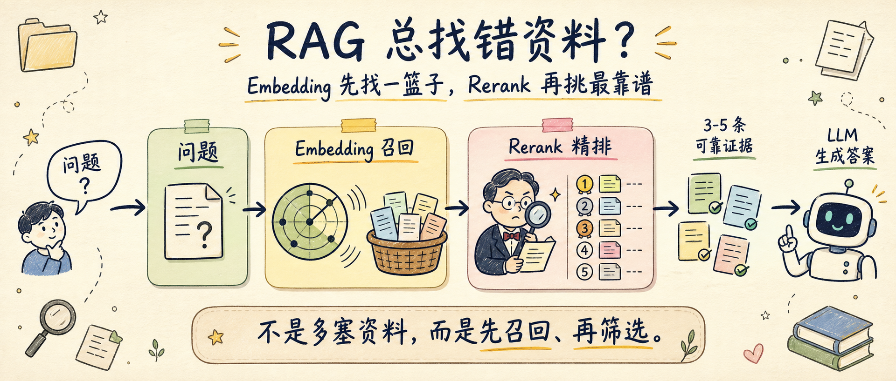
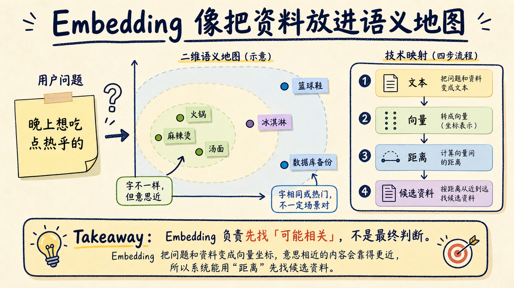
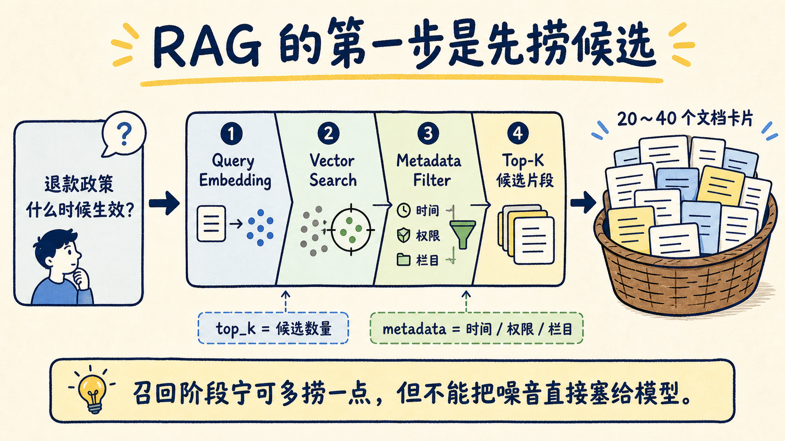
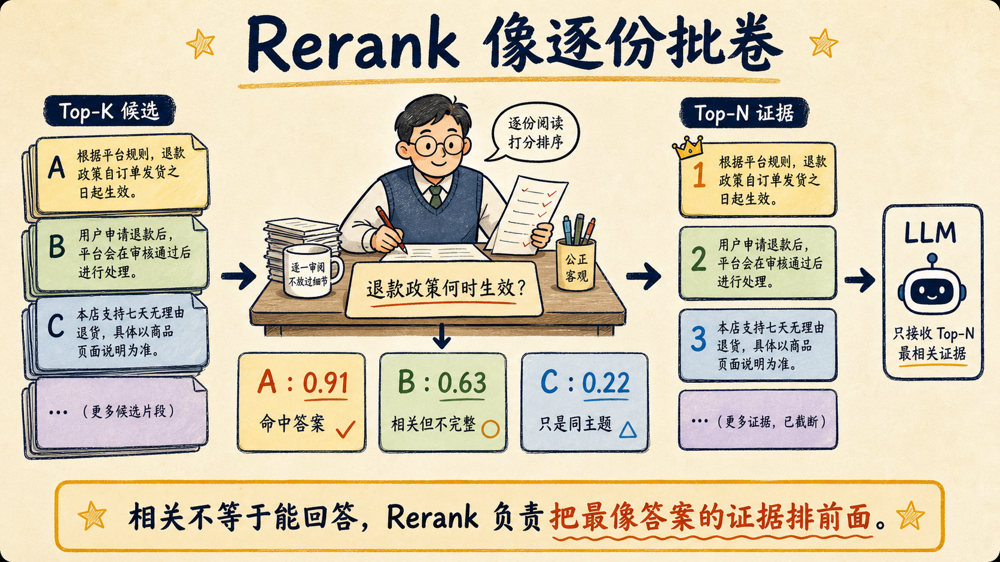
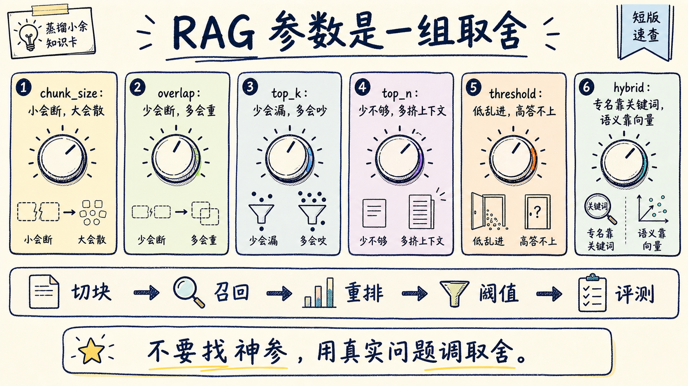

# RAG 总找错资料？Embedding 和 Rerank 讲清楚

RAG 经常答错，不一定是大模型笨，也不一定是知识库太少。很多时候，问题出在资料没有被正确找出来、排好队。

Embedding 负责第一步：把用户问题和资料都变成向量，放到同一张“语义地图”里，先找出一篮子可能相关的片段。Rerank 负责第二步：把这些候选片段逐条拿来和原问题对照，重新排序，只把最像答案的证据交给模型。

用生活里的话说：Embedding 像图书馆里跑得很快的助理，先搬来一车可能有用的书；Rerank 像经验丰富的老师，逐本翻开看，判断哪几页真的能回答这道题。



这篇文章只解决三个问题：

- Embedding 到底是什么，为什么 RAG 离不开它。
- Rerank 到底补了什么，为什么不能只靠向量相似度。
- 参数怎么配，尤其是 `chunk_size`、`overlap`、`top_k`、`top_n`、`score_threshold`。

## 先把 RAG 想成一次“查资料”

RAG 的全称是 Retrieval-Augmented Generation，直译是“检索增强生成”。别被名字吓到，它做的事很朴素：

```text
用户提问 -> 去资料库查资料 -> 把相关资料塞给大模型 -> 让模型基于资料回答
```

这和你写报告很像。老板问你“上季度退款政策为什么影响转化率”，你不会直接拍脑袋写结论。你会先找政策文档、用户反馈、数据报表、客服工单，再把证据整理成答案。

RAG 的麻烦也在这里。资料库大了以后，系统必须先判断“哪些资料可能相关”。如果第一步找错，后面的模型写得再顺，也只是把错误资料包装得更像答案。

所以 RAG 质量的第一道门，不在生成，而在检索。

## Embedding：把文字变成能比较距离的坐标

Embedding 可以理解成“把一段文字变成一串数字”。OpenAI 的 Embeddings API 文档里也这样定义：它会为输入内容生成一个向量表示，返回的是浮点数数组。向量有多长，取决于你选的 embedding 模型。

这串数字不是给人看的，是给机器算距离用的。

生活里可以这样类比：你打开外卖 App，说“晚上想吃点热乎的”。系统不会只找包含“热乎”两个字的店，它会知道火锅、麻辣烫、汤面更接近你的意思，冰淇淋和篮球鞋离得很远。

Embedding 做的就是类似的事。它把“晚上想吃点热乎的”“火锅”“麻辣烫”“汤面”放到语义空间里。意思越接近，坐标距离越近。



放到 RAG 里，流程就是：

```text
文档切块 -> 每块生成 embedding -> 存进向量库
用户问题 -> 生成 query embedding -> 找距离最近的文档块
```

这就是向量检索。它的优势是快，能在很大的资料库里迅速找出一批候选片段。

但这里有一个重要边界：**Embedding 找的是“像不像”，不是“能不能回答”。**

比如用户问：“退款政策从哪一天开始影响企业客户？”

向量检索可能找出这些片段：

- A：退款政策发布日期和生效日期。
- B：企业客户续费流程。
- C：退款政策的客服话术。
- D：某个企业客户的投诉记录。

B、C、D 都“相关”，但真正能回答问题的可能只有 A，再加上一份数据报表。向量距离能帮你先捞候选，却不能保证排第一的就是答案。

## top_k：先拿多少候选，不是越大越好

`top_k` 是 RAG 里最容易被误调的参数。它表示第一阶段先取回多少个候选片段。

你可以把它想成让图书馆助理先搬多少本书。

`top_k=5`，助理只搬 5 本。速度快，但可能漏掉真正有用的书。

`top_k=50`，助理搬 50 本。召回更宽，但噪音变多，后面的人要花更多时间筛。

这就是 RAG 的基本取舍：召回越宽，漏掉答案的概率越低；但噪音、延迟和成本也会变高。



如果没有 rerank，我通常不会把 `top_k` 调得很大。因为这些片段可能直接进大模型上下文，塞多了会挤占 token，还会让模型在噪音里摇摆。

如果有 rerank，`top_k` 可以更大一点。常见做法是先取 20 到 50 个候选，再让 reranker 选出 3 到 8 个最值得给模型看的片段。

关键不是背数字，而是看现象：

- 正确片段经常排在第 8、第 15、第 30 位：应该加 rerank。
- 正确片段根本进不了前 50：rerank 救不了，先查切块、embedding 模型、关键词检索和 query rewrite。
- 前 5 里经常有重复片段：先降 overlap 或做去重，再谈加大 top_k。

## Rerank：把候选资料重新排队

Rerank 的作用，是把第一阶段取回来的候选片段重新排序。

Cohere 的 Rerank 文档里，接口形态很直白：输入一个 `query` 和一组 `documents`，模型会按语义相关性把 documents 从高到低排列，并返回 `relevance_score`。Pinecone 的文档也把它放在两阶段检索里：先从索引查一批结果，再把 query 和结果送给 reranking model 重新打分。

生活里更好理解：Embedding 像助理按目录和印象搬书，Rerank 像老师批卷。

老师不是看卷子标题像不像，而是拿着题目逐份检查：这份有没有回答问题？有没有缺条件？是不是只提到了同一个主题，但没有给出答案？



Rerank 比向量检索慢，因为它通常要把“用户问题 + 候选片段”放在一起读。它不适合跑全库，但非常适合跑在第一阶段筛出来的小候选集上。

所以工程上经常是两段式：

```text
第一段：Embedding / BM25 / Hybrid Search 先取 top_k
第二段：Rerank 对 top_k 重新排序，输出 top_n
```

这套组合的价值很清楚：

- Embedding 负责召回，尽量别漏。
- Rerank 负责精排，尽量别把噪音放前面。
- LLM 负责生成，但只看更可靠的证据。

## 什么时候必须上 Rerank

不是所有 RAG 都需要 rerank。

如果你的知识库很小，问题很固定，文档结构清楚，比如几十条 FAQ，embedding 检索可能已经够用。你加 rerank，质量提升有限，延迟却会增加。

但下面几种场景，我会优先加 rerank。

第一，用户问题很长，包含多个条件。

比如：“2025 年企业版合同里，退款政策对年付客户和月付客户分别怎么处理？”向量检索容易找到“退款政策”相关片段，却忽略“企业版”“2025 年”“年付/月付”这些约束。Rerank 能更认真地对齐条件。

第二，知识库里同主题文档很多。

比如客服知识库里有很多“退款”“发票”“续费”文章。向量检索会觉得它们都相关，但真正能回答某个具体问题的只有几段。

第三，专有名词、编号、条款很多。

合同编号、错误码、政策版本、数据库表名、API 参数，这些信息只靠语义相似度容易飘。更稳的做法是 hybrid search 先把关键词也拉进来，再用 rerank 精排。

第四，正确答案经常在候选里，但不在最前面。

这说明召回已经有了，排序不够好。此时上 rerank，比盲目换大模型更直接。

## 参数怎么配：先给一套起点

RAG 没有万能参数。不同文档、不同问题、不同模型，最优值都会变。

但工程上需要起点。下面这张表可以当第一版配置。

| 场景 | chunk_size | overlap | retrieval top_k | rerank top_n | 说明 |
|---|---:|---:|---:|---:|---|
| FAQ / 短文档 | 300-500 tokens | 30-80 | 8-15 | 3-5 | 问题短，片段也短，别切太大 |
| 技术文档 / 内部知识库 | 600-900 tokens | 80-160 | 20-40 | 4-8 | 最常见的 RAG 起点 |
| 法务 / 制度 / 长 PDF | 800-1200 tokens | 120-250 | 30-60 | 5-10 | 优先按章节切，建议 hybrid + rerank |

OpenAI File Search 的默认设置也能当一个参考坐标：默认 chunk size 是 800 tokens，overlap 是 400 tokens，最多把 20 个 chunks 加入上下文，ranker 是 `auto`，score threshold 是 0。它还规定了 chunk size 的可配置范围，overlap 不能超过 chunk size 的一半。

这个默认值不是所有系统都该照抄。尤其是 400 tokens overlap，在一些自建知识库里可能带来大量重复召回。我的建议是先从 10%-20% overlap 起步，如果跨段漏信息，再往上加。



一套可落地的初始配置可以这样写：

```yaml
chunking:
  chunk_size_tokens: 800
  chunk_overlap_tokens: 120

retrieval:
  method: hybrid
  dense_weight: 0.6
  sparse_weight: 0.4
  top_k: 30

rerank:
  enabled: true
  top_n: 6
  score_threshold: calibrate_from_eval

generation:
  max_context_chunks: 6
  require_citations: true
```

这里最值得注意的是 `score_threshold: calibrate_from_eval`。它不是一个偷懒写法，而是一个工程原则：阈值必须从真实查询和评测集里校准，不要跨模型照搬。

有的 reranker 分数集中在 0.2 到 0.8，有的分数非常尖锐。你把别人的 0.5 拿来用，可能直接把好证据过滤掉，也可能完全拦不住噪音。

## 每个参数到底在调什么

`chunk_size` 控制每个文档块多大。

太小，像把菜谱切成一句一句。系统可能找到“加盐”，却找不到前面的“先把肉腌好”。太大，又像把整本菜谱塞给检索器。命中看似相关，但不够精准。

`overlap` 控制相邻块之间重复多少内容。

它像复印笔记时每页多留几行，避免一个关键句刚好被切断。overlap 太低，跨段信息容易断；overlap 太高，检索结果里会出现大量近重复片段，模型看到的证据反而变少。

`top_k` 控制第一阶段先捞多少候选。

它影响召回。top_k 太小容易漏，太大容易慢，还会给 rerank 带来更多成本。

`top_n` 控制 rerank 后给大模型多少片段。

它影响生成阶段的上下文质量。top_n 太少，证据不足；top_n 太多，模型会被相似但不关键的片段分散注意力。

`score_threshold` 控制低分证据能不能进上下文。

它像餐厅门口的评分线。线太低，什么店都能进；线太高，可能一家店都不剩。上线前要记录“好答案”和“坏答案”的分数分布，再决定阈值。

`hybrid_search.embedding_weight` 控制语义检索和关键词检索的权重。

如果用户经常问“ORA-00942”“合同第 7.2 条”“SKU-8841”，关键词很重要，不能只靠向量。若用户问的是“怎么降低客服误判”，语义相似更重要，可以提高 dense embedding 的权重。

## 一个最小可用工作流

如果你正在搭自己的 RAG，我会按这个顺序做。

第一步，先整理文档结构。

标题、章节、表格、更新时间、权限、来源 URL，这些 metadata 要先保住。别一上来就把所有 PDF 切成等长文本块。

第二步，按文档类型切块。

FAQ 用小块，技术文档用中等块，制度和合同尽量按章节、条款、表格语义切。切块质量差，后面所有参数都像在补漏。

第三步，先跑 embedding 检索。

拿 30 到 50 个真实问题做评测，看正确片段能不能进 top_k。这个阶段只看召回，不急着看生成答案。

第四步，再加 rerank。

如果正确片段经常在 top_k 里但排序靠后，就上 rerank。把 `top_k` 调到 20-40，把 `top_n` 设成 4-8，观察最终上下文是否更干净。

第五步，校准 threshold。

记录每次 rerank 的分数、最终是否答对、是否引用正确。等你有几十到几百条样本，再决定阈值。

第六步，加拒答。

当所有候选分数都低，或者 top_n 证据彼此矛盾，不要让模型硬答。更好的回答是：“当前资料不足，我找到了 A 和 B，但缺 C。”

## 常见误区：把 Embedding 当成数据库大脑

Embedding 不是记忆本身，也不是推理本身。它只是把资料变成可检索的坐标。

所以不要期待向量库自动理解权限、时间、版本、业务规则。比如“旧退款政策”和“新退款政策”在语义上很近，但业务上可能完全不能混用。这个问题要靠 metadata filter、版本字段、时间范围和生成前检查解决。

也不要把 rerank 当成万能过滤器。Rerank 只能重排已经拿到的候选。如果第一阶段没有召回正确片段，rerank 没有东西可排。

更不要用“把 top_k 调到 100”代替系统设计。候选越多，rerank 越慢；上下文越多，模型越容易被噪音干扰。RAG 的目标不是多塞资料，而是把最有用的证据放在最前面。

## 最后给一张判断表

你可以用下面这张表快速判断该调哪里。

| 现象 | 优先检查 |
|---|---|
| 答案完全找不到 | 切块、embedding 模型、query rewrite、hybrid search |
| 正确片段在 top_k 里但靠后 | 加 rerank，调大 top_k，调 top_n |
| 引用很多但都不关键 | 降 top_n，提高 threshold，检查 rerank |
| 结果里重复片段很多 | 降 overlap，做去重，按 parent document 合并 |
| 专有名词经常漏 | 加 BM25 / sparse search，降低纯语义依赖 |
| 回答经常过期 | metadata 加时间字段，检索时做版本过滤 |
| 模型胡乱补全 | 加 score threshold、拒答策略、引用约束 |

RAG 的可控性，来自把“找资料”这件事拆开看。

Embedding 解决“先去哪里找”。Rerank 解决“找到的一堆资料谁更值得信”。参数配置解决“召回、精度、成本、延迟之间怎么取舍”。

能把这三层分清，RAG 就不再是一个黑盒问答框，而是一条能调、能测、能追责的资料流水线。

我的建议很简单：别先追求复杂架构。先拿 50 个真实问题，记录每个问题的 top_k、rerank 分数、最终引用和答案对错。

只要这张表跑起来，你就会很快知道：问题到底出在 embedding 没找着，rerank 没排对，还是模型拿着资料仍然没答好。

回复「RAG 参数」，我可以继续整理一份可直接复制的 RAG 评测表：包含问题、期望证据、top_k 命中、rerank 分数、引用正确率和调参记录。

---

参考资料：

- OpenAI：Embeddings API Reference  
  <https://platform.openai.com/docs/api-reference/embeddings>
- OpenAI：Assistants File Search  
  <https://platform.openai.com/docs/assistants/tools/file-search>
- Cohere：Rerank Overview  
  <https://docs.cohere.com/docs/rerank-overview>
- Pinecone：Rerank Results  
  <https://docs.pinecone.io/guides/search/rerank-results>
- Qdrant：Hybrid Search with Reranking  
  <https://qdrant.tech/documentation/advanced-tutorials/reranking-hybrid-search/>
