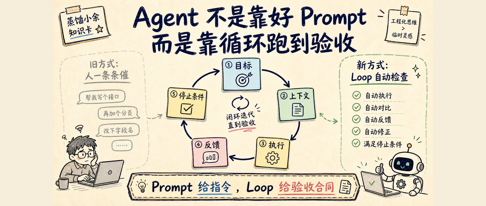
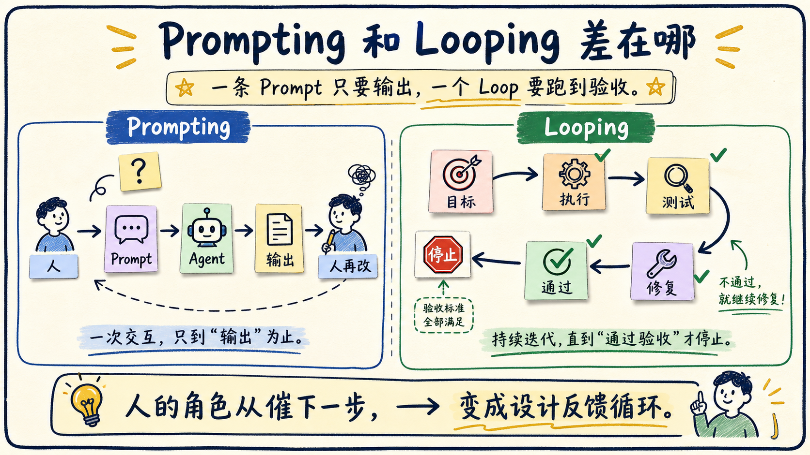
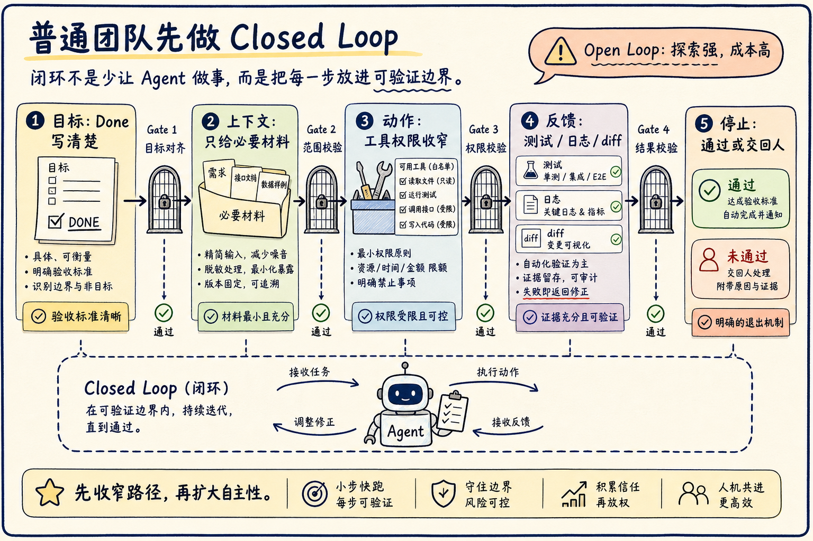
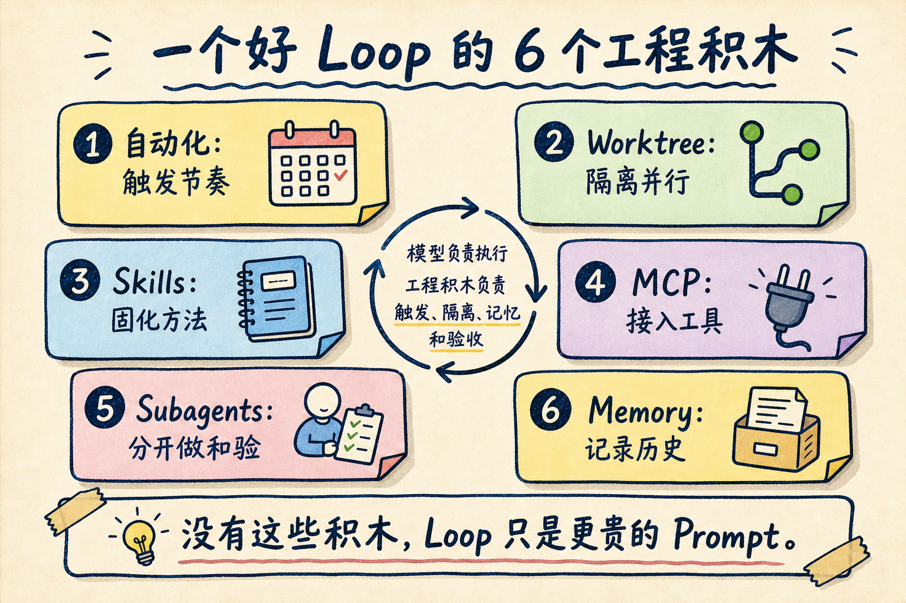

# Agent 不是靠好 Prompt，而是靠循环跑到验收

Agent 交付不稳，很多时候不是 Prompt 写得不够漂亮，而是它没有被放进一个能持续反馈、自动修正、知道何时停下来的循环里。

一条 Prompt 给的是指令。一个 Loop 给的是工作合同：目标是什么，能看哪些上下文，能做哪些动作，怎么检查结果，什么时候算完成，什么时候必须交回给人。

这就是最近 “Loop Engineering” 被反复提起的原因。它不是让工程师退出工作，而是把工程师的判断前移：不再一条条催 AI 下一步，而是设计一个能让 Agent 自己推进、自己验证、自己收敛的闭环。



## Loop 解决的不是表达问题，而是反馈问题

Rahul 这篇 X 长文从两句传播很广的话讲起。

Peter Steinberger 说，不应该再只是提示 coding agents，而应该设计能提示 agents 的 loops。Boris Cherny 也表达过类似意思：他不再直接 prompt Claude，而是运行会 prompt Claude、判断下一步该做什么的 loops。

这两句话容易被误读成一句新口号：别写 Prompt，写 Loop。

更准确的理解是：Prompt 还是要写，但 Prompt 不再是唯一的工程对象。真正要设计的是一套反馈系统。

过去你这样工作：

```text
你写 Prompt -> Agent 给输出 -> 你看哪里不对 -> 你再写下一条 Prompt
```

这里面真正的循环是人。Agent 只是在每一轮里响应。

Loop Engineering 要做的，是把这条人工循环外部化：

```text
目标 -> 计划 -> 执行 -> 检查 -> 修复 -> 再检查 -> 通过后停止
```

这时 Agent 不只是“回答你”，而是在一个可验证流程里工作。



OpenAI 在解释 Codex 长任务时也用了类似结构：plan、edit code、run tools、observe results、repair failures、update docs/status，然后 repeat。重点不是模型突然会了魔法，而是工具、测试、日志、diff、文件和状态给了它真实反馈。

没有反馈，Agent 只能把下一段话写得更像答案。有反馈，Agent 才能知道自己错在哪里。

## 普通团队先做 Closed Loop

Loop 有一个容易被忽略的分叉：open loop 和 closed loop。

Open loop 给 Agent 一个比较大的目标，让它自己探索路径。它适合研究、探索、长链路创新，也最容易让人兴奋。但它有三个现实问题：成本高、权限边界难控、结果不稳定。

Closed loop 更无聊，也更适合落地。人先把路径设计窄，把每一步的输入、工具、检查和停止条件写清楚。Agent 仍然可以循环，但只能在这个框架里循环。

我的建议很直接：绝大多数团队先做 closed loop。

因为真实工程里，最贵的不是模型输出慢一点，而是一个自动化流程在错误方向上跑太远。没有质量闸门的 open loop，很容易从“自主 Agent”变成“自动制造返工”。



一个最小可用 closed loop 至少要有五个闸门。

| 闸门 | 要写清什么 |
|---|---|
| 目标 | 什么叫 done，不要只写“优化一下” |
| 上下文 | 需要读哪些文件、资料、日志，哪些不要读 |
| 动作 | 允许用哪些工具，哪些操作必须先问 |
| 反馈 | 用测试、lint、截图、diff、引用、人工 review 里的哪一种检查 |
| 停止 | 什么时候结束，什么时候重试，什么时候交回给人 |

这张表比“请认真一点”有用得多。

比如你让 Agent 修一个登录 bug，普通 Prompt 是：

```text
帮我修复登录失败的问题。
```

一个 closed loop 会写成：

```text
目标：修复密码登录在 Safari 下偶发 401 的问题。

上下文：
- 先读 auth 相关代码、最近 20 条失败日志、登录测试。
- 不改支付、用户资料和权限系统。

动作：
- 可以修改 auth client 和相关测试。
- 需要新增依赖、改数据库 schema、删除数据时停止并询问。

反馈：
- 每轮修改后运行 auth unit tests。
- 如果失败，读取错误并只针对失败原因继续修。

停止：
- auth tests 全部通过，并总结改动文件、验证命令和剩余风险。
```

这才像一个能交出去的工程任务。

## 一个好 Loop 需要 6 个工程积木

Rahul 原文列了六个 building blocks：automations、worktrees、skills、plugins/connectors、subagents、memory。这个框架有用，因为它把 “Loop Engineering” 从抽象口号拉回到具体系统。

我会这样理解它们。



第一，automations 负责触发。

稳定、重复的流程才值得自动跑。Codex best practices 里有一句很好的判断：skills define the method, automations define the schedule。也就是说，先把方法固化，再让它按节奏运行。

第二，worktrees 负责隔离。

多个 Agent 并行跑时，文件冲突不是小问题。Git worktree 的价值，是让每个 Agent 在独立 checkout 和分支上工作。这样并行不是“大家抢同一张桌子”，而是每个人有自己的工作台。

第三，skills 负责把方法沉淀下来。

一个 skill 不是一句更长的 Prompt，而是一套可复用工作流：说明、参考资料、脚本、模板、边界。没有 skills，Agent 每次都重新猜你的项目规则；有 skills，loop 每跑一次都更像在同一个工程体系里工作。

第四，MCP 和 connectors 负责进入真实环境。

只看本地文件的 loop 很小。真实工作往往还要读 Linear、GitHub、Figma、数据库、浏览器、内部知识库。MCP 的价值是把这些外部能力用明确边界接进来：哪些是只读资源，哪些是可执行工具，哪些动作风险更高。

第五，subagents 负责把“做”和“验”分开。

写代码的 Agent 不应该永远自己给自己打分。更稳的结构是一个 Agent 实现，另一个 Agent 只按 spec 检查；一个 Agent 负责探索，另一个 Agent 负责复核证据。Claude Code 的 subagents 已经支持自定义提示、工具限制、权限模式、hooks、skills 和独立 memory，本质就是在帮你做角色边界。

第六，memory 负责让循环不要从零开始。

长期 loop 最怕失忆。跑过哪些方案，哪些测试失败过，哪些风险被确认过，不能只留在一次对话里。更可靠的位置是仓库文件、任务系统、研究笔记、AGENTS.md、CLAUDE.md 或明确的 memory 层。

Loop 的质量，很多时候不取决于“模型多聪明”，而取决于这些工程积木有没有把 Agent 约束在正确轨道上。

## 成本是 Loop 的第一道现实门槛

Loop 会烧 token。

一次中等 coding loop 可能要读代码、写补丁、跑测试、读失败、修复、再跑。加上 subagents、日志和多轮验证，token 很快上去。原文提到 50K 到 200K tokens 的单 Agent 任务、几十万到几百万 tokens 的 fleet loop，并不夸张。

所以便宜模型确实重要。

DeepSeek 官方价格页当前列出的 DeepSeek-V4-Flash / Pro 都是 1M context、最高 384K output，并支持 JSON output 和 tool calls。Flash 的 cache-miss input 是 $0.14 / 1M tokens，output 是 $0.28 / 1M tokens；Pro 的 cache-miss input 是 $0.435 / 1M tokens，output 是 $0.87 / 1M tokens。Flash 并发限制也更高。

这会让很多循环第一次变得“跑得起”。

但这里要加一个边界：便宜模型降低的是试错成本，不自动提高验收质量。一个没有测试、没有停止条件、没有权限边界的 loop，用便宜模型跑，只是更便宜地跑偏。

真正的成本控制有三层。

第一层是缩窄路径。能 closed loop 就不要 open loop；能只读三类文件，就不要让 Agent 扫全仓。

第二层是拆分模型。规划、执行、校验、摘要不一定都用同一个最贵模型。简单检查可以用便宜模型，关键决策再升级。

第三层是减少重复上下文。把稳定规则写进 skills，把状态写进文件，把失败记录留下来，不要每一轮都靠超长 Prompt 重新解释世界。

## 两个最小可用例子

第一个是 coding loop。

```text
读 VISION.md / ARCHITECTURE.md / 当前 issue
-> 制定一个最小修改计划
-> 修改代码
-> 运行测试
-> 失败就读错误并修复
-> 通过就写交付说明
-> 停止
```

这个 loop 的关键不是“会改代码”，而是每轮都用测试和 diff 收敛。没有测试，就换成截图、类型检查、lint、静态分析或人工 review。总之必须有反馈对象。

第二个是研究 loop。

```text
定义研究问题
-> 搜一手来源
-> 摘要每个来源的证据
-> 对照原问题检查缺口
-> 继续补资料或停止
-> 输出带来源的结论
```

这个 loop 的关键是反证和缺口检查。不要让 Agent 搜到前三个页面就开始写报告。它要先问：证据是否来自一手材料？有没有相互矛盾？有没有只证明了相关性，却没有证明结论？

你会发现，好的 loop 都不神秘。它们只是把“一个靠谱工程师本来就会做的自检动作”写成了可重复流程。

## Prompt Engineer 和 Loop Engineer 的差别

Prompt Engineer 优化的是一次输出。

Loop Engineer 优化的是一个系统在多轮反馈后能不能稳定到达结果。

前者关心这句话怎么写得更准确。后者关心这些问题：

- 目标是否可验收？
- 上下文是否足够但不过量？
- Agent 有没有权限做危险动作？
- 检查者是不是和执行者分开？
- 失败信息能不能自动回到下一轮？
- 状态是否写在对话外面？
- 什么时候必须停？

这不是文案能力的升级，而是软件工程能力的回归。

也正因为如此，Loop Engineering 不会让人类更轻松地“不懂”。它恰恰要求人更懂流程、更懂边界、更懂验证。否则你设计出来的不是 loop，而是一台自动扩大错误的机器。

## 明天怎么开始

不要一上来就做 fleet loop，也不要先搭复杂 orchestrator。

从一个很小、重复、可验收的任务开始。

比如：

- 每天早上扫描 CI 失败，找出最可能的原因并给出修复建议。
- 每次改代码后自动跑相关测试，失败就让 Agent 只针对错误修一轮。
- 每周整理一次仓库里的 TODO、近期决策和未解决风险。
- 每次写文章前抓取来源、补一手资料、生成研究笔记和引用清单。

选任务时只看一个标准：它能不能写出明确的 done。

如果 done 写不清，先别自动化。那不是 Agent 问题，是流程还没准备好。

我的落地清单是：

| 检查项 | 起步做法 |
|---|---|
| 目标 | 写一句可验证的 done |
| 上下文 | 指定 3 到 5 个必读文件或数据源 |
| 权限 | 明确哪些操作只读，哪些必须暂停询问 |
| 反馈 | 选一个硬信号：测试、lint、截图、引用、人工 review |
| 记忆 | 把状态写进文件，不只放在聊天里 |
| 成本 | 先限制轮数、token、文件范围和并发 |
| 复盘 | 每次失败后修改 loop，而不是只改下一条 Prompt |

## 结论：Prompt 还在，但杠杆变了

Loop Engineering 真正改变的，不是 Prompt 不重要了，而是 Prompt 变成了系统的一部分。

以前人的主要工作，是在每轮输出后继续提示 Agent。现在更值得做的，是把目标、上下文、动作、反馈和停止条件设计成循环，让 Agent 在边界内自己推进。

这并不意味着人可以退场。

恰恰相反，人要把判断放到更上游：什么任务值得自动化，什么反馈才算可靠，什么权限不能交出去，什么结果必须人工确认。

一个可靠的 loop，确实比一千条漂亮 Prompt 更值钱。

但前提是：你仍然是那个懂工作的人，而不是只会按下开始按钮的人。

## 参考资料

- [Rahul: Loops: What Every AI Engineer Needs to Know in 2026](https://x.com/sairahul1/status/2064277888216555684)
- [Addy Osmani: Loop Engineering](https://addyosmani.com/blog/loop-engineering/)
- [OpenAI Developers: Run long horizon tasks with Codex](https://developers.openai.com/blog/run-long-horizon-tasks-with-codex)
- [OpenAI Developers: Codex best practices](https://developers.openai.com/codex/learn/best-practices)
- [OpenAI Developers: Codex worktrees](https://developers.openai.com/codex/app/worktrees)
- [OpenAI Developers: Follow a goal](https://developers.openai.com/codex/use-cases/follow-goals)
- [OpenAI Developers: Agent Skills](https://developers.openai.com/codex/skills)
- [OpenAI Developers: Customization, MCP and subagents](https://developers.openai.com/codex/concepts/customization)
- [OpenAI Developers: Codex memories](https://developers.openai.com/codex/memories)
- [Claude Code Docs: Subagents](https://code.claude.com/docs/en/sub-agents)
- [Claude Code Docs: Hooks](https://code.claude.com/docs/en/hooks)
- [Claude Code Docs: Memory](https://code.claude.com/docs/en/memory)
- [DeepSeek API Docs: Models & Pricing](https://api-docs.deepseek.com/quick_start/pricing)
