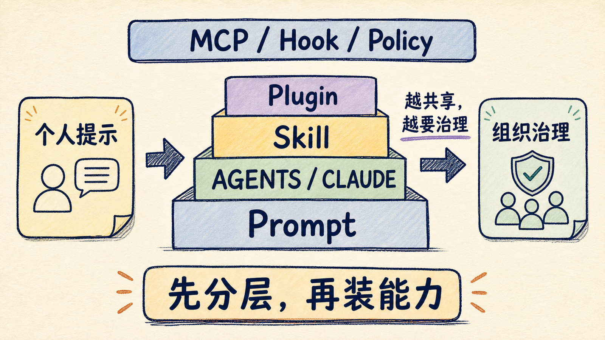
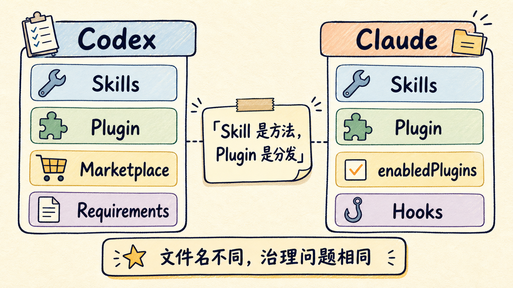
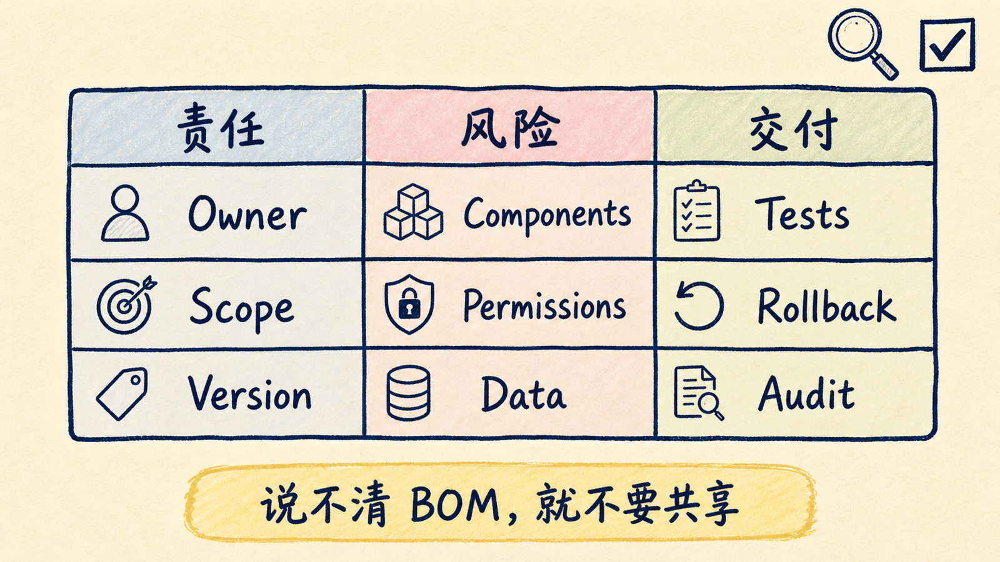
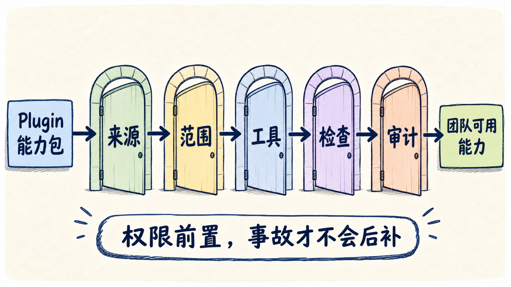
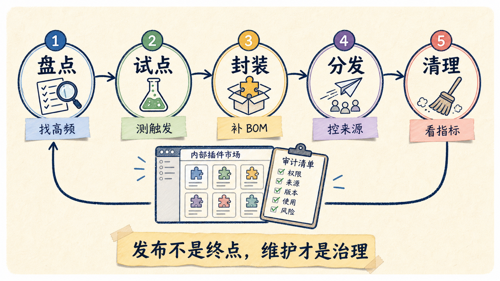

# Codex、Claude 插件越装越乱？企业落地先管边界

企业用 Codex 和 Claude Code 的插件，最大风险不是插件不够多，而是每个人都在把自己的工作习惯、外部工具和权限开关装进 AI 工作台，最后没人知道这些能力来自哪里、能读什么数据、会在什么时刻自动执行。

所以企业落地插件的第一原则不是“多装几个好用的”，而是先管四件事：**来源、范围、权限、生命周期**。

插件应该被当成一段可分发的软件，而不是一段更长的提示词。它需要 owner、版本、权限说明、测试样例、回滚方式和审计路径。只有这几件事清楚，Codex 和 Claude 才能从个人效率工具，变成团队能放心复用的工程基础设施。

## 先把插件放回能力栈

很多团队一听到 Plugin，就会直接问：我们要不要建一个内部插件市场？

这个问题太早了。

更好的起点是先分清每一层能力到底解决什么问题。

最底层是一次性 Prompt，适合临时约束。比如“这次只看 diff，不改代码”。它应该留在当前对话里，不要上升成制度。

再往上是 `AGENTS.md` 和 `CLAUDE.md` 这类项目说明，适合放稳定事实：仓库怎么跑测试、哪些目录不能碰、发布前要看什么。Codex 官方文档明确说，`AGENTS.md` 会按 global、project、当前目录层层加载；越靠近当前目录的规则越具体。这个机制适合管理项目习惯，不适合承载一大段复杂流程。

真正的可复用方法，应该沉淀成 Skill。Skill 的价值是把一条工作流写清楚：什么时候触发、需要读哪些资料、怎么验证、失败时怎么处理。OpenAI 和 Anthropic 都把 Skills 放在插件体系的核心位置，因为它比项目说明更像“可调用的操作手册”。

Plugin 再往上一层。它解决的不是“方法怎么写”，而是“怎么安装、共享、更新、组合”。一个插件可以包含 Skill，也可以绑定 MCP、Hook、Agent、LSP、监控脚本和默认设置。到了这一层，它就已经不是文档，而是团队能力包。

最外层是企业策略：managed settings、requirements、permission profiles、marketplace allowlist、审计日志。它们的作用不是让模型更聪明，而是防止聪明的模型跑到不该跑的地方。

我建议企业内部用一句话统一认知：

**Skill 解决方法复用，Plugin 解决分发，MCP 解决外部连接，Hook 解决强制约束，Managed Policy 解决不可绕过的边界。**

## Codex 和 Claude 的共同规律：先做 Skill，再做 Plugin

Codex 和 Claude Code 的具体文件名不一样，但治理逻辑很接近。

OpenAI 文档里，Codex Skill 是 reusable workflow 的 authoring format；Plugin 是 installable distribution unit。也就是说，先把工作流写成 Skill，等它稳定、有复用价值，再打包成 Plugin。

Anthropic 文档里的判断也类似：个人、单项目、快速实验，放在 `.claude/` 里；跨项目复用、团队共享、版本更新、marketplace 分发，再做 Plugin。

这条顺序很重要。

很多团队失败在反过来做：先搭 marketplace，再问每个团队要不要贡献插件。结果插件列表很快膨胀，里面混着半成品脚本、过期 Prompt、没人维护的 MCP 连接和权限很大的工具。看起来像生态，实际是配置垃圾场。

更稳的路线是：

1. 在真实项目里用 Prompt 或项目说明跑通一次。
2. 把重复出现的步骤收进 Skill。
3. 用两三个真实任务验证 Skill 是否稳定。
4. 给 Skill 加 owner、输入输出、验证命令和失败处理。
5. 需要跨项目分发时，再封装成 Plugin。

这不是保守，而是把插件当软件交付来做。

软件不会因为放进仓库就可靠，插件也不会因为叫 Plugin 就可控。它必须经历需求、实现、测试、发布和维护。

## 企业需要的不是插件列表，而是插件物料清单

如果一个插件准备进入团队共享范围，我会要求它先补一张 Plugin BOM。

BOM 是 Bill of Materials。这里不是硬件清单，而是插件的工程责任清单。

最小清单可以这样写：

| 字段 | 要回答的问题 |
|---|---|
| Owner | 谁负责维护，离职或转岗后谁接手 |
| Scope | 给个人、项目、团队，还是整个公司 |
| Source | 来自内部仓库、官方市场，还是第三方 Git 源 |
| Version | 是否 pin 了 tag、commit 或语义版本 |
| Components | 包含 Skills、MCP、Hooks、Agents、Monitors 中的哪些 |
| Permissions | 会读写哪些文件、调用哪些外部系统、触发哪些命令 |
| Data | 可能接触代码、日志、客户数据、密钥还是公开资料 |
| Test prompts | 用哪些样例证明它会触发、会停止、不会误伤 |
| Rollback | 出问题时怎么禁用、卸载、降级 |
| Audit | 需要记录哪些调用、安装、配置变更和异常 |

这张表会暴露很多假成熟。

比如一个“发布助手”插件，如果只有一个 Skill，风险很低；如果它还带 Hook、MCP 和浏览器自动化，就要明确它能不能发生产环境、能不能读取密钥、能不能改远端状态。

再比如一个“安全审查”插件，如果只是读 diff 给建议，和一个会自动修改代码、安装依赖、调用外部扫描器的插件，风险不是一个等级。

企业真正要管的不是插件数量，而是每个插件的爆炸半径。

## 权限要前置，不要等事故后补文档

插件治理里最容易被低估的是权限。

AI 编程工具的插件通常不是静态 UI 扩展。它们可能带来工具调用、文件读写、网络访问、OAuth 授权、后台监控和自动 Hook。企业里如果只做“插件安装审批”，还不够。

我会把权限拆成五道闸门。

第一道是 marketplace 来源。

Codex 支持 repo 或个人 marketplace，也支持通过 CLI 添加 marketplace。Claude Code 也支持 `extraKnownMarketplaces`，企业还可以用 managed-only 的 `strictKnownMarketplaces` 限制用户只能从批准来源安装。落地时不要让员工随便从任何 GitHub 地址装插件，先做一个内部批准列表。

第二道是安装范围。

Claude 的 plugin install 支持 `user`、`project`、`local` scope。项目级安装会写入仓库 `.claude/settings.json`，适合团队共享；local 适合个人试验；user 适合个人跨项目默认能力。Codex 也有 repo、user、admin、system 多层能力来源。企业要明确：试验能力进 local，项目能力进 project/repo，组织强制能力进 managed/admin。

第三道是 MCP 权限。

MCP 不是“工具越多越好”。Codex 的 MCP 配置可以做 enabled tools、disabled tools、默认 approval mode 和 per-tool approval；Claude 的 MCP 配置可以用 `oauth.scopes` pin 授权范围，也可以用 `headersHelper` 接内部 SSO 或短期 token。企业应该给每个 MCP server 写清楚：哪些工具默认只读，哪些工具必须询问，哪些工具不能开放。

第四道是 Hook。

Hook 的价值是确定性。比如工具调用前扫描密钥、阻止改受保护文件、格式化代码、审计配置变更。Codex 官方文档提到 non-managed hook 需要 review/trust，managed hook 由策略信任且不能被用户禁用。Claude 文档也建议用 hooks 做格式化、通知、保护文件和配置审计。企业应该把安全类 Hook 放到 managed 层，而不是靠每个人自觉启用。

第五道是审计。

OpenAI 的企业文档里，Codex 有 Analytics Dashboard/API 和 Compliance API，用来追踪 adoption、token、Code Review 和活动日志。Claude Enterprise 也把 Compliance API、managed policy settings、OpenTelemetry metrics 放进企业方案里。插件如果能影响代码、数据或外部系统，就应该能回答：谁装了，谁启用了，什么时候调用了，出了问题怎么追。

## 不要做一个万能插件

插件越大，越难治理。

一个常见错误，是把公司所有 AI 编程习惯都塞进 `company-ai-plugin`：代码审查、写测试、发布、查工单、读日志、生成周报、发 Slack，全在一个包里。

这种插件短期看省事，长期会变成组织级单点风险。任何一次更新都可能影响所有工作流；任何一个高权限 MCP 都会扩大整个插件的安全边界；任何一个 Hook 写错，都可能让无关任务一起被打断。

更好的拆法是按任务和权限边界拆：

| 插件类型 | 适合包含 |
|---|---|
| `repo-reviewer` | 代码审查 Skill、只读 diff 工具、审查输出模板 |
| `release-guard` | 发布检查 Hook、版本清单、CI 状态读取 |
| `incident-runbook` | 事故复盘 Skill、日志读取 MCP、时间线模板 |
| `design-qa` | 截图检查 Skill、浏览器工具、视觉验收清单 |
| `internal-docs` | 内部知识库 MCP、引用规则、只读检索策略 |

拆小以后，启用策略也更清楚。新人可以默认只启用 `repo-reviewer`；发布负责人再启用 `release-guard`；SRE 才拿到 `incident-runbook` 里的日志权限。

插件治理的目标不是统一成一个巨型入口，而是让每条工作流有清楚边界。

## 五步把插件落到企业里

我会按五步推进，而不是一次性铺开。

第一步，盘点重复工作。

不要从“有哪些插件可装”开始，而是问工程团队每周重复解释最多的工作流是什么。比如 PR review、前端截图验收、RAG 评测、发布检查、事故复盘、需求拆解。只有高频、稳定、有明确验收标准的工作流，才值得先做。

第二步，做一个项目级试点。

先在一个仓库里用 `.claude/skills/`、`.agents/skills/` 或项目说明跑起来。不要一开始就上全公司。试点阶段重点看三件事：触发是否准确，输出是否稳定，失败时是否会停下来。

第三步，封装成插件。

Codex 侧用 `.codex-plugin/plugin.json`，Claude 侧用 `.claude-plugin/plugin.json`。同时补 README、BOM、示例任务、权限说明和回滚方式。如果插件有外部连接，MCP scope 和工具审批策略要一起进文档。

第四步，进入受控分发。

Codex 可以用 repo marketplace、个人 marketplace、workspace sharing。Claude 可以用 marketplace、`enabledPlugins` 和安装 scope。企业内部至少要做到：来源可控、版本可追、默认启用策略明确、高风险插件默认关闭。

第五步，接入治理闭环。

上线后看触发率、失败率、误触发、权限提示、审计日志和用户反馈。不要把插件发布当终点。一个插件如果三个月没人维护、没人验证、文档和权限已经过期，就应该下架或降级。

## 给团队的一份最小制度

如果你现在要在公司里写第一版插件管理规范，我建议先写得很短。

可以直接从这 10 条开始：

1. 所有共享插件必须有 owner。
2. 所有共享插件必须说明来源、版本和安装范围。
3. 高权限插件默认不自动启用。
4. 第三方 marketplace 必须经过批准。
5. MCP server 必须声明工具列表、数据范围和授权 scope。
6. 会写文件、跑命令、调外部系统的能力必须有审批或 Hook 保护。
7. 安全类 Hook 放 managed/admin 层，不靠个人启用。
8. 每个插件至少保留 3 个 test prompts。
9. 每个插件必须有禁用、卸载或降级路径。
10. 每季度清理无人维护、无调用、权限过大的插件。

这份制度不复杂，但足够挡住大部分混乱。

企业落地 Codex 和 Claude，不是把个人电脑上的好用配置复制给所有人。真正要复制的，是一套能持续更新、能被审计、能安全失败的工作流。

插件是很好的承载格式。它能把经验变成可安装能力，也能把能力变成可治理的软件资产。

前提是别让它变成另一种影子 IT。

最后，我会用一个简单判断收尾：如果一个插件说不清“谁维护、从哪来、能碰什么、怎么验证、怎么回滚”，它就还不应该进入团队共享范围。

回复「插件治理」，我可以继续整理一份企业内部 Plugin BOM 模板，包含 Codex 和 Claude 两套目录、manifest、权限字段和上线检查表。

---

参考资料：

- OpenAI Codex：Plugins：<https://developers.openai.com/codex/plugins>
- OpenAI Codex：Build plugins：<https://developers.openai.com/codex/plugins/build>
- OpenAI Codex：Agent Skills：<https://developers.openai.com/codex/skills>
- OpenAI Codex：Managed configuration：<https://developers.openai.com/codex/enterprise/managed-configuration>
- OpenAI Codex：MCP：<https://developers.openai.com/codex/mcp>
- Anthropic Claude Code：Create plugins：<https://code.claude.com/docs/en/plugins>
- Anthropic Claude Code：Plugins reference：<https://code.claude.com/docs/en/plugins-reference>
- Anthropic Claude Code：Settings：<https://code.claude.com/docs/en/settings>
- Anthropic Claude Code：Hooks：<https://code.claude.com/docs/en/hooks-guide>
- Anthropic Claude Code：MCP：<https://code.claude.com/docs/en/mcp>
