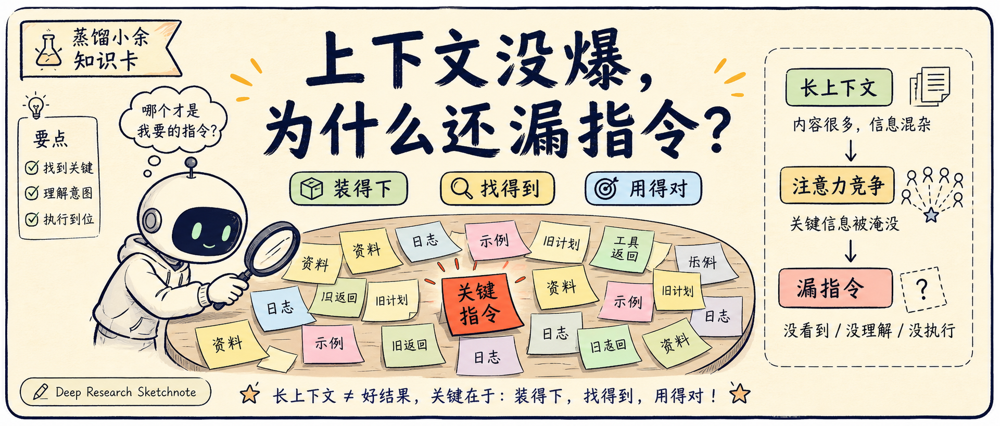
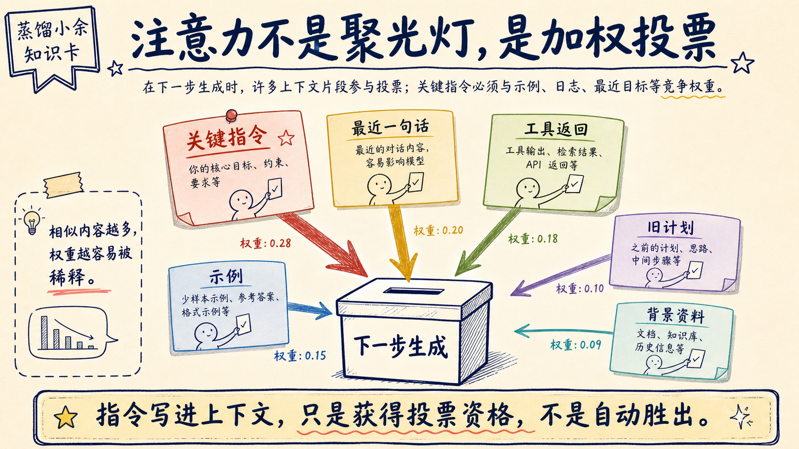
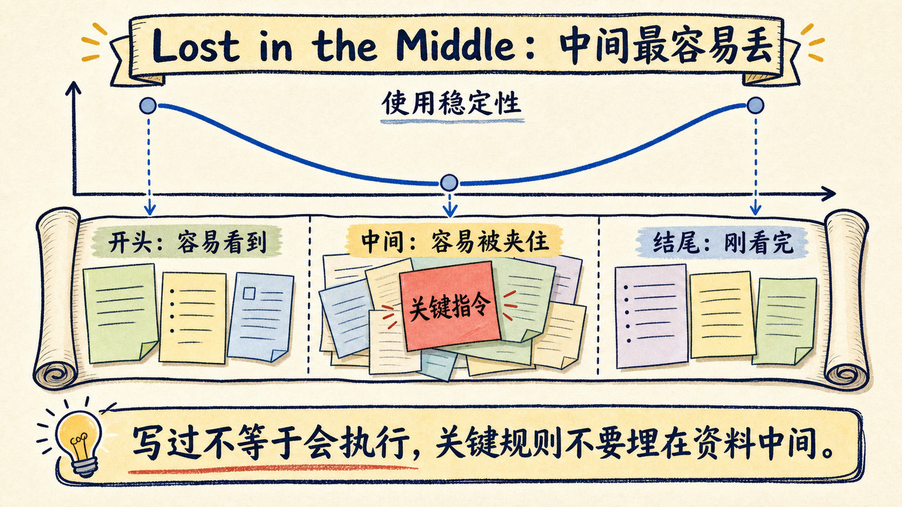
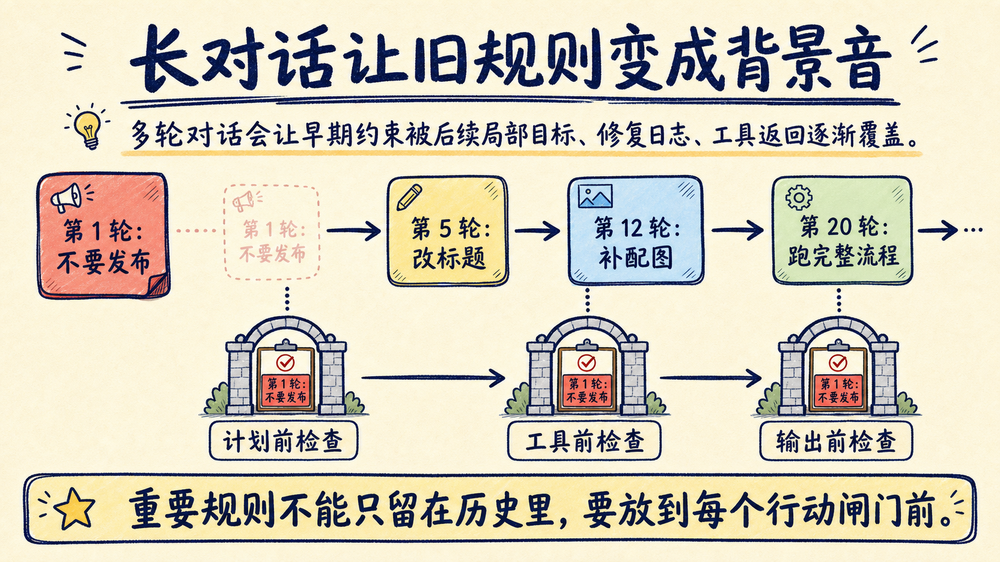
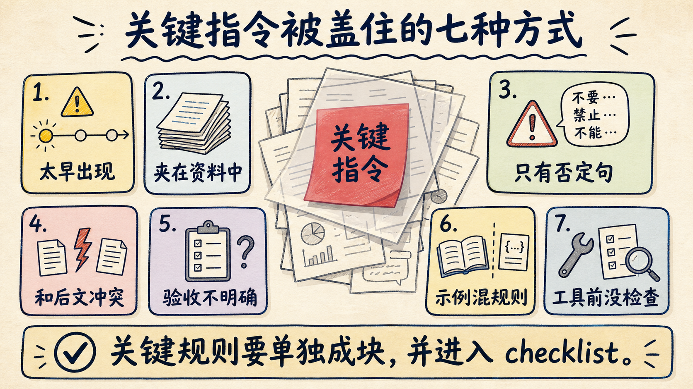
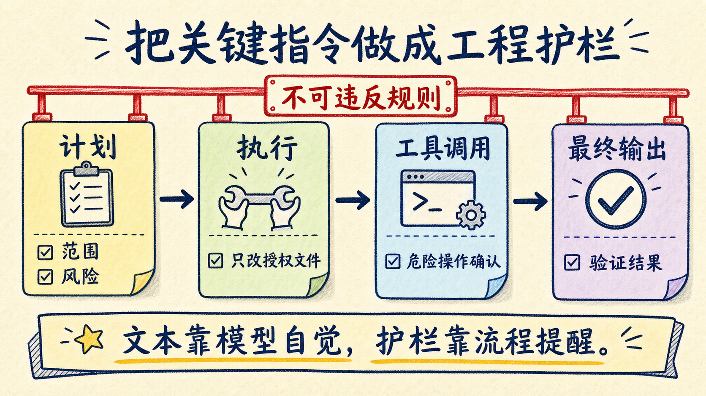
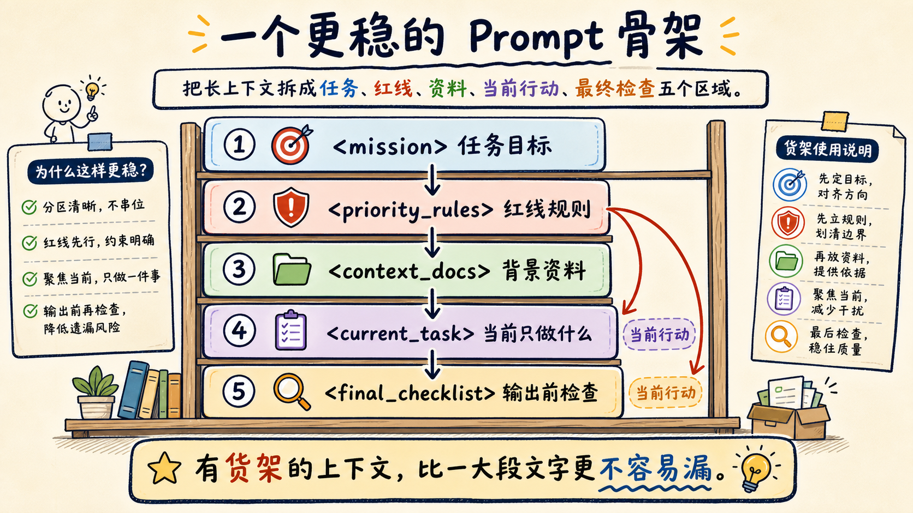

# 上下文没爆，模型为什么还漏指令？

上下文没有超过限制，只说明模型还能把这些 token 放进输入里，不说明它会像人类做会议纪要一样，把每条关键指令按重要性排好、记牢、执行到底。

这就是很多人用长上下文模型时最容易误判的地方。

你明明把规则写进去了，模型也没有提示超出窗口，甚至上一轮还承认“我会遵守”。但过几轮以后，它还是会漏掉一条关键要求：别改某个文件、输出必须带引用、先跑测试再总结、不要把草稿发布出去。

问题不一定是模型“没看到”。更常见的情况是：它看到了，但在生成下一步时，注意力被别的信息稀释了。



把长上下文想成一张越来越大的会议桌。窗口越大，能坐下的人越多；但主持人每次发言前，仍然只能根据当前问题快速扫一圈。坐在角落、说得很早、夹在一堆相似发言中间的人，明明还在会议室里，却更容易被忽略。

长上下文真正考验的不是“能不能装下”，而是“能不能在关键时刻找对、用对、优先执行对”。

## 上下文窗口不是可靠记忆

先把一个误会拆开。

上下文窗口是容量上限，不是可靠记忆。它更像冰箱有多大，而不是你能不能立刻找到昨天买的药。

冰箱很大，东西当然没丢。但如果蔬菜、药盒、饮料、剩菜、外卖袋全堆在一起，开门时你能看到很多东西，未必能快速找到最要紧的那一盒。模型的长上下文也类似：token 还在，不代表生成时会被正确调用。


Transformer 的注意力机制决定了这一点。

在经典论文 Attention Is All You Need 里，模型不是把上下文“背下来”再回答，而是在每一步生成时，根据当前要生成的内容，对上下文片段计算匹配度，再把许多片段加权合成下一步的表示。

这听起来抽象，可以换成会议比喻。

模型不是秘书，手里拿着完整会议纪要逐条核对。模型更像主持人，每次要说下一句话时，都临时扫一眼满桌便签：哪张便签和当前话题最像，哪张便签在显眼位置，哪张便签被前面的话带起来，它就更可能参考哪张。

所以“指令还在上下文里”只是第一层条件。第二层条件是：当模型真正要行动时，那条指令能不能从一堆上下文里赢得足够注意力。

长上下文让第一层条件变宽了，也让第二层竞争变激烈了。

## 注意力不是聚光灯，而是一场投票

很多人会把“注意力”想成舞台上的聚光灯：照到哪，模型就看哪。

这个比喻不太准。

更接近的比喻是投票。上下文里每个片段都在为“下一步应该怎么写”贡献一点权重。关键指令当然可以投票，但相似例子、最近一句话、工具返回结果、旧计划、引用文档、错误尝试也都在投票。



当上下文很短时，关键指令旁边的竞争者少。它像会议桌上唯一一张红色便签，很容易被看到。

当上下文变长时，会议桌上开始出现几十张便签。有些是需求，有些是日志，有些是错误，有些是示例，有些只是你和模型的闲聊。关键指令还是红色便签，但桌上已经有一堆红色、橙色、粉色便签。模型不一定能每次都把正确那张拿起来。

Attention Sinks 这类研究还补了一层提醒：位置本身也会影响注意力。模型会给某些初始 token 较多权重，有些 token 即使语义并不重要，也可能像“注意力水槽”一样吸走一部分注意力。

这意味着长上下文不是一个公平货架。

有些信息站在入口处，有些信息站在出口处，有些信息被夹在中间。模型当然可以访问它们，但访问概率和使用稳定性不是均匀分布的。

## 夹在中间的指令最容易丢

长上下文研究里最有名的现象之一，叫 Lost in the Middle。

这篇论文测试了多文档问答和 key-value 检索任务，发现相关信息放在上下文开头或结尾时，模型表现更好；放在中间时，表现会明显下降。

这个结论很符合人的日常经验。

你让同事看一叠资料，最上面的纸容易被记住，最后一页因为刚看完也容易被记住。中间夹着的那张报销票据，并不是不在资料里，而是最容易被翻过去。



这对 Agent 和提示词工程特别重要。

很多关键指令不是放在系统提示词开头，也不是放在最终执行前，而是夹在一大段材料中间：

- “下面是项目背景……”
- “这里有十个文件摘要……”
- “顺便注意不要修改生产配置……”
- “继续看日志……”
- “最后帮我总结。”

从人的角度看，“不要修改生产配置”很重要；从模型输入结构看，它可能只是夹在一堆普通句子中间的一行文字。

如果后面又出现了更近的任务描述，比如“直接修一下配置问题”，模型的下一步生成更可能被最近的局部目标牵引，而不是回头稳定执行中间那条安全红线。

所以长提示词里最危险的位置，往往不是结尾，而是“看起来已经写过”的中间。

写过，不等于被执行。

## 噪声越像答案，越容易抢注意力

上下文干扰最麻烦的地方，不是完全无关的废话。

完全无关的信息像窗外施工，吵，但容易识别。真正危险的是语义上很像任务、但实际无关或错误的信息。它像会议上有人讲了一个听起来很专业、其实不适用于当前项目的经验。


近年的长上下文研究反复指向这个问题。

RULER 评估“真实上下文大小”时，不只看模型能不能在长文本里找针，还看多跳追踪、聚合、变量追踪等更接近真实工作的任务。NoLiMa 刻意减少问题和上下文之间的字面重合，用来测试模型能不能在没有明显关键词的情况下做语义推理。

还有研究直接指出，即使相关证据被完美检索出来，单纯增加上下文长度也会让表现下降。另一些论文研究“上下文分心诅咒”，发现语义连贯但任务无关的材料，会明显干扰模型表现。

这解释了一个很常见的工程现象：

你给 Agent 的资料越多，它有时反而越不稳。

不是因为资料多本身有罪，而是因为资料没有分区、没有优先级、没有过滤掉相似噪声。正确指令旁边摆着太多“看起来也有道理”的句子，模型就更容易把相关性误当成重要性。

就像把正确钥匙放在桌上，但旁边又放了 100 把形状相近的钥匙。钥匙没丢，拿错概率却上升了。

## 长对话会把旧规则变成背景音

单轮长上下文已经会分散注意力，多轮对话还会叠加另一个问题：状态漂移。

你一开始说：“不要发布，只生成草稿。”

中间讨论了标题、配图、格式、引用、排版、封面、账号风格。后来你说：“最后跑完整流程。”

如果系统没有把“不要发布”变成一个始终可见的执行前检查，模型很容易把后面的“完整流程”理解成发布流程的一部分。



LLMs Get Lost In Multi-Turn Conversation 这篇论文把一次性任务拆成多轮对话来测试模型，结果发现多轮沟通会显著降低任务完成能力。论文把这种现象称为 lostness，很贴近真实 Agent 会话里的跑偏：目标还在，历史也在，但模型越来越像在解决上一轮的局部问题。

生活里也一样。

装修第一天，你和施工队强调“不要动承重墙”。后面连续聊了三天灯带、柜门、瓷砖、插座，大家当然没有忘记房子里有承重墙。但如果施工前没有一张红线清单，某个工人只看到最新的局部图纸，就可能在错误的位置开槽。

Agent 的长对话也是这样。

最早的约束如果只是自然语言历史，就会慢慢变成背景音。要让它稳定生效，必须把它变成工作流里的红线：计划前检查一次，动手前检查一次，输出前再检查一次。

## 关键指令最容易被这些内容盖住

大模型漏指令，通常不是随机漏。下面这些指令最容易被覆盖。



| 容易被漏的指令 | 为什么危险 | 更稳的写法 |
|---|---|---|
| 很早出现的规则 | 后续任务和日志会抢占注意力 | 在执行前再次放入 checklist |
| 夹在资料中间的限制 | 模型可能把它当普通背景 | 单独放到 `non_negotiable_rules` |
| 否定句规则 | “不要 X”容易被局部目标冲淡 | 写成“只允许 Y；禁止 X” |
| 和后文目标冲突的规则 | 最近目标更容易牵引生成 | 明确优先级：安全规则高于任务速度 |
| 隐含验收标准 | 模型不一定把它转成动作 | 写成可勾选的测试项 |
| 示例里的例外 | 示例和当前任务边界混淆 | 把示例放进 `examples`，和规则分开 |
| 工具调用前的限制 | 工具调用是高风险动作 | 在工具前加“调用前必须确认” |

这张表可以总结成一句工程判断：

关键指令不要只写成“文本”，要写成“结构”。

文本会被淹没，结构会反复出现。文本靠模型自觉，结构靠流程提醒。

## 解决方法不是缩短一切，而是重排上下文

长上下文不是坏东西。

它解决了很多真实问题：不用频繁截断材料，可以塞入完整文件，可以保留更长对话，可以做多文档推理。LongBench 这类评测也说明，长上下文能力确实是大模型的重要方向。

但长上下文要配上下文工程。只扩窗口，不整理信息，就像把办公室从 20 平米换到 200 平米，却不买货架、不贴标签、不规定谁负责归档。



我会按这几个原则组织长上下文。

第一，把指令、资料、示例、日志分区。

不要把所有东西写成一大段自然语言。可以用清楚的标签隔开：

```text
<mission>当前任务目标</mission>
<non_negotiable_rules>不可违反规则</non_negotiable_rules>
<context_docs>背景资料</context_docs>
<examples>示例</examples>
<working_log>历史尝试</working_log>
<final_checklist>输出前检查</final_checklist>
```

Anthropic 的长上下文提示建议里也强调用 XML 标签组织材料，并把长文档放在问题之前。这样做的目的不是追求格式漂亮，而是帮助模型分辨“哪一段是规则，哪一段是资料，哪一段只是参考”。

第二，把最高优先级规则重复放在临近行动的位置。

如果一条规则会造成不可逆后果，比如“不要发草稿”“不要删数据库”“不要改生产配置”，它不应该只出现在对话开头。它应该在计划、执行、工具调用、最终输出前都出现。

这不是啰嗦，而是把红线放到闸门旁边。

第三，让模型先定位证据，再回答。

长上下文任务里，如果你只说“根据以上资料回答”，模型可能会直接综合。更稳的方式是要求它先列出使用了哪些片段，再给结论。Anthropic 的建议里也提到，可以让模型先引用相关文档片段，再回答问题。

对 Agent 来说，这一步相当于让它先把钥匙从桌上找出来，再开门，而不是边摸边猜。

第四，减少相似噪声。

RAG 和长上下文经常犯一个错：宁可多给，不敢少给。结果是检索出来的五段材料都差不多，模型看起来证据很多，实际上只是多了干扰。

更好的做法是给材料分层：

- 必读：规则、当前任务、验收标准；
- 参考：背景资料、相似案例；
- 可忽略：旧日志、失败尝试、低相关材料。

如果资料只是“可能相关”，不要直接塞进主上下文。先让检索、rerank、摘要或人工筛选做一次清理。

第五，把关键要求外部化。

不要指望模型永远记得“必须跑测试”。把测试命令写进脚本，把格式要求写进 lint，把发布前检查写成 dry-run，把危险操作变成需要人工确认的步骤。

上下文工程的终点，不是把提示词写得更长，而是把关键约束从提示词里搬到系统里。

## 一个更稳的 Prompt 骨架

下面这个模板不是为了显得“工程化”，而是为了减少关键指令被淹没。



```text
<mission>
你要完成什么任务，用一句话写清楚。
</mission>

<priority_rules>
这些规则高于速度和完整性：
1. 不要执行发布、删除、覆盖这类不可逆操作。
2. 修改前先说明将要动哪些文件。
3. 完成前必须运行指定验证命令。
</priority_rules>

<context_docs>
这里放背景资料、文件摘要、引用材料。
资料可以很长，但不要混入新指令。
</context_docs>

<current_task>
当前只做这一件事：
- 输入是什么
- 输出是什么
- 不做什么
</current_task>

<action_checklist>
动手前检查：
- 是否会触发不可逆操作？
- 是否需要先读文件？
- 是否有用户未授权的范围？
</action_checklist>

<final_checklist>
交付前检查：
- 是否满足 priority_rules？
- 是否说明验证结果？
- 是否列出未完成项或阻塞项？
</final_checklist>
```

这个骨架的关键，不是 XML 标签本身，而是把上下文从“一大坨文字”变成“有货架的仓库”。

模型仍然可能犯错，但犯错概率会下降。更重要的是，错在哪里更容易查：是规则写得不够硬，还是资料噪声太多，还是最终检查没有挡住。

## 发给 Agent 前，先做这 7 个检查

长上下文任务开始前，可以先问自己 7 个问题。

1. 最高优先级规则是不是单独成块，而不是夹在背景材料中？
2. 不可逆操作是不是写成了工具前检查？
3. 当前任务和历史资料是不是分开了？
4. 示例和规则是不是分开了？
5. 相似但低相关的资料是不是被删掉或降级了？
6. 输出前 checklist 是不是能逐条打勾？
7. 如果会话继续 20 轮，关键规则会不会仍然出现在临近行动的位置？

如果这 7 个问题答不上来，继续加上下文只会让会议桌更乱。

## 最后说人话

大模型的上下文没有超限，不代表它没有遗忘风险。

更准确的说法是：信息还在窗口里，但不一定在注意力中心；指令还在文本里，但不一定在执行路径上。

所以长上下文时代，提示词工程会越来越像信息架构。

你要决定什么是规则，什么是资料，什么是示例，什么是历史；要把危险操作前移成检查，把验收标准后置成闸门，把关键约束从“我已经说过了”变成“每次行动前都会看到”。

上下文窗口越大，越不能把它当记忆宫殿。

它更像一间越来越大的仓库。真正重要的不是仓库面积，而是货架、标签、红线、出库清单，以及最后那个永远不会省略的复核动作。

## 资料来源

- [Attention Is All You Need](https://arxiv.org/abs/1706.03762)
- [Lost in the Middle: How Language Models Use Long Contexts](https://arxiv.org/abs/2307.03172)
- [LongBench: A Bilingual, Multitask Benchmark for Long Context Understanding](https://arxiv.org/abs/2308.14508)
- [RULER: What's the Real Context Size of Your Long-Context Language Models?](https://arxiv.org/abs/2404.06654)
- [Efficient Streaming Language Models with Attention Sinks](https://arxiv.org/abs/2309.17453)
- [NoLiMa: Long-Context Evaluation Beyond Literal Matching](https://arxiv.org/abs/2502.05167)
- [Context Length Alone Hurts LLM Performance Despite Perfect Retrieval](https://arxiv.org/abs/2510.05381)
- [Breaking Focus: Contextual Distraction Curse in Large Language Models](https://arxiv.org/abs/2502.01609)
- [LLMs Get Lost In Multi-Turn Conversation](https://arxiv.org/abs/2505.06120)
- [OpenAI Cookbook: GPT-4.1 Prompting Guide](https://cookbook.openai.com/examples/gpt4-1_prompting_guide)
- [Anthropic Docs: Long context prompting tips](https://docs.anthropic.com/en/docs/build-with-claude/prompt-engineering/long-context-tips)
