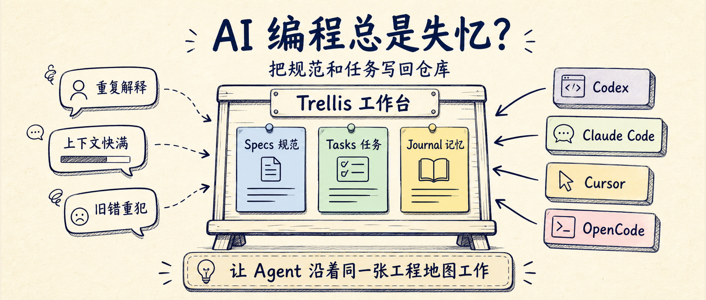
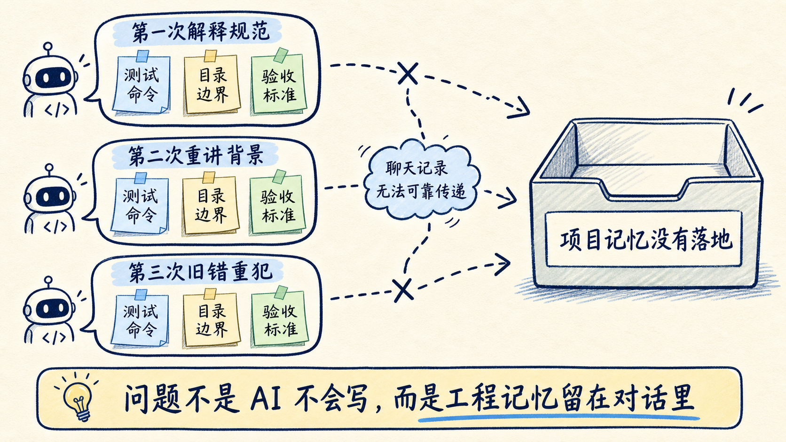
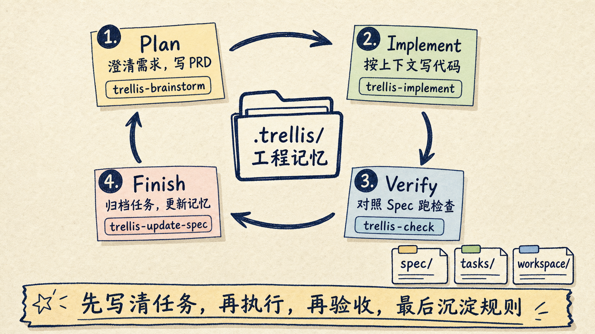
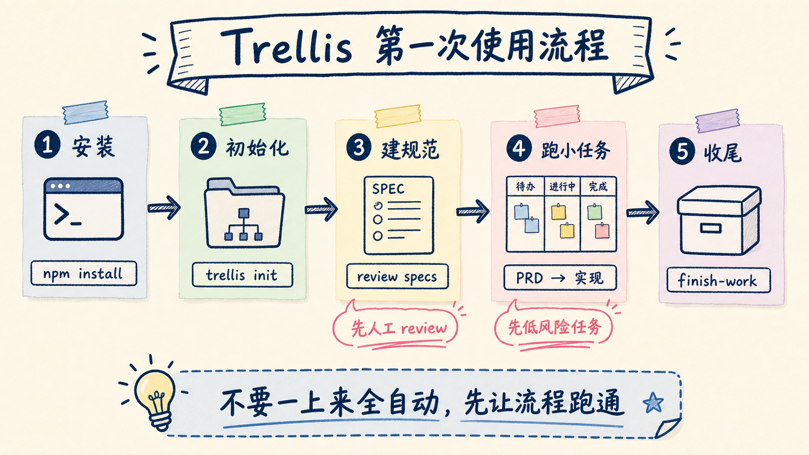

# AI 编程总是失忆？Trellis 把规范和任务写回仓库

Trellis 解决的不是“再造一个 AI 编程工具”，而是 AI 编程里更具体的麻烦：Codex、Claude Code、Cursor、OpenCode 都能写代码，但新会话经常像刚入职的同事，又要重新解释项目结构、团队规范、上次做到哪里、这次怎么验收。

Trellis 的做法很朴素：把这些东西写回仓库。

它把项目规范放进 `.trellis/spec/`，把每个需求的 PRD、实现上下文和检查上下文放进 `.trellis/tasks/`，把工作日志放进 `.trellis/workspace/`。这样不同 AI coding agent 进入项目时，不是靠一段越写越长的提示词摸索，而是沿着仓库里的工程记忆工作。



如果你已经在用 AI 写代码，Trellis 最值得看的地方不是“它又支持了多少模型”，而是它把 Agent 工作流拆成了可版本化、可复盘、可共享的工程对象。

## 问题不在 AI 不会写，而在每轮都要重新教

很多团队用 AI 编程都会遇到同一个场景。

第一天，你花了半小时告诉 Agent：项目用什么框架，测试怎么跑，哪些目录不能碰，接口命名有什么约定。它表现不错，改了几个文件，测试也过了。

第二天，你开了一个新会话。Agent 又开始问同样的问题，或者更麻烦，它不问，直接按通用习惯改代码。你只好把昨天讲过的规则再讲一遍。

这不是模型能力问题，而是工程记忆没有落地。

`AGENTS.md`、`CLAUDE.md`、`.cursorrules` 能缓解一部分问题。它们适合写项目说明，比如怎么安装依赖、怎么跑测试、哪些目录有风险。但长期用下来，这类文件容易变成一篇大杂烩：代码风格、业务背景、发布流程、临时提醒、个人偏好全塞在一起。

Trellis 在这些入口之上补了一层结构。



它不是让你多写一个说明文件，而是把 AI 编程拆成三类资产：

| 资产 | 放在哪里 | 解决什么问题 |
|---|---|---|
| Specs | `.trellis/spec/` | 稳定规范和项目约定 |
| Tasks | `.trellis/tasks/` | 单个需求的 PRD、实现上下文、检查记录 |
| Workspace journal | `.trellis/workspace/` | 上一次做了什么、学到了什么、下一轮从哪里接 |

这三类文件的价值，是让上下文从“聊天记录”变成“仓库资产”。

聊天记录很容易丢，也很难 review。仓库文件可以被版本管理、被团队讨论、被不同工具复用。Trellis 的定位就在这里：它是 coding agent 的工程脚手架，不是另一个聊天窗口。

## Trellis 的核心：先写清任务，再让 Agent 动手

Trellis 官方 README 把流程写得很直接：

1. 用自然语言描述你想做什么。
2. AI 先和你头脑风暴，一次问一个问题，直到 PRD 足够清晰。
3. AI 再进入实现阶段，并按 Spec、lint、type-check、tests 做检查。
4. 工作完成后，按平台入口运行 finish workflow，归档任务并更新 journal。

这条流程的关键，不是“问问题”这个形式，而是把需求澄清和代码实现分开。

过去很多 AI 编程失败，都是因为人刚说完“帮我优化一下登录页”，Agent 就开始改文件。需求没收敛，边界没写清，验收标准没有，最后只能靠人盯着 diff 抢救。

Trellis 的第一步是 Plan。`trellis-brainstorm` 会逐题澄清需求，并写出 `prd.md`。如果任务需要资料调研，可以交给 `trellis-research` 子代理处理。真正开始实现前，Trellis 会把需要的 Spec 和研究材料编进 `implement.jsonl` / `check.jsonl`。

第二步是 Implement。`trellis-implement` 按 PRD 写代码，重点是用已经整理好的上下文做事，而不是把整个仓库一股脑塞给模型。

第三步是 Verify。`trellis-check` 会根据 diff 对照 Spec 检查，并运行 lint、type-check 和 tests。能自己修的就继续修，不能修的留下明确问题。

第四步是 Finish。最终检查通过后，`trellis-update-spec` 会把本轮新增认知沉淀回 `.trellis/spec/`，让下一次会话少走弯路。

这里有一个边界要说清楚：官方 How It Works 里，`/trellis:finish-work` 是提交之后的归档和 journal 记账，不是替你提交功能代码的命令。不同平台的入口也不完全一样，有的平台是显式 slash command，有的平台通过 Trellis skill 或 workflow 触发。



这就是 Trellis 和普通提示词的差异。

普通提示词是一次性指令。Trellis 更像一条工作流：先把任务写清楚，再执行，再验收，最后把经验收进项目记忆。

## 第一次怎么用：先在一个小仓库里跑通

Trellis 的前置要求不复杂：

- Node.js >= 18
- Python >= 3.9

安装命令是：

```bash
npm install -g @mindfoldhq/trellis@latest
```

进入你的项目根目录后初始化：

```bash
trellis init -u your-name
```

如果你只想给实际使用的平台生成适配文件，可以显式传平台参数。README 里给了一个例子：

```bash
trellis init --cursor --opencode --codex -u your-name
```

我建议第一次不要在生产主分支上直接跑大需求。更稳的做法是新开一个实验分支，或者找一个边界清楚的小项目，先看它生成了什么。

初始化后，重点看三个目录。

```text
.trellis/
├── spec/        # 项目规范和稳定约定
├── tasks/       # 每个任务的 PRD、实现上下文、检查上下文
└── workspace/   # 工作日志和项目记忆
```

接下来不要急着让 Agent 改代码。先让它理解项目并帮你生成第一版 specs。

可以这样说：

```text
请先分析这个项目的结构，帮我用 Trellis 建立第一版项目规范。
重点看：技术栈、测试命令、代码风格、危险目录、常见改动流程。
生成后先让我 review，不要直接开始实现需求。
```

这一步很重要。AI 生成的 specs 只是初稿，不应该未经检查就变成团队规范。你要删掉过度推断的规则，补上团队真正关心的约束，比如：

- 数据库 migration 怎么写；
- 哪些目录不允许自动改；
- 测试必须跑到什么层级；
- UI 改动是否需要截图；
- 生产配置和密钥文件永远不能碰。

第一版 specs 稳住以后，再跑一个小任务。

比如：

```text
我想给登录页增加“记住我”选项。
请按 Trellis 流程先澄清需求，写 PRD，等我确认后再实现。
实现后运行相关测试，并说明改了哪些文件、怎么验证。
```

如果流程正常，你应该能看到 Trellis 把需求沉淀成任务文件，而不是只在对话里推进。等工作完成、检查通过，并且按团队流程完成提交之后，再运行收尾入口。支持 slash command 的平台通常是：

```text
/trellis:finish-work
```

如果你所在的平台没有原生 slash command，就按 Trellis 为该平台生成的 finish workflow 或 skill 入口走。

这一步会做收尾：归档任务，更新工作日志，把有价值的新规则写回 spec。下一次再开会话，Agent 就不是从零开始。



## Trellis 适合谁，不适合谁

Trellis 最适合三类人。

第一类，是已经在用多个 AI 编程工具的人。

你可能在 Codex 里跑长任务，在 Cursor 里做日常编辑，在 Claude Code 里做重构，在 OpenCode 里试命令行工作流。工具一多，规范就容易散。Trellis 的价值是让项目层记忆留在仓库里，而不是绑定在某一个工具里。

第二类，是团队里已经出现“AI 写代码风格不一致”的人。

一个人把测试规则写在 CLAUDE.md，另一个人写在 Cursor rules，第三个人只靠 Prompt 记忆。短期能跑，长期会乱。Trellis 把 specs、tasks、journal 分开，让团队可以像 review 代码一样 review AI 工作流。

第三类，是经常做长任务的人。

长任务最怕上下文快满。Trellis 的 `/trellis:finish-work` 不只是结束当前任务，也是在把工作状态收进仓库。下一轮继续时，Agent 可以从 journal 和 task 里恢复脉络。

但 Trellis 不适合所有场景。

如果你只是让 AI 改一个一次性脚本，或者仓库很小、没有协作、没有稳定规范，直接写一条清楚的 Prompt 可能更快。Trellis 会引入额外文件和流程，只有当“重复解释项目背景”已经成为成本时，这套结构才明显划算。

还有一个边界要提前知道：Trellis 是 AGPL-3.0 许可证。个人学习、开源项目通常问题不大；公司内部改造、二次分发、商业集成要让团队自己确认合规边界。

## 我会怎么落地

如果让我把 Trellis 接进一个真实仓库，我不会一上来追求全自动。

我会按五步走。

第一步，只让 Trellis 读项目并生成 specs，不允许改业务代码。

第二步，人工 review `.trellis/spec/`，把 AI 乱猜的规则删掉，把真正重要的团队约束补进去。

第三步，挑一个低风险任务跑完整流程，比如补一个小测试、改一个局部 UI、修一个复现清楚的 bug。

第四步，对比 Trellis 产出的 PRD、检查记录和 journal，看看它是否真的减少了重复解释，而不是制造更多文档。

第五步，再决定要不要让团队共享这套 specs，并把它纳入正常 code review。

这里最值得保留的是一个判断：

**Trellis 的价值不是让 Agent 更自由，而是让 Agent 在同一张工程地图上工作。**

Agent 需要自由探索，但工程项目更需要可追溯的边界。规范、任务、验收和复盘都留在聊天记录里，团队很难持续改进；它们进入仓库以后，才有机会变成真正的工程资产。

所以 Trellis 不是每个项目的必需品。

但如果你已经开始抱怨“每次都要重新教 AI 一遍项目”，Trellis 值得试一次。先从一个小任务开始，让它把 specs、tasks、journal 跑通。跑完再问自己一个问题：下一次新会话，Agent 是否真的少问了废话，少犯了旧错，少让你从头解释。

如果答案是肯定的，这就不是又多了一个工具。

这是项目开始拥有 AI 时代的工程记忆。

---

参考资料：

- Trellis GitHub：<https://github.com/mindfold-ai/Trellis>
- Trellis 中文 README：<https://github.com/mindfold-ai/Trellis/blob/main/README_CN.md>
- Trellis 官方文档：<https://docs.trytrellis.app/zh>
- Trellis 快速开始：<https://docs.trytrellis.app/zh/start/install-and-first-task>
- Trellis 支持平台：<https://docs.trytrellis.app/zh/advanced/multi-platform>
- npm：<https://www.npmjs.com/package/@mindfoldhq/trellis>
