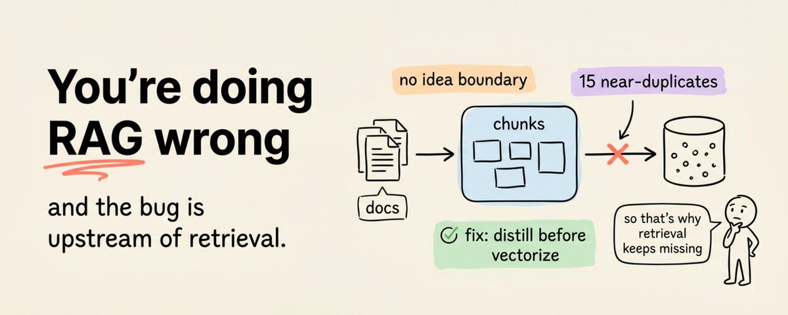
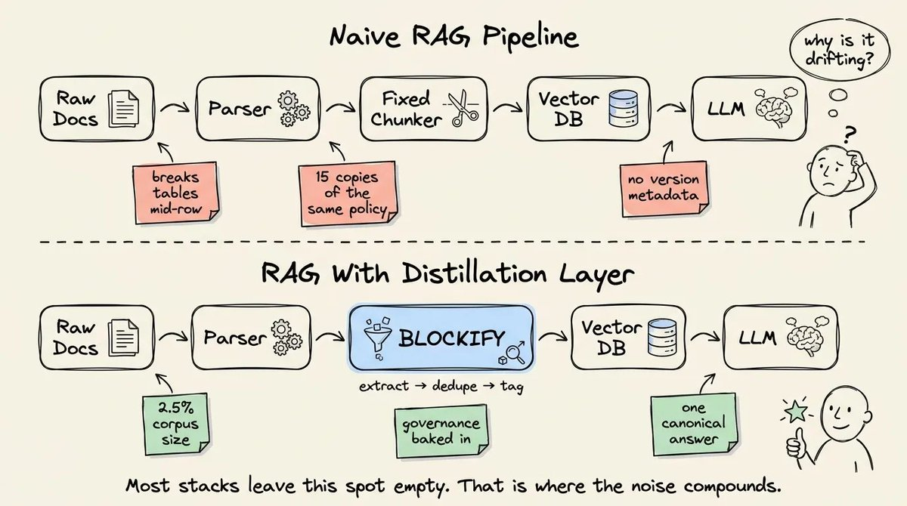
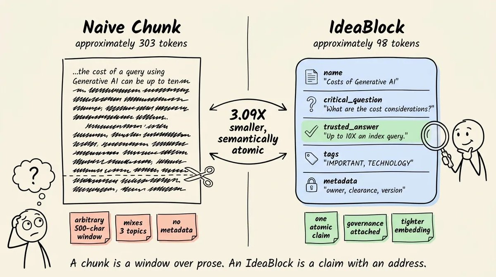
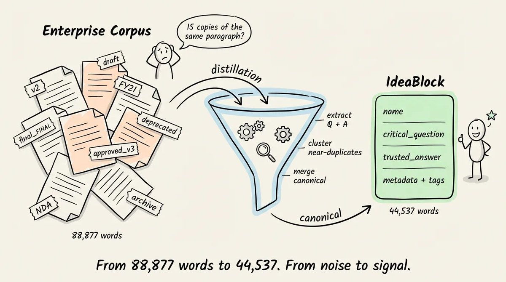
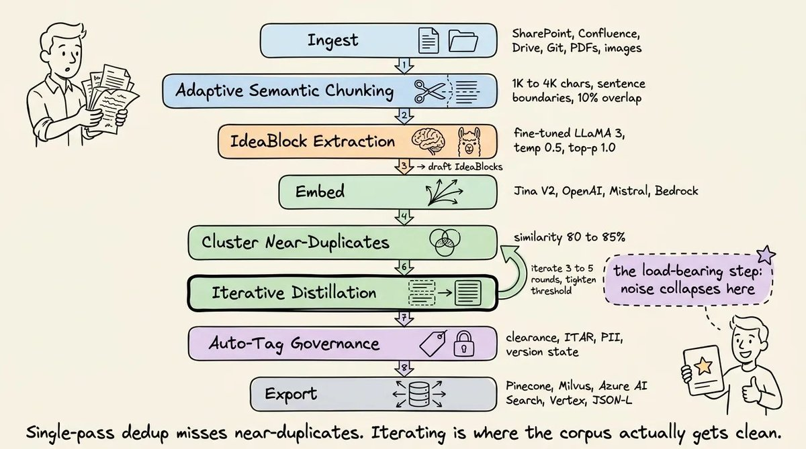
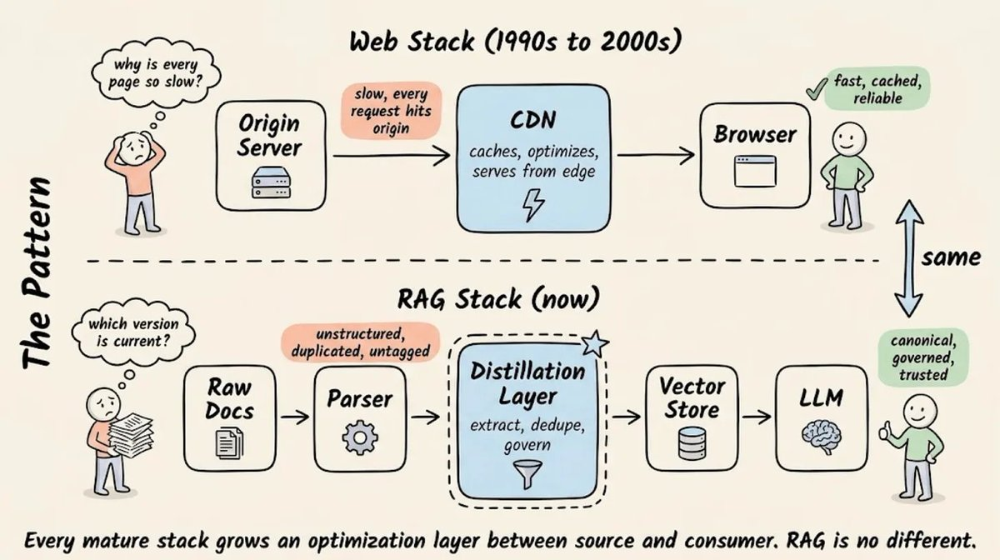

RAG 经常答偏，不一定是 embedding 差，也不一定是 reranker 没调好。

很多企业知识库更早就歪了：文档一进系统，就被按字数切成 chunk。表格切到一半，结论和论据分开，旧版政策和新版政策一起进 Top-K，权限、版本、来源又被挂在 orchestrator 外层。检索层拿到的是碎片，模型再强，也只能在碎片上补洞。

Akshay Pachaar 在一篇 X Article 里介绍了 Blockify 的做法：先把文档蒸馏成 IdeaBlock，再送进向量库。一个 IdeaBlock 不是一段随手切出来的文本，而是一个问题、一个可信答案，再加上版本、权限、来源、标签这些治理字段。

我会把它理解成一句工程判断：RAG 的输入单位不该只是“文本窗口”，而应该是“可追踪、可更新、可控权限的一条事实”。

## 先别急着调检索

传统 RAG pipeline 很熟悉：Raw Docs 进 parser，parser 之后接 fixed chunker，然后写进 Vector DB，最后交给 LLM。

这个流程的问题不在每一步都错，而在中间少了一层“知识整理”。原始文档里有表格、脚注、版本、审批状态、权限级别、重复段落。固定长度切分器只关心窗口够不够长，不关心一个想法有没有讲完。

所以后面常见的排查会变成：

- 换 embedding 模型；
- 调 Top-K；
- 加 hybrid search；
- 再上一层 reranker；
- 最后靠 prompt 告诉模型“请注意上下文”。

这些补丁可能有用，但如果底层知识单元已经碎了，检索调参只能缓解，不能把半张表格变回完整事实。

## chunk 只是切片，不是知识

原文把 chunk 的问题拆成三类。

第一，chunk 没有想法边界。切分器跑到 token 限制就停，可能把一个表格切成两半，也可能只留下结论，把支撑结论的前文扔到另一个 chunk。

第二，chunk 没有版本状态。企业资料里，经常同时存在 v2、final_final、draft、approved_v3、deprecated。Top-K 一旦把几个近似段落一起捞上来，LLM 很容易把旧政策和新政策混成一个看起来很自信的答案。

第三，chunk 本身不带权限。销售、法务、工程师查的是同一套知识库，但能看的内容不同。如果权限只写在 orchestrator 的过滤逻辑里，内容和治理规则就分家了。以后谁改了文档、谁改了权限、哪个版本可见，都得靠外层系统继续兜。

这类问题不是“语义相似度还不够聪明”。更像是知识库刚入库时，就没有给知识一个清楚的地址。

## IdeaBlock：一条事实，一张身份证

Blockify 提出的 IdeaBlock，目标是把“窗口里的文字”改成“结构化的事实单元”。

一个 IdeaBlock 至少包含：

- `name`：这条知识叫什么；
- `critical_question`：用户可能怎么问；
- `trusted_answer`：经过验证的两三句话答案；
- `tags / entity / keywords`：方便检索和归类；
- `metadata`：来源、owner、版本、权限、状态。

这样做的好处很直接：用户问题本来就是问题，索引里也存“问题 + 答案”，匹配关系就不再只靠一段长文本里碰巧出现了相似词。

它也给治理留了位置。版本、权限、来源不是外挂备注，而是跟这条事实绑在一起。以后 spec 改了，你更新一个 IdeaBlock；下游应用下一次查到的就是新答案。用普通 chunk 时，同一个事实可能散在几十个近重复段落里，改一次像翻旧文件柜。

## 数据少一点，检索可能更稳

原文引用了 Blockify 的内部 benchmark，数字挺有意思，但要按“项目方数据”理解。

在 17 份文档、298 页材料上，原文说 IdeaBlock 到最佳匹配 query 的平均 cosine distance 是 0.1585，naive chunk 是 0.3624。按作者的说法，这是 2.29x 的检索距离改善。

另一个实验里，2,042 个原始 IdeaBlock 经过 80% 到 85% 相似度阈值、3 到 5 轮去重后，合并成 1,200 个 canonical IdeaBlock。词数从 88,877 降到 44,537，蒸馏后的数据在 vector accuracy 上高出 13.55%。

直觉上，资料越多越安全。但向量库不是网盘。十五个近似段落挤在同一片 embedding 空间里，反而会把概率质量摊薄，检索结果在一堆重复项之间摇摆。把近重复事实合成一条 canonical block，信号会干净很多。

## 工程上怎么加这一层

Blockify 的流程可以拆成七步：

1. 先定义索引层级，比如 Organization、Business Unit、Product、Persona。
2. 接入文档，来源可以是 SharePoint、Confluence、Git、PDF、Markdown、图片等。
3. 按语义边界切分，再让 LLM 抽出 draft IdeaBlock。
4. 用 embedding 和聚类找近重复，原文提到 80% 到 85% 的相似度阈值。
5. 反复蒸馏，把近重复内容合并成 canonical block。
6. 自动打标签，把版本、权限、数据隐私、产品线这些字段补上。
7. 经过人工校验后，导出到向量库或 JSON-L。

GitHub README 里还提到，开源仓库包含一个 FastAPI distillation service 和一个 Claude Code skill。支持的存储、部署和集成不少，包括 Docker、Helm、SQLite、PostgreSQL、Redis、ChromaDB、Pinecone、Cloudflare Vectorize、Neo4j 等。

我的看法是，别先被这些集成列表带跑。更值得拿走的是中间那层：在 parser 和 vector store 之间，先做抽取、去重、归并、打标签。

## 应用层会少掉三类补丁

换知识单元以后，应用层最先变的是三件事。

第一，query construction 会简单一些。用户问问题，索引里也有对应问题和答案，不必一直靠阈值、重写 query、rerank 去弥补“问题”和“散文窗口”之间的形状差异。

第二，权限会靠近数据层。角色、版本、clearance level 直接贴在 block 上，同一个索引给销售和法务返回不同数据，不再完全依赖外层流程记得过滤。

第三，更新路径会变短。规格变了，改一条 canonical IdeaBlock；普通 chunk 则要先找到所有重复段落，再判断哪个新、哪个旧、哪个还能被引用。

这不是说 reranker、hybrid search、prompt engineering 都没价值。它们仍然是工具。只是当知识库里全是半截事实和重复版本时，应用层越补越厚，系统越难解释。

## 我会怎么用它

如果你已经有一套 RAG，不用马上换架构。先拿下面这张自检表查一遍。

| 自检问题 | 命中后的处理 |
| --- | --- |
| Top-K 里经常出现同一段话的多个版本？ | 先做近重复聚类和 canonical 合并 |
| chunk 会切断表格、流程、结论和论据？ | 改成按语义边界抽取知识单元 |
| 权限、版本、来源只在外层代码里？ | 把治理字段写回知识单元 |
| 旧资料经常混进新答案？ | 给 block 加 version state 和审批状态 |
| 更新一个事实要改很多文件？ | 建立一条事实一个记录的映射 |

如果命中三条以上，我会先看数据蒸馏层，而不是继续微调 Top-K。

反过来，如果你的知识库很小、文档版本很少、权限也简单，IdeaBlock 这套做法可能偏重。小团队先用更好的 parser、更严格的 chunk overlap、简单去重，也能解决一批问题。

RAG 的成熟方向，大概率会像 Web stack 当年长出 CDN 一样，在 source 和 consumer 之间长出一层优化层。Web 不会让每个请求都直打源站；RAG 也不该让每个问题都面对一堆未经整理的原始 chunk。

下次 RAG 又答偏，先别急着换模型。先问一句：向量库里存的，真的是知识吗？

来源：Akshay Pachaar X Article《You're doing RAG wrong》、Blockify GitHub README（2026-06-22 访问）。原文图片保留自 X Article。
