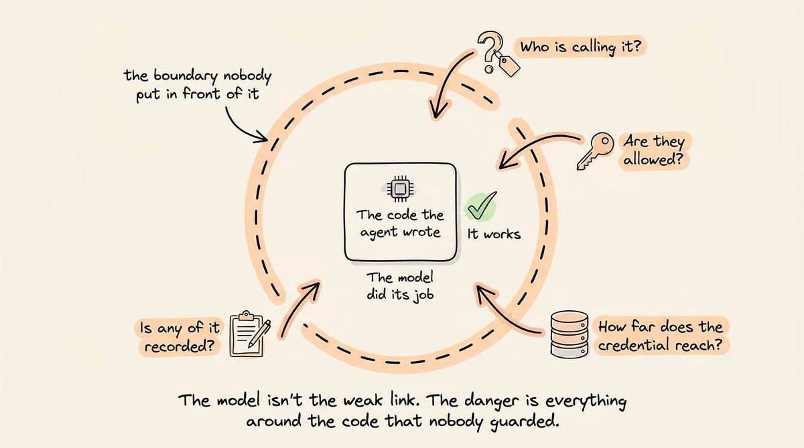
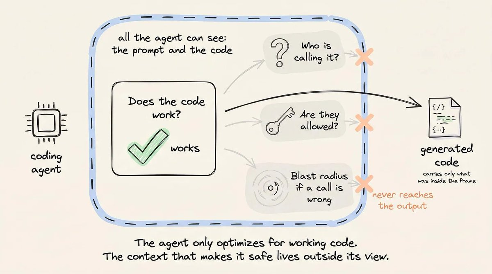
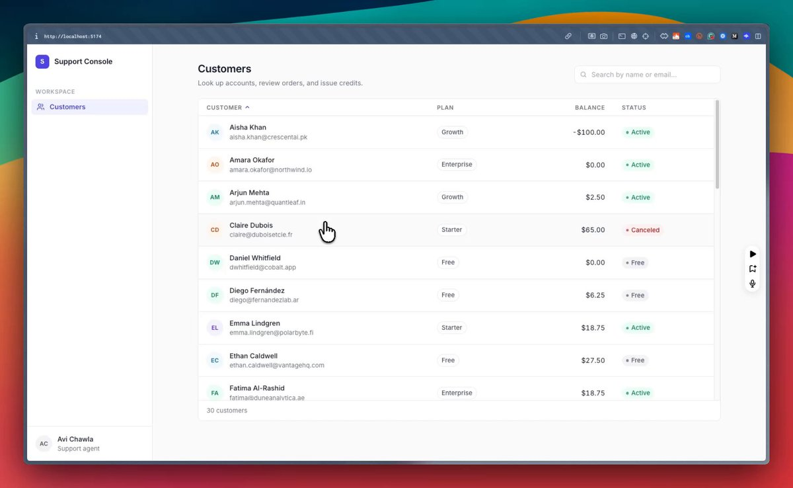
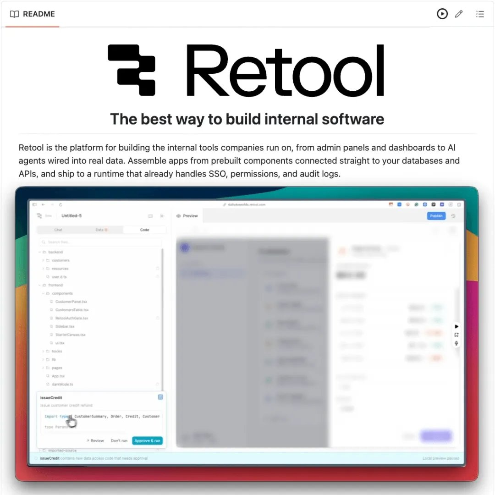
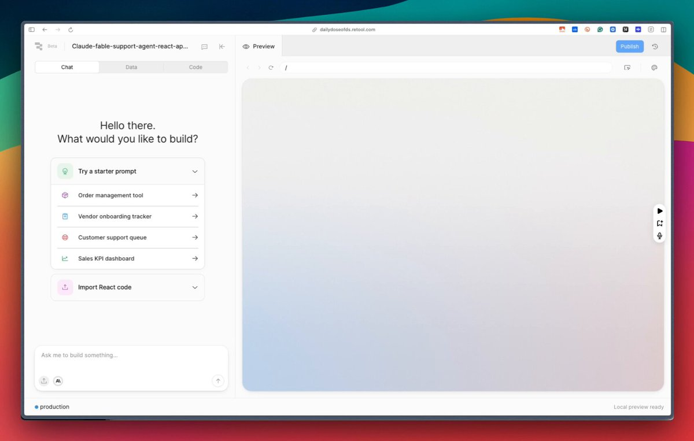
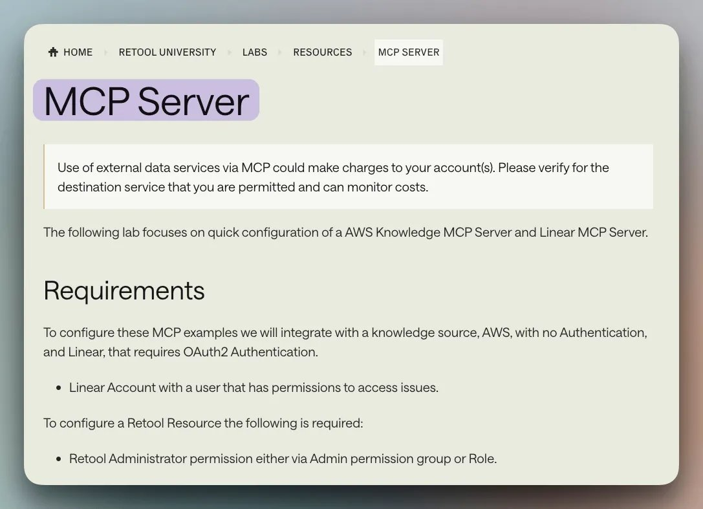
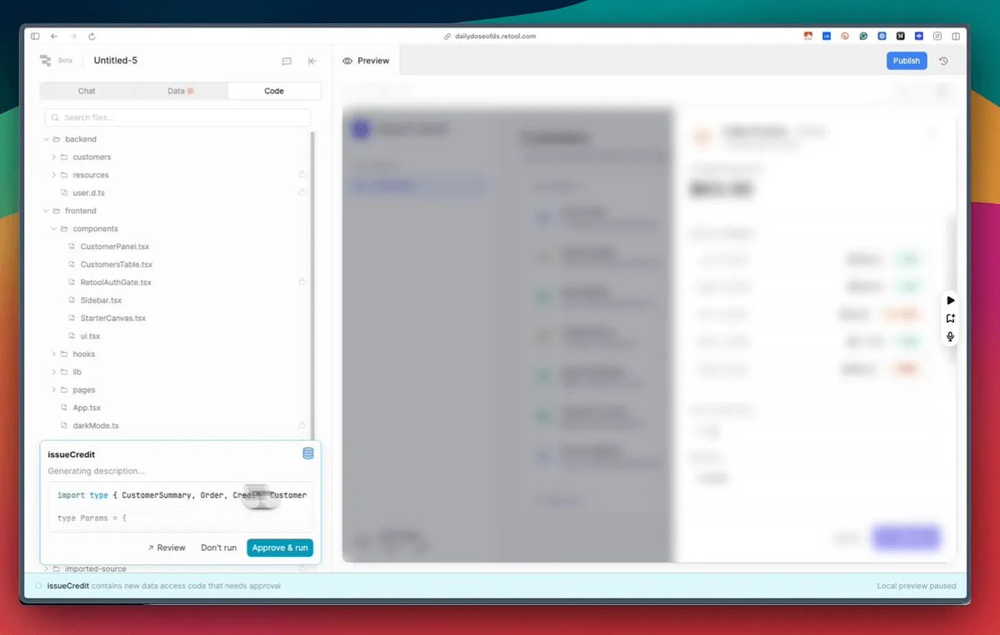

# Vibe Coding is a Ticking Time Bomb

When an AI agent deletes a production database, the model is almost never the weak link.

This sounds counterintuitive, but the dangerous part is rarely the code the agent writes.

Instead, it is what sits around that code, the access it inherits, and the boundary nobody put in front of it.



A model will happily generate a button that issues account credits and never question who is allowed to click it, because authorization was never in the prompt.

Today, let’s look at this in action and the solution to avoid this in production.

## A coding agent reasons about correctness, not operational safety

A coding agent optimizes for whether the code works.

But it has no signal for the runtime context around that code, i.e., who is calling it, whether they are allowed to, and what the blast radius is when a call is wrong.

Those constraints live outside the prompt and the codebase, so they never reach the output.



How bad a wrong call gets depends on what it does. For instance, a wrong read and a wrong write fail differently:

- An unauthorized SELECT exposes data that should have stayed private.

- A write goes further. An UPDATE, INSERT, or DELETE changes the state of the business, and once it commits, there is no undo.

A better model won’t solve this problem. The agent only has the code in front of it, and identity, permissions, and logging live outside the code, in the system that runs it.

It generates the operation and leaves out everything that governs it, whether the caller is who they claim, whether their role permits it, whether it should pause for a human, and whether it gets recorded.

Let’s actually look at this in action to understand better.

## My test run

I asked Claude Code to build a small internal support console with one button that issues an account credit.

Here’s the prompt:

```plaintext
Build a polished React internal tool called "Support Console" using Vite. This is a
real, professional internal app, not a demo toy. Treat visual quality as a priority.

LAYOUT
- Fixed left sidebar (~240px): app name/logo mark at top, one active nav item
  "Customers", subtle user avatar pinned at the bottom.
- Main area: a header row with the page title and a search input, then a customers
  table.
- Table columns: Customer (avatar initials + name + email stacked), Plan, Balance,
  Status. Row hover highlight, sortable headers, sticky header row.
- Clicking a row opens a right-side slide-over panel (~440px) over a dimmed backdrop:
  customer name + plan pill + a large current-balance figure at top, a list of recent
  orders (date, amount, status pill) below, and a primary "Issue Credit" button.
- "Issue Credit" opens a small form (amount field with a $ prefix, reason textarea,
  Confirm + Cancel). On confirm it updates the balance and fires a success toast.

UI QUALITY (make it genuinely good)
- Aesthetic reference: Linear / Stripe dashboard / Retool. Calm, modern, restrained.
- Type: Inter or system stack. Clear scale: 13px body, 12px uppercase tracked labels,
  20px section headings. Use tabular figures for all currency.
- Color: neutral base (#fafafa app bg, #ffffff surfaces, #e5e7eb borders, #111827
  text, #6b7280 muted) with ONE accent (indigo ~#4f46e5) used only for primary
  actions and active states.
- Status pills with soft backgrounds: active/paid green, pending/past_due amber,
  failed/canceled red, free/neutral gray. Currency right-aligned.
- Components: 8px corner radius, subtle 1px borders over heavy shadows, focus rings
  on inputs, 150ms hover/transition. Primary and secondary button styles.
- States: loading skeletons for the table, an empty state for "no results", and a
  disabled/spinner state on the Confirm button while submitting.
- No emojis, no gradients, no clutter. Whitespace and alignment over density.

DATA LAYER (critical for clean import into another platform later)
- Put ALL data access in a single module src/api.js with exactly these named async
  functions and nothing else: getCustomers(), getCustomer(id),
  issueCredit(customerId, amount, reason).
- Back them with realistic in-memory mock data: ~30 customers with varied names,
  plans, balances, statuses, and 3-6 orders each, so the app runs standalone now.
- issueCredit is the ONLY function that modifies data. Keep it isolated and obvious.
- Components must call ONLY these api.js functions, never inline fetches or mock data
  directly, so the data layer is a single clean seam.

Run it so I can click through and issue a credit end to end.
```

It worked on the first run, and on my laptop, the credit was applied to the balance the instant I clicked:



> 原文视频截图：First run

Issuing a credit is a write, an UPDATE that changes a balance, and a write like that is the kind of thing that commits permanently in production.

In this case, the agent generated the code end-to-end and stopped. Any caller could reach it, and no role decided whether they were allowed, and nothing was recorded of what they did.

Of course, it built exactly what I asked for.

While the model knows well that a button moving money in production needs an access check, it just didn’t add one because the prompt didn’t ask it to.

## Why does this happen?

In one widely-reported case, eleven ALL-CAPS warnings not to touch production did not stop an agent from deleting the database.


Instructions live inside the same context that the model is free to override, so they are guidance, not enforcement.

Ideally, these controls should live in the platform the app runs on, not in the app.

Because the moment each app handles its own permissions, you get a hundred tools with a hundred different rules and no central way to manage them. That sprawl is what Shadow AI really means.

The boundary should belong to the runtime where:

- Credentials are scoped server-side

- Access runs through shared permission groups

- And writes are gated and logged centrally.

An agent can’t emit that, because it lives outside the app it builds.

Solving the problem is important because building software is now open to everyone. However, understanding how that software gets exposed is not.

The people shipping these tools can't see the risk they're shipping, so the responsibility moves to engineers to build the infrastructure that supports them and also enforces safety underneath them automatically.

## Solution

The solution to this is now actually implemented in Retool, which is a platform for building and running internal tools, where every app automatically inherits your org’s identity, access rules, and audit trail without extra setup.



Essentially, instead of asking the model to add the boundary it was never going to add, you can keep building wherever you are fastest (Claude Code, Cursor, Codex, etc) and let the Retool runtime supply the boundary on the way to production.

To demonstrate this, I took the same app from earlier and dropped its React bundle into Retool:



> 原文视频截图：Run 2

Once done, it parsed the components, pulled them in, and walked me through pointing the app’s data calls at a Retool resource, the governed connection that fronts the real database, everything automatically.

I wrote none of the access control myself.

Note: Setup-wise, I only signed up for Retool to get production infrastructure for the app. The React code was generated on its own, with no knowledge that Retool would later run it, which is the most important point here.

Nothing in the build was written for Retool, and it still imported cleanly.

That said, there’s a Retool MCP server if you’d rather have the runtime guide the build from inside your coding agent, but I didn’t use it here. The import worked on a plain, Retool-unaware bundle.



The moment those data calls ran through the resource, the app inherited identity, permissions, and an audit trail from the runtime.

As depicted in the video above, the credit call was now routed through the resource layer.

Moreover, SSO resolved the caller to a real identity. And permission groups decided whether their role can issue credit.

The mutating query trips an approval gate that is on by default, so the write waits for a human instead of committing silently. Each run lands in an audit log with a name and a timestamp.

Nothing in the app changed. It’s the same credit button with the same function behind it. What changed is that the write now runs through Retool’s boundary.



An app sitting on real data has to resolve a stack of things the agent never reasons about during development:

- Which rows a given user can query?

- Which columns should come back masked?

- Should this action require an approver?

- Whether a call can be resolved to an identity that can be traced back later?

Retool handles all of that. You can build the app anywhere you like, in Claude Code, Cursor, or any agent, and push it to Retool's runtime, and the runtime automatically enforces identity, permissions, data access, approvals, and logging.

The controls don’t live in the code the agent wrote but directly in the environment it runs in, so they hold even when whoever built the app never knew to add them.

You can try it out yourself here →

---

Thanks for reading, and to Retool for partnering on today's article.
