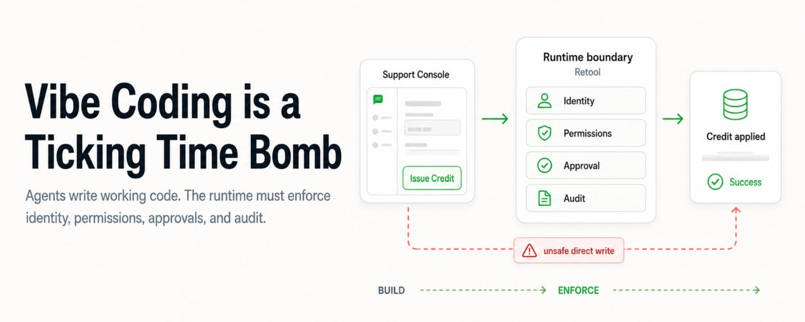

# Vibe Coding 最大坑：代码能跑，权限没人管

你让 Coding Agent 做一个内部客服台：客户列表、余额明细、一个 `Issue Credit` 按钮。几分钟后，页面很漂亮，点击也生效，账户余额立刻变化。

风险也从这里开始。

这个按钮不是普通 UI，它会改业务状态。只要没有身份、权限、审批和审计，能点的人就可能直接改钱。Akshay 这篇 X Article 讲的就是这个问题：生产事故的弱点常常不在模型写错代码，而在生成出来的工具没有运行时边界。

原文最后说明 Retool 是合作方。下面把 Retool 当作一个运行时治理样本来看，不写成唯一答案。

## Agent 会先完成需求，不会自动替你守门

Coding Agent 很擅长把需求变成可运行代码。

但它默认优化的是“功能是否完成”：按钮能不能点，表单能不能提交，状态能不能更新。它不一定知道这个动作到了生产环境以后，谁有资格点，点之前要不要审批，失败后怎么追责。

原文里的例子很典型：作者让 Claude Code 做一个内部支持后台，并要求数据访问集中在 `src/api.js`，其中只有一个函数会修改数据：`issueCredit(customerId, amount, reason)`。

这个约束对代码结构很有帮助，却没有自动变成权限系统。

一个读操作和一个写操作，风险完全不同。

- 错误的 `SELECT` 会泄露不该被看到的数据；
- 错误的 `UPDATE`、`INSERT`、`DELETE` 会改变业务状态；
- 涉及余额、订单、账号、权限的写操作，提交以后很难靠一句“撤回”解决。

所以，不要只问“Agent 写得对不对”。更要问：这段代码接触真实数据时，有没有被放进受控通道。

## Prompt 里的警告，不等于生产环境里的闸门

原文提到一个被广泛讨论的案例：即使上下文里写了 11 条全大写警告，Agent 仍然没有停下高风险动作。

这类案例有一个共同点：警告还在模型上下文里，不在执行系统里。

Prompt 可以提醒模型，但不能替代权限。模型只要拿到了凭证、连上了生产库、拥有写权限，它就可能把“建议不要做”理解成一条可以被覆盖的指令，而不是一堵墙。

我会把安全边界放在模型外面：

| 风险问题 | 更稳的落点 |
|---|---|
| 谁在操作 | SSO / IdP / 当前用户身份 |
| 能不能操作 | 权限组 / 角色 / 资源访问规则 |
| 能看哪些数据 | 行级权限 / 字段脱敏 / 环境隔离 |
| 写操作是否敏感 | 审批流 / 人工确认 / 双人复核 |
| 事后怎么查 | 审计日志 / 参数记录 / 时间戳 |

把这些规则写进 prompt，只能算提醒。把它们落到运行时，才算控制。

## 运行时应该接住 Agent 没有推理到的那一层

原文用 Retool 做了第二次演示：同一个 React 应用导入 Retool 后，数据调用走 Retool Resource，写入动作进入带治理的运行时。

这里的重点不是“必须用 Retool”，而是架构分工。

Coding Agent 负责把界面和业务流程写出来。运行时负责接住身份、权限、资源访问、审批和审计。这样，哪怕生成代码的人不知道要补哪条安全规则，工具上线时也不会直接裸奔到生产数据前面。

第一次运行时，按钮点下去，余额直接变了。这个结果很爽，也很危险。

第二次运行时，改变的不是那个按钮，而是按钮背后的通道。调用通过 Resource 进入运行时，由运行时补身份、权限、审批和日志。

Retool 官方文档里，治理能力大致分三层：组织访问、项目访问、数据访问。权限系统也分两块：RBAC 管组织级能力，Permission Groups 管 app、resource、workflow、agent 这类对象的访问。审计日志则记录用户动作、时间、查询等信息，具体能力会受版本、托管方式和套餐影响。

这就是我更愿意保留的结论：不要期待 Agent 在生成每个内部工具时自动补齐企业级治理。把治理做成运行时能力，让所有工具统一继承。

## 上线前，先过这张检查表

如果团队已经在用 Claude Code、Cursor、Codex 这类工具快速搭内部工具，别等到第一次事故再补规则。上线前至少问完这 8 个问题：

| 检查项 | 过线标准 |
|---|---|
| 写操作有没有单独标出 | 所有会改数据的函数、按钮、API 都能被快速定位 |
| 生产凭证放在哪里 | 不在前端、不在 prompt、不在本地临时脚本里裸奔 |
| 用户身份怎么传递 | 每次关键操作都能落到具体用户，而不是共享账号 |
| 权限怎么判断 | 角色或权限组在运行时生效，不靠 UI 隐藏按钮 |
| 敏感写入要不要审批 | 改余额、删数据、改权限这类动作有人工确认或审批 |
| 失败后怎么恢复 | 有回滚、补偿、冻结或人工处理路径 |
| 审计日志够不够查 | 能查到谁、何时、对什么资源、带什么参数做了什么 |
| prompt 警告有没有外部约束 | 高风险动作有系统层拦截，不只是一段安全提示词 |

这张表不复杂，但能挡住很多“demo 很漂亮，上线很吓人”的内部工具。

## 我会怎么用 Vibe Coding

Vibe Coding 不是不能用。相反，它很适合做原型、后台工具、数据看板、一次性运营台和内部流程页。

我的边界会更硬一点：

- 让 Agent 写 UI 和业务流程；
- 让后端或资源层接管真实数据访问；
- 让运行时统一做身份、权限、审批和审计；
- 让高风险写操作先进入人工确认，而不是直接提交；
- 把“不要碰生产”从 prompt 里搬到权限系统里。

代码能跑，只说明第一关过了。内部工具要进生产，第二关是运行时边界。

下次 Agent 又很快帮你做完一个后台按钮，先别急着接生产库。收藏这张检查表，先看它有没有身份、权限、审批和审计。

来源：Akshay 的 X Article「Vibe Coding is a Ticking Time Bomb」：https://x.com/akshay_pachaar/status/2067646389291725258

参考：Retool Governance、Permissions Quickstart、Audit Logs 官方文档。
