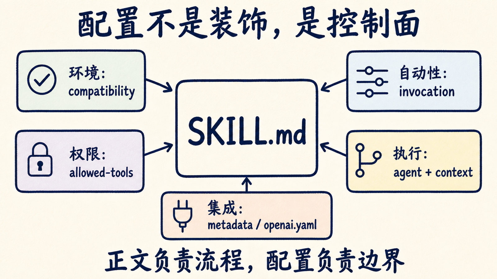
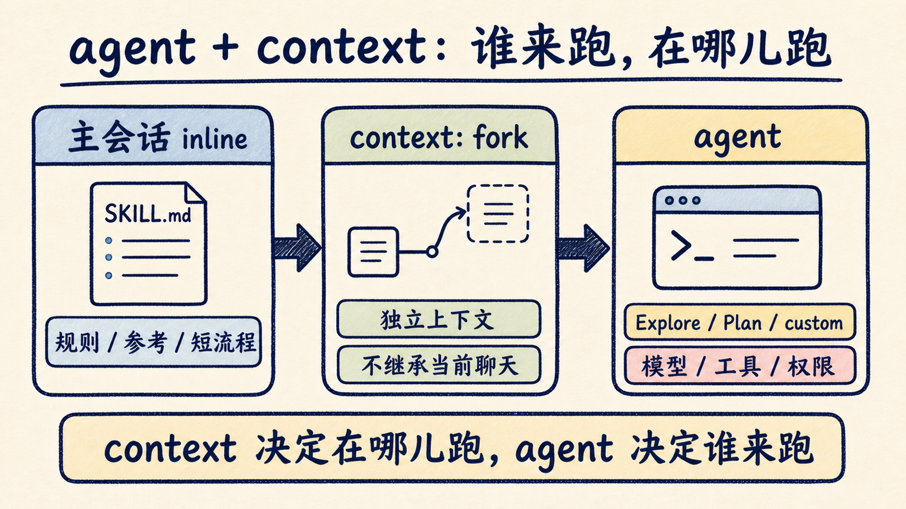
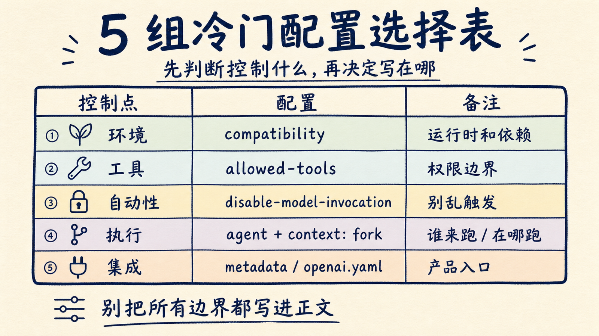

# Skill 老是不听话？先看这 5 个冷门配置

很多人写 Skill，第一反应是把 `SKILL.md` 写长一点：多写触发条件，多写步骤，多写不要犯错。

这当然有用，但很快会碰到另一个问题：Agent 不是看不懂说明书，而是不知道这条说明应该在哪种环境里跑、能不能用工具、该交给哪个 agent、上下文要不要隔离、该不该显示在某个运行时界面里。

这类问题，靠正文继续加粗是解决不了的。它们属于 Skill 的控制面。

如果只记一个判断：成熟的 Skill 不只是 prompt 文件，而是一组可授权、可派发、可隔离、可集成的工作契约。正文写“怎么做”，配置决定“在哪儿做、交给谁做、以什么权限做”。



下面这 5 个配置，都是平时容易被忽略，但一旦写错就会让 Skill 变得很怪的地方。

## 先讲一个坑：不是所有字段都通用

Agent Skills 的通用格式其实很克制。

一个 Skill 目录最少只需要 `SKILL.md`，里面有 YAML frontmatter 和 Markdown 正文。标准里要求的字段只有 `name` 和 `description`。其他像 `license`、`compatibility`、`metadata`、`allowed-tools`，都是可选字段，其中 `allowed-tools` 还是实验能力，不同 Agent 实现支持程度不一样。

这句话很重要。

你在 Claude Code、Codex、Cursor、VS Code 或某个自建 Agent runtime 里看到的配置，不一定都能跨工具复制。尤其是 `context: fork`、`disable-model-invocation`、`agents/openai.yaml` 这类字段，很多时候是运行时扩展，不是 Agent Skills 的最小公共标准。

所以读这篇文章时，先把心态摆正：不要把配置当咒语抄。先问它控制的是哪一层。

## 1. `compatibility`：别把运行环境藏在正文里

你说得对，`description` 不该算冷门。

它太基础了。`description` 是路由规则，不是简介，这件事现在写 Skill 的人基本都知道：要写清楚这个 Skill 做什么、什么时候用、不要泛化成广告词。

真正更容易被漏掉的是另一个标准字段：`compatibility`。

很多 Skill 明明只在某个运行时、某组工具、某类项目里成立，却把这些限制写在正文最后一句：

> 需要 git、jq、网络访问，最好在 Claude Code 里用。

这句话如果藏在正文里，Agent 只有激活 Skill 之后才可能看到。更好的做法，是把运行环境前置到 frontmatter：

```yaml
compatibility: Requires Claude Code 2.1+, git, jq, network access, and a trusted project workspace.
```

`compatibility` 不会自动帮你安装依赖，也不是权限系统。它更像一张贴在 Skill 门口的告示：这个 Skill 预期在哪种环境里工作。

它适合写三类信息：

- 运行时要求：Claude Code、Codex、某个插件系统；
- 工具要求：git、docker、jq、uv、bun、网络访问；
- 项目要求：必须在受信任 workspace，或必须能访问某个内部目录。

这比把依赖写在正文里更稳。因为正文负责流程，`compatibility` 负责提醒边界。

小余判断：只要一个 Skill 对运行环境有假设，就不要把假设藏进步骤里。先写 `compatibility`，再写怎么做。

## 2. `allowed-tools`：别让工具权限藏在正文里

有些 Skill 不是“解释一套方法”，而是要稳定调用工具。

比如浏览器自动化、PDF 渲染、发布公众号、跑测试、读表格。你在正文里写“可以运行脚本”当然有帮助，但更清楚的做法，是把工具边界放到配置层。

Agent Skills 标准里有一个实验字段：

```yaml
allowed-tools: Bash(git:*) Bash(jq:*) Read
```

它的意思是：这个 Skill 预期会用到这些工具。支持这个字段的运行时，可以据此做预授权、展示或约束。

本机也能看到类似例子。比如浏览器自动化 Skill 会在 frontmatter 里声明可用的 `agent-browser` 命令；公众号发布 Skill 则在 `metadata.openclaw.requires` 里声明它需要 `bun` 或 `npx`。

这里不要误会：`allowed-tools` 不是万能安全沙箱。官方规范也明确说它是实验字段，是否强制执行取决于运行时。权限边界还要看 Agent 工具层、sandbox、审批策略和组织策略。

但它仍然值得写。

原因不是“写了就安全”，而是它把一个危险的隐性事实显性化了：这个 Skill 不是纯知识，它会碰工具、碰文件、碰网络，使用者应该知道。

## 3. `disable-model-invocation`：低频 Skill 不要自动跳出来

有些 Skill 很适合手动调用，但不适合让模型自动判断。

比如：

- 高权限发布流程；
- 低频但流程很重的审计；
- 会改配置、发草稿、调用外部账号的动作；
- 只在特定团队语境里成立的内部工作流。

这类 Skill 如果允许自动触发，常见后果是“用户只是问了一句，Agent 直接进入大流程”。看起来很积极，实际很吓人。

这时候可以考虑运行时支持的关闭自动调用配置，比如：

```yaml
disable-model-invocation: true
```

这不是通用 Agent Skills 标准字段，而是某些客户端或团队规范会采用的扩展。它表达的是一个很实用的意图：这个 Skill 只能由用户显式点名，别让模型自己脑补。

我会把它用在三类地方：

1. 会发布、发送、删除、付款、改权限的 Skill；
2. 需要大量上下文、成本较高的 Skill；
3. 容易和普通问答混淆的 Skill。

反过来，像“代码审查”“系统性调试”“读取 PDF”这种高频、低风险、触发语义清楚的 Skill，可以保留自动触发。

小余判断：Skill 越接近外部世界，越应该降低自动性。Agent 的主动性应该服务交付，不应该绕过边界。

## 4. `agent` + `context`：指定谁来跑，以及在哪种上下文里跑

你提到的“通过 fork 起一个 subagent”，这次应该和 `agent` 字段一起讲。

Claude Code 的 Skill frontmatter 里，`context` 和 `agent` 是一组组合拳：

```yaml
---
name: pr-summary
description: Summarize changes in a pull request
context: fork
agent: Explore
allowed-tools: Bash(gh *)
---

Pull request context:
- PR diff: !`gh pr diff`
- PR comments: !`gh pr view --comments`

Summarize this pull request...
```

这里的意思不是“所有任务都继承当前聊天记录”。

按照 Claude Code 文档，Skill 里的 `context: fork` 会让这条 Skill 跑进一个 subagent 上下文。Skill 正文本身变成 subagent 的任务提示。它适合那种“我已经把任务写进 Skill 了，现在请交给一个专门执行者处理”的场景。

`agent` 决定用哪个 subagent type 来执行。可以是内置的 `Explore`、`Plan`、`general-purpose`，也可以是你自己放在 `.claude/agents/` 里的自定义 agent。如果省略，默认会走通用 agent。

这两个字段合起来，回答的是两个问题：

- `context`：这条 Skill 要不要离开主会话，去一个独立执行上下文里跑；
- `agent`：如果要离开，交给哪个 agent，继承哪组模型、工具和权限配置。

我会把它用在三类 Skill 上：

1. 任务产出很吵，比如扫仓库、读日志、拉 PR diff；
2. 执行者应该受限，比如只读探索就交给 `Explore`；
3. Skill 正文本身已经是完整任务，不需要主会话继续喂背景。

还有一个坑要讲清楚：`context: fork` 这个 Skill 配置，和 Claude Code 里的 `/fork` 当前会话不是一回事。

`/fork` 更像从当前聊天现场分出一条支线，会继承到目前为止的对话、工具和消息历史。它适合“我已经和主 Agent 讨论了很久，现在想从同一现场并行试另一条路线”。

而 Skill 里的 `context: fork` 更像“把这份 Skill 任务交给指定 subagent 执行”。它强调的是隔离执行和指定执行者，不是把当前聊天记录整包复制过去。

小余判断：如果你想控制“谁来干活”，看 `agent`；如果你想控制“在哪里干活”，看 `context`；如果你想继承完整聊天现场，那是 `/fork` 这个会话能力，不要和 Skill frontmatter 混在一起。



## 5. `metadata` 和 `agents/openai.yaml`：把运行时集成放到旁边

最后一个配置，不一定写在 `SKILL.md` 里。

这是很多人容易漏掉的点：一个 Skill 如果要进入某个产品界面、插件市场、组织内目录，往往需要额外的运行时适配文件。

通用的 `metadata` 适合放一些不会污染正文的附加信息：

```yaml
metadata:
  owner: platform-team
  version: "1.2.0"
  requires:
    network: true
```

但如果你是在 Codex / OpenAI surface 里打包 Skill，本机安装的很多 skill 还会带一个 `agents/openai.yaml`：

```yaml
interface:
  display_name: "OpenAI Docs"
  short_description: "Reference OpenAI docs, Codex self-knowledge, and model migration guidance"
  default_prompt: "Use OpenAI Docs for official docs lookup..."

dependencies:
  tools:
    - type: "mcp"
      value: "openaiDeveloperDocs"
      description: "OpenAI Developer Docs MCP server"
```

这类文件解决的不是“Agent 怎么执行任务”，而是“这个 Skill 在运行时怎么被展示、怎么被默认调用、依赖什么工具”。

我喜欢把它理解成 Skill 的适配层。

`SKILL.md` 负责可移植的工作流；`agents/openai.yaml` 负责某个具体客户端里的产品化入口。两者分开，Skill 才不会为了适配某个界面，把正文写得越来越像配置垃圾桶。

## 一张表：配置到底该放哪儿

如果你准备写自己的 Skill，可以先按这张表过一遍。

| 你想控制什么 | 优先放哪儿 | 注意 |
|---|---|---|
| 环境是否匹配 | `compatibility` | 不要把运行时和依赖藏进正文 |
| 能不能用工具 | `allowed-tools` / runtime permission | 不要把实验字段当安全边界 |
| 是否只能手动调用 | `disable-model-invocation` 或运行时策略 | 适合高权限、低频、重流程 Skill |
| 交给哪个执行者 | `agent` | 通常和 `context: fork` 一起看 |
| 要不要独立上下文 | `context: fork` | Skill 正文变成 subagent 的任务 |
| UI、默认入口、依赖 | `metadata` / `agents/openai.yaml` | 这是适配层，不要塞进正文 |



## 最后：别把 Skill 写成万能 prompt

Skill 最容易走偏的方式，是把所有问题都塞进正文。

环境不清，就在正文里补一句“需要某某工具”。权限不清，就在正文里写“可以运行命令”。执行者不清，就在正文里提醒“最好交给只读 agent”。上下文太吵，就在正文里提醒“不要污染主会话”。运行时没有入口，就在正文里写“用户应该这样调用我”。

这些话不是没用，但它们都只是软提醒。

成熟一点的写法，是把它们放回对应的控制面：

- 环境交给 `compatibility`；
- 权限交给工具配置；
- 自动性交给 invocation policy；
- 执行者交给 `agent`；
- 上下文交给 `context`；
- 产品入口交给运行时适配文件。

这样写出来的 Skill 才更像工程资产，而不是一段越写越长的提示词。

建议你收藏上面的表。下次 Skill 又“不听话”时，可以按这 6 行排查：先看环境，再看权限，再看自动性，然后看执行者、上下文和运行时适配。大多数问题不需要把 `SKILL.md` 写长，只需要把边界放回正确的位置。

后面我会继续拆 Agent Skills 的工程化做法，包括怎么把反馈写回 Skill、怎么给 Skill 做 eval、怎么让多个 subagent 安全协作。如果你正在把个人工作流沉淀成可复用技能，可以关注这个系列，下一篇就不用从零翻配置文档。

---

参考资料：

- [Agent Skills Specification](https://agentskills.io/specification.md)
- [Claude Code Subagents](https://code.claude.com/docs/en/sub-agents.md)
- [Claude Code Skills](https://code.claude.com/docs/en/skills.md)
- [OpenAI Codex Skills](https://developers.openai.com/codex/skills)
