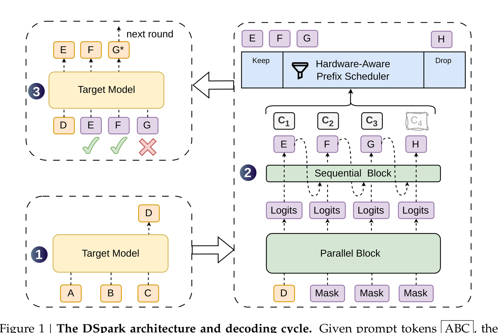
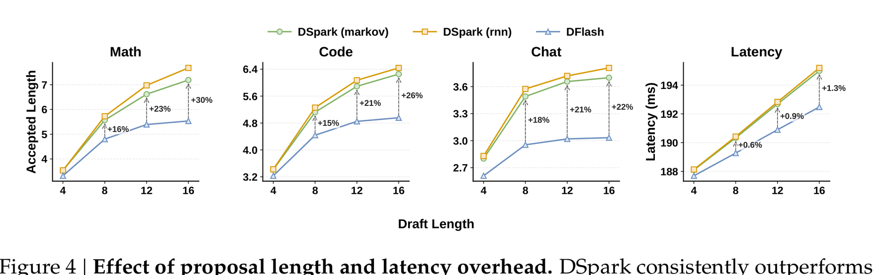
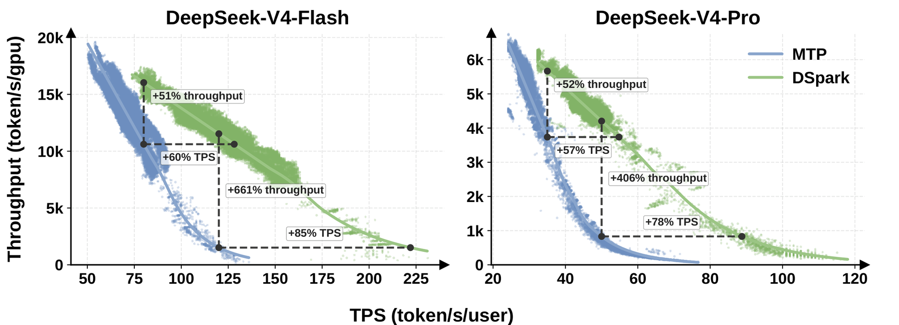
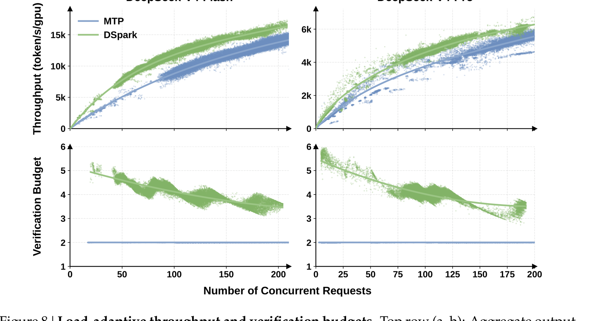

# 大模型变快，不是只靠更小模型：DSpark 的草稿验证法

DeepSeek 这篇 DSpark，讲的不是“又训练了一个更强的新模型”。

它更像一套给 DeepSeek-V4 推理服务装上的加速流水线：先让小草稿模块提前猜一段 token，再让大模型一次性验证；能过的留下，过不了的由大模型修正。

这类方法叫 speculative decoding。它的难点不在“猜得越多越好”，而在两个更工程的问题：草稿别前后打架，验证别浪费大模型算力。

DSpark 的核心判断很直接：大模型服务变慢，很多时候不是模型不会算，而是把 GPU 时间花在了低价值 token 上。

## 先理解一个比喻：草稿助理和主编

普通大模型生成文本，是一个 token 一个 token 往外写。

每写一个 token，大模型都要完整算一遍。输出越长，用户等得越久；并发越高，GPU 越容易被挤满。

Speculative decoding 换了一种工作流：

1. 先让一个更轻的 draft model 写几步草稿。
2. 再让目标大模型 target model 一次性检查这段草稿。
3. 大模型接受从开头开始连续正确的 token。
4. 第一个不合适的位置，由大模型自己生成正确 token。

这件事的好处是，如果草稿猜得准，大模型一次 forward pass 就能推进多个 token。

但这里有个硬约束：不能为了快，把输出质量偷偷改掉。经典 speculative decoding 通过 rejection sampling 保证目标模型的分布不变。也就是说，它追求的是“少算冤枉账”，不是“换一个便宜模型糊弄过去”。

## 第一个坑：并行草稿很快，但后面容易乱

草稿模型有两类典型做法。

自回归草稿是一边看前文一边往后写。它的优点是前后关系稳，缺点是自己也得一步一步生成。草稿还没写完，大模型已经在旁边等它。

并行草稿反过来，一次把多个位置都猜出来。速度很香，但每个位置像是分头写作，容易出现局部冲突。

论文里用了一个很好懂的例子：上下文可能接 “of course”，也可能接 “no problem”。如果每个位置独立猜，就可能拼出 “of problem” 或 “no course”。

在推理系统里，这种错误不会直接出现在最终回答里，因为 target model 会验证并拒掉。问题是，拒掉也要花算力。

后面的草稿 token 越不稳定，大模型验证它们的收益越低。

DSpark 的第一刀，是把并行草稿改成“半自回归”。

它没有把整段草稿重新变成慢吞吞的逐 token 生成。重计算仍然交给 parallel backbone，一次性算出多个位置的基础 logits。然后在最后加一个很轻的 sequential head，让后面的 token 能看到前面已经采样出来的 token。

可以把它理解成：先把草稿摊开，再用一支很轻的红笔，把句子内部的前后依赖补上。

Figure 4 里最值得看的不是某一个点，而是趋势：草稿长度变长时，DSpark 和 DFlash 的差距会拉大；但 sequential head 带来的延迟开销很小。

这说明 DSpark 没有靠“多堆一个大模型”换质量，而是在草稿尾部最容易掉链子的地方，加了一点便宜的依赖建模。

## 第二个坑：草稿猜得多，不等于都值得验证

如果只看算法，大家很容易得出一个朴素结论：草稿越长，越有机会一次多接受几个 token。

生产系统里不是这么算账。

大模型验证草稿也占 batch 容量。系统空闲时，多验证几个 token 可能没感觉；高并发时，把大概率会被拒的后缀也塞给 target model，就等于挤掉别的用户请求。

所以 DSpark 的第二刀，是给验证加调度。

它在 draft model 旁边训练了一个 confidence head。这个 head 不只是给单个 token 打分，而是估计“如果前面的草稿都通过了，当前位置还能通过验证的概率”。

然后 scheduler 把这些概率连起来，估计一段 prefix 能活下来的概率。

注意这里的关键词是 prefix。Speculative decoding 接受的是从开头开始连续通过的一段 token，不是东挑一个、西挑一个。所以第 5 个 token 再自信，如果第 3 个 token 已经很危险，它也没有独立上车的机会。

DSpark 的 hardware-aware prefix scheduler 会看两类信号：

- 当前这批请求里，哪些草稿前缀最可能被接受。
- 当前推理引擎在不同 batch size 下的吞吐曲线。

空闲时，它多验证一点，榨出更高单用户速度。忙起来，它缩短每个请求的验证长度，把 target model 的容量留给更可能通过的 token。

## 线上结果：快不是一个数字，是一条边界线

论文里最容易被传播的数字，是 DeepSeek-V4 线上服务里的加速结果。

在匹配吞吐水平下，DSpark 让 V4-Flash 的每用户生成速度提升 60% 到 85%，让 V4-Pro 提升 57% 到 78%。

但我不建议把这句话理解成“任何地方接入 DSpark 都能快 80%”。

论文真正想说明的是，DSpark 把 serving 系统的吞吐和交互速度边界往外推了。

Figure 7 的横轴是单用户 token/s，纵轴是每 GPU 的输出吞吐。蓝线是原来的 MTP baseline，绿线是 DSpark。

这张图的意思是：同样想保证用户感觉“够快”，DSpark 能支撑更高总吞吐；同样总吞吐下，DSpark 能让单个用户拿到更快生成速度。

更严格的 SLA 下，论文还给出了 661% 和 406% 这类很大的吞吐提升数字。但论文自己也提醒，这些点更多说明 baseline 已经接近运行边界，不应当当成常规乘数收益来宣传。

这点很重要。靠谱的工程论文不会只报最大数字，还会告诉你数字出现在哪里。

## DSpark 真正聪明的地方：负载变了，验证预算也变

如果让我只保留 DSpark 的一个工程启发，我会选这一条：

不要用固定策略处理动态负载。

同样一个草稿 token，在凌晨低流量时验证它可能很划算；在高并发峰值时验证它，可能就是把 GPU 时间从更有价值的请求上抢走。

Figure 8 下面两张图很直观：并发请求越多，DSpark 分配给每个请求的平均验证预算越会下降。MTP baseline 基本固定在 2 个 token 附近，而 DSpark 会在大约 4 到 6 个 token 之间动态调整，再随着负载上升逐步收紧。

这不是“少验证所以慢一点”。恰好相反，它是在高负载时减少低置信验证，把系统吞吐稳住。

## 这篇论文给工程侧的可复用清单

如果你在看推理加速、Agent 服务延迟，或者自建模型服务，我建议用下面这张表判断一个 speculative decoding 方案是不是能落地。

| 问题 | 只做 demo 的答案 | 生产系统要追问 |
|---|---|---|
| 草稿怎么生成 | 一次多猜几个 token | 后缀接受率会不会快速衰减 |
| 草稿前后关系 | 并行更快 | token 之间有没有轻量依赖建模 |
| 验证长度 | 固定验证 N 个 token | 能不能按请求难度和系统负载调整 |
| 置信度 | 打一个分筛掉低分 token | 分数是否校准到可用于吞吐估算 |
| 加速数字 | 报平均 speedup | 是否给出吞吐、延迟、并发的边界曲线 |
| 部署成本 | 算法看起来可行 | kernel、batch、KV cache、CUDA graph 是否能接住动态长度 |

我会特别看最后两行。

很多推理加速方案在单请求 benchmark 上很漂亮，到了多用户服务就失真。原因不是算法没用，而是验证 token 会抢 batch 容量，动态长度会让底层执行变复杂。

DSpark 把这个问题摆在明面上：它不只训练一个草稿头，还要让 scheduler 懂引擎吞吐曲线，让底层 kernel 支持可变长度验证。

## 适合谁看，不适合谁跟

如果你只是本地跑一个小模型，DSpark 可能离你有点远。因为它的主要收益来自大模型服务系统，尤其是并发、SLA、batch capacity 这些生产问题。

如果你在做 Agent 平台、代码生成服务、长输出问答，DSpark 很值得看。Agent 场景对“第一个响应之后的持续生成速度”很敏感，用户不只是等一个答案，还在等工具调用、代码 patch、日志解释、下一轮计划。

我不会把 DSpark 理解成一个可以简单复制的脚本。

更好的用法是，把它当成一套推理系统设计样板：

- 先拆清楚瓶颈是在 draft、verify，还是 serving scheduler。
- 再看加速方案有没有保持 target model 分布。
- 最后把收益放回吞吐和交互速度的二维边界里评估。

## 边界：复杂请求的草稿成本仍然会浪费

DSpark 也不是无成本加速。

论文在限制里说得很清楚：它仍然要先生成一整段 draft block。对于天然接受率很低的复杂请求，这部分草稿计算可能收不回来。

这也是下一步优化方向：能不能让 draft model 先判断请求难度，难的请求少猜一点，甚至提前退出。

这条边界对 Agent 很现实。越开放、越长链路、越带工具状态的任务，输出分布越不稳定，草稿越难提前猜准。未来的推理加速，很可能不会是一套全局固定参数，而是按任务类型、上下文形态和系统负载一起调度。

## 小结

DSpark 的价值，不是证明“大模型只要加一个小模型就能变快”。

它更像一次生产系统视角的纠偏：推理加速要同时回答三个问题。

第一，草稿能不能便宜地产生。

第二，草稿后半段会不会自己乱掉。

第三，大模型验证预算该给谁，而不是平均撒给所有 token。

下次看到 speculative decoding 的 speedup 数字，别只看“快了几倍”。先问三件事：接受长度怎么来的，验证浪费怎么控，负载变高时吞吐边界有没有一起变好。

这三个问题，比单点速度数字更接近真实服务里的答案。

参考资料：

- DeepSeek DSpark paper: https://github.com/deepseek-ai/DeepSpec/blob/main/DSpark_paper.pdf
- DeepSpec repository: https://raw.githubusercontent.com/deepseek-ai/DeepSpec/main/README.md
- DeepSeek-V4-Pro-DSpark model card: https://huggingface.co/deepseek-ai/DeepSeek-V4-Pro-DSpark
