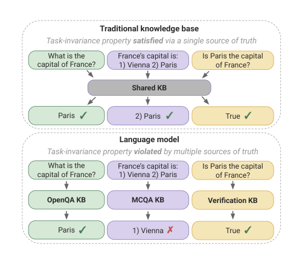
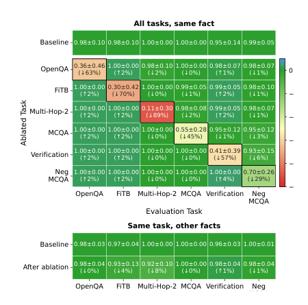
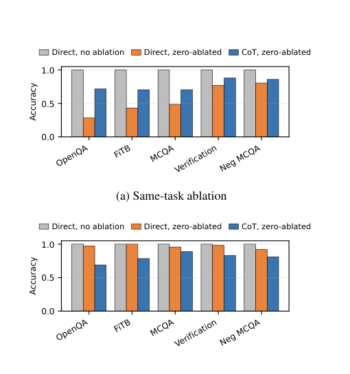

# 别把模型当统一知识库：同一事实，换问法就换参数

你给模型做事实评测时，最容易写一个问题：法国首都是哪里？

模型答 Paris，于是这条事实被标成通过。

但换成选择题、填空题、判断题，它未必还稳定答对。更麻烦的是，这种不稳定不一定只是 prompt 写得差，而可能来自参数里的存储方式。

arXiv 上这篇新论文《LMs as Task-Specific Knowledge Bases》给了一个很扎心的判断：**大模型不像传统知识库那样，为同一个事实维护一个统一事实源。很多时候，同一个事实会按任务格式分散在不同参数编码里。**

这对做 Agent、RAG、知识编辑、模型安全评测的人都很要命。因为生产系统里，用户不会只用一种格式问问题。

## 先拆掉一个舒服的比喻

过去几年，大家经常说大模型参数像一个知识库。

这个比喻有用，因为模型确实记住了大量事实。问首都、人物、公司总部、官方语言，它能直接从参数里吐答案。

但传统知识库还有一个更硬的要求：同一个事实应该有单一事实源。

比如 `(France, capital-of, Paris)` 这条事实，不管你怎么问，都应该回到同一条记录：

- "What is the capital of France?"
- "The capital of France is __."
- "Is Paris the capital of France?"
- "France's capital is: 1) Vienna 2) Paris"

传统数据库里，这些只是查询接口不同。事实源仍然是同一条记录。

论文要问的问题很朴素：大模型满足这个性质吗？

作者把这个性质叫 task-invariance。中文可以理解成：**事实知识不应该被任务格式绑架**。

## 第一组证据：事实不会自动同步到其他问法

论文先看训练过程。

如果模型真的有一个统一事实源，那么一个事实在某种任务里学会以后，只要另一个任务格式本身已经成熟，这条事实也应该很快在另一个任务里出现。

比如模型已经会用开放问答回答 "France -> Paris"，同时它也已经会做选择题。那么同一条事实应该能迁移到选择题里。

作者用 OLMo-3-7B IT 的 105 个训练检查点做追踪，数据来自 5 类关系：

- 国家和首都
- 国家和官方语言
- 地标和国家
- 公司和总部城市
- 人和演奏乐器

每类下采样到 46 个事实，一共 230 个事实。每个事实再用 6 种任务去测：补全、填空、开放问答、选择题、反向选择题、真假判断。

结果不太像统一知识库。

在 1,031 个可测试的 fact-task pair 里，有 **47.9%** 没有按预期同步出现。作者换了不同阈值，结果仍接近：阈值 0.4 时是 50.9%，阈值 0.8 时是 49.2%。

这不是几个 prompt 坏了。

论文还做了统计检验，把事实和任务格式的交互项拿出来看。最终模型里，fact-task interaction 解释了 **23%** 的方差。也就是说，模型答不答对，不只取决于事实本身，也强烈取决于你把事实包装成什么任务。

对工程侧来说，这个结论已经够用了：

**一个事实在 A 问法上通过，不等于它在 B 问法上也进入了同一个可靠存储。**

## 第二组证据：同一个事实能定位到不同参数

行为不一致还不够。也可能有人说：模型里仍然有统一事实源，只是读取接口太脆。

所以论文继续做机制分析。

作者在 OLMo-2-7B IT、OLMo-2-13B IT 和 Gemma-2-9B IT 上，尝试为每个 `(fact, task)` 找一小组参数组件，包括 attention heads 和 MLP neurons。

这组参数必须同时满足三个条件：

1. **Necessary**：拿掉它，目标事实在目标任务上明显变差。
2. **Sufficient**：在被破坏的 prompt 里，把它的激活 patch 回来，能恢复答案。
3. **Specific**：干预它时，不应该明显影响同一个事实的其他任务，也不应该明显影响同一个任务的其他事实。

这相当于问：能不能找到一小块参数，专门支撑 "France 的首都是 Paris" 这个事实在 OpenQA 任务上的表现，而不是支撑所有 "France -> Paris" 问法。

答案是可以。

在论文展示的一个代表性结果里，数据集是 `(country, official language, language)`，模型是 OLMo-2-7B IT。消融目标任务对应的局部组件后，目标格子的性能下降是 **29% 到 89%**；但同一个事实在其他任务上、同一个任务里的其他事实上，变化都基本压在 **8% 以内**。

更强的一点是 sufficiency。把局部组件激活 patch 回被破坏的 prompt，目标 pair 的恢复率达到 **69% 到 102%**。

这说明论文找到的不是随便一堆相关参数，而是对某个事实、某个任务格式有明确作用的参数子集。

如果统一知识库比喻成立，你很难解释这种现象：为什么同一个事实在不同任务上可以被拆成不同局部参数编码？

## 任务格式不是皮肤，而是存储路径

论文还有一个很实用的发现：不是所有任务格式都一样。

生成类任务，比如 OpenQA、FITB、多跳问答，参数编码更容易分开，纠缠度更低。判别类任务，比如选择题、真假判断、反向选择题，纠缠度更高。

论文汇总 15 个模型和数据集组合后，给出的平均纠缠度是：

| 任务类型 | 平均纠缠度 |
|---|---:|
| 判别任务：MCQA / VERIFICATION / NEGMCQA | 0.21 |
| 生成任务：OPENQA / FITB / MULTI-HOP | 0.11 |

再看训练里的事实共现，差异也很明显。

如果一个事实先在判别任务里出现，它迁移到非真假判断任务的比例只有 **3% 到 42%**。如果先在生成任务里出现，迁移比例是 **40% 到 90%**。

这对评测很有提醒意义。

选择题看起来很标准，结果好统计，也容易批量跑。但选择题不是开放问答的简单替代品。它可能调到另一套参数路径，甚至和开放生成走不同的事实入口。

所以只用选择题评测事实知识，或者只用开放问答评测事实知识，都容易给系统一个过于乐观的结论。

## CoT 有时不是想清楚了，而是绕到别的入口

论文最后把问题接到 chain-of-thought。

很多人都见过这种现象：直接问模型，它答错；让它一步步想，它又答对。

常见解释是 CoT 让模型推理更充分。论文给了一个更机制化的解释：CoT 可能会动用评估任务之外的任务特异编码。

作者做了两类消融。

第一类，消融当前任务自己的编码。直接回答的准确率下降 **20% 到 72%**，CoT 只下降 **12% 到 30%**。这说明 CoT 能绕开一部分当前任务路径的损伤。

第二类，消融其他任务里最影响当前条件的编码。直接回答最多只下降 **8%**，CoT 却下降 **11% 到 31%**。这说明 CoT 更依赖其他任务格式里的参数编码。

我的理解是：CoT 不只是给答案前多写几句话。

它更像在参数空间里多走几条路。直接回答卡在一个任务入口时，CoT 可能通过中间步骤调到另一个任务格式的事实编码。

这当然是能力。但它也提醒我们：模型里的事实访问并不干净。

当你用 CoT 把一个答案救回来时，不要急着说"模型其实知道"。更准确的说法是：模型在某些访问路径里能拿到这条事实，在另一些路径里拿不到。

## 对 Agent 和知识库工程有什么用

这篇论文最适合落到一个工程判断：

**不要把模型内部知识当成生产系统的 single source of truth。**

模型参数可以是知识的压缩副本，可以是补全器，可以是推理材料的一部分，但它不该替代显式事实源。

尤其是下面这些场景：

| 场景 | 容易犯的错 | 更稳的做法 |
|---|---|---|
| 事实评测 | 只测一种问法，答对就算知道 | 同一事实至少测开放问答、填空、判断、选择题和 paraphrase |
| Agent 记忆 | 以为模型会自然记住用户事实 | 把事实写进外部记忆，并保留来源、时间和失效规则 |
| RAG 系统 | 只看最终答案，不看访问路径 | 检查答案是否来自检索证据，而不是参数猜测 |
| 知识编辑 | 一个 prompt family 改成功就收工 | 编辑后跨任务、跨模板、跨 CoT / direct 再测 |
| 安全与遗忘 | 单一格式拒答就认为已遗忘 | 用肯定、否定、选择题、判断题、多跳方式做红队 |

这张表比论文里的数字更适合你直接拿去用。

因为真实 Agent 系统里，问题从来不会按 benchmark 的格式排队出现。用户可能先问开放问题，再给一个错误选项让模型判断，接着让 Agent 写邮件、改代码、查数据库。

如果这些入口背后不是同一个事实源，你就需要在系统层补一致性。

## 我会怎么用这篇论文

第一，评测事实可靠性时，我不会再接受"单格式通过"。

同一批事实，至少要用 4 类入口测一遍：开放生成、填空、判断、选择题。对 Agent 任务，还要加上工具调用后的追问和 CoT / direct 对比。

第二，做知识编辑和 unlearning 时，我会把跨任务验证当成默认门槛。

只把 "The capital of France is ___" 改掉，不代表 "Is Paris the capital of France?" 也被改掉。论文的结论正好解释了为什么很多编辑方法会出现 ripple effect 或漏网。

第三，做企业知识库时，我会更坚定地把事实源放在外部系统。

LLM 负责理解问题、组织检索、生成解释。事实本身应该来自文档、数据库、工单、CRM、代码仓库、版本化记忆，而不是来自模型参数里的模糊压缩。

第四，看到 CoT 提升事实准确率时，我会多问一句：它到底是在推理，还是在换访问路径？

如果 CoT 只是绕到另一组任务编码拿到了答案，生产系统仍然要关心可控性。因为你不知道下一个任务格式会不会又掉回错的入口。

## 这篇论文的边界

不要把这篇论文读成"大模型没有知识"。

论文说的不是模型一无所知，而是事实知识和任务格式在参数里纠缠在一起。

它也有清楚边界：

- 实验主要看 `(subject, relation, object)` 这种关系型事实。
- 机制实验和 CoT 实验筛掉了低基线表现事实，更多描述模型已经比较熟的事实。
- 模型规模是 7B 到 13B，覆盖 OLMo 和 Gemma 两个家族，还不能直接推广到所有超大模型。
- 官方代码仓库目前还是占位 README，复现实验需要等作者放出代码和数据。

但这些边界没有削弱主结论，反而让结论更值得重视。

关系型事实本来就是最像知识库记录的一类知识。如果连这种事实都明显受任务格式影响，那把参数当统一知识库就更需要谨慎。

## 最后给一张收藏清单

下次你要判断"模型是否知道一条事实"，别只问一次。

按这 6 个问题检查：

1. 这条事实在开放问答里对吗？
2. 这条事实在填空或补全里对吗？
3. 这条事实在选择题里对吗？选项位置换过吗？
4. 这条事实在真假判断里对吗？正反说法都测过吗？
5. 直接回答和 CoT 的结果一致吗？
6. 如果事实被编辑、更新或删除，所有任务格式都跟着变了吗？

答不上来，就别急着把"模型知道"写进系统假设。

更稳的说法是：模型在某些问法上能取到这条事实。至于它是不是可靠知识源，要看跨任务、跨模板、跨推理路径之后还剩多少一致性。

对 Agent 工程来说，这就是这篇论文最实用的提醒：

**模型会记住很多东西，但记住不等于统一存储；答对一次，也不等于生产可控。**

参考资料：

- Amit Elhelo, Amir Globerson, Mor Geva. [LMs as Task-Specific Knowledge Bases: An Interpretability Analysis](https://arxiv.org/abs/2606.27237). arXiv:2606.27237, 2026-06-25.
- 官方代码仓库: https://github.com/amitelhelo/TaskInvariance
- Fabio Petroni et al. [Language Models as Knowledge Bases?](https://arxiv.org/abs/1909.01066), 2019.
