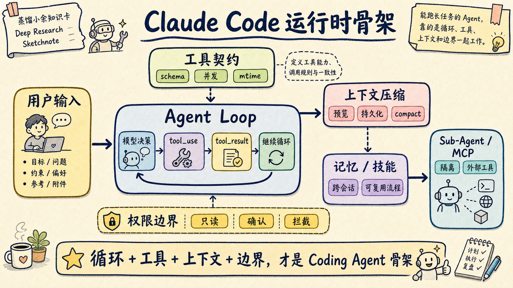

# 别硬啃 50 万行源码：先读这本 Claude Code 小书

你想看懂 Claude Code，不一定要从 50 万行源码开始。

更好的入口，是先把它拆回一个能跑的最小系统：模型怎么决定下一步，工具怎么被调用，权限怎么拦截，上下文怎么压缩，记忆和技能怎么进运行时，多 Agent 和 MCP 又怎么扩展边界。

《Claude Code From Scratch》走的就是这条路径。它用约 4300 行 TypeScript 和约 3800 行 Python，把 Claude Code 的关键机制复现成一套教学实现。不是仿 UI，也不是写几个 demo prompt，而是沿着 Agent runtime 的骨架，把一台 Coding Agent 重新装出来。

如果只记一个判断：这本书适合想理解 Claude Code 为什么能工作的开发者，不适合只想学几个 Claude Code 命令的人。

## 这不是一本「怎么用 Claude Code」的书

很多 Claude Code 教程会从命令开始讲：怎么安装，怎么登录，怎么让它改代码，怎么让它跑测试。

这本书的入口不在使用层，而在运行时层。

它先问一个更底层的问题：Claude Code 这类 Coding Agent 到底靠什么跑起来？

答案不是「模型很聪明」这么简单。书里的主线很清楚：用户输入进入 CLI，Agent Loop 调用模型，模型返回工具调用，系统执行工具，把结果喂回模型，然后继续循环。直到模型不再发出工具调用，任务才结束。

这个循环听起来朴素，但它解释了 AI 编程从聊天助手走向自主 Agent 的关键变化。

聊天助手只能给建议。Coding Agent 可以读文件、改文件、跑命令、看报错、再修复。模型不再只是回答问题，而是在一个受控工具循环里持续试错。

读懂这一层，很多 Agent 产品就没那么玄了。

## 第一处精髓：Agent Loop 是心脏，不是装饰

书的第 1 章把 Agent Loop 拆得很干净：调用 LLM，检查响应里有没有 `tool_use`，有就执行工具，把 `tool_result` 放回消息历史，再继续下一轮。

这也是我最推荐先读的部分。

因为很多人做 Agent，容易先去追复杂能力：多 Agent、记忆、MCP、长上下文、自动规划。结果基础循环还没想清楚，就开始堆功能。

Agent Loop 先回答三个问题：

- 模型怎么决定下一步；
- 工具结果怎么变成下一轮输入；
- 系统什么时候认为任务完成。

这三个问题没有处理好，后面的能力都会变成补丁。

比如工具失败了，是直接报错，还是把错误返回给模型让它修？输出太长了，是截断，还是持久化到磁盘让模型按需读取？用户中断了，正在跑的工具怎么停？

这些都不是 prompt 能兜住的，它们属于循环控制。

## 第二处精髓：工具不是函数列表，而是工作契约

第 2 章讲工具系统，我建议做 Agent runtime 的人认真看。

书里没有把工具写成一堆函数名，而是把工具当成完整契约：名字、描述、输入 schema、权限检查、是否只读、是否可并发、是否危险、结果怎么渲染、结果太大怎么处理。

这比「给模型几个工具」更接近真实工程。

一个读文件工具和一个删文件工具，当然不能只靠名字区分风险。一个 shell 工具对 `ls` 可能是只读的，对 `rm` 就不是。一个搜索工具可以并发跑，写文件工具就要小心冲突。工具输出超过几十 KB，如果直接塞回上下文，很快就会把任务跑死。

书里还有一个很好的安全判断：默认值要 fail-closed。

也就是说，工具默认不可并发，默认不是只读。误把安全工具当成需要确认，最多让用户多点一下；误把危险工具当成安全工具，就可能直接写坏项目。

这就是 Agent 工具系统和普通 SDK 的差别。SDK 只关心函数能不能调用，Agent 工具还要关心模型会不会误用、运行时能不能拦住、用户能不能看懂。

## 第三处精髓：System Prompt 是装配层，不是许愿池

第 3 章讲 System Prompt，很容易被低估。

很多人把 system prompt 当成一段更长的提示词，继续往里面加「你要认真」「不要犯错」「一步一步思考」。

这本书的处理更工程化。

它把 prompt 拆成身份、系统事实、任务规则、操作风险、工具偏好、输出风格和效率约束。顺序也有讲究：先建立身份和约束框架，再告诉模型怎么做具体动作。

我喜欢其中两个细节。

一个是反模式接种。不要只说「保持简洁」，还要明确说不要给没改过的代码加 docstring，不要顺手重构周边代码，不要提前抽象。

另一个是工具偏好映射。比如让模型优先用专用读文件工具，而不是用 shell 里的 `cat`；优先用编辑工具，而不是随手 `sed`。这不是形式主义，专用工具更容易做权限控制、结构化输出和并行调度。

小余判断：Agent 里的 prompt 不是文案，它更像运行时装配表。把项目规则、工具说明、记忆、技能放在正确位置，模型下一步动作才会稳定。

## 第四处精髓：上下文管理决定 Agent 能跑多远

如果只能挑一个进阶章节，我会先读第 7 章。

因为拉开普通聊天机器人和 Coding Agent 差距的，不只是模型会调用工具，而是系统能不能在长任务里维持有效上下文。

书里把上下文管理拆成几层：大结果先持久化到磁盘，只在上下文里留预览和路径；历史工具结果按预算裁剪；过时结果被 snip；缓存冷掉时做 microcompact；最后才用 auto-compact 做全量摘要。

这个设计背后的判断很关键：上下文不是仓库。

复杂任务会读很多文件、跑很多命令、产生很多中间输出。如果都塞进消息历史，模型窗口很快满掉，成本也会失控。更好的做法是把大结果外部化，把当前决策需要的摘要留在上下文，把可回读路径留给模型。

这也是很多自制 Agent 容易卡住的地方。

它们一开始能跑，是因为任务短。一旦进入真实项目，日志变长、文件变多、测试失败来回几轮，消息历史开始膨胀，模型就会忘记目标、丢掉约束、重复读文件。

所以我会把第 7 章当成分水岭。看懂这里，才算开始理解 Coding Agent 的工程难度。

## 第五处精髓：记忆和技能不要混在一起

第 8 章讲记忆，第 9 章讲技能。两章放在一起读，很有价值。

记忆解决的是跨会话认知。书里有一个很好的约束：只记不可从当前项目状态推导的信息。

代码结构、文件路径、当前报错，能从项目里读出来，就不该长期写进记忆。否则记忆会漂移，几周后反而误导模型。更适合进入记忆的，是用户偏好、反馈、项目决策、外部系统位置这类信息。

技能解决的是重复工作流。

一个 `/commit` 技能可以封装读 diff、分析变更、写 commit message 的流程。技能可以 inline 注入当前对话，也可以 fork 到独立子 Agent 执行，避免大量工具调用污染主上下文。

这两件事很容易被混用。

很多人会把「某次任务怎么做」写成记忆，结果长期污染；也有人把「用户长期偏好」塞进技能，结果只有调用技能时才生效。

更稳的分法是：

| 对象 | 解决什么问题 | 不该放什么 |
|---|---|---|
| 记忆 | 跨会话保留用户、反馈、项目决策、外部引用 | 可从代码和当前状态重新推导的信息 |
| 技能 | 把重复工作流做成可调用模块 | 一次性聊天上下文、临时项目状态 |

读完这两章，再看现在各种 Agent Skills、Memory、Rules 设计，会清楚很多。

## 第六处精髓：多 Agent 和 MCP 是边界扩展

书的后半段讲 Plan Mode、多 Agent 和 MCP。

Plan Mode 的价值不是「让 Agent 慢一点」，而是把只读探索和写入执行分开。先读代码、写计划、让用户审批，再进入执行模式。这个设计对真实项目很重要，因为一旦 Agent 直接开改，返工成本会比多花几分钟规划高得多。

多 Agent 章节讲的是 Sub-Agent fork-return。主 Agent 派生一个独立子 Agent 去探索、规划或执行通用任务，完成后只把结果返回主线。

这里要抓住关键词：上下文隔离。

多 Agent 不是给模型起几个人设名，而是把一段会污染主上下文的工作拆出去，让主线只接收结论。

MCP 章节则把外部工具接入讲清楚：启动子进程，通过 JSON-RPC 握手，发现工具，用 `mcp__server__tool` 这样的前缀注册，再把调用透明路由到外部服务。

这解释了为什么 MCP 对 Agent 重要。它不是又一个插件市场概念，而是把数据库、GitHub、Slack、本地文件系统这些外部能力，接进统一工具池的协议层。

## 我建议这样读这本书

如果你没有时间逐章细看，可以收藏这张阅读路线表：

| 目标 | 先读章节 | 读完要带走什么 |
|---|---|---|
| 看懂 Agent 怎么跑 | 引言 + 第 1 章 | Agent Loop、tool_use、tool_result |
| 做一个能改代码的 Agent | 第 2、3、6 章 | 工具契约、System Prompt、权限边界 |
| 让 Agent 跑长任务 | 第 7 章 | 分层压缩、大结果持久化、auto-compact |
| 做个人工作流 | 第 8、9、10 章 | 记忆、技能、Plan Mode |
| 做平台扩展 | 第 11、12、13 章 | Sub-Agent、MCP、下一步增强路线 |

不建议第一遍就纠结每段代码。

先按架构读，把「一个 Coding Agent 至少需要哪些模块」这张图拼出来。第二遍再回到代码，看每个模块怎么实现。

这本书最好的地方，是它没有只停在概念层。每章都把 Claude Code 真实设计和 mini-claude 的简化实现对照起来：生产系统怎么做，教学版本为什么删掉一部分。

这种对照非常适合学习工程取舍。

## 这本书适合谁

我会推荐给三类人。

第一类，是已经在用 Claude Code、Codex、Cursor Agent，但想知道背后怎么工作的开发者。你不必马上造一个 Agent，但读完会更懂为什么有些任务需要 Plan Mode，为什么工具权限会弹窗，为什么上下文会突然 compact。

第二类，是准备做自建 Coding Agent 的工程师。不要一上来就做多 Agent 平台，先把 Agent Loop、工具契约、权限、上下文压缩跑通。书里的 mini-claude 就是一条不错的最小路线。

第三类，是在写 Agent Skill、Memory、MCP 集成的人。读完你会更容易判断一条规则应该放进 system prompt、记忆、技能，还是工具协议。

不太适合的人也很明确。

如果你只是想学 Claude Code 日常命令，这本书会偏底层。它不是「十分钟上手」教程，而是一本拆发动机的小书。

## 荐语

我喜欢这本书的地方，是它把 Claude Code 从一个「很好用的黑盒」拆回了普通软件工程。

Agent Loop 是循环，工具系统是契约，System Prompt 是装配层，权限是边界，上下文管理是内存治理，记忆和技能是长期工作流，多 Agent 和 MCP 是扩展接口。

这些词听起来都不神秘，但合在一起，就构成了现在 Coding Agent 的基本骨架。

这也是我推荐它的原因：读完不一定马上能造出一个 Claude Code，但你会更清楚自己在用的 Agent 到底靠哪些工程机制工作。

下次 Agent 又跑偏时，别只怪模型不聪明。先回头看六件事：循环有没有反馈，工具有没有契约，权限有没有边界，上下文有没有压缩，记忆有没有漂移，技能有没有隔离。

这张检查表建议收藏起来，比多背几个 prompt 更有用。

如果你想继续看 Claude Code 和 Coding Agent runtime 拆解，我后面会沿着三条线继续写：Agent Loop、上下文压缩、Skill / MCP 边界。关注这个系列，下一篇就从 Agent Loop 的工具反馈循环讲起。

原书地址：[Claude Code From Scratch](https://diwang.info/claude-code-from-scratch/#/)
