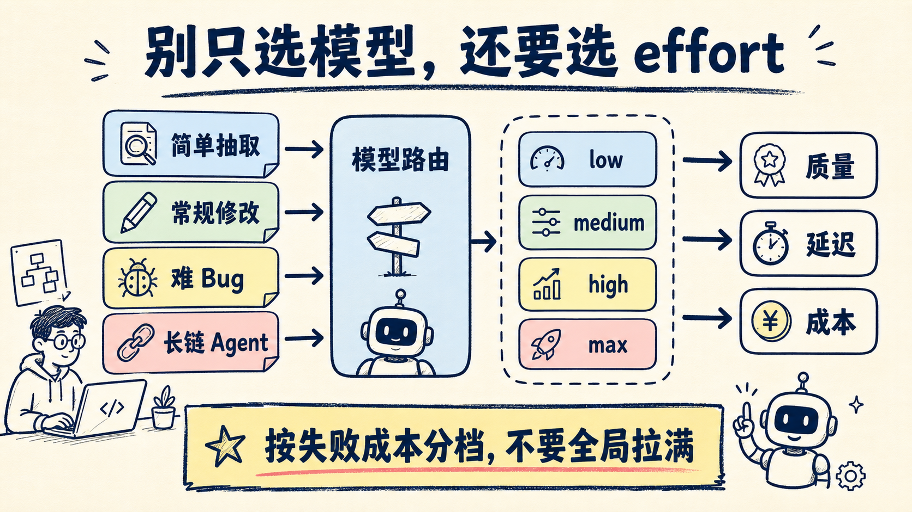
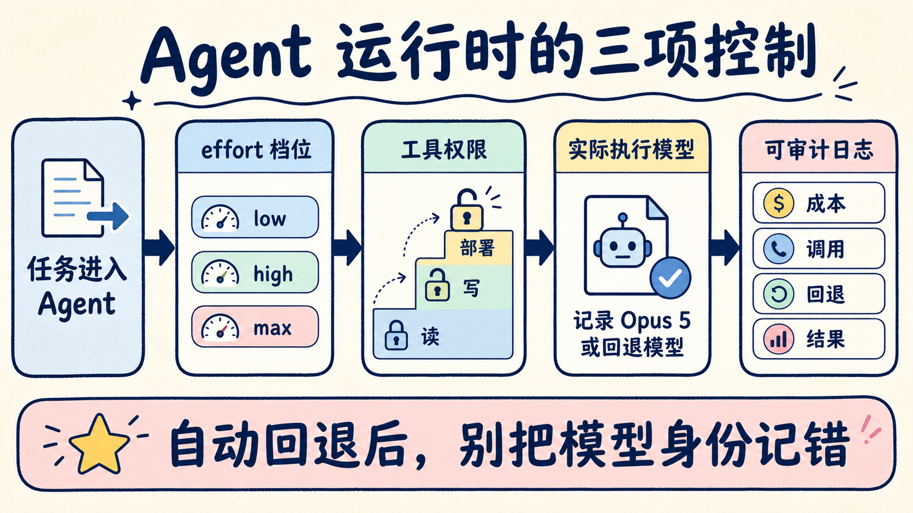

# Opus 5 不是全面替换：先把最难的任务交给它

Claude Opus 5 发布后，最省事的动作是把模型名全部替换掉。

但这通常也是最贵、最难评估的迁移方式。

Opus 5 的价值不在于接管每一次分类、摘要和简单改写，而在于把过去需要反复盯着的高难任务，推进得更久、更稳，并在交付前主动验证。开发者现在要做的，不是“全量升级”，而是找出工作流里最贵的失败，把 Opus 5 放到那里。

## 这次升级，重点不是又多了几个榜单第一

Anthropic 在 7 月 24 日发布了 Claude Opus 5。API 型号是 `claude-opus-5`，基础价格仍是每百万输入 token 5 美元、输出 token 25 美元，与 Opus 4.8 相同。

官方把它描述为：用大约一半的成本，接近 Fable 5 的前沿能力。

在 Anthropic 公布的评测里，Opus 5 在 Frontier-Bench v0.1 上超过其他模型；CursorBench 3.2 的 max effort 结果与 Fable 5 峰值只差 0.5%，单任务成本约为一半。它在自动化、计算机操作、科研和专业知识工作上也有明显提升。

这些数字要谨慎看。它们主要来自 Anthropic 的发布材料和早期合作方，不等于每个真实代码库都能复现。

更值得看的是发布公告里反复出现的一种行为：遇到信息缺口时不急着交差，会自己补测试、换验证路径、追到根因，再检查结果。

对 Agent 工程来说，这比“第一次回答更漂亮”更重要。长任务最贵的成本，常常不是 token，而是模型过早宣布完成后，人再回来排查。

## Opus 5 想做的，是日常主力而不是展示柜模型

Fable 5 代表能力上限，Opus 5 则试图把接近这个上限的表现，放进更多人每天能用的价位。

它已经成为 Claude Max 的默认模型，也是 Claude Pro 上最强的模型。开发者可以在 Claude API、Claude Code、Claude Cowork，以及 AWS、Google Cloud和 Microsoft Foundry 使用。

这次还有一个很实用的变化：effort 档位。

同一个 Opus 5，可以根据任务价值决定“想多久”。简单任务压低 effort，减少 token、延迟和成本；跨仓库重构、难 bug、研究型任务再拉到 high、xhigh 或 max。

这让模型选择从一道单选题，变成两层路由：

1. 先决定任务要不要用 Opus 5；
2. 再决定这次任务值得投入多少 effort。

## 三类任务，最值得先迁移

### 第一类：失败后返工很贵

例如跨文件重构、生产事故根因分析、数据迁移、复杂 PR 审查。

这类任务不怕模型多花几分钟，怕的是它修了表面症状、漏掉边界条件，最后把返工留给工程师。Anthropic 公布的案例里，Opus 5 在一个开源包管理器 bug 上追到了根因，还补掉了社区 patch 遗漏的边界。

单个案例不能证明普遍能力，却给出了很清楚的试用方向：把“表面能跑、实际没修干净”的任务先交给它。

### 第二类：要跨很多工具跑完整闭环

例如从表格找出风险账户，通知负责人，再生成留存摘要；或者从需求开始，修改代码、打开浏览器验收、修掉移动端问题。

这类任务的难点不是某一步不会，而是跑到第七步还记得目标、能检查前一步的输出，并愿意在交付前回头验证。

Opus 5 在 Zapier AutomationBench 和 OSWorld 2.0 上的表现，正好指向这种长链任务。这里仍要用自己的工具集和真实数据做回归，不能拿官方榜单代替生产验收。

### 第三类：输入模糊，但判断质量决定结果

专业研究、架构方案、财务分析、合同修订，通常没有唯一标准答案。

早期客户反馈里，Opus 5 的提升多次集中在数值推理、表格、根因分析、代码审查和对不合理方案提出异议。它的优势更像“判断更稳”，不只是“知识更多”。

如果任务只要求抽字段、改格式、生成固定模板，Opus 5 的上限很可能用不上。

## 不要全局拉满 effort

effort 提供了控制权，也带来新的成本坑。

如果所有请求都用 max，团队只是把“无差别上最贵模型”改成了“无差别上最贵档位”。更稳的做法是按失败成本分层：

| 任务 | 建议模型与 effort | 原因 |
| --- | --- | --- |
| 分类、抽取、固定格式 | 便宜模型或 Opus 5 低 effort | 结果容易校验，失败成本低 |
| 单文件修改、常规问答 | Opus 5 低到中 effort | 兼顾速度与质量 |
| 跨文件重构、难 bug | Opus 5 high / xhigh | 根因与边界验证更值钱 |
| 高价值研究、长链 Agent | Opus 5 xhigh / max | 允许更多推理和工具循环 |
| 极高难度、能力上限任务 | 与 Fable 5 做 A/B | 不预设 Opus 5 必然足够 |

建议把任务成功率、人工接管次数、总 token、墙钟时间和返工时间一起记录。只看单次 token 价格，会漏掉模型失败后的人力成本。

## 两个 beta，Agent 开发者要特别留意

Opus 5 同时带来两个 beta 能力。

第一个是会话中途修改工具。开发者可以在对话进行中改变 Claude 可用的工具，而不让 prompt cache 失效。

这适合按阶段开放权限：研究阶段只给搜索和读取；方案确认后再开放写文件；用户批准后才开放部署。工具不必在会话开始时一次性全部塞进去。

第二个是自动回退。Opus 5 或 Fable 5 的请求如果被安全分类器拦截，API 可以把请求路由到另一个可用模型。Claude.ai、Claude Code 和 Claude Cowork 中，部分场景默认会回退到 Opus 4.8。

自动回退能减少工作流被拒绝直接打断，但也会改变审计语义。日志必须记录最终执行模型，否则团队会把 Opus 4.8 的结果当成 Opus 5，A/B 数据也会被污染。

## 我会怎么迁移现有工作流

我不会先改默认模型，而会跑一轮影子测试。

- [ ] 从线上挑 20～50 个最难、返工最贵的真实任务
- [ ] 固定工具、Prompt、权限和验收脚本
- [ ] 对比 Opus 4.8 与 Opus 5 的成功率和人工接管次数
- [ ] 给 Opus 5 分别测试低、中、高 effort
- [ ] 记录总 token、耗时、工具调用数和返工时间
- [ ] 检查安全拦截后是否发生模型回退
- [ ] 只有高难任务收益明确时，才扩大路由比例
- [ ] 简单任务继续留在便宜模型

这张清单的目标不是证明新模型更强，而是找出它在哪些任务上更划算。

还有一条边界不能省：Opus 5 的自我验证更强，不等于可以取消外部验收。测试、权限、回滚、人工审批仍然属于系统职责。

## 最后

Opus 5 最值得关注的变化，是“接近能力上限”开始变成日常可路由的工程资源。

别急着一键替换全部模型。先把工作流里返工最贵、工具链最长、最需要判断的任务挑出来，用成功率、接管次数和总成本做一次 A/B。

把上面的迁移清单收藏下来。下一篇我会继续实测：同一组 Claude Code 任务，在不同 effort 档位下，质量、速度和 token 到底差多少。

