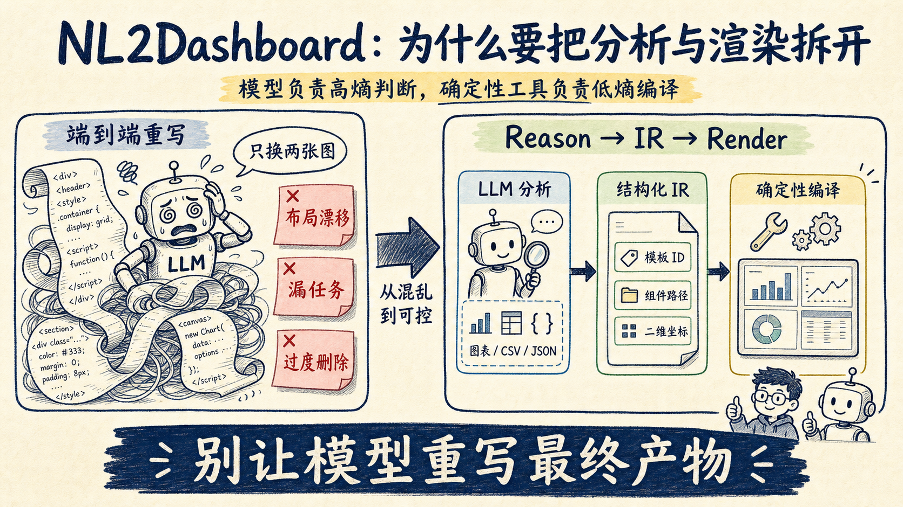
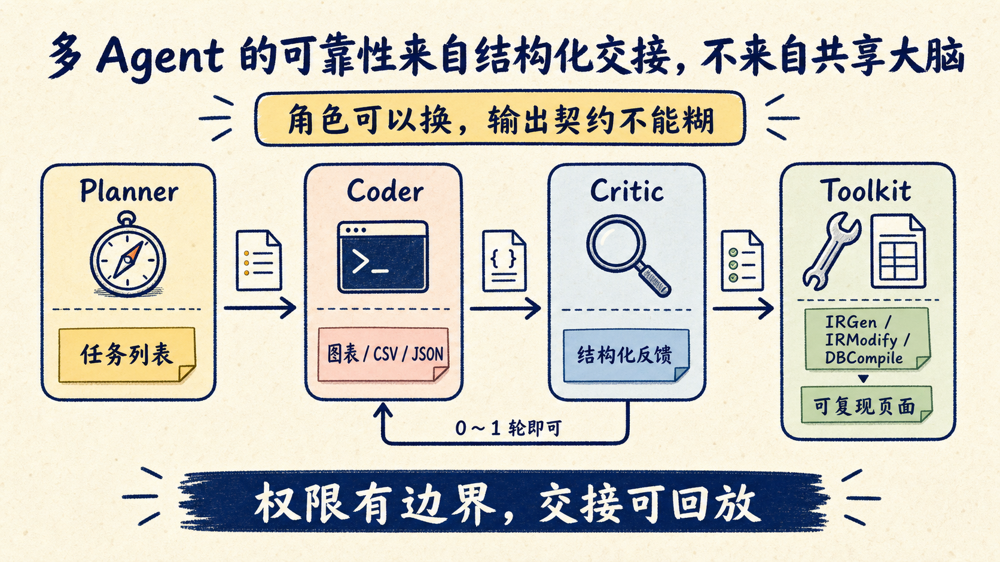

# 别让 Agent 重写整个页面：NL2Dashboard 用 IR 管住修改边界

你让 Agent 把 Dashboard 里的两张图换个位置，再补一张趋势图。它答应得很快，交付时却把标题改了、配色漂了，甚至顺手删掉一块本来不该动的内容。

问题不一定出在模型不够强，而是任务边界给错了：你让模型重新生成最终页面，却期待它只改一个局部。

论文 NL2Dashboard 给出的办法很克制：模型不再直接维护整份 HTML，而是只修改一份结构化中间表示（IR）；页面交给确定性渲染器重新组装。论文实验中，它完成了全部修改任务，生成开销比值也从端到端方案常见的 1～3，降到生成时的 0.58、局部修改时的 0.02～0.43。

这套设计值得看的地方，不只是“用自然语言做 Dashboard”。它给所有 Agent 应用都提了一个问题：

> 哪些工作必须让模型判断，哪些工作应该交还给普通代码？

## 直接生成 HTML，为什么总会越改越乱

一张完整 Dashboard 不是一张图。它同时包含数据分析、图表选择、页面布局、颜色、组件位置、CSS 和交互脚本。

端到端方案把这些工作塞给同一次生成。模型既要判断“该分析什么”，又要决定“卡片放左边还是右边”，还要输出大量 HTML、CSS 和 JavaScript。

第一次生成也许能看。第二次让它局部修改，麻烦就来了：模型通常要把原页面读进上下文，再重写整份文件。一个“交换两张图”的要求，最后变成一次全量代码生成。

论文统计了基线系统 210 个失败修改案例。41% 是空间布局错误，21% 漏了任务，18% 发生了过度删除。最常见的问题不是页面打不开，而是修改范围失控。

这很像让 AI 改一个大型配置文件，却不给 schema、diff 和 patch 工具，只让它根据一句自然语言重新打印全部内容。输出越长，误伤面越大。

## NL2Dashboard 的做法：先推理，再编译

NL2Dashboard 把流程拆成两段：

1. **Prompt-to-IR**：模型理解用户意图、运行数据分析，并填写结构化配置；
2. **IR-to-Dashboard**：普通程序读取配置，套用模板，确定性地组装页面。

这份 IR 记录三类信息：

- Dashboard 标题、字体颜色等默认属性；
- 一份预制模板的 ID；
- 图表、表格、文本结果的文件路径与二维布局坐标。

模型仍然负责困难的部分。它要读懂表结构，规划分析任务，在沙箱里生成并执行脚本，产出图表、CSV 和 JSON。

但它不再负责把所有视觉细节逐 token 写出来。渲染器只做 slot filling：找到模板，把分析制品填进指定位置。

这就是论文概括的 Reason-then-Render。模型处理开放判断，代码处理可重复装配。

## 修改不靠“理解整页”，而靠四个原子动作

只引入 IR 还不够。用户的修改指令仍然可能很模糊：

> 背景改成深色，删掉销售分布，新增季度趋势，再把左右两张图交换。

NL2Dashboard 不让模型直接碰页面，而是先把这句话翻译成一个有顺序的修改脚本：

`change → delete → add → swap`

系统只定义四种原子动作：

| 动作 | 负责什么 |
| --- | --- |
| `change` | 修改标题、背景色等模板属性 |
| `swap` | 交换两个分析组件的位置 |
| `delete` | 删除指定组件 |
| `add` | 加入新的图表、表格或分析结果 |

如果 `add` 需要新的数据分析，Coder 再去生成新的制品。随后 `IRModify` 依次更新配置，`DBCompile` 重新组装页面。

这个设计的价值很直接：模型不能靠一段看似合理的 HTML 假装完成任务。每次修改都能落到有限动作、明确目标和可检查结果上。

对 Agent 工程来说，这比“再写一版更强的 Prompt”更有用。自然语言入口可以很自由，执行层必须尽量收敛。

## 多 Agent 不是重点，输出契约才是

论文还实现了一套四部分架构：

- Planner 识别生成或修改意图，拆任务并调度；
- Coder 在沙箱里写代码、跑分析，失败后自修复；
- Critic 用视觉模型检查图表，再把问题退回 Coder；
- Toolkit 提供 IR 生成、修改和页面编译工具。

看起来像标准的多 Agent 系统，但拆成几个角色并不会自动提高可靠性。

NL2Dashboard 更关键的取舍，是每个角色都没有无限权限。Planner 不直接写页面，Coder 只交分析制品，Critic 只提反馈，最终组装必须经过确定性工具。

论文的消融实验也给了一个实用提醒：Critic 能改善质量，但多轮收益递减、token 成本上升。作者建议实践中零轮或一轮就够。

我的判断是，多 Agent 系统最容易做过头的地方，就是把“多检查几遍”当成可靠性。真正该先设计的是交接物：

- Planner 交付任务列表；
- Coder 交付可执行制品；
- Critic 交付结构化反馈；
- 编译器交付可复现页面。

角色名字可以换，契约不能糊。

## 实验结果亮眼，但别把它读成模型排行榜

论文用了 10 张来自金融、教育和政务场景的表格。每张表先做生成，再做 7 类修改任务，从改标题、换图，到多步骤的删除、新增和交换。

NL2Dashboard 的生成质量总分是 11.89，修改质量是 11.93；第二名 Gemini 2.5 Pro 分别是 10.63 和 10.84。论文报告的相对提升为 8.4% 和 7.3%。

token 效率用 GOR 衡量：LLM 输出 token 除以最终 Dashboard 文件 token，越低越好。NL2Dashboard 生成时是 0.58，七类修改为 0.02～0.43；豆包和 GPT-5 Agentic 多数落在 1～3。

这些结果支持“IR 能减少重复生成、提高修改可控性”，但还有三条边界要记住：

1. 论文目前是 arXiv 预印本，数据集只有 10 张表；
2. 视觉质量由 VLM 打分，修改成功率才加入人工交叉验证；
3. 各方案使用的模型与产品入口不同，不能拿总分直接判断哪个底座模型更强。

模板化也有代价。确定性渲染能守住布局，却会压低完全自由创作的上限。要做高度定制的数据艺术作品，我不会先选这条路；要批量生成风格稳定、经常局部修改的业务看板，它就很合适。

## 这套 IR 思路，可以搬到哪些 Agent 里

我会用下面四个问题判断一个任务是否值得加 IR：

- 输出结构是否反复出现？
- 用户是否经常只改一个局部？
- 是否已经有稳定的渲染器、编译器或执行器？
- 一次误改是否会污染未指定区域？

如果大多回答“是”，就别再让 Agent 直接重写最终产物。

| 场景 | Agent 应该产出 | 确定性工具负责 |
| --- | --- | --- |
| 周报生成 | 章节、数据引用、状态 IR | 套模板、排版、导出 |
| 云资源变更 | 声明式变更计划 | 校验、diff、apply |
| 工作流搭建 | 节点与连线配置 | 编译、执行、重试 |
| 网页生成 | 组件树与设计 token | 渲染、响应式布局 |
| 告警处置 | 原子操作序列 | 权限检查、执行、回滚 |

反过来，如果任务只做一次、输出高度自由、连 schema 都还没稳定，先加 IR 可能只是多造一层抽象。

## 一份可直接复用的设计清单

准备把 Agent 接进生产流程时，可以先过这 6 项：

1. **圈出高熵判断**：哪些步骤需要模型理解语义、做开放分析？
2. **移走低熵劳动**：拼 HTML、套样式、校验 schema 能否交给代码？
3. **定义最小 IR**：只保存下游执行必需的字段。
4. **限制修改动作**：把编辑意图收敛成有限、可组合的操作集。
5. **保留可回放制品**：Prompt、IR、工具输入和结果都能追踪。
6. **用 diff 验收边界**：除了检查“改对了什么”，还要检查“有没有动不该动的地方”。

NL2Dashboard 最值得带走的经验，不是又多了一个多 Agent Demo。

而是它把模型从最终产物前面往后退了一步。模型负责判断，IR 负责交接，普通代码负责兑现。Agent 一旦开始频繁修改真实系统，这一步后退，往往比换一个更强模型更重要。

建议把上面的 6 项清单收藏下来。下次 Agent 又把局部修改做成全量重写，先别继续补 Prompt，先检查中间是不是缺了一层可审计的 IR。
