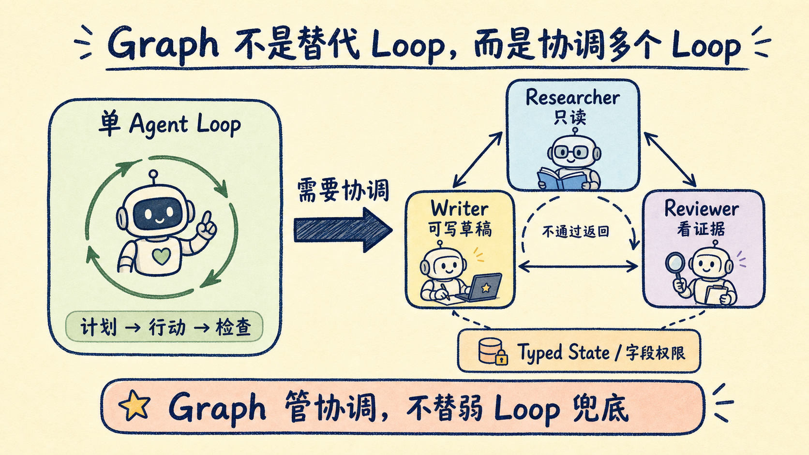

# 多 Agent 别急着画 Graph：先守住这 4 条工程边界

一个 Agent 跑不稳，就拆成 researcher、writer、reviewer，再画几条边把它们连起来。架构图立刻高级了，系统却可能更慢、更贵、更难查错。

问题不在 Graph 没用，而在使用顺序反了。

Graph Engineering 不是 Loop Engineering 的替代品。它解决的是多个 Loop 之间的协调：谁先运行，谁能改状态，失败后回到哪里，最后由谁验收。如果单个 Loop 还没有停止条件、完成检查和预算上限，套上 Graph 只会把一次失败扩散成分布式失败。

这篇文章不追新名词，只回答两个工程问题：什么时候值得上 Graph，以及上了以后最容易坏在哪里。

## 一个 Loop，本来就是最小的 Graph

先把术语压到最小。

- **Node（节点）**：一个独立工作单元，可以是 Agent、模型调用、普通函数、工具，甚至人工审批；
- **Edge（边）**：决定下一个节点是谁，可以串行、并行，也可以按条件分支；
- **State（状态）**：沿着边传递的共享对象，节点从中读取，也可能向其中写入。

最常见的示例只有三个节点：researcher 搜集材料，writer 写初稿，reviewer 判断是否通过。通过就结束，不通过就退回 writer。

这里已经有一个 Loop。Graph 没有消灭循环，只是把多个循环接起来，并给它们加上调度与约束。

这也解释了最近几年不断出现的新词：

| 层级 | 负责什么 |
| --- | --- |
| Prompt Engineering | 模型收到的指令 |
| Context Engineering | 模型在当前调用里能看到什么 |
| Harness Engineering | 工具、状态、错误处理等运行外壳 |
| Loop Engineering | 单个 Agent 如何持续行动直到完成 |
| Graph Engineering | 多个 Loop 如何协调、分支和互相验收 |

上层不会替你补好下层。Prompt、上下文和 Harness 有问题，Graph 只会让故障传播路径更复杂。

而且 Graph 并不是 2026 年才出现的新技术。LangChain 在 2024 年 1 月发布 LangGraph 时，就把有环状态图用于 Agent Runtime；微软 AutoGen 的 GraphFlow 支持串行、并行、条件分支和循环；Google ADK 2.0 也把 Agent 与普通函数统一成图节点。新的是讨论热度，不是图本身。

## 节点不是越多越专业

最常见的 Graph 过度设计，是把“总结一份 PDF”拆成 fetcher、chunker、summarizer、reviewer、formatter 五个节点。

节点多了，看起来职责清楚，实际却增加了五类成本：模型调用、序列化、共享状态、重试路径和观测面。

一个节点值得独立存在，至少要满足一条：

1. 需要不同模型或不同工具权限；
2. 子任务可以独立并行，且最后能明确合并；
3. 需要独立失败、独立重试或独立审计；
4. 承担读写隔离，例如 reviewer 只读、executor 才能写。

如果两个节点合并后没有丢掉权限边界、并行收益或故障隔离，它们原本就不该拆开。

我的判断标准更直接：先在纸上画。如果解释每个节点为什么存在，比解释业务本身还费劲，Graph 已经过度设计。

## 共享状态，会把小错误变成系统错误

单 Agent 跑久了，常见问题是 context rot：历史越来越长，错误和噪声一起留在上下文里。

Graph 里，同一种问题会迁移到共享 State。

第二个节点写错一个字段，第五个节点可能把它当成确定事实。等最终输出出错时，坏数据已经经过多个节点，很难只看最后一步定位。

稳定做法并不花哨：

- 给 State 定义类型和 schema；
- 明确每个节点能读、能写哪些字段；
- 节点之间只传必要结果，不转发整段对话；
- 在关键边界做 checkpoint，支持逐节点回放；
- 让所有外部副作用具备幂等性。

最后一条最容易漏。checkpoint 之后重放，可能再次发邮件、再次扣款或再次创建记录。如果写操作不能安全执行两次，可回放就会变成重复事故。

## 能用代码判断的路由，别交给模型猜

每条 Edge 都在回答一个决策：下一步走哪里。

把所有路由都交给模型，确实灵活，但同一份 State 可能在两次运行中走不同路径。调试时，你甚至无法先复现错误。

Google 在 ADK 2.0 的设计里给了一个清楚的分工：可检查的条件交给确定性代码，只有需要理解模糊输入、做语义判断的步骤才调用模型。

例如退款流程中，“金额是否超过上限”“数据库是否返回记录”“测试是否通过”都应该由代码判断；“用户描述是否符合例外条款”才可能需要模型。

这条边界还能降低 Prompt Injection 的破坏面。模型即使被恶意输入影响，也不该拥有图上不存在的执行路径。

一句可复用的规则：

> 能写成稳定布尔条件的路由，用代码；只有无法枚举的语义判断，才花一次模型调用。

## 多个 Agent 一致，不等于答案正确

Graph 会制造一种很危险的安全感：几个 Agent 都同意，结果应该靠谱。

如果它们使用同一个模型、读同一份错误上下文，再互相参考输出，一致意见可能只是相关性错误。结构越工整，错误越像经过了充分论证。

reviewer 节点要有“牙齿”：

- 尽量使用不同模型或不同提示方式；
- 给 reviewer 新鲜上下文，不直接塞入完整讨论历史；
- 验收标准锚定外部证据，例如测试结果、编译结果、真实查询或 diff；
- reviewer 默认只读，最终写操作集中在一个可追踪节点。

多 Agent 最该并行的是“读”和“判断”，不是“改”。多个角色可以从不同角度检查；会产生外部副作用的写入口，越少越好。

## Graph 大多数时候都是过度设计

Graph 有性能上限，但成本也真实存在。

Anthropic 在其多 Agent Research System 复盘中报告：Agent 通常消耗约为普通聊天 4 倍的 token，多 Agent 系统约为 15 倍。它们的内部研究评测里，多 Agent 系统比单 Agent 高 90.2%，但优势来自研究任务可以天然拆成多条独立搜索线。

这组数字不能外推成“多 Agent 普遍提升 90.2%”。Anthropic 同时指出，多 Agent 更适合高价值、强并行、信息超出单一上下文窗口的任务；依赖关系密集、需要共享大量上下文的工作并不适合。

所以我会先问四个问题：

| 问题 | 是，才更值得上 Graph |
| --- | --- |
| 工作能否拆成真实专业分工？ | 不同模型、工具或权限确有必要 |
| 是否存在可观的并行收益？ | 子任务能 fan-out，并可靠 join |
| 是否需要故障隔离和回放？ | 单个节点可重试、可审计 |
| 路由是否需要长期维护？ | 分支、审批、预算需要显式治理 |

四项都答不上来，就先留在 Loop。

## 一份可以直接拿走的 Graph 上线清单

准备把多 Agent Graph 接进真实业务前，先过这 8 项：

1. **单 Loop 已经可控**：有停止条件、完成检查、超时和预算上限。
2. **每个节点都能证明必要性**：合并后会失去权限、并行或故障隔离。
3. **State 有类型**：字段、版本和读写权限明确。
4. **Edge 优先确定性**：能用代码判断的条件不交给模型。
5. **Checkpoint 可回放**：能定位错误从哪个节点开始。
6. **副作用可幂等**：重试不会重复发信、扣款或写记录。
7. **Reviewer 有独立证据**：不让同一模型只凭自己的输出打分。
8. **成本按节点计量**：每个节点都有 token、时间和重试预算。

Graph Engineering 这个词可能很快又被下一个热词替代，但工程问题不会消失。

当一个 Loop 不够用时，先别急着增加 Agent 数量。把节点边界、状态写权限、确定性路由和独立验收画清楚。Graph 的价值不在图上有多少框，而在系统出错时，你知道该停哪条边、回放哪个节点、由谁负责最后一次写入。

建议收藏这 8 项清单。下一次架构图开始长出十几个 Agent 时，用它删一轮节点，通常比再加一个“主管 Agent”更有效。
