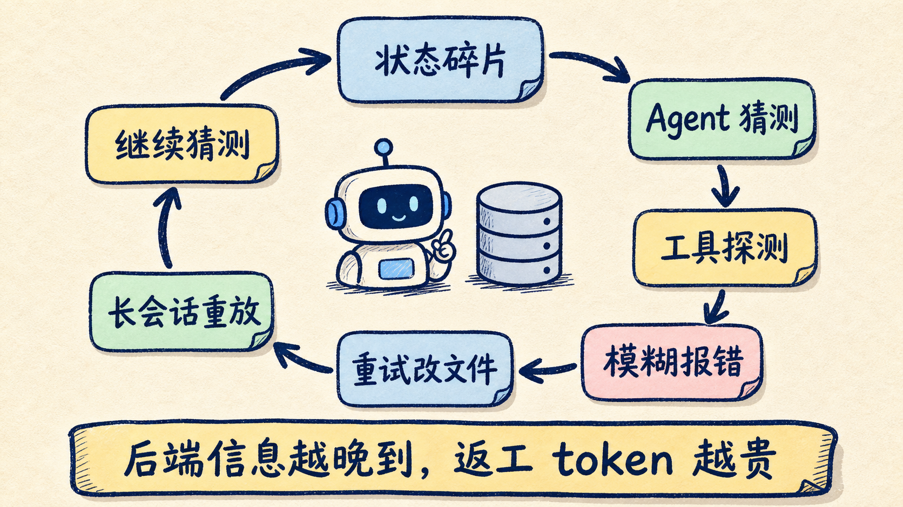
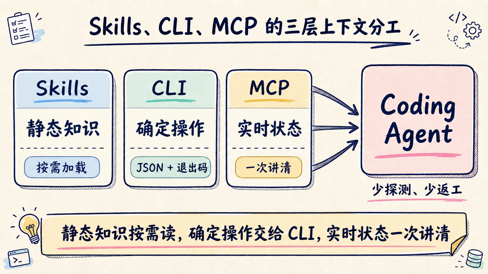

# Claude Code 越聪明越烧钱？先检查后端有没有让它猜

Claude Code 跑一个功能，最贵的可能不是写代码，而是反复确认后端到底长什么样。

状态散在十几个命令里，报错只说“权限不足”，工具定义一股脑塞进上下文。模型只能先猜、再试、再读日志、再改文件。每次返工，越来越长的会话又要重新送进模型。

所以，Agent 成本不能只盯模型价格和 Prompt。**后端怎样向 Agent 暴露工具、状态与错误，本身就是上下文工程。**

Avi Chawla 最近做了一次很有意思的对照：让 Claude Code 用两套后端构建同一个 DocuRAG 应用。Firebase 路线消耗 15.7M tokens、12.95 美元；InsForge 路线消耗 6.3M tokens、4.87 美元。

差距约 2.5 倍，但最值得带走的不是“换后端”三个字，而是那条成本链：

> 后端信息不完整 → Agent 增加探测 → 错误触发重试 → 文件反复重写 → 长会话持续重放。

## 更聪明的模型，为什么可能探测得更多

直觉上，模型升级后应该更省 token。现实未必如此。

当信息缺失时，能力更强的模型往往不会直接放弃。它会提出更多假设，调用更多工具，尝试更多修复路径。探索能力提升了，但如果后端始终只返回零散信息，探索成本也会一起放大。

原文还引用了 MCPMark V2 的一个现象：同样 21 个数据库任务里，从 Sonnet 4.5 换到 Sonnet 4.6 后，经 Supabase MCP server 产生的后端 token 用量从 11.6M 增加到 17.9M。

这组数字需要谨慎看待，它来自作者的转述，不等于“新模型一定更贵”。更准确的结论是：**模型能力无法自动补齐系统没有提供的上下文。**

## 后端的三种设计，会把 token 花在找路上

原文把 Firebase 路线的摩擦拆成三类。它们并非 Firebase 独有，很多为人类开发者设计的平台都存在类似问题。

### 1. 工具面按产品规模增长，不按任务缩小

Firebase 官方 MCP server 覆盖 Authentication、Firestore、Storage、Crashlytics、Hosting 等多组能力，还可以向 Agent 提供文档资源。

能力丰富没有错。问题在于，如果当前任务只需要认证和数据库，Agent 却同时看到大量无关工具定义，宝贵的上下文就先被“菜单”占掉了。

好消息是，Firebase 官方已经提供 `--only` 参数，可以只启用需要的 feature groups：

```json
{
  "command": "npx",
  "args": [
    "-y",
    "firebase-tools@latest",
    "mcp",
    "--only",
    "auth,firestore,storage"
  ]
}
```

所以第一步不一定是迁移平台，而是先把工具面裁到当前任务需要的范围。

### 2. 后端状态只能靠多次探测拼出来

Agent 写代码前需要知道：当前项目、认证方式、数据结构、存储桶、索引、权限规则和可用模型。

如果这些状态分散在多条命令和控制台页面里，Agent 就要自己拼图。Firestore 又是 schemaless，集合字段往往还要通过样本文档推断。

这种“边写边发现”的流程很贵。新信息晚到一步，已经写好的代码就可能全部重开。

### 3. 错误只有症状，没有可执行的诊断

`PERMISSION_DENIED: Missing or insufficient permissions` 对人类已经不够友好，对 Agent 更糟。

它可能来自安全规则、集合路径拼错，也可能来自用户尚未登录。如果错误没有规则 ID、资源路径、认证状态和建议动作，Agent 只能不断试错。

而 Agent 的重试不是免费循环。每次新的假设、工具结果和文件修改都会继续拉长会话。



## 后端上下文工程，应该把信息分成三层

InsForge 在原文里采用的办法，不是简单地“少给上下文”，而是让不同信息走不同通道。

### Skills：放稳定知识

SDK 用法、最佳实践、常见故障处理，这些内容变化不频繁，适合放进 Skills，通过渐进式披露按需加载。

Agent 开始会话时只看到少量元数据。任务真正命中某个领域后，再读取完整说明。

### CLI：执行确定性操作

创建表、配置认证、部署函数、读取项目状态，应该由 CLI 提供 `--json`、非交互参数和明确退出码。

自然语言适合表达目标，结构化输出适合让 Agent 判断下一步。

### MCP：读取实时状态

MCP 最适合承载会变化的状态，而不是把所有文档都常驻进上下文。

原文里，InsForge 用一个 metadata 调用返回认证提供商、数据表、存储桶和可用模型。Agent 在写代码前先拿到后端全景，避免边写边猜。

这套分工可以压缩成一句工程规则：

> 静态知识按需读，确定性操作交给 CLI，实时状态一次讲清楚。



## 2.5 倍差距，到底从哪里来的

两次构建都要完成登录、PDF 上传、切块、向量检索、模型回答、聊天记录持久化和用户数据隔离。

最终记录如下：

| 指标 | Firebase 路线 | InsForge 路线 |
|---|---:|---:|
| Token 用量 | 15.7M | 6.3M |
| 成本 | $12.95 | $4.87 |
| 用户消息 | 4 | 1 |
| 工具调用 | 141 | 102 |
| 写入后再次编辑 | 25 | 3 |

工具调用数只差约 38%，token 却差约 2.5 倍。真正拉开差距的是返工：Firebase 路线有 25 个文件在首次写入后被再次编辑，API routes 一共重开了 10 次；InsForge 路线的 3 次编辑都落在配置文件上。

Agent 一旦在长会话后段重开应用代码，代价不只是一条 edit 调用。前面的对话、工具结果和旧代码都会成为后续推理负担。

不过，这不是一份严格控制变量的通用 benchmark。InsForge 自带模型网关和面向 Agent 的默认工作流，Firebase 路线还涉及单独的 OpenAI 接入；两者产品能力与生态成熟度也不完全相同。

因此，2.5 倍更适合作为一个案例信号，而不是采购结论。

## 给现有后端做一次 Agent-ready 体检

不迁移平台，也可以先检查下面 8 项：

- [ ] MCP 工具能否按项目或 feature group 裁剪？
- [ ] Agent 能否用一次调用读取项目全景？
- [ ] 状态输出是否稳定、结构化、可解析？
- [ ] CLI 是否支持 `--json`、非交互执行和语义化退出码？
- [ ] 错误是否包含资源、规则、认证状态和建议动作？
- [ ] 静态文档是否按需加载，而非常驻上下文？
- [ ] UI 控制台里的关键操作，是否都有 headless 路径？
- [ ] Agent 写文件前，是否已经拿到足够的后端约束？

如果前四项大多是否，Agent 很可能正在用 token 重建人类脑中的后台地图。

## 我会先改什么

我的顺序很明确：**先减少猜测，再考虑换模型或换平台。**

第一步，裁掉当前任务用不到的 MCP 工具与资源。第二步，补一个聚合状态命令，让 Agent 开工前读到认证、schema、存储和权限。第三步，把最常见的模糊报错改成结构化诊断。第四步，再统计重试、文件重开次数和会话 token。

这些改造通常比迁移后端便宜，也能直接验证问题到底来自哪里。

InsForge 的思路值得研究，但新平台意味着生态、运维、兼容性和长期维护风险。对已有 Firebase 项目，我不会只为了一个单次实验立刻迁移；对准备从零开始、主要由 Coding Agent 驱动的内部工具，我会把“Agent 能否完整理解后端”列为选型指标。

模型价格会继续降，模型能力会继续涨。但只要系统仍然让 Agent 猜，省下来的 token 很快又会被探索和返工吃掉。

如果你正在做 Agent 工程化，可以先收藏上面的 8 项清单。回复 **后端体检**，我再整理一份可直接放进项目的 Agent-ready Backend Review 模板。

## 参考资料

- Avi Chawla：How to cut Claude Code costs by 2.5x
- Firebase 官方 MCP server 文档
- Firebase CLI 官方文档
- InsForge GitHub 仓库
- MCPMark 论文
