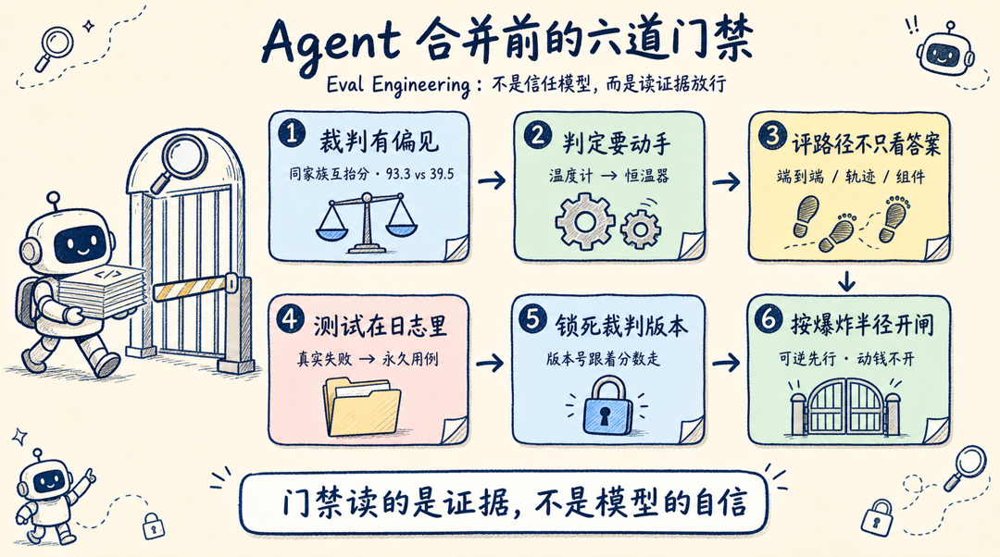
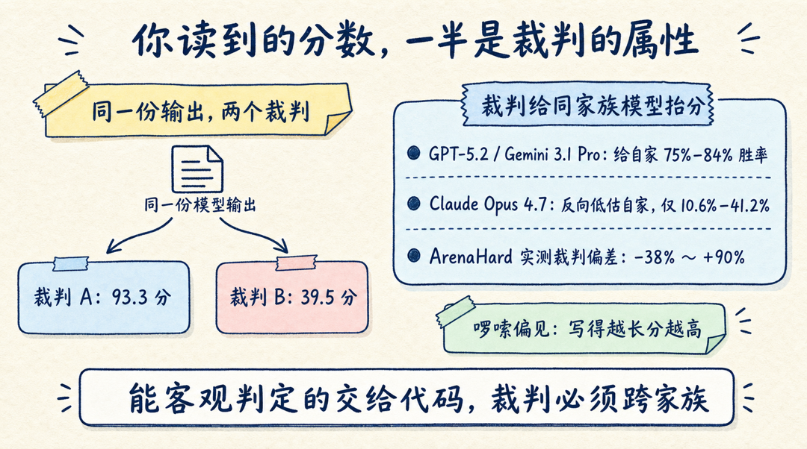
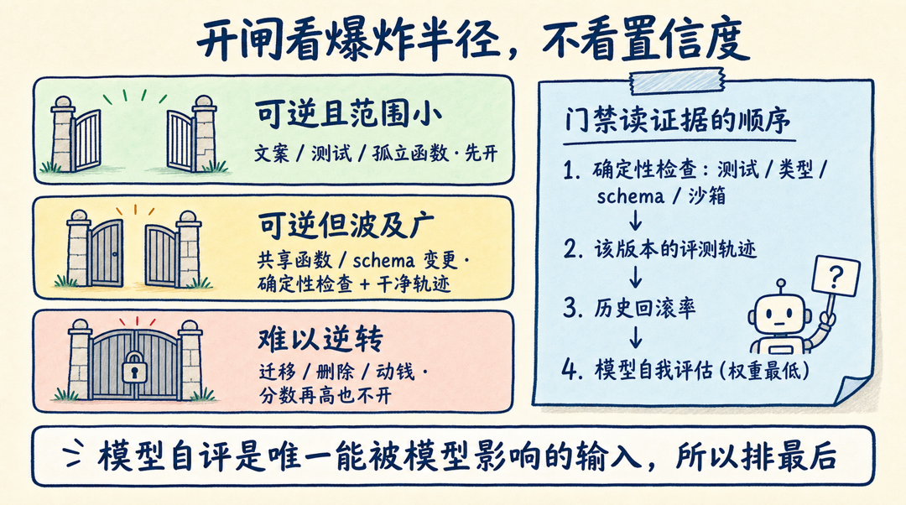

上周 X 上最热的帖子是 Qwen3.8-Max 发布：官方演示里，agent 从空文件夹干到生产环境，issue 进去、代码和测试出来、自己合并。同一时间，另一篇长文也在工程圈被大量收藏，问的是硬币的另一面：**agent 改完代码直接合并，不经过人 review，你敢吗？**

这篇 X Article 来自 AI 研究者 Hanako（@hanakoxbt），15 万浏览、800 多收藏。她的回答很直接：敢不敢不是勇气问题。大多数团队缺的不是对模型的信任，而是一道能读证据、按规则放行的**门禁（gate）**——而门禁要读的那些证据，在大多数系统里根本还不存在。

她把"开门禁之前必须先成立的六件事"写成了一门完整小课。这篇文章把它蒸馏出来，你可以直接对照自己的 agent 工作流查漏。

## 一、你读到的分数，有一半是裁判的属性

自动评测的起点很扎实。2023 年 UC Berkeley 的 Zheng 等人在 MT-Bench 研究里证明，GPT-4 当裁判时与人类评分的一致率超过 80%，已经接近人类互评之间的一致率。于是整个行业几乎一夜之间把评测交给了 API 调用。

后续研究发现了麻烦：裁判会对内容以外的东西做出反应。Hanako 引用的 2026 年测试数据显示，头部裁判模型会系统性抬高同家族模型的分数——GPT-5.2 和 Gemini 3.1 Pro 给自家输出开出 75% 到 84% 的胜率，Claude Opus 4.7 则反向低估自家族，胜率只给 10.6% 到 41.2%。在 ArenaHard 上，不同裁判之间的实测偏差从 -38% 跨到 +90%。最夸张的一组对照：同一份模型输出，裁判 A 手下拿 93.3 分，裁判 B 手下只有 39.5 分。

除了这些"家族偏见"，还有啰嗦偏见：回答越长分越高，不管多出来的字有没有信息量。

这不意味着 LLM 当裁判不能用，而是意味着裁判的搭建方式本身承重。三条规则覆盖大部分场景：

- **裁判必须来自与被测模型不同的家族**，同家族意味着共享盲区；
- **高风险场景用多厂商裁判团**，跨家族取平均才能打散相关性错误；
- **凡是能客观判定的，交给代码而不是裁判**——测试过没过、文件在不在、状态变没变。

一句话：被有偏见的裁判喂大的门禁，比没有门禁更糟。它把一个猜测洗成数字，然后照着数字动手。

## 二、不改变运行行为的判定，只是一份报告

多数团队停在差一步的地方：拿到分数，放上 dashboard，然后 dashboard 谁也不影响。

2026 年成熟的转变是**把评测从 agent 身后搬进 agent 体内**。上线前的评测被提升为运行时的护栏，分数直接控制 agent 下一步能做什么：能摸到哪些工具、一次交接是否被接受、要不要升级给人处理。这是温度计和恒温器的区别——温度计只读数，恒温器会动手。

每个判定都映射成一个对当前运行的结构性动作：

-  grounding 不足 → 拒绝这次交接；
-  schema 校验失败 → 掐断这条边；
-  疑似编造 → 隔离这个分支，不许合进主线程；
-  只有"已验证完成"才被允许结束运行。

注意最后一条。agent 停止调用工具，只是它"这一轮说完了"，不等于"任务做完了"。这两者的差别，只有外部检查能分辨。

运行时判定还有第二个用途：一套判定已经在指挥运行的系统，到了合并时刻才有值得被门禁读取的判定。

## 三、只批最终答案，等于不看过程分

只给最终回答打分，会出现一种典型事故：agent 通过一串稀烂的步骤撞对了答案，一个月后才发现。

Agent 评测分三层，三层都要：

| 层级 | 回答的问题 | 暴露什么 |
|---|---|---|
| 端到端 | 任务成功了吗 | 最终结果 |
| 轨迹级 | 路径合理吗 | 死循环、重复调用、浪费的步骤 |
| 组件级 | 哪个检索器 / 工具 / 子 agent 坏了 | 去哪里修 |

上手只需要三个指标：**忠实度**（答案扎根于工具真实返回的内容，而不是工具返回空时模型自己脑补的部分）、**工具参数准确率**（调对的工具、带对的参数）、**任务完成率**（对照真实信号而不是 agent 自己的宣称）。

三个里面最会藏的是忠实度。一个文笔干净的 agent 编造一个汇率，能在你面板上所有质量指标里拿高分，直到客户照着这个数字做了决策才爆雷。

对门禁而言，轨迹比答案更重要。同样一个 diff，走干净路径到达的，和原地空转四十步才到达的，是完全不同的两种风险。

## 四、最好的测试早就躺在你的日志里

坐在工位上发明的测试，只能防住你已经想象到的失败。真正贵的那批失败，此刻正带着时间戳躺在你的 trace 里。

从日志里捞一小批完整运行，挑的时候让"正常"和"出岔子"挨在一起：

- 一次干净跑完的请求——这是"正常长什么样"的基线；
- 一次被用户改写或纠正的请求——纠正本身就是免费的标注；
- 一次工具返回为空、或者同样参数调了两遍的运行；
- 一次外部依赖超时的运行——它测的只有一件事：世界说不的时候，你的 agent 什么反应。

每条用四行写成测试用例：agent 做了什么、哪里正常哪里不正常、原因是你的 agent 还是依赖、这个用例保护哪个能力。

归因是最容易浪费一周的地方。同样参数查两遍，是你 agent 里的死循环；限流报错回来，那是别人的问题——除非你的 agent 本来就该从限流里恢复，那它才是你的测试。

两条规则保证这套方法不自欺。其一，trace 只能告诉你 agent 做了什么，永远告诉不了它本该做什么，标准答案得来自测试、记录、规范或者人。其二，**信任验证器之前先测验证器**：喂一个明显正确的结果和一个貌似合理的错误结果，任何一个判反了，坏的是评分细则，不是 agent。

每个被这样转化的失败，都是门禁不会被同一颗雷炸第二次的保证。

## 五、不锁裁判版本，这个月就白干了

裁判也是软件，软件有版本。一个悄悄升级的裁判，会让升级前后的所有分数失去可比性。

这种失败是静音的：裁判这个月升个小版本、下个月升个大版本，你的测试套件照常出数，而那些数字几周前就不代表同一个意思了。

所以：**锁定裁判版本，并且把版本号跟着每一条分数记进日志。**

评分细则（rubric）写成一行话，格式是"当某个可独立观测的结果发生时算通过"，而不是一堆代理指标的捆绑。还有一条红线：**永远不给答案的"形状"发分**——长度、关键词出现次数、引用数量、和参考答案的相似度，一概不给分。

这不是审美偏好。对着裁判优化得足够狠，agent 会学会"看起来对"而不是"真的对"，你的防线就变成了攻击面——这就是回路里有个模型的古德哈特定律。

依赖自我评审之前，还有一件事值得知道：DeepMind 的 Huang 等人在 ICLR 2024 证明过，没有外部 grounding 的内在自我修正——让模型自己检查并修改自己的作业——并不可靠，经常越改越差。grounding 必须来自模型之外。

套件规模也要按"扛得住真实使用"来设计：作者给的 2026 年工程经验值是，聚合分至少要有 500 个用例垫底才值得信任，而且单次运行要短到没人需要围着它排期。跑起来比一杯咖啡还久的测试套件，最终都会退化成季度仪式。

## 六、按爆炸半径开闸，不按置信度开闸

大多数分享在这里走错方向：造一个置信度分数，设个阈值，高于阈值全放行。

置信度是这个决策里最弱的变量。强的那个是：**如果这次改动是错的，代价多大。**

按"错误撤销起来多贵"把工作分成三条泳道，每条泳道配不同的闸门：

| 泳道 | 例子 | 闸门策略 |
|---|---|---|
| 可逆且范围小 | 文案修改、一个测试、有覆盖的孤立函数 | 可以先开，一次错误合并的成本就是一次 revert |
| 可逆但波及广 | 共享工具函数、schema 新增字段、十几个调用方碰的代码 | 确定性检查全过 + 轨迹干净才放行 |
| 难以逆转 | 数据迁移、删除操作、写生产库、动钱 | 分数再高也不开 |

在放开的泳道里，门禁读的是证据而不是意见，证据分先后：**确定性结果排最前**（测试、类型、schema、沙箱执行——没有模型参与）；然后是该 agent 版本的评测轨迹；再往后是历史记录（这个 agent 在这个面上的产出，以前被回滚过多少次）。**模型自己的评估排在最后、权重最低**——因为它是唯一一个模型自己能动手脚的输入。

上线姿势也要保守：先跑影子模式，门禁给每个改动打分但一个都不合并，攒够真实流量再和人工 review 对比；盯紧门禁和人工评审的分歧率，分歧率明显大于零就一直关着。

最后留一句警告在眼前：测试套件可以全绿，而它守护的产品正在散架——因为测试会收敛于测试本身，而不是收敛于需求。绿是证据，不是证明。

## 我的判断

这套东西适合谁？已经在用 coding agent 批量产出 PR、review 带宽成为瓶颈的团队。不适合谁？agent 一周就跑几个任务的小团队——门禁本身的建设成本比人工 review 还贵。

最大的坑不在六步里的任何一步，而在把门禁当成一次性工程。裁判在升级、模型在换代、你的代码库在长，门禁读的证据必须跟着换。Hanako 原文有一句话值得贴在工位上：**你信用卡账单上的模型是租来的，围在它外面的考官才是你真正拥有的资产。**

回到开头的问题：agent 改完代码直接合并，你敢吗？六步走完之后的答案是——你要建的不是对 agent 的信任，而是一个紧到"信任不再是问题"的约束。

**行动建议**：今晚就可以做第一步，不用写代码。打开你的 agent 日志，按第四节的方法挑 4 条运行记录，写成四行测试用例。门禁是从第一批真实失败里长出来的，不是从架构图里长出来的。

---

*原文：Eval Engineering: build the gate that lets your agents merge without you，作者 Hanako（@hanakoxbt），2026-08-01 发布于 X。文中 2026 年裁判偏见数据为原帖引用的测试结果，独立原始榜单暂未公开；Zheng 等人 MT-Bench 研究（2023）与 Huang 等人自我修正研究（ICLR 2024）均有公开论文可查。*
