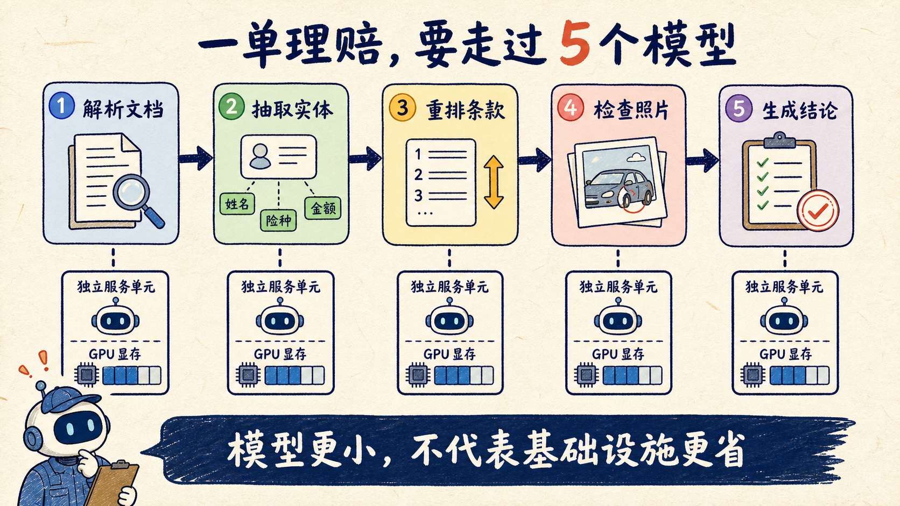
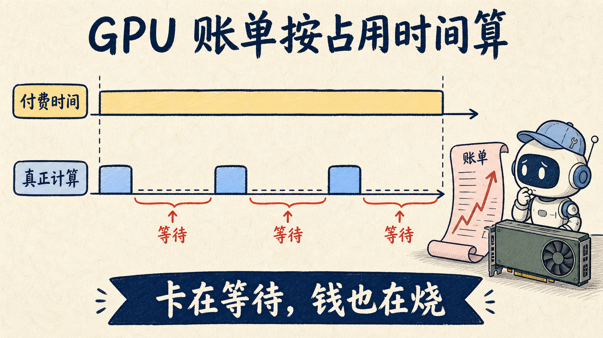
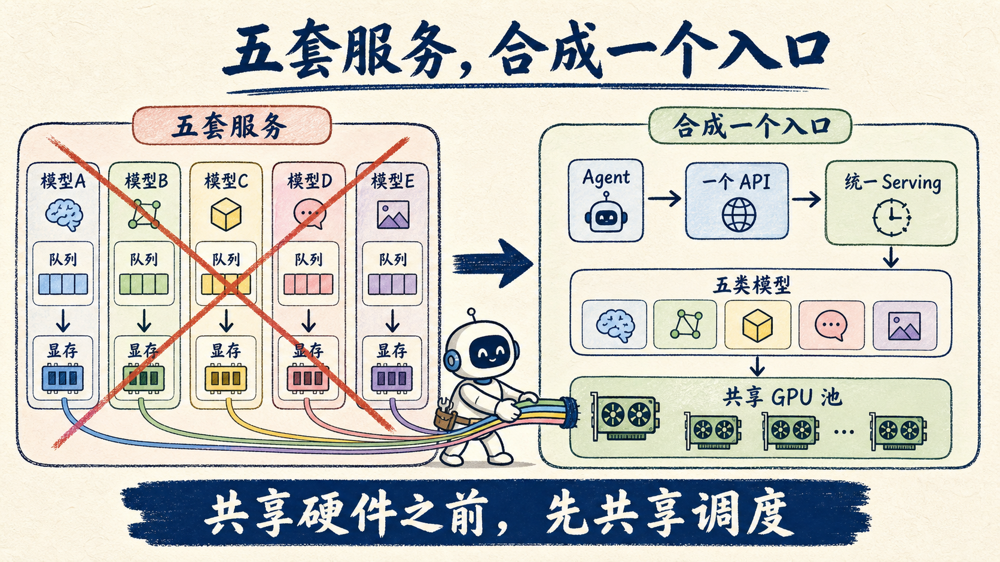
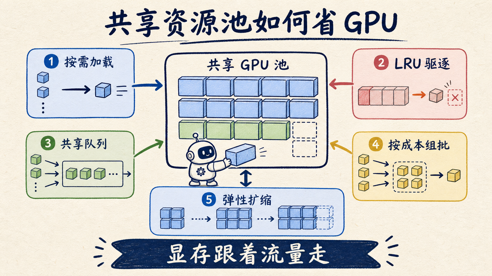
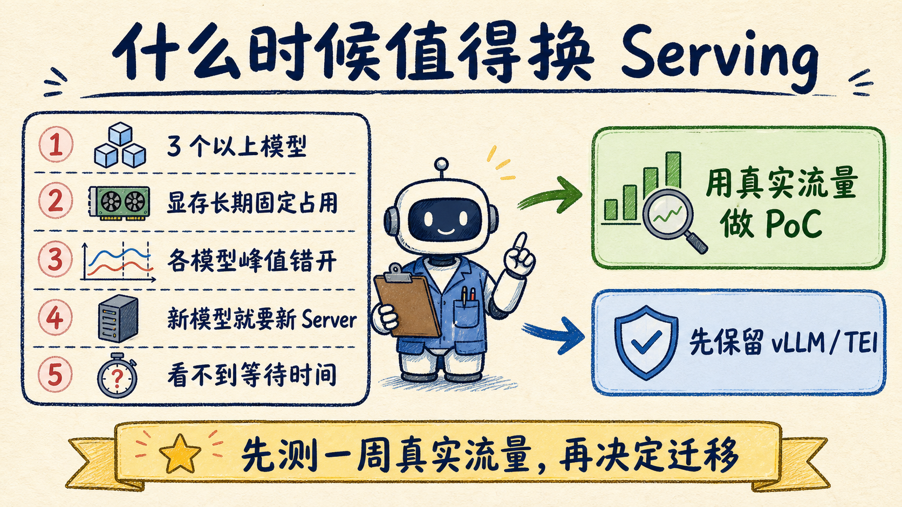

# 5 个模型，1 张 GPU：小模型省的钱，别还给 serving


一张洪水保险理赔单，Agent 要依次调用 5 个模型：docling 把 PDF 转成 markdown，GLiNER 抽出姓名和保单号，reranker 找相关条款，Grounding DINO 检查受灾照片，最后由 Qwen 写审核结论。

单看模型价格，这套设计很省；看 GPU 账单，未必。

如果每个模型独占一张卡，一单理赔按顺序走完 5 个环节，每张卡大部分时间都在等上游。GPU 账单按占用时间算，不会因为它刚才只计算了几秒就少收钱。

Akshay Pachaar 最近一篇 X Article 讲的就是这个坑：小模型压低了 token 成本，serving 没跟上，成本会从 API 账单挪到 GPU 账单。

如果你正在自建多模型 pipeline，可以把文章分成两半看：前半是普遍存在的资源浪费，后半的 SIE 是项目方给出的解决方案，需要拿自己的流量验证。

## 账单没消失，只是从 token 挪到 GPU



生产系统正在从“一个大模型包打天下”转向“几个小模型各干一段”。专用模型能减少 token 开销，不代表 serving 层会自动省钱。你仍然要付 GPU、显存、调度和组批的成本。

托管 API 起步快，调用量上来后费用也会跟着涨，模型选择和数据边界还受供应商约束。想自己控模型、控数据，就要自建。自建一个小模型不难，难的是业务很少只调用一个模型：完整 pipeline 需要多个专用模型在线，随时接住上游请求。

这些模型的工作方式不同，serving 栈也跟着分裂。LLM 逐 token 生成、要管 KV cache，常用 vLLM；embedding 和 reranker 读完输入就返回结果，常用 TEI；docling、Grounding DINO、GLiNER 这类解析、视觉、抽取模型，往往还要各包一层自定义 server。

五个环节，三套 serving 栈只是起步。

## 两种摆法，都把钱花在等待上



模型上卡后，常见的两种摆法都不轻松。

**一种是一模型一卡。** 运维最简单，但串行 pipeline 会让卡轮流空转：parser 工作时，reranker 的卡在等；等 reranker 跑起来，parser 的卡又挂着。一张 L4 有 24GB 显存，小型抽取模型或 reranker 往往只用掉一部分。卡越加越多，平均利用率越难看。

**另一种是多个模型挤一张卡。** 显存可能放得下，几个互不知情的 serving 进程却不会主动协调。每个进程按自己的配置预留显存：留少了，长文档可能把同卡服务一起拖垮；留多了，空闲显存也借不出去。

流量还会在环节之间移动。parser 突发时，reranker 可能正闲着，但固定显存配额不会跟着流量走。每个进程又有自己的队列和组批逻辑，没有调度者看得到整张卡。

硬件已经共享，serving 进程仍在各自排队。

## 先别挑工具，先写清四个要求

原文在点名 SIE 之前列了四个要求。我会先拿它们审现有架构，再决定要不要换工具：

1. **模型够广**：embedding、reranker、OCR、视觉、抽取、生成，都能放到同一套 API 后面。
2. **组批够满**：引擎能按模型架构和输入长度组 batch，少让短请求陪长请求补 padding。
3. **显存跟着流量走**：忙的模型留在卡上，闲的按需驱逐，不让常驻进程长期占着显存。
4. **能进生产**：除了推理引擎，还要有路由、自动扩缩、监控和 GPU 池。

难点不在给不同模型包一层统一 API，而在底层形状完全不同：Qwen 要处理生成和 KV cache，ColBERT 给每个 token 返回向量，reranker 只吐一个分数。想把它们塞进同一个调度系统，还要让组批和显存分配都有效，工程量远大于写几个 endpoint。

## SIE 怎么把 5 个模型收进一个集群



原文给出的方案是 Superlinked Inference Engine（SIE，Apache 2.0）。在保险理赔示例里，上层主要使用三个原语：

- `extract`：docling 转 markdown、GLiNER 抽字段、Grounding DINO 找受灾区域；
- `score`：bge-reranker 给保单条款重排序；
- `generate`：Qwen 汇总中间结果，按 JSON schema 输出审核结论。

五个环节通过一个 client 调用。决定 GPU 成本的，是下面这些机制：



1. **按需加载**：请求来了再加载模型，显存紧张时按 LRU 驱逐，GPU 变成共享池；
2. **一个队列看全部工作**：gateway 接请求，空闲 worker 取任务，调度器能看到全局；
3. **按计算成本组批**：尽量把成本接近的请求放进同一 batch，减少 padding 浪费；
4. **随流量伸缩**：gateway + worker 结构可以从单机扩到 Kubernetes；
5. **模型带着 serving 配置进场**：官方当前采用 `100+` 模型的口径，catalog 为模型准备显存、batching 和精度配置。

本地启动是两行：

```bash
pip install "sie-server[local]"
sie-server serve   # 默认监听 8080
```

这两行能证明服务跑得起来，不能证明你的生产流量跑得稳。首个模型还要下载权重，延迟和吞吐会受模型、硬件、输入长度与 batch 大小影响。

## 我的判断：先数卡，再决定要不要迁



截至 2026 年 8 月 6 日，SIE GitHub 仓库约 2.4k star，官方文档列出了 OpenAI 兼容接口、按需加载、LRU 驱逐、KEDA 自动扩缩、Grafana 监控，以及 LangChain、CrewAI、Chroma、Qdrant 等集成。

这些能力值得试，但要把利益相关说清楚：原 X Article 来自项目方，`100+ 模型` 和生产栈是官方口径，不是你的验收结果。catalog 之外的自研模型、冷启动时间、显存争抢和高峰吞吐，仍要自己测。

先用下面 5 个问题数一遍 pipeline：

| 自查问题 | 命中后说明什么 |
| --- | --- |
| 一次请求经过 3 个以上模型？ | 成本已经不只是“跑一个 LLM” |
| 每个模型独占一张卡或固定显存？ | 可能在为空转和静态配额付费 |
| 各环节的流量高峰经常错开？ | 共享调度可能有收益，值得压测 |
| 接一个新模型就要写一套 server？ | 缺统一的模型接口和 catalog |
| 监控看不到模型等待、加载和驱逐？ | 还无法判断共享后会不会更省 |

只命中一条，继续用 vLLM、TEI 或现有自定义服务通常更省事。命中两条以上，再拿自己的文档、图片和一周峰值流量做 PoC；不要先迁生产，再补基准。

准备评审多模型 GPU 方案时，把这张 5 问自查清单收藏下来。下一张 GPU 账单到手，先算每张卡有多少时间在等上游，再讨论换模型还是换 serving。

来源：[Akshay Pachaar X Article《How to serve 5 models on one GPU (100% open-source)》](https://x.com/akshay_pachaar/status/2084992645966016757)、[Superlinked/SIE GitHub 仓库](https://github.com/superlinked/sie)、[sie-server PyPI](https://pypi.org/project/sie-server/)（2026-08-06 访问）。原文图片保留自 X Article。
