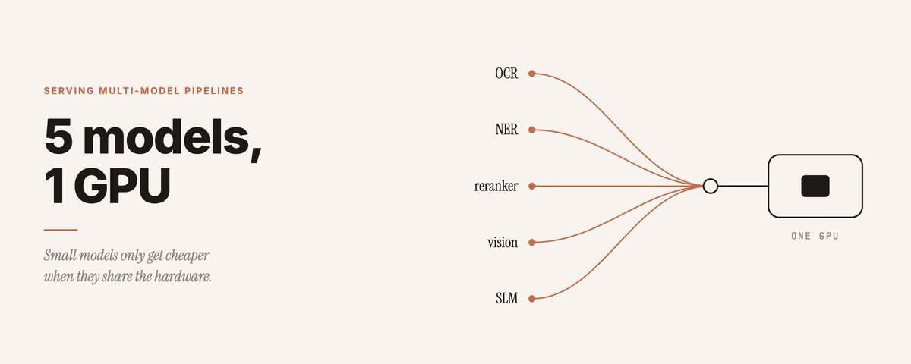
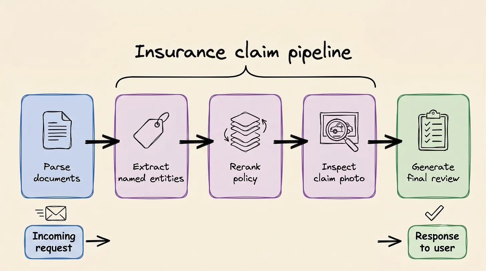
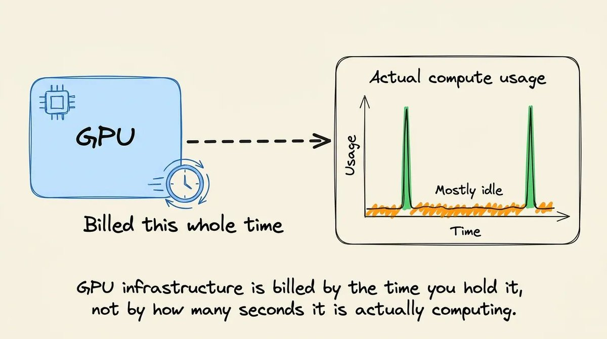
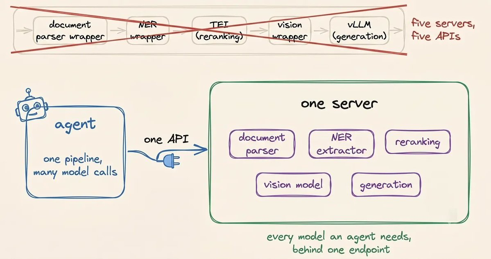
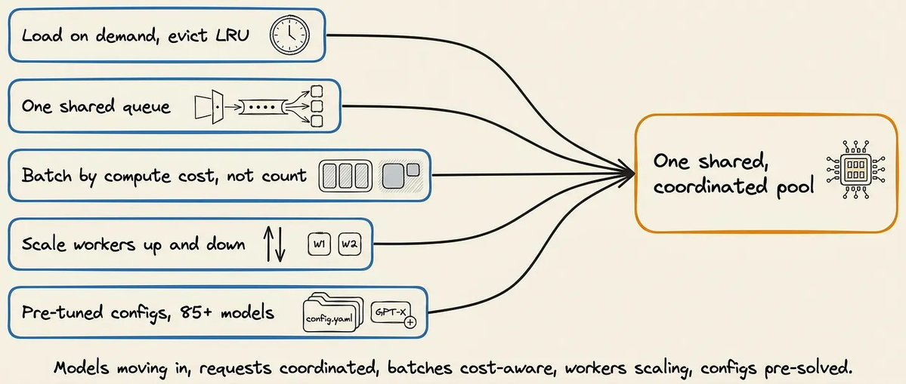
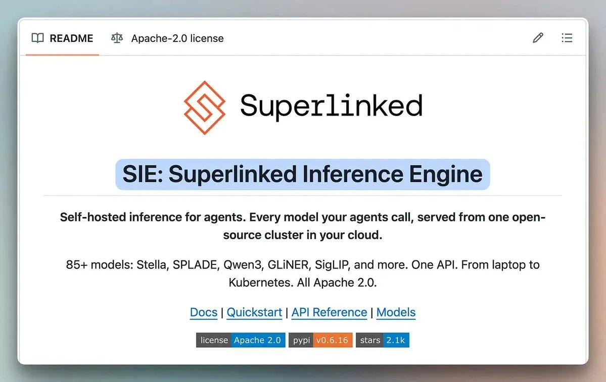

# 5 个模型，1 张 GPU：小模型省的钱，别还给 serving



你的 Agent 处理一张洪水保险理赔单，一次请求要过五个模型：docling 把 PDF 解析成 markdown，GLiNER 抽出投保人姓名和保单号，reranker 从保单里捞出相关条款，Grounding DINO 检查受灾照片，最后 Qwen 写出审核结论。

如果每个模型独占一张 GPU，账单会很直白：一单理赔按顺序走完五个环节，每张卡大部分时间都在等上游干完活。而 GPU 是按你持有它的时间计费的，不是按它真正计算的那几秒。

Akshay Pachaar 最近一篇 X Article 讲的就是这件事：大家都换成了小模型，token 账单确实降了，但成本只是挪了个位置——从按 token 付费，变成按 GPU 时长付费。serving 方式不对，省下的钱会原样还回去。

如果你正在自建多模型 pipeline，这篇值得看完。文章后半介绍的开源方案 SIE 有项目方视角，但前半对 serving 浪费的拆解，不依赖任何特定工具。

## 小模型省钱，只省了一半



生产系统正在从"一个大模型包打天下"转向"几个小模型各干一段"。模型层面这几乎总是更便宜，但模型只是推理账单的一部分。你还需要 GPU 来跑它、显存来装它、一个 serving 层来调度和组批。

托管 API 起步快，但费用随用量线性涨，模型选择和数据去向都不归你管。想控模型、控数据，就得自建。自建一个小模型不难，难的是真实业务很少只有一个模型——专用模型各管一段，拼起来才是完整 pipeline，基础设施得让这些模型全都在线、随时可被调用。

麻烦在于，这些模型的工作方式完全不同，serving 工具也跟着分裂：LLM 逐 token 生成、要管 KV cache，用 vLLM；embedding 和 reranker 读一遍输入就出结果，用 TEI；docling、Grounding DINO、GLiNER 这类解析、视觉、抽取模型两边都不靠，通常各自包一个自定义 server。五个环节，三套 serving 栈起步。

## 两种摆法，都把钱花在等待上



模型上了卡，只有两种摆法，都不太干净。

**一种是一模型一卡。** 运维最简单，但流水线是串行的：parser 的卡空转时，reranker 的卡帮不上忙；等 reranker 跑起来，parser 的卡继续挂着。而且这些专用模型很小，一张 L4 有 24GB 显存，一个抽取模型或 reranker 只用得到零头。卡越加越多，每张卡的利用率越来越低。

**另一种是多个模型挤一张卡。** 显存放得下，难的是让几个互相不知情的 serving 进程共享这张卡。vLLM 的 `--gpu-memory-utilization` 默认 0.92，旁边的进程根本不知道还剩多少。分少了，一个长文档就把这个模型打爆，还可能拖垮同卡的其他人；分多了，那块显存宁可闲着也不给别人。更要命的是，流量在环节之间是流动的——parser 突发时 reranker 可能闲着，但显存分配不会跟着流量动。每个进程还各有自己的队列和组批逻辑，没有任何一个调度者看得到整张卡的全局。

一句话：硬件可以共享，serving 进程却各自为政。

## 一个合格的 serving 层要做四件事

原文在点名任何工具之前，先列了四个要求，这个顺序我很认同——先想清楚要什么，再挑轮子：

1. **广度**：embedding、reranker、OCR、视觉、抽取、生成，都要能跑在同一个 API 后面。
2. **利用率**：能把不同长度的请求组进同一个 batch 而不浪费算力，这意味着引擎要控制每种架构的 batching 和 attention 路径。
3. **显存跟着流量走**：按需加载、空闲驱逐，忙的模型留在卡上，闲的让位，而不是像常驻进程那样死占显存。
4. **像生产设施**：路由、自动扩缩、监控、GPU 池。vLLM 只是引擎，自己不会跨副本分流，也不会随流量加减卡。

这件事难在不同模型家族底层完全不一样：Qwen 处理位置和注意力的方式是一种，ColBERT 对每个 token 返回向量，reranker 只吐一个分数。一个引擎要装下所有这些形状、还能把任意请求组成满 batch——这活儿以前没人做成开源包，各团队只能自己写几个月定制代码。

## SIE：三个原语，五个机制



原文给出的答案是开源的 Superlinked Inference Engine（SIE，Apache 2.0）。它对上层只暴露三个原语：

- `extract`：解析、NER、视觉检测共用——docling 转 markdown、GLiNER 抽字段、Grounding DINO 找受灾区域，都走这一个接口；
- `score`：bge-reranker 给保单条款重排序；
- `generate`：Qwen3.5-4B 汇总所有中间结果，按 JSON schema 输出最终审核。

五个环节、三种原语、一个集群。API 是表面，真正值钱的是底下五件事：



1. **按需加载**：请求来了才加载模型，显存紧张时驱逐最久没用的（LRU），GPU 变成共享池；
2. **一个队列看全部工作**：gateway 把请求放进公共队列，worker 就绪就取，调度有全局视角；
3. **按算力成本组批**：不按请求条数组批，按预估计算成本分组，短输入不用陪着长输入补 padding；
4. **随流量伸缩**：gateway + worker 结构，同一套东西从笔记本跑到 K8s 集群；
5. **模型自带 serving 配置**：catalog 里的模型（原文称 112 个）按名字引用，加载时就带着验证过的显存、batching、精度设置，不用自己从头调。

跑起来也就两行：

```bash
pip install "sie-server[local]"
sie-server serve   # 监听 8080
```

之后整个 pipeline 都通过一个 client 对象调用，不管底层命中哪个模型。

## 我的判断：先数卡，再决定动不动它



SIE 目前 2.1k star，覆盖了 Chroma、Qdrant、LangChain、CrewAI 这些常见集成，还提供 OpenAI 兼容接口，存量代码改个 URL 就能指过去。但两点要清醒：第一，这篇 X Article 本质上是项目方的介绍文，"100+ 模型"、"生产就绪"这类说法要自己拿真实流量验；第二，catalog 之外的模型仍然要自己包 serving，111 个现成配置帮不了你第 112 个自研模型。

所以我的建议是，先别管工具，回家数一数自己的 pipeline：

| 自查问题 | 命中说明 |
| --- | --- |
| 一次请求要经过 3 个以上模型？ | serving 成本已经不只是"跑一个 LLM"的问题 |
| 每个模型各占一张 GPU？ | 大概率在为串行 pipeline 的空转时间付费 |
| 各环节的流量高峰错开？ | 共享 GPU 有利可图，且不会互相挤爆 |
| 每个 serving 进程各占固定显存？ | 显存没有跟着流量走，合并有空间 |
| 接一个新模型要写一套 serving 代码？ | 缺一个统一的模型 catalog 和 API |

命中两条以上，值得把 SIE 拉下来跑一遍它的 insurance-claim notebook（仓库里有完整示例），用你自己的文档和照片替换进去测。只有一两个模型、流量又稳定的系统，别折腾，vLLM + TEI 就够了。

下次 GPU 账单又来的时候，先问一句：这些卡有多少时间在等别人干完活？这个答案比换任何模型都值钱。

来源：Akshay Pachaar X Article《How to serve 5 models on one GPU (100% open-source)》、Superlinked GitHub 仓库（2026-08-06 访问）。原文图片保留自 X Article。
